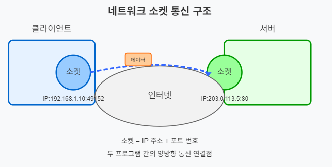
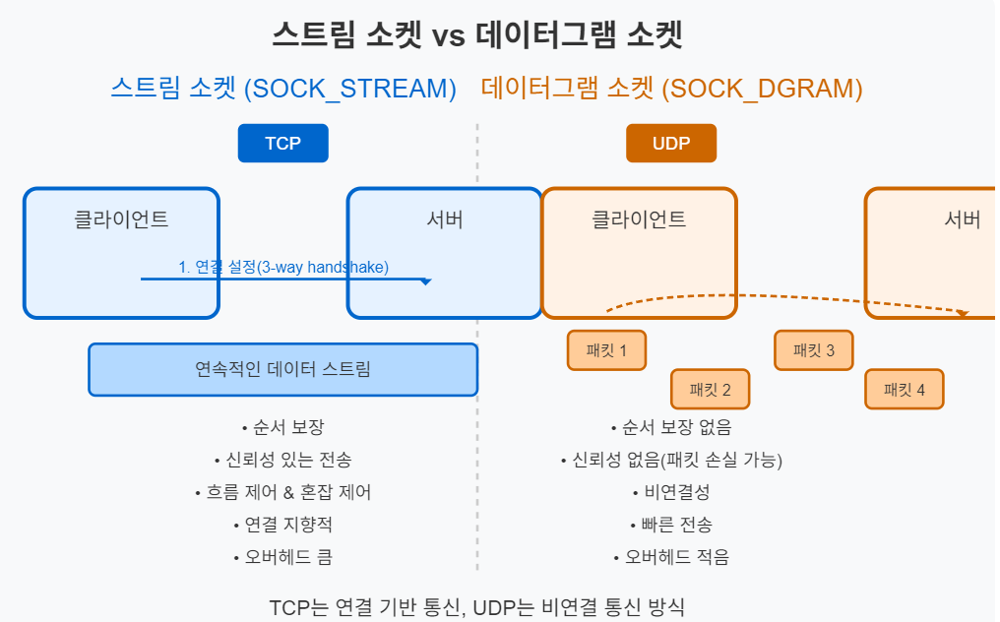
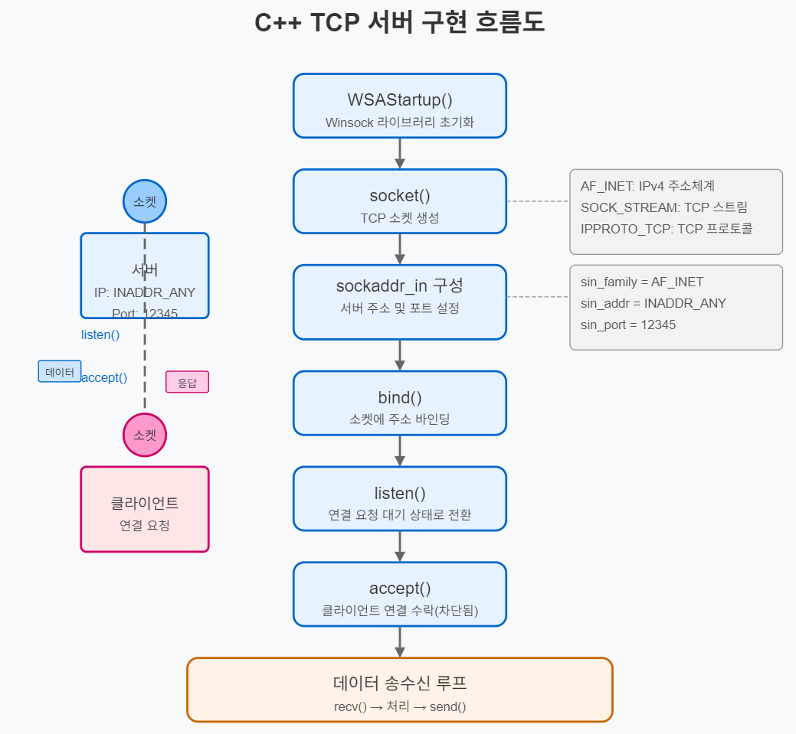
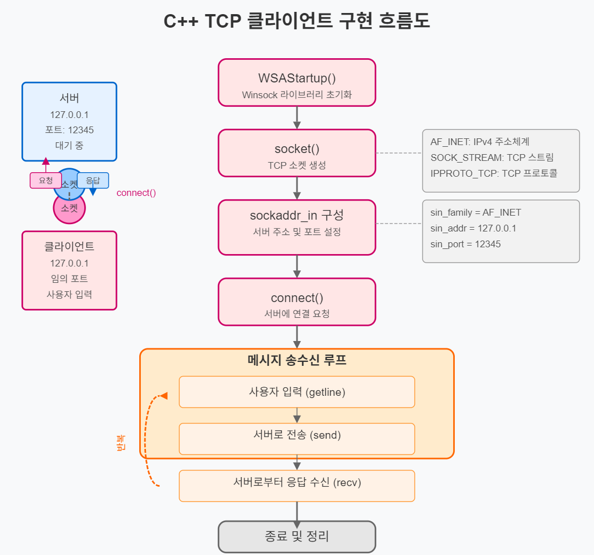

# 게임 서버 개발자가 알아야할 TCP/IP Windows 소켓 프로그래밍

저자: 최흥배, Claude AI  

- C++23
- Windows 11
- Visual Studio 2022 이상
  

-----  
# Chapter 01. 네트워크와 소켓 프로그래밍
  
## 01. TCP/IP 프로토콜 개요
TCP/IP(Transmission Control Protocol/Internet Protocol)는 인터넷에서 데이터를 주고받는 데 사용되는 표준 프로토콜 집합입니다. 이 프로토콜은 네트워크에서 데이터가 어떻게 패킷으로 나뉘고, 주소가 지정되고, 전송되고, 라우팅되며, 수신되는지에 대한 규칙을 정의합니다.

### TCP/IP 계층 구조
1. **네트워크 액세스 계층**: 이더넷, Wi-Fi 등 물리적 연결을 담당
2. **인터넷 계층**: IP 프로토콜이 여기에 속하며 패킷 라우팅과 주소 지정 담당
3. **전송 계층**:
   - **TCP**: 연결 지향적 프로토콜로 데이터 전송의 신뢰성 보장
   - **UDP**: 비연결성 프로토콜로 신뢰성보다 속도가 중요한 경우 사용
4. **응용 계층**: HTTP, FTP, SMTP 등 응용 프로그램에 서비스 제공
  
  
    
  
### 게임 서버 개발 시 고려사항
온라인 게임 서버에서는 보통 TCP와 UDP를 모두 활용합니다. **로그인, 캐릭터 정보, 게임 상태 동기화 등 신뢰성이 중요한 데이터는 TCP**를, **실시간 위치 업데이트나 음성 채팅 등 지연 시간이 중요한 데이터는 UDP**를 사용합니다.
  

## 02. 소켓의 개념  
소켓은 네트워크 통신의 기본 요소로, 두 프로그램이 네트워크를 통해 데이터를 주고받을 수 있게 해주는 양방향 통신 엔드포인트다. 마치 전화기가 두 사람을 연결해주는 것처럼, 소켓은 두 프로그램을 연결해준다.  
  
    

1. 통신 엔드포인트: 소켓은 네트워크 상의 두 프로그램을 연결하는 끝점이다.
2. 식별자: 각 소켓은 IP 주소와 포트 번호의 조합으로 고유하게 식별된다.
  소켓 = IP 주소 + 포트 번호
3. 소켓 타입:
    - TCP 소켓 (스트림 소켓): 연결 지향적, 신뢰성 있는 데이터 전송
    - UDP 소켓 (데이터그램 소켓): 비연결성, 빠르지만 신뢰성 낮음
4. 클라이언트-서버 모델:
    - 서버 소켓: 특정 포트에서 연결 요청을 대기(listen)
    - 클라이언트 소켓: 서버에 연결 요청을 보냄
  
    
### 소켓의 기본 요소
- **소켓 주소**: IP 주소와 포트 번호의 조합으로 네트워크에서 특정 프로세스를 식별
- **소켓 API**: 운영체제가 제공하는 네트워크 프로그래밍 인터페이스
   

### 소켓의 유형
1. **스트림 소켓(SOCK_STREAM)**: TCP 프로토콜 기반, 연결 지향적, 데이터 신뢰성 보장
2. **데이터그램 소켓(SOCK_DGRAM)**: UDP 프로토콜 기반, 비연결성, 빠른 전송 속도
3. **로우 소켓(SOCK_RAW)**: 하위 수준 프로토콜에 직접 접근 가능
  

     
스트림 소켓과 데이터그램 소켓의 주요 차이점은 다음과 같다:

#### 스트림 소켓 (SOCK_STREAM)
- **프로토콜**: TCP(Transmission Control Protocol) 사용
- **특징**:
  - 연결 지향적 (Connection-oriented)
  - 3-way handshake로 연결 설정
  - 데이터 전송 순서 보장
  - 신뢰성 있는 전송 (패킷 손실 시 재전송)
  - 흐름 제어와 혼잡 제어 제공
  - 바이트 스트림 형태로 데이터 전송

- **적합한 용도**:
  - 파일 전송
  - 웹 브라우징 (HTTP)
  - 이메일 (SMTP)
  - 원격 로그인 (SSH)
  
  
#### 데이터그램 소켓 (SOCK_DGRAM)
- **프로토콜**: UDP(User Datagram Protocol) 사용
- **특징**:
  - 비연결성 (Connectionless)
  - 연결 설정 없이 바로 데이터 전송
  - 데이터 순서 보장 없음
  - 신뢰성 없음 (패킷 손실 가능)
  - 흐름 제어나 혼잡 제어 없음
  - 개별 패킷 단위로 데이터 전송

- **적합한 용도**:
  - 실시간 스트리밍 (비디오, 오디오)
  - 온라인 게임
  - DNS 조회
  - IoT 센서 데이터
  
  
두 소켓 타입의 선택은 응용 프로그램의 요구사항에 따라 달라진다. 데이터 신뢰성이 중요하면 TCP 스트림 소켓을, 속도와 낮은 지연시간이 중요하면 UDP 데이터그램 소켓을 선택한다.  
    
Windows에서는 Winsock(Windows Socket) API를 사용하여 소켓 프로그래밍을 구현합니다.
  

## 03. 소켓의 특징과 구조

### 소켓의 주요 특징
1. **양방향 통신**: 데이터 송수신 모두 가능
2. **프로토콜 독립성**: 다양한 프로토콜에 대해 일관된 인터페이스 제공
3. **다중 연결 처리**: 서버 소켓은 여러 클라이언트 연결 처리 가능
4. **비동기 통신 지원**: 논블로킹 모드와 비동기 I/O 모델 지원
  
### 소켓의 구조
Windows에서 소켓은 `SOCKET` 데이터 타입으로 표현되며, 내부적으로 네트워크 리소스에 대한 핸들입니다. 소켓 주소는 다음과 같은 구조체로 표현됩니다:

```cpp
// IPv4 소켓 주소 구조체
struct sockaddr_in {
    short sin_family;           // 주소 체계 (AF_INET)
    unsigned short sin_port;    // 포트 번호
    struct in_addr sin_addr;    // IP 주소
    char sin_zero[8];           // 패딩
};

// IPv6 소켓 주소 구조체
struct sockaddr_in6 {
    short sin6_family;          // 주소 체계 (AF_INET6)
    unsigned short sin6_port;   // 포트 번호
    unsigned long sin6_flowinfo; // 흐름 정보
    struct in6_addr sin6_addr;  // IPv6 주소
    unsigned long sin6_scope_id; // 범위 ID
};
```
  

### Winsock 초기화
Windows에서 소켓 프로그래밍을 시작하기 전에 WSAStartup 함수를 호출하여 Winsock을 초기화해야 합니다:

```cpp
WSADATA wsaData;
if (WSAStartup(MAKEWORD(2, 2), &wsaData) != 0) {
    // 초기화 실패 처리
}

// 소켓 프로그래밍 코드...

WSACleanup(); // 프로그램 종료 시 정리
```
  

## 04. 소켓 프로그램 맛보기
이제 C++23 표준을 사용한 간단한 TCP 클라이언트-서버 프로그램 예제를 살펴보겠습니다.  

### TCP 서버 예제:
codes/tcp_server_01 디렉토리  
```cpp
#include <iostream>
#include <string>
#include <format>
#include <WinSock2.h>
#include <WS2tcpip.h>

#pragma comment(lib, "ws2_32.lib")

using namespace std;

int main() {
    // Winsock 초기화
    WSADATA wsaData;
    if (WSAStartup(MAKEWORD(2, 2), &wsaData) != 0) {
        cerr << "WSAStartup 실패" << endl;
        return 1;
    }

    // 소켓 생성
    SOCKET serverSocket = socket(AF_INET, SOCK_STREAM, IPPROTO_TCP);
    if (serverSocket == INVALID_SOCKET) {
        cerr << "소켓 생성 실패: " << WSAGetLastError() << endl;
        WSACleanup();
        return 1;
    }

    // 소켓 주소 설정
    sockaddr_in serverAddr;
    serverAddr.sin_family = AF_INET;
    serverAddr.sin_addr.s_addr = htonl(INADDR_ANY); // 모든 IP 주소 수신
    serverAddr.sin_port = htons(12345); // 포트 12345 사용

    // 소켓 바인딩
    if (bind(serverSocket, reinterpret_cast<sockaddr*>(&serverAddr), sizeof(serverAddr)) == SOCKET_ERROR) {
        cerr << "바인딩 실패: " << WSAGetLastError() << endl;
        closesocket(serverSocket);
        WSACleanup();
        return 1;
    }

    // 리스닝 상태로 전환
    if (listen(serverSocket, SOMAXCONN) == SOCKET_ERROR) {
        cerr << "리스닝 실패: " << WSAGetLastError() << endl;
        closesocket(serverSocket);
        WSACleanup();
        return 1;
    }

    cout << "서버가 시작되었습니다. 클라이언트를 기다리는 중..." << endl;

    // 클라이언트 연결 수락
    sockaddr_in clientAddr;
    int clientAddrSize = sizeof(clientAddr);
    SOCKET clientSocket = accept(serverSocket, reinterpret_cast<sockaddr*>(&clientAddr), &clientAddrSize);
    
    if (clientSocket == INVALID_SOCKET) {
        cerr << "클라이언트 연결 수락 실패: " << WSAGetLastError() << endl;
        closesocket(serverSocket);
        WSACleanup();
        return 1;
    }

    // 클라이언트 IP 출력
    char clientIP[INET_ADDRSTRLEN];
    inet_ntop(AF_INET, &clientAddr.sin_addr, clientIP, INET_ADDRSTRLEN);
    cout << format("클라이언트 연결됨: {}:{}\n", clientIP, ntohs(clientAddr.sin_port));

    // 데이터 수신 및 응답
    const int bufferSize = 1024;
    char buffer[bufferSize];
    
    while (true) {
        // 데이터 수신
        int bytesReceived = recv(clientSocket, buffer, bufferSize, 0);
        if (bytesReceived <= 0) {
            if (bytesReceived == 0) {
                cout << "클라이언트 연결 종료" << endl;
            } else {
                cerr << "수신 실패: " << WSAGetLastError() << endl;
            }
            break;
        }

        // 수신된 데이터 처리
        buffer[bytesReceived] = '\0';
        cout << format("클라이언트로부터 수신: {}\n", buffer);

        // 응답 전송
        string response = "메시지 수신 완료: ";
        response += buffer;
        
        if (send(clientSocket, response.c_str(), response.length(), 0) == SOCKET_ERROR) {
            cerr << "전송 실패: " << WSAGetLastError() << endl;
            break;
        }
    }

    // 소켓 닫기
    closesocket(clientSocket);
    closesocket(serverSocket);
    WSACleanup();
    
    return 0;
}
```
  
  
  

### TCP 클라이언트 예제:  
codes/tcp_client_01 디렉토리  

```cpp
#include <iostream>
#include <string>
#include <format>
#include <WinSock2.h>
#include <WS2tcpip.h>

#pragma comment(lib, "ws2_32.lib")

using namespace std;

int main() {
    // Winsock 초기화
    WSADATA wsaData;
    if (WSAStartup(MAKEWORD(2, 2), &wsaData) != 0) {
        cerr << "WSAStartup 실패" << endl;
        return 1;
    }

    // 소켓 생성
    SOCKET clientSocket = socket(AF_INET, SOCK_STREAM, IPPROTO_TCP);
    if (clientSocket == INVALID_SOCKET) {
        cerr << "소켓 생성 실패: " << WSAGetLastError() << endl;
        WSACleanup();
        return 1;
    }

    // 서버 주소 설정
    sockaddr_in serverAddr;
    serverAddr.sin_family = AF_INET;
    serverAddr.sin_port = htons(12345); // 서버와 동일한 포트 사용
    
    // 서버 IP 주소 설정 (이 예제에서는 로컬호스트)
    if (inet_pton(AF_INET, "127.0.0.1", &serverAddr.sin_addr) <= 0) {
        cerr << "잘못된 서버 주소" << endl;
        closesocket(clientSocket);
        WSACleanup();
        return 1;
    }

    // 서버에 연결
    if (connect(clientSocket, reinterpret_cast<sockaddr*>(&serverAddr), sizeof(serverAddr)) == SOCKET_ERROR) {
        cerr << "서버 연결 실패: " << WSAGetLastError() << endl;
        closesocket(clientSocket);
        WSACleanup();
        return 1;
    }

    cout << "서버에 연결되었습니다." << endl;

    // 메시지 송수신
    const int bufferSize = 1024;
    char buffer[bufferSize];
    string message;

    while (true) {
        // 사용자로부터 메시지 입력 받기
        cout << "서버로 보낼 메시지 (종료하려면 'exit' 입력): ";
        getline(cin, message);

        if (message == "exit") {
            break;
        }

        // 메시지 전송
        if (send(clientSocket, message.c_str(), message.length(), 0) == SOCKET_ERROR) {
            cerr << "전송 실패: " << WSAGetLastError() << endl;
            break;
        }

        // 응답 수신
        int bytesReceived = recv(clientSocket, buffer, bufferSize, 0);
        if (bytesReceived <= 0) {
            if (bytesReceived == 0) {
                cout << "서버 연결 종료" << endl;
            } else {
                cerr << "수신 실패: " << WSAGetLastError() << endl;
            }
            break;
        }

        // 수신된 응답 처리
        buffer[bytesReceived] = '\0';
        cout << format("서버로부터 응답: {}\n", buffer);
    }

    // 소켓 닫기
    closesocket(clientSocket);
    WSACleanup();

    return 0;
}
```
  
  
 

### 소켓 프로그래밍의 핵심 단계
1. **초기화**: Winsock 라이브러리 초기화 (WSAStartup)
2. **소켓 생성**: socket() 함수로 소켓 생성
3. **서버 측**:
   - 바인딩(bind): 소켓을 특정 주소와 포트에 바인딩
   - 리스닝(listen): 연결 요청 대기 상태로 전환
   - 수락(accept): 클라이언트 연결 요청 수락
4. **클라이언트 측**:
   - 연결(connect): 서버에 연결 요청
5. **데이터 송수신**: send(), recv() 함수 사용
6. **정리**: 소켓 닫기(closesocket), Winsock 정리(WSACleanup)
  

### 게임 서버 개발을 위한 추가 고려사항
1. **비동기 소켓 프로그래밍**: 실제 게임 서버에서는 대부분 비동기 방식을 사용합니다. Windows에서는 WSAEventSelect, WSAAsyncSelect, Overlapped I/O, I/O Completion Port(IOCP) 등의 메커니즘을 제공합니다.

2. **멀티스레딩**: 고성능 서버는 다중 스레드를 활용하여 여러 작업을 동시에 처리합니다. C++23의 std::thread, std::mutex 등을 사용하여 구현할 수 있습니다.

3. **오류 처리**: 네트워크 프로그래밍에서는 다양한 예외 상황이 발생할 수 있으므로 적절한 오류 처리가 중요합니다.

4. **패킷 설계**: 효율적인 데이터 직렬화/역직렬화 방법과 패킷 구조 설계가 필요합니다.

5. **보안**: 온라인 게임 서버는 보안에 특히 주의해야 합니다. SSL/TLS를 이용한 암호화, 패킷 인증 등의 기술을 적용해야 할 수 있습니다.

이러한 기본 개념들을 이해하고 실습하면서, 점진적으로 더 복잡한 게임 서버 구조와 최적화 기법들을 학습해 나가시기 바랍니다.   

