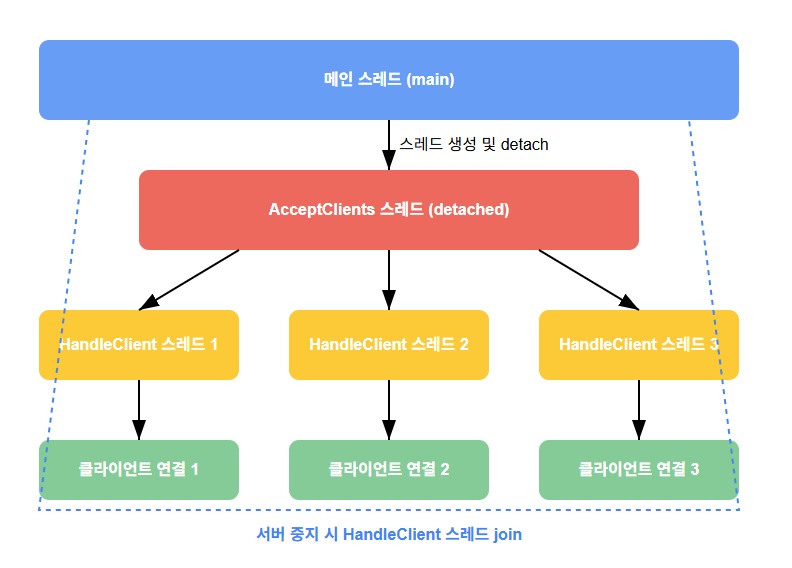

# 게임 서버 개발자가 알아야할 TCP/IP Windows 소켓 프로그래밍

저자: 최흥배, Claude AI  

- C++23
- Windows 11
- Visual Studio 2022 이상
  

-----  
# Chapter 04. TCP 서버-클라이언트 
  
## 01 TCP 서버-클라이언트 구조
TCP(Transmission Control Protocol)는 신뢰성 있는 데이터 전송을 보장하는 연결 지향적 프로토콜입니다. 온라인 게임에서는 데이터의 정확한 전달이 중요하기 때문에 TCP가 널리 사용됩니다. 

### TCP의 주요 특징
- **연결 지향적**: 통신 전 연결 설정이 필요합니다
- **신뢰성**: 패킷 손실 시 자동으로 재전송됩니다
- **순서 보장**: 데이터가 보낸 순서대로 도착합니다
- **흐름/혼잡 제어**: 네트워크 상황에 따라 데이터 전송 속도를 조절합니다

### TCP 서버-클라이언트 기본 구조
**서버 측 동작**:
1. 소켓 생성 (socket)
2. 소켓에 주소 바인딩 (bind)
3. 연결 대기 상태로 전환 (listen)
4. 클라이언트 연결 수락 (accept)
5. 데이터 송수신 (send/recv)
6. 연결 종료 (close)

**클라이언트 측 동작**:
1. 소켓 생성 (socket)
2. 서버에 연결 요청 (connect)
3. 데이터 송수신 (send/recv)
4. 연결 종료 (close)

### Windows 네트워크 프로그래밍 기초
Windows에서 네트워크 프로그래밍을 하기 위해 Winsock API를 사용합니다. 기본적인 순서는 다음과 같습니다:

1. WSAStartup 함수로 Winsock 초기화
2. 소켓 생성, 바인딩, 연결 등의 작업 수행
3. 데이터 송수신
4. WSACleanup 함수로 Winsock 종료
  

## 02 TCP 서버-클라이언트 분석

### TCP 서버 구현
   
  
다음은 C++23과 최신 Win32 API를 사용한 TCP 서버 구현 예시입니다:  
`codes/tcp_server_02`  

```cpp
#include <iostream>
#include <string>
#include <format>
#include <thread>
#include <vector>
#include <WinSock2.h>
#include <WS2tcpip.h>

#pragma comment(lib, "ws2_32.lib")

class TCPServer {
private:
    SOCKET listenSocket;
    std::vector<std::thread> clientThreads;
    bool running;
    
    static constexpr int BUFFER_SIZE = 1024;
    static constexpr int DEFAULT_PORT = 27015;

public:
    TCPServer() : listenSocket(INVALID_SOCKET), running(false) {}
    
    ~TCPServer() {
        Stop();
    }
    
    bool Start(int port = DEFAULT_PORT) {
        WSADATA wsaData;
        int result = WSAStartup(MAKEWORD(2, 2), &wsaData);
        if (result != 0) {
            std::cerr << std::format("WSAStartup 실패: {}\n", result);
            return false;
        }
        
        // 소켓 생성
        listenSocket = socket(AF_INET, SOCK_STREAM, IPPROTO_TCP);
        if (listenSocket == INVALID_SOCKET) {
            std::cerr << std::format("소켓 생성 실패: {}\n", WSAGetLastError());
            WSACleanup();
            return false;
        }
        
        // 서버 주소 설정
        sockaddr_in serverAddr;
        serverAddr.sin_family = AF_INET;
        serverAddr.sin_port = htons(port);
        serverAddr.sin_addr.s_addr = INADDR_ANY;  // 모든 인터페이스에서 접속 허용
        
        // 소켓 바인딩
        result = bind(listenSocket, reinterpret_cast<sockaddr*>(&serverAddr), sizeof(serverAddr));
        if (result == SOCKET_ERROR) {
            std::cerr << std::format("바인딩 실패: {}\n", WSAGetLastError());
            closesocket(listenSocket);
            WSACleanup();
            return false;
        }
        
        // 연결 대기 시작
        result = listen(listenSocket, SOMAXCONN);
        if (result == SOCKET_ERROR) {
            std::cerr << std::format("리슨 실패: {}\n", WSAGetLastError());
            closesocket(listenSocket);
            WSACleanup();
            return false;
        }
        
        running = true;
        std::cout << std::format("TCP 서버가 포트 {}에서 시작되었습니다.\n", port);
        
        // 클라이언트 연결 수락 스레드 시작
        std::thread acceptThread(&TCPServer::AcceptClients, this);
        acceptThread.detach();
        
        return true;
    }
    
    void Stop() {
        running = false;
        
        if (listenSocket != INVALID_SOCKET) {
            closesocket(listenSocket);
            listenSocket = INVALID_SOCKET;
        }
        
        for (auto& thread : clientThreads) {
            if (thread.joinable()) {
                thread.join();
            }
        }
        
        clientThreads.clear();
        WSACleanup();
        std::cout << "TCP 서버가 중지되었습니다.\n";
    }
    
private:
    void AcceptClients() {
        while (running) {
            // 클라이언트 연결 수락
            sockaddr_in clientAddr;
            int clientAddrLen = sizeof(clientAddr);
            
            SOCKET clientSocket = accept(listenSocket, reinterpret_cast<sockaddr*>(&clientAddr), &clientAddrLen);
            if (clientSocket == INVALID_SOCKET) {
                if (running) {
                    std::cerr << std::format("클라이언트 연결 수락 실패: {}\n", WSAGetLastError());
                }
                continue;
            }
            
            // 클라이언트 IP 주소 얻기
            char clientIP[INET_ADDRSTRLEN];
            inet_ntop(AF_INET, &clientAddr.sin_addr, clientIP, INET_ADDRSTRLEN);
            std::cout << std::format("새 클라이언트 연결: {}:{}\n", clientIP, ntohs(clientAddr.sin_port));
            
            // 클라이언트 처리 스레드 시작
            clientThreads.emplace_back(&TCPServer::HandleClient, this, clientSocket, std::string(clientIP));
        }
    }
    
    void HandleClient(SOCKET clientSocket, std::string clientIP) {
        char buffer[BUFFER_SIZE];
        
        while (running) {
            // 데이터 수신
            int bytesReceived = recv(clientSocket, buffer, BUFFER_SIZE - 1, 0);
            if (bytesReceived <= 0) {
                if (bytesReceived == 0) {
                    std::cout << std::format("클라이언트 {}가 연결을 종료했습니다.\n", clientIP);
                } else {
                    std::cerr << std::format("recv 실패: {}\n", WSAGetLastError());
                }
                break;
            }
            
            // 수신된 데이터 처리
            buffer[bytesReceived] = '\0';
            std::cout << std::format("{}로부터 수신: {}\n", clientIP, buffer);
            
            // 클라이언트에게 에코 응답
            std::string response = std::format("서버 에코: {}", buffer);
            int bytesSent = send(clientSocket, response.c_str(), static_cast<int>(response.length()), 0);
            if (bytesSent == SOCKET_ERROR) {
                std::cerr << std::format("send 실패: {}\n", WSAGetLastError());
                break;
            }
        }
        
        // 클라이언트 소켓 닫기
        closesocket(clientSocket);
    }
};

int main() {
    // 한글 출력을 위한 설정
    SetConsoleOutputCP(CP_UTF8);
    
    TCPServer server;
    if (server.Start()) {
        std::cout << "서버를 종료하려면 아무 키나 누르세요...\n";
        std::cin.get();
        server.Stop();
    }
    
    return 0;
}
```

### TCP 클라이언트 구현  
`codes/tcp_client_02`  

```cpp
#include <iostream>
#include <string>
#include <format>
#include <thread>
#include <WinSock2.h>
#include <WS2tcpip.h>

#pragma comment(lib, "ws2_32.lib")

class TCPClient {
private:
    SOCKET clientSocket;
    bool connected;
    std::thread receiveThread;
    
    static constexpr int BUFFER_SIZE = 1024;
    static constexpr int DEFAULT_PORT = 27015;

public:
    TCPClient() : clientSocket(INVALID_SOCKET), connected(false) {}
    
    ~TCPClient() {
        Disconnect();
    }
    
    bool Connect(const std::string& serverIP, int port = DEFAULT_PORT) {
        // Winsock 초기화
        WSADATA wsaData;
        int result = WSAStartup(MAKEWORD(2, 2), &wsaData);
        if (result != 0) {
            std::cerr << std::format("WSAStartup 실패: {}\n", result);
            return false;
        }
        
        // 소켓 생성
        clientSocket = socket(AF_INET, SOCK_STREAM, IPPROTO_TCP);
        if (clientSocket == INVALID_SOCKET) {
            std::cerr << std::format("소켓 생성 실패: {}\n", WSAGetLastError());
            WSACleanup();
            return false;
        }
        
        // 서버 주소 설정
        sockaddr_in serverAddr;
        serverAddr.sin_family = AF_INET;
        serverAddr.sin_port = htons(port);
        inet_pton(AF_INET, serverIP.c_str(), &serverAddr.sin_addr);
        
        // 서버에 연결
        result = connect(clientSocket, reinterpret_cast<sockaddr*>(&serverAddr), sizeof(serverAddr));
        if (result == SOCKET_ERROR) {
            std::cerr << std::format("서버 연결 실패: {}\n", WSAGetLastError());
            closesocket(clientSocket);
            WSACleanup();
            return false;
        }
        
        connected = true;
        std::cout << std::format("{}:{}에 연결되었습니다.\n", serverIP, port);
        
        // 수신 스레드 시작
        receiveThread = std::thread(&TCPClient::ReceiveMessages, this);
        
        return true;
    }
    
    void Disconnect() {
        connected = false;
        
        if (clientSocket != INVALID_SOCKET) {
            closesocket(clientSocket);
            clientSocket = INVALID_SOCKET;
        }
        
        if (receiveThread.joinable()) {
            receiveThread.join();
        }
        
        WSACleanup();
        std::cout << "서버와의 연결이 종료되었습니다.\n";
    }
    
    bool SendMessage(const std::string& message) {
        if (!connected || clientSocket == INVALID_SOCKET) {
            std::cerr << "연결되지 않았습니다.\n";
            return false;
        }
        
        int bytesSent = send(clientSocket, message.c_str(), static_cast<int>(message.length()), 0);
        if (bytesSent == SOCKET_ERROR) {
            std::cerr << std::format("메시지 전송 실패: {}\n", WSAGetLastError());
            return false;
        }
        
        return true;
    }
    
private:
    void ReceiveMessages() {
        char buffer[BUFFER_SIZE];
        
        while (connected) {
            // 데이터 수신
            int bytesReceived = recv(clientSocket, buffer, BUFFER_SIZE - 1, 0);
            if (bytesReceived <= 0) {
                if (bytesReceived == 0) {
                    std::cout << "서버가 연결을 종료했습니다.\n";
                } else {
                    std::cerr << std::format("recv 실패: {}\n", WSAGetLastError());
                }
                connected = false;
                break;
            }
            
            // 수신된 데이터 처리
            buffer[bytesReceived] = '\0';
            std::cout << "서버로부터 수신: " << buffer << std::endl;
        }
    }
};

int main() {
    // 한글 출력을 위한 설정
    SetConsoleOutputCP(CP_UTF8);
    
    TCPClient client;
    std::string serverIP;
    
    std::cout << "서버 IP를 입력하세요 (localhost는 127.0.0.1): ";
    std::getline(std::cin, serverIP);
    
    if (client.Connect(serverIP)) {
        std::string message;
        while (true) {
            std::cout << "전송할 메시지 (종료: exit): ";
            std::getline(std::cin, message);
            
            if (message == "exit") {
                break;
            }
            
            client.SendMessage(message);
        }
        
        client.Disconnect();
    }
    
    return 0;
}
```

### 서버-클라이언트 구현 분석

1. **서버 동작 방식**:
   - `Start()` 메서드에서 소켓을 생성하고 바인딩한 후 연결 대기
   - `AcceptClients()` 메서드는 별도 스레드에서 실행되며 클라이언트 연결을 수락
   - 각 클라이언트 연결마다 `HandleClient()` 메서드를 실행하는 새 스레드 생성
   - 에코 서버 방식으로 수신한 메시지를 그대로 클라이언트에게 반환

2. **클라이언트 동작 방식**:
   - `Connect()` 메서드에서 서버에 연결
   - 수신 메시지를 처리하기 위한 별도 스레드 생성 (`ReceiveMessages()`)
   - 메인 스레드는 사용자 입력을 받아 서버로 메시지 전송

3. **멀티스레딩 구현**:
   - C++11부터 도입된 `std::thread`를 사용하여 멀티스레딩 구현
   - 각 클라이언트 연결을 별도 스레드로 처리하여 동시 다중 접속 지원
   - 비동기 메시지 수신을 위해 수신 전용 스레드 사용

4. **에러 처리**:
   - 각 단계마다 상세한 에러 메시지 출력
   - 연결 종료 시 적절한 리소스 정리
  

## 03 TCP 서버-클라이언트(IPv6)
IPv6는 주소 고갈 문제를 해결하기 위해 도입된 차세대 인터넷 프로토콜입니다. 최신 게임 서버는 IPv6 지원이 필수적입니다.

### IPv6 TCP 서버 구현 
`codes/tcp_server_03`   
`codes/tcp_server_02`는 한번에 1개의 클라이언트 접속할 수 있지만 `codes/tcp_server_03`은 thread를 사용하여 동시에 복수의 클라이언트가 접속할 수 있다.          
  
```cpp
#include <iostream>
#include <string>
#include <format>
#include <thread>
#include <vector>
#include <WinSock2.h>
#include <WS2tcpip.h>

#pragma comment(lib, "ws2_32.lib")

class TCPServerIPv6 {
private:
    SOCKET listenSocket;
    std::vector<std::thread> clientThreads;
    bool running;
    
    static constexpr int BUFFER_SIZE = 1024;
    static constexpr int DEFAULT_PORT = 27015;

public:
    TCPServerIPv6() : listenSocket(INVALID_SOCKET), running(false) {}
    
    ~TCPServerIPv6() {
        Stop();
    }
    
    bool Start(int port = DEFAULT_PORT) {
        WSADATA wsaData;
        int result = WSAStartup(MAKEWORD(2, 2), &wsaData);
        if (result != 0) {
            std::cerr << std::format("WSAStartup 실패: {}\n", result);
            return false;
        }
        
        // IPv6 소켓 생성
        listenSocket = socket(AF_INET6, SOCK_STREAM, IPPROTO_TCP);
        if (listenSocket == INVALID_SOCKET) {
            std::cerr << std::format("소켓 생성 실패: {}\n", WSAGetLastError());
            WSACleanup();
            return false;
        }
        
        // IPv4 매핑된 IPv6 주소 허용 (듀얼 스택)
        int ipv6Only = 0; // 0: 듀얼 스택(IPv4+IPv6), 1: IPv6만
        result = setsockopt(listenSocket, IPPROTO_IPV6, IPV6_V6ONLY, 
                          reinterpret_cast<char*>(&ipv6Only), sizeof(ipv6Only));
        if (result == SOCKET_ERROR) {
            std::cerr << std::format("IPv6 옵션 설정 실패: {}\n", WSAGetLastError());
            closesocket(listenSocket);
            WSACleanup();
            return false;
        }
        
        // 서버 주소 설정 (IPv6)
        sockaddr_in6 serverAddr;
        ZeroMemory(&serverAddr, sizeof(serverAddr));
        serverAddr.sin6_family = AF_INET6;
        serverAddr.sin6_port = htons(port);
        serverAddr.sin6_addr = in6addr_any; // 모든 IPv6 인터페이스에서 접속 허용
        
        // 소켓 바인딩
        result = bind(listenSocket, reinterpret_cast<sockaddr*>(&serverAddr), sizeof(serverAddr));
        if (result == SOCKET_ERROR) {
            std::cerr << std::format("바인딩 실패: {}\n", WSAGetLastError());
            closesocket(listenSocket);
            WSACleanup();
            return false;
        }
        
        // 연결 대기 시작
        result = listen(listenSocket, SOMAXCONN);
        if (result == SOCKET_ERROR) {
            std::cerr << std::format("리슨 실패: {}\n", WSAGetLastError());
            closesocket(listenSocket);
            WSACleanup();
            return false;
        }
        
        running = true;
        std::cout << std::format("TCP IPv6 서버가 포트 {}에서 시작되었습니다.\n", port);
        
        // 클라이언트 연결 수락 스레드 시작
        std::thread acceptThread(&TCPServerIPv6::AcceptClients, this);
        acceptThread.detach();
        
        return true;
    }
    
    void Stop() {
        running = false;
        
        if (listenSocket != INVALID_SOCKET) {
            closesocket(listenSocket);
            listenSocket = INVALID_SOCKET;
        }
        
        for (auto& thread : clientThreads) {
            if (thread.joinable()) {
                thread.join();
            }
        }
        
        clientThreads.clear();
        WSACleanup();
        std::cout << "TCP IPv6 서버가 중지되었습니다.\n";
    }
    
private:
    void AcceptClients() {
        while (running) {
            // 클라이언트 연결 수락
            sockaddr_in6 clientAddr;
            int clientAddrLen = sizeof(clientAddr);
            
            SOCKET clientSocket = accept(listenSocket, reinterpret_cast<sockaddr*>(&clientAddr), &clientAddrLen);
            if (clientSocket == INVALID_SOCKET) {
                if (running) {
                    std::cerr << std::format("클라이언트 연결 수락 실패: {}\n", WSAGetLastError());
                }
                continue;
            }
            
            // 클라이언트 IP 주소 얻기
            char clientIP[INET6_ADDRSTRLEN];
            inet_ntop(AF_INET6, &clientAddr.sin6_addr, clientIP, INET6_ADDRSTRLEN);
            std::cout << std::format("새 클라이언트 연결: [{}]:{}\n", clientIP, ntohs(clientAddr.sin6_port));
            
            // 클라이언트 처리 스레드 시작
            clientThreads.emplace_back(&TCPServerIPv6::HandleClient, this, clientSocket, std::string(clientIP));
        }
    }
    
    void HandleClient(SOCKET clientSocket, std::string clientIP) {
        char buffer[BUFFER_SIZE];
        
        while (running) {
            // 데이터 수신
            int bytesReceived = recv(clientSocket, buffer, BUFFER_SIZE - 1, 0);
            if (bytesReceived <= 0) {
                if (bytesReceived == 0) {
                    std::cout << std::format("클라이언트 {}가 연결을 종료했습니다.\n", clientIP);
                } else {
                    std::cerr << std::format("recv 실패: {}\n", WSAGetLastError());
                }
                break;
            }
            
            // 수신된 데이터 처리
            buffer[bytesReceived] = '\0';
            std::cout << std::format("{}로부터 수신: {}\n", clientIP, buffer);
            
            // 클라이언트에게 에코 응답
            std::string response = std::format("IPv6 서버 에코: {}", buffer);
            int bytesSent = send(clientSocket, response.c_str(), static_cast<int>(response.length()), 0);
            if (bytesSent == SOCKET_ERROR) {
                std::cerr << std::format("send 실패: {}\n", WSAGetLastError());
                break;
            }
        }
        
        // 클라이언트 소켓 닫기
        closesocket(clientSocket);
    }
};

int main() {
    // 한글 출력을 위한 설정
    SetConsoleOutputCP(CP_UTF8);
    
    TCPServerIPv6 server;
    if (server.Start()) {
        std::cout << "서버를 종료하려면 아무 키나 누르세요...\n";
        std::cin.get();
        server.Stop();
    }
    
    return 0;
}
```

### IPv6 TCP 클라이언트 구현
`codes/tcp_client_03`    

```cpp
#include <iostream>
#include <string>
#include <format>
#include <thread>
#include <WinSock2.h>
#include <WS2tcpip.h>

#pragma comment(lib, "ws2_32.lib")

class TCPClientIPv6 {
private:
    SOCKET clientSocket;
    bool connected;
    std::thread receiveThread;
    
    static constexpr int BUFFER_SIZE = 1024;
    static constexpr int DEFAULT_PORT = 27015;

public:
    TCPClientIPv6() : clientSocket(INVALID_SOCKET), connected(false) {}
    
    ~TCPClientIPv6() {
        Disconnect();
    }
    
    bool Connect(const std::string& serverIP, int port = DEFAULT_PORT) {
        // Winsock 초기화
        WSADATA wsaData;
        int result = WSAStartup(MAKEWORD(2, 2), &wsaData);
        if (result != 0) {
            std::cerr << std::format("WSAStartup 실패: {}\n", result);
            return false;
        }
        
        // IPv6 소켓 생성
        clientSocket = socket(AF_INET6, SOCK_STREAM, IPPROTO_TCP);
        if (clientSocket == INVALID_SOCKET) {
            std::cerr << std::format("소켓 생성 실패: {}\n", WSAGetLastError());
            WSACleanup();
            return false;
        }
        
        // 서버 주소 설정 (IPv6)
        sockaddr_in6 serverAddr;
        ZeroMemory(&serverAddr, sizeof(serverAddr));
        serverAddr.sin6_family = AF_INET6;
        serverAddr.sin6_port = htons(port);
        
        // IPv6 주소 변환
        if (inet_pton(AF_INET6, serverIP.c_str(), &serverAddr.sin6_addr) != 1) {
            std::cerr << "잘못된 IPv6 주소 형식입니다.\n";
            closesocket(clientSocket);
            WSACleanup();
            return false;
        }
        
        // 서버에 연결
        result = connect(clientSocket, reinterpret_cast<sockaddr*>(&serverAddr), sizeof(serverAddr));
        if (result == SOCKET_ERROR) {
            std::cerr << std::format("서버 연결 실패: {}\n", WSAGetLastError());
            closesocket(clientSocket);
            WSACleanup();
            return false;
        }
        
        connected = true;
        std::cout << std::format("[{}]:{}에 연결되었습니다.\n", serverIP, port);
        
        // 수신 스레드 시작
        receiveThread = std::thread(&TCPClientIPv6::ReceiveMessages, this);
        
        return true;
    }
    
    void Disconnect() {
        connected = false;
        
        if (clientSocket != INVALID_SOCKET) {
            closesocket(clientSocket);
            clientSocket = INVALID_SOCKET;
        }
        
        if (receiveThread.joinable()) {
            receiveThread.join();
        }
        
        WSACleanup();
        std::cout << "서버와의 연결이 종료되었습니다.\n";
    }
    
    bool SendMessage(const std::string& message) {
        if (!connected || clientSocket == INVALID_SOCKET) {
            std::cerr << "연결되지 않았습니다.\n";
            return false;
        }
        
        int bytesSent = send(clientSocket, message.c_str(), static_cast<int>(message.length()), 0);
        if (bytesSent == SOCKET_ERROR) {
            std::cerr << std::format("메시지 전송 실패: {}\n", WSAGetLastError());
            return false;
        }
        
        return true;
    }
    
private:
    void ReceiveMessages() {
        char buffer[BUFFER_SIZE];
        
        while (connected) {
            // 데이터 수신
            int bytesReceived = recv(clientSocket, buffer, BUFFER_SIZE - 1, 0);
            if (bytesReceived <= 0) {
                if (bytesReceived == 0) {
                    std::cout << "서버가 연결을 종료했습니다.\n";
                } else {
                    std::cerr << std::format("recv 실패: {}\n", WSAGetLastError());
                }
                connected = false;
                break;
            }
            
            // 수신된 데이터 처리
            buffer[bytesReceived] = '\0';
            std::cout << "서버로부터 수신: " << buffer << std::endl;
        }
    }
};

int main() {
    // 한글 출력을 위한 설정
    SetConsoleOutputCP(CP_UTF8);
    
    TCPClientIPv6 client;
    std::string serverIP;
    
    std::cout << "서버 IPv6 주소를 입력하세요 (localhost는 ::1): ";
    std::getline(std::cin, serverIP);
    
    if (client.Connect(serverIP)) {
        std::string message;
        while (true) {
            std::cout << "전송할 메시지 (종료: exit): ";
            std::getline(std::cin, message);
            
            if (message == "exit") {
                break;
            }
            
            client.SendMessage(message);
        }
        
        client.Disconnect();
    }
    
    return 0;
}
```

### IPv4와 IPv6의 주요 차이점
1. **주소 체계**:
   - IPv4: 32비트 주소 (예: 192.168.0.1)
   - IPv6: 128비트 주소 (예: 2001:0db8:85a3:0000:8a2e:0370:7334)

2. **구현 차이**:
   - 소켓 생성 시 주소 패밀리를 `AF_INET6`로 설정
   - IPv6 주소를 저장하기 위해 `sockaddr_in6` 구조체 사용
   - 듀얼 스택 지원을 위한 `IPV6_V6ONLY` 소켓 옵션 설정

3. **듀얼 스택**:
   - Windows에서는 IPv6 소켓이 IPv4 연결도 수락하도록 설정 가능
   - `IPV6_V6ONLY` 옵션을 0으로 설정하여 구현
   - 하나의 서버로 IPv4와 IPv6 클라이언트 모두 지원 가능

### 게임 서버 개발자를 위한 추가 고려 사항
1. **비동기 I/O 및 성능 최적화**:
   - 실제 게임 서버에서는 비동기 I/O(IOCP, Overlapped I/O)를 활용하여 성능 향상
   - I/O 멀티플렉싱(select, WSAPoll 등) 고려

2. **패킷 설계**:
   - 게임 서버에서는 바이너리 프로토콜을 사용하여 효율적인 데이터 전송
   - 헤더-페이로드 구조의 패킷 설계
   - 직렬화/역직렬화 라이브러리 활용(Protocol Buffers, FlatBuffers 등)

3. **세션 관리**:
   - 클라이언트 연결을 객체 지향적으로 관리하는 세션 시스템 구현
   - 연결/연결 해제 이벤트 처리
   - 타임아웃, 핑-퐁 메커니즘으로 연결 상태 확인

4. **스레드 관리**:
   - 스레드 풀을 사용하여 리소스 효율적 사용
   - 스레드 간 공유 자원 동기화
   - 락 최소화를 통한 성능 향상

5. **보안 고려사항**:
   - 패킷 검증으로 조작 방지
   - TLS/SSL 적용으로 암호화 통신
   - DDoS 방어 전략 수립

이 예제들은 기본적인 TCP 서버-클라이언트 구현을 보여주는 것으로, 실제 게임 서버 개발에는 더 복잡한 아키텍처와 최적화가 필요합니다. 그러나 기본 개념을 이해하는 데 좋은 출발점이 될 것입니다.  
