# 게임 서버 개발자가 알아야할 TCP/IP Windows 소켓 프로그래밍

저자: 최흥배, Claude AI  

- C++23
- Windows 11
- Visual Studio 2022 이상
  

-----  
# Chapter.05 데이터 전송하기

## 01 응용 프로그램 프로토콜과 데이터 전송
온라인 게임에서 서버와 클라이언트 간의 데이터 전송은 게임의 핵심입니다. 이 데이터 교환을 위해서는 양측이 이해할 수 있는 규약, 즉 **응용 프로그램 프로토콜**이 필요합니다.

### 응용 프로그램 프로토콜이란?
응용 프로그램 프로토콜은 **두 프로그램이 서로 통신할 때 사용하는 데이터 형식과 규칙을 정의**한 것입니다.   
게임에서는 이 프로토콜을 통해 캐릭터 움직임, 공격, 채팅 등 다양한 정보를 주고받습니다.  

### 바이트 순서(Endianness) 
네트워크 통신에서 가장 기본적인 문제 중 하나는 바이트 순서입니다.

```cpp
// 네트워크 바이트 순서(빅 엔디안)로 변환
uint16_t hostToNetwork16(uint16_t value) {
    return htons(value); // host to network short
}

uint32_t hostToNetwork32(uint32_t value) {
    return htonl(value); // host to network long
}

// 호스트 바이트 순서로 변환
uint16_t networkToHost16(uint16_t value) {
    return ntohs(value); // network to host short
}

uint32_t networkToHost32(uint32_t value) {
    return ntohl(value); // network to host long
}
```
  
C++로 만든 서버와 클라이언트 푸로그램이 x86_64 CPU 아키텍처에서 실행된다면 바이트 순서 문제는 대체로 고려하지 않아도 됩니다. x86_64 CPU 아키텍처는 `리틀 엔디안` 입니다. 또 C#을 사용하는 경우 CPU 아키텍처와 상관 없이 .NET 플랫폼은 `리틀 엔디안` 입니다.
  
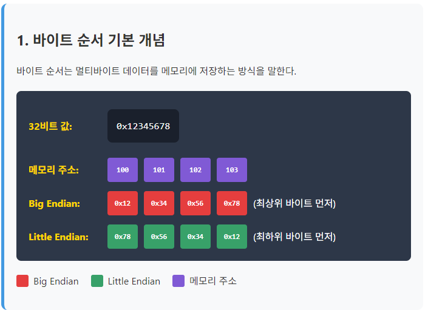   
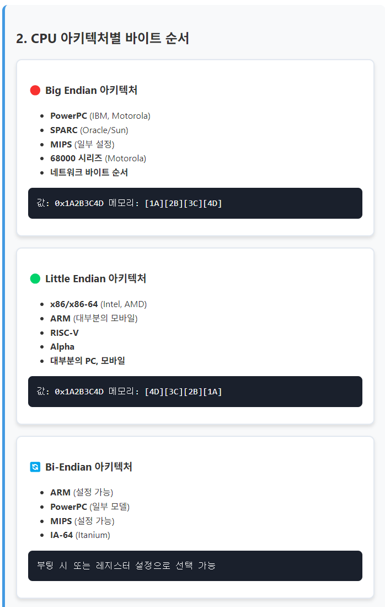   


프로그래밍 언어별 바이트 순서 처리  
  
C/C++ - 플랫폼 의존적  
```
#include <arpa/inet.h>  // Linux/Unix
#include <winsock2.h>   // Windows

// 엔디안 확인
bool is_little_endian() {
    uint32_t test = 1;
    return *(uint8_t*)&test == 1;
}

// 네트워크 바이트 순서 변환
uint32_t host_to_network(uint32_t host_value) {
    return htonl(host_value);  // Host TO Network Long
}

uint32_t network_to_host(uint32_t network_value) {
    return ntohl(network_value);  // Network TO Host Long
}

// 수동 바이트 순서 변환
uint32_t swap_bytes(uint32_t value) {
    return ((value & 0xFF000000) >> 24) |
           ((value & 0x00FF0000) >> 8)  |
           ((value & 0x0000FF00) << 8)  |
           ((value & 0x000000FF) << 24);
}
```  
  
Rust - 명시적 엔디안 제어  
```
// 바이트 순서 변환
let value: u32 = 0x12345678;

// 네트워크 바이트 순서 (Big Endian)
let big_endian = value.to_be();
let from_big = u32::from_be(big_endian);

// 호스트 바이트 순서 (Little Endian)
let little_endian = value.to_le();
let from_little = u32::from_le(little_endian);

// 바이트 배열로 직렬화
let bytes_be = value.to_be_bytes();  // [0x12, 0x34, 0x56, 0x78]
let bytes_le = value.to_le_bytes();  // [0x78, 0x56, 0x34, 0x12]

// 바이트 배열에서 복원
let restored_be = u32::from_be_bytes([0x12, 0x34, 0x56, 0x78]);
let restored_le = u32::from_le_bytes([0x78, 0x56, 0x34, 0x12]);
Go - 내장 바이너리 패키지
import (
    "encoding/binary"
    "bytes"
)

func endianExample() {
    value := uint32(0x12345678)
    buf := new(bytes.Buffer)
    
    // Big Endian 쓰기
    binary.Write(buf, binary.BigEndian, value)
    // 결과: [0x12, 0x34, 0x56, 0x78]
    
    // Little Endian 쓰기
    buf.Reset()
    binary.Write(buf, binary.LittleEndian, value)
    // 결과: [0x78, 0x56, 0x34, 0x12]
    
    // 읽기
    var result uint32
    binary.Read(buf, binary.LittleEndian, &result)
}
```  
  
Java - DataInputStream/DataOutputStream  
```
import java.io.*;
import java.nio.ByteBuffer;
import java.nio.ByteOrder;

// Java는 기본적으로 Big Endian
public class EndianExample {
    public static void main(String[] args) throws IOException {
        int value = 0x12345678;
        
        // Big Endian (Java 기본값)
        ByteBuffer bigBuffer = ByteBuffer.allocate(4);
        bigBuffer.putInt(value);
        byte[] bigBytes = bigBuffer.array();
        // 결과: [0x12, 0x34, 0x56, 0x78]
        
        // Little Endian
        ByteBuffer littleBuffer = ByteBuffer.allocate(4);
        littleBuffer.order(ByteOrder.LITTLE_ENDIAN);
        littleBuffer.putInt(value);
        byte[] littleBytes = littleBuffer.array();
        // 결과: [0x78, 0x56, 0x34, 0x12]
    }
}
```  
  
Python - struct 모듈
```  
import struct
import socket

value = 0x12345678

# Big Endian 패킹
big_endian = struct.pack('>I', value)     # '>' = Big Endian
print(f"Big Endian: {big_endian}")
# 결과: b'\x12\x34\x56\x78'

# Little Endian 패킹  
little_endian = struct.pack('<I', value)  # '<' = Little Endian
print(f"Little Endian: {little_endian}")
# 결과: b'xV4\x12'

# 언패킹 예제
unpacked_big = struct.unpack('>I', big_endian)[0]
unpacked_little = struct.unpack('<I', little_endian)[0]

print(f"Original value: 0x{value:08x}")
print(f"Unpacked from big endian: 0x{unpacked_big:08x}")
print(f"Unpacked from little endian: 0x{unpacked_little:08x}")

# 네트워크 바이트 순서 (항상 big endian)
network_order = socket.htonl(value)  # host to network long
print(f"Network order: 0x{network_order:08x}")
```  
  
    
### 바이트 정렬
  
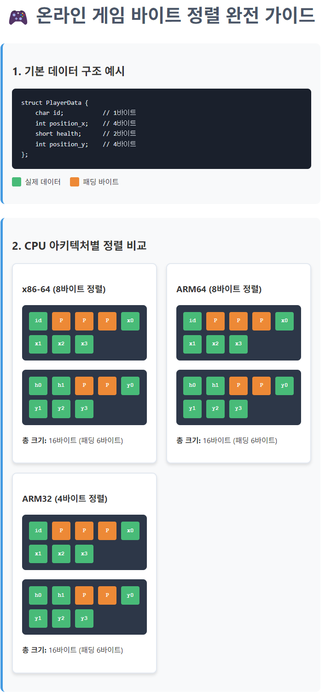   
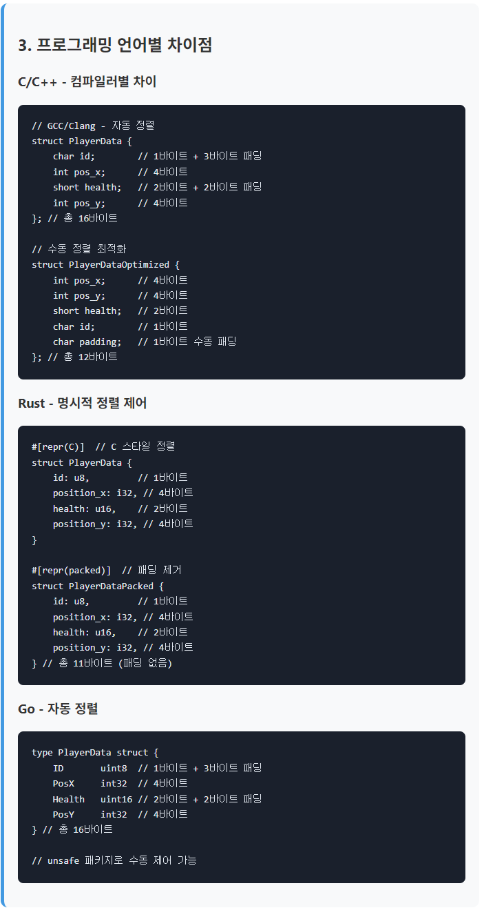   
 
C++ 구조체에 패딩이 필요한 이유는 **메모리 정렬(memory alignment)** 때문이다.

#### 메모리 정렬이 필요한 이유
CPU는 데이터를 특정 경계에서 읽을 때 가장 효율적으로 동작한다. 예를 들어 4바이트 정수는 4의 배수 주소에서, 8바이트 double은 8의 배수 주소에서 읽는 것이 빠르다.

##### 패딩 없이 구조체를 배치하면?

```cpp
struct Example {
    char a;     // 1바이트
    int b;      // 4바이트  
    char c;     // 1바이트
    double d;   // 8바이트
};
```

**패딩 없는 메모리 배치:**
```
주소:  0  1  2  3  4  5  6  7  8  9  10 11 12 13 14 15
데이터: a  b  b  b  b  c  d  d  d  d  d  d  d  d
```

이 경우 문제점들:
- `int b`가 주소 1에서 시작 → 4바이트 경계에 정렬되지 않음
- `double d`가 주소 6에서 시작 → 8바이트 경계에 정렬되지 않음

#### 패딩을 추가한 실제 메모리 배치:

```
주소:  0  1  2  3  4  5  6  7  8  9  10 11 12 13 14 15
데이터: a  P  P  P  b  b  b  b  c  P  P  P  P  P  P  P  d  d  d  d  d  d  d  d
```

여기서 `P`는 패딩(빈 공간)이다.

**실제 구조체 크기와 오프셋:**
```cpp
struct Example {
    char a;     // 오프셋 0, 크기 1
    // 3바이트 패딩
    int b;      // 오프셋 4, 크기 4  
    char c;     // 오프셋 8, 크기 1
    // 7바이트 패딩
    double d;   // 오프셋 16, 크기 8
};
// 전체 크기: 24바이트
```

#### 시각적 비교

**패딩 없음 (비효율적):**
```
┌─┬─────┬─┬───────┐
│a│ b b │c│ d d d │  ← 정렬되지 않음
└─┴─────┴─┴───────┘
```

**패딩 있음 (효율적):**
```
┌─┬───┬─────┬─┬───────┬───────────┐
│a│PAD│ b b │c│  PAD  │  d d d d  │  ← 모든 데이터가 올바르게 정렬됨
└─┴───┴─────┴─┴───────┴───────────┘
```

#### 패딩의 장점
1. **성능 향상**: CPU가 한 번의 메모리 접근으로 데이터를 읽을 수 있다
2. **안정성**: 일부 CPU는 정렬되지 않은 접근 시 오류를 발생시킨다
3. **캐시 효율성**: 메모리 캐시 라인과 잘 맞아떨어진다

따라서 컴파일러는 자동으로 패딩을 추가해서 모든 멤버가 적절한 경계에 정렬되도록 한다.    


### 직렬화와 역직렬화
직렬화(Serialization)는 메모리 내의 데이터 구조를 바이트 스트림으로 변환하는 과정이고, 역직렬화(Deserialization)는 그 반대 과정입니다.
  
C++에서는 `std::memcpy` 또는 구조체 패킹을 통해 간단한 직렬화를 구현할 수 있지만, 복잡한 데이터 구조에는 한계가 있습니다.  


#### 구조체 패킹
- `#pragma pack(1)`으로 메모리 정렬 제어
- 구조체를 통째로 바이너리 파일에 저장/로드
- 배열 데이터 처리와 메모리 직렬화 예제 포함
- 고정 크기 데이터에 최적화
  
```    
#include <iostream>
#include <fstream>
#include <cstring>

// 구조체 패킹을 사용한 직렬화
#pragma pack(push, 1)  // 1바이트 정렬로 패딩 제거
struct PackedData {
    int id;
    float value;
    char name[16];
    bool active;
    double score;
};
#pragma pack(pop)

// 복합 데이터 구조체
#pragma pack(push, 1)
struct GamePlayer {
    int playerId;
    char playerName[32];
    float health;
    float mana;
    int level;
    bool isOnline;
};
#pragma pack(pop)

int main() {
    std::cout << "=== 구조체 패킹 직렬화 예제 ===" << std::endl;
    
    // 단일 구조체 직렬화
    PackedData data1 = {123, 45.67f, "TestData", true, 98.5};
    
    std::cout << "원본 데이터:" << std::endl;
    std::cout << "ID: " << data1.id << std::endl;
    std::cout << "Value: " << data1.value << std::endl;
    std::cout << "Name: " << data1.name << std::endl;
    std::cout << "Active: " << data1.active << std::endl;
    std::cout << "Score: " << data1.score << std::endl;
    
        
    // 메모리 직렬화 (바이트 배열로)
    std::cout << "\n=== 메모리 직렬화 ===" << std::endl;
    
    char buffer[sizeof(PackedData)];
    std::memcpy(buffer, &data1, sizeof(PackedData));
    
    PackedData data3;
    std::memcpy(&data3, buffer, sizeof(PackedData));
    
    std::cout << "메모리에서 복사된 데이터: " << data3.name << std::endl;
    
    // 구조체 크기 정보
    std::cout << "\n=== 구조체 크기 정보 ===" << std::endl;
    std::cout << "PackedData 크기: " << sizeof(PackedData) << " bytes" << std::endl;
    
    return 0;
}
```  


#### std::memcpy: 직렬화/역직렬화 클래스
- 유연한 직렬화/역직렬화 클래스 구현
- 가변 길이 문자열과 배열 처리 가능
- 복합 데이터 구조체를 위한 직렬화 메서드 제공
- 메모리 간 직접 복사도 지원
  
```
#include <iostream>
#include <cstring>
#include <vector>
#include <string>

// memcpy를 사용한 직렬화 클래스
class BinarySerializer {
private:
    std::vector<char> buffer;
    size_t writeOffset;

public:
    BinarySerializer() : writeOffset(0) {}
    
    // 기본 데이터 타입 쓰기
    template<typename T>
    void write(const T& data) {
        size_t size = sizeof(T);
        buffer.resize(buffer.size() + size);
        std::memcpy(buffer.data() + writeOffset, &data, size);
        writeOffset += size;
    }
    
    // 문자열 쓰기 (길이 + 데이터)
    void writeString(const std::string& str) {
        size_t len = str.length();
        write(len);  // 먼저 길이 저장
        buffer.resize(buffer.size() + len);
        std::memcpy(buffer.data() + writeOffset, str.c_str(), len);
        writeOffset += len;
    }
    
    // 배열 쓰기
    template<typename T>
    void writeArray(const T* arr, size_t count) {
        write(count);  // 배열 크기 저장
        size_t totalSize = sizeof(T) * count;
        buffer.resize(buffer.size() + totalSize);
        std::memcpy(buffer.data() + writeOffset, arr, totalSize);
        writeOffset += totalSize;
    }
    
    // 버퍼 반환
    const std::vector<char>& getBuffer() const { return buffer; }
    size_t getSize() const { return buffer.size(); }
    
    // 버퍼 초기화
    void clear() {
        buffer.clear();
        writeOffset = 0;
    }
};

// 역직렬화 클래스
class BinaryDeserializer {
private:
    std::vector<char> buffer;
    size_t readOffset;

public:
    BinaryDeserializer() : readOffset(0) {}
    
    // 버퍼에서 직접 로드
    void loadFromBuffer(const std::vector<char>& data) {
        buffer = data;
        readOffset = 0;
    }
    
    // 기본 데이터 타입 읽기
    template<typename T>
    T read() {
        T data;
        std::memcpy(&data, buffer.data() + readOffset, sizeof(T));
        readOffset += sizeof(T);
        return data;
    }
    
    // 문자열 읽기
    std::string readString() {
        size_t len = read<size_t>();
        std::string str(buffer.data() + readOffset, len);
        readOffset += len;
        return str;
    }
    
    // 배열 읽기
    template<typename T>
    std::vector<T> readArray() {
        size_t count = read<size_t>();
        std::vector<T> arr(count);
        size_t totalSize = sizeof(T) * count;
        std::memcpy(arr.data(), buffer.data() + readOffset, totalSize);
        readOffset += totalSize;
        return arr;
    }
    
    // 읽기 위치 초기화
    void reset() { readOffset = 0; }
    bool hasMore() const { return readOffset < buffer.size(); }
    size_t remaining() const { return buffer.size() - readOffset; }
};

// 복합 데이터 구조체
struct PlayerData {
    int id;
    std::string name;
    float health;
    std::vector<int> inventory;
    bool isActive;
    
    // 직렬화 메서드
    void serialize(BinarySerializer& serializer) const {
        serializer.write(id);
        serializer.writeString(name);
        serializer.write(health);
        serializer.writeArray(inventory.data(), inventory.size());
        serializer.write(isActive);
    }
    
    // 역직렬화 메서드
    void deserialize(BinaryDeserializer& deserializer) {
        id = deserializer.read<int>();
        name = deserializer.readString();
        health = deserializer.read<float>();
        inventory = deserializer.readArray<int>();
        isActive = deserializer.read<bool>();
    }
};

int main() 
{
    std::cout << "=== memcpy 기반 직렬화 예제 ===" << std::endl;
    
    // 기본 데이터 직렬화
    BinarySerializer serializer;
    
    int number = 42;
    float pi = 3.14159f;
    std::string message = "Hello, Serialization!";
    bool flag = true;
    double precision = 123.456789;
    
    serializer.write(number);
    serializer.write(pi);
    serializer.writeString(message);
    serializer.write(flag);
    serializer.write(precision);
    
    std::cout << "직렬화 완료, 버퍼 크기: " << serializer.getSize() << " bytes" << std::endl;
    
    // 메모리에서 역직렬화
    BinaryDeserializer deserializer;
    deserializer.loadFromBuffer(serializer.getBuffer());
    
    int readNumber = deserializer.read<int>();
    float readPi = deserializer.read<float>();
    std::string readMessage = deserializer.readString();
    bool readFlag = deserializer.read<bool>();
    double readPrecision = deserializer.read<double>();
    
    std::cout << "\n역직렬화 결과:" << std::endl;
    std::cout << "Number: " << readNumber << std::endl;
    std::cout << "Pi: " << readPi << std::endl;
    std::cout << "Message: " << readMessage << std::endl;
    std::cout << "Flag: " << (readFlag ? "true" : "false") << std::endl;
    std::cout << "Precision: " << readPrecision << std::endl;
    
    std::cout << "\n=== 복합 데이터 직렬화 ===" << std::endl;
    
    // 플레이어 데이터 생성
    PlayerData player1;
    player1.id = 1001;
    player1.name = "SuperPlayer";
    player1.health = 85.5f;
    player1.inventory = {1, 5, 3, 12, 8};  // 아이템 ID들
    player1.isActive = true;
    
    // 복합 데이터 직렬화
    BinarySerializer playerSerializer;
    player1.serialize(playerSerializer);
    
    std::cout << "플레이어 데이터 직렬화 완료" << std::endl;
    std::cout << "원본 플레이어: " << player1.name 
              << " (ID: " << player1.id 
              << ", HP: " << player1.health 
              << ", Items: " << player1.inventory.size() << "개)" << std::endl;
    
    // 복합 데이터 역직렬화
    PlayerData player2;
    BinaryDeserializer playerDeserializer;
    playerDeserializer.loadFromBuffer(playerSerializer.getBuffer());
    player2.deserialize(playerDeserializer);
    
    std::cout << "\n로드된 플레이어: " << player2.name 
              << " (ID: " << player2.id 
              << ", HP: " << player2.health 
              << ", Active: " << (player2.isActive ? "Yes" : "No") << ")" << std::endl;
    
    std::cout << "인벤토리: ";
    for (size_t i = 0; i < player2.inventory.size(); i++) {
        std::cout << player2.inventory[i];
        if (i < player2.inventory.size() - 1) std::cout << ", ";
    }
    std::cout << std::endl;
    
    std::cout << "\n=== 메모리 간 직렬화 ===" << std::endl;
    
    // 메모리에서 메모리로 직접 복사
    BinaryDeserializer memoryDeserializer;
    memoryDeserializer.loadFromBuffer(playerSerializer.getBuffer());
    
    PlayerData player3;
    player3.deserialize(memoryDeserializer);
    
    std::cout << "메모리 복사된 플레이어: " << player3.name 
              << " (ID: " << player3.id << ")" << std::endl;
    
    return 0;
}
```    
  
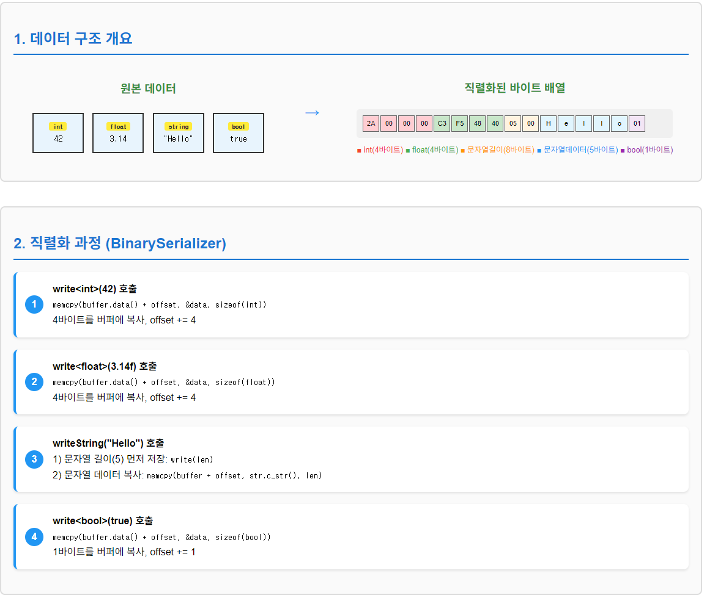  
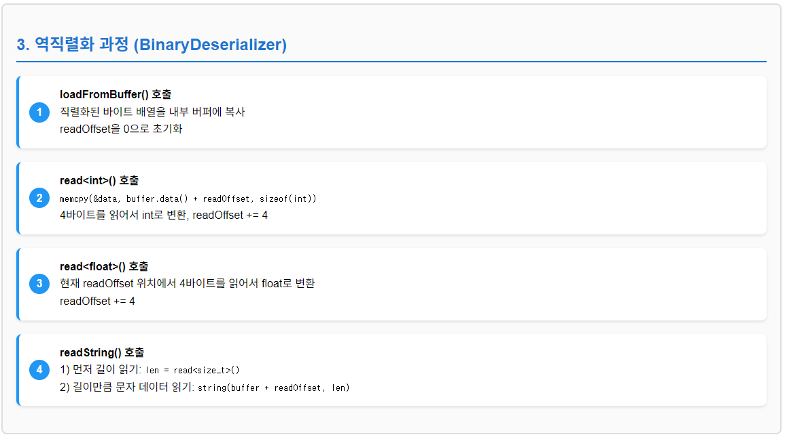   
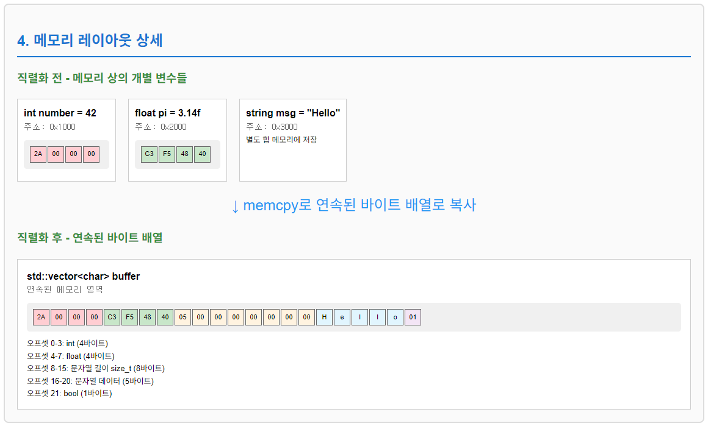   
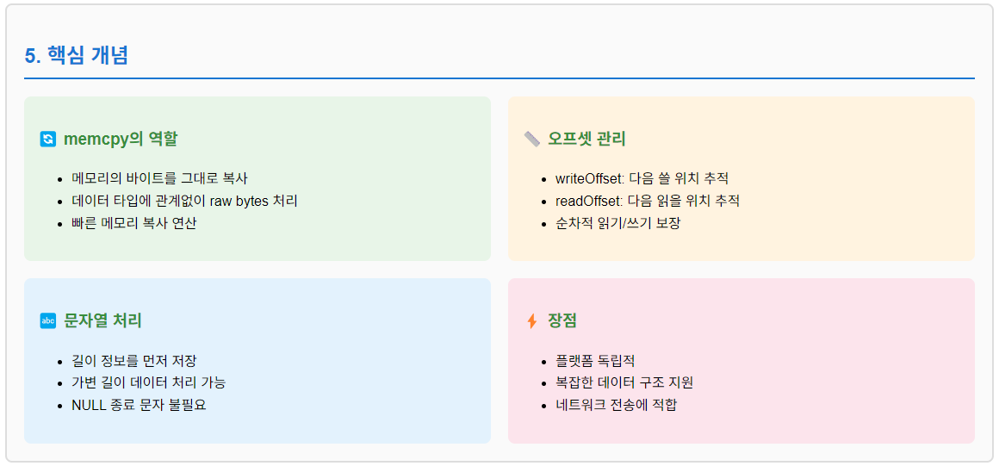     

      
#### 오픈 소스 라이브러리
[Google Protocol Buffer (Protobuf)](https://velog.io/@scarleter99/C%EA%B2%8C%EC%9E%84%EC%84%9C%EB%B2%84-5-3.-%ED%8C%A8%ED%82%B7-%EC%A7%81%EB%A0%AC%ED%99%94-Google-Protocol-Buffer-Protobuf )    
[Protocol Buffers Documentation](https://protobuf.dev/ )  
  


## 02 다양한 데이터 전송 방식

### 1. 송수신 모드
**블로킹 I/O vs 논블로킹 I/O**
- 블로킹 I/O: 작업이 완료될 때까지 스레드가 대기
- 논블로킹 I/O: 즉시 반환되며, 작업 완료 여부를 반환값으로 확인
  
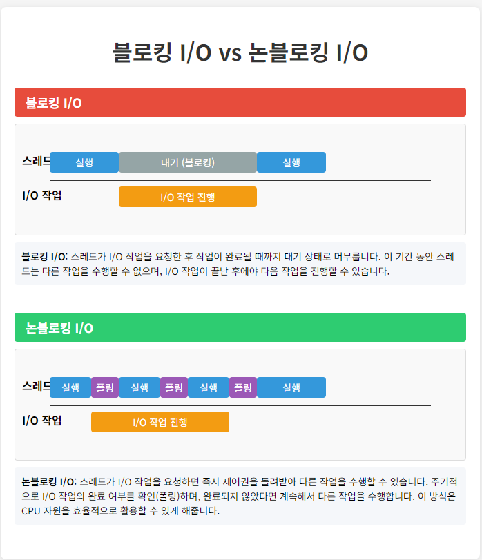 
  

**동기 I/O vs 비동기 I/O**
- 동기 I/O: 작업 완료 시점에 결과를 받음
- 비동기 I/O: 작업을 요청만 하고 완료 시 콜백 또는 이벤트로 통지받음  
  
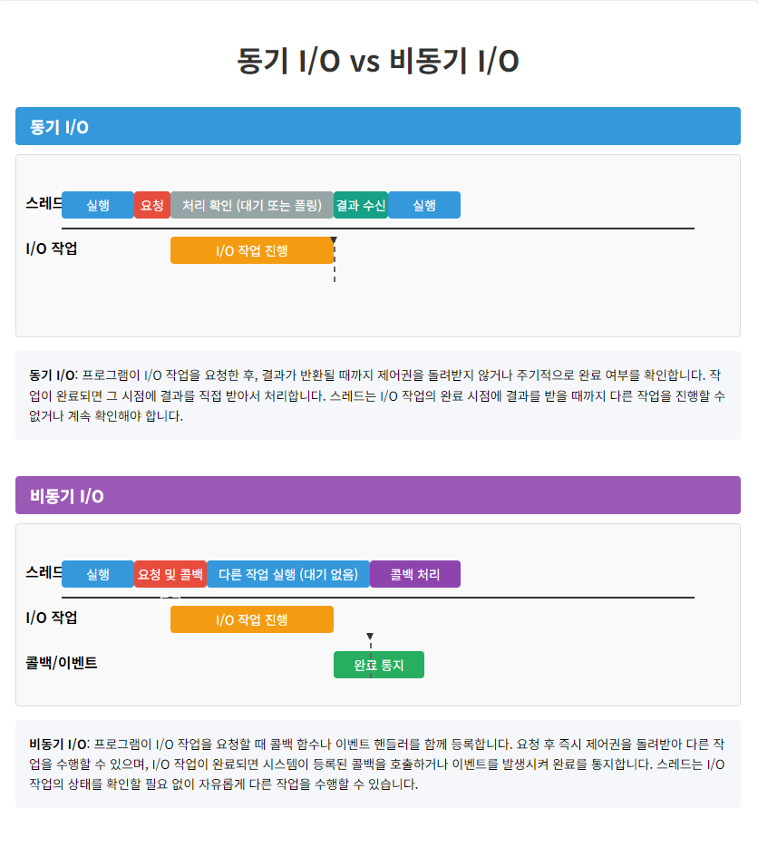   
  
  
### 2. 데이터 패킷 구조
게임 서버에서 일반적으로 사용되는 패킷 구조:  

1. **고정 길이 패킷**: 항상 같은 크기의 데이터
  
2. **가변 길이 패킷**: 데이터 크기가 가변적
  
3. **헤더-페이로드 구조**: 고정 길이 헤더 + 가변 길이 페이로드  
    ```cpp
    // 패킷 헤더 예시
    #pragma pack(push, 1)  // 구조체 패딩 제거
    struct PacketHeader {
        uint16_t size;      // 전체 패킷 크기
        uint16_t type;      // 패킷 유형
    };
    #pragma pack(pop)
    ```   
  
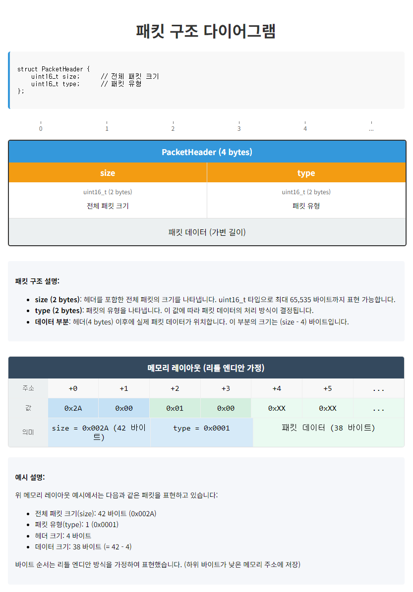   


### 3. 데이터 경계 처리
TCP는 스트림 지향 프로토콜이므로 메시지 경계를 보존하지 않습니다.    
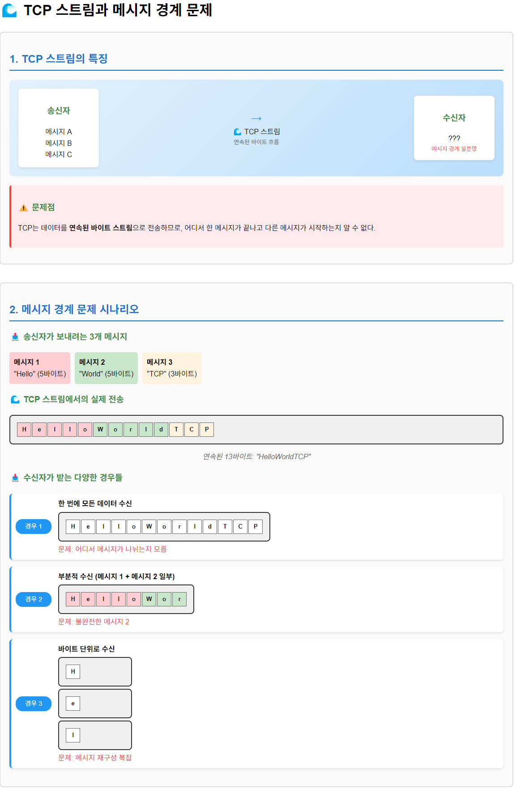 
  
경계 처리 방법으로는:
1. **고정 길이 패킷**: 항상 같은 크기로 송수신
2. **길이 필드 추가**: 데이터 앞에 길이 정보 추가
3. **구분자 사용**: 특별한 시퀀스로 메시지 끝 표시
4. **헤더-페이로드 구조**: 헤더에 페이로드 크기 정보 포함
  
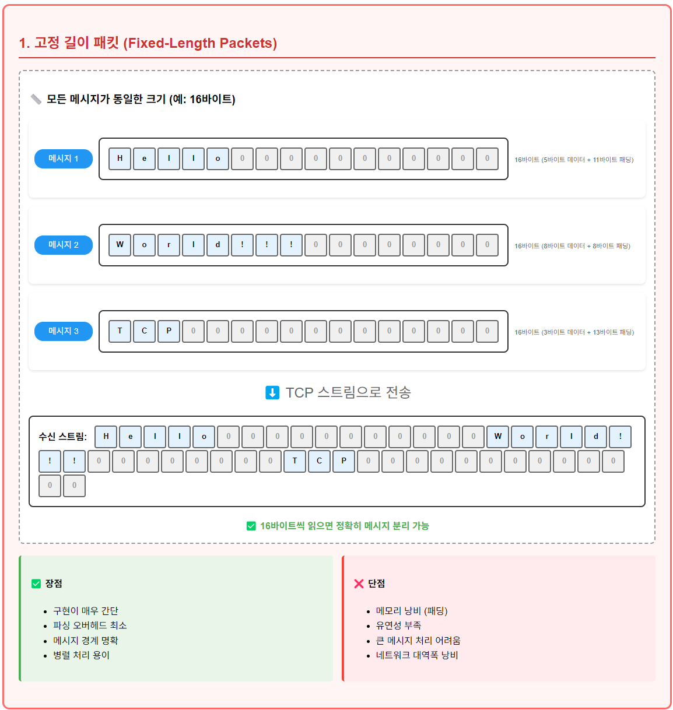  
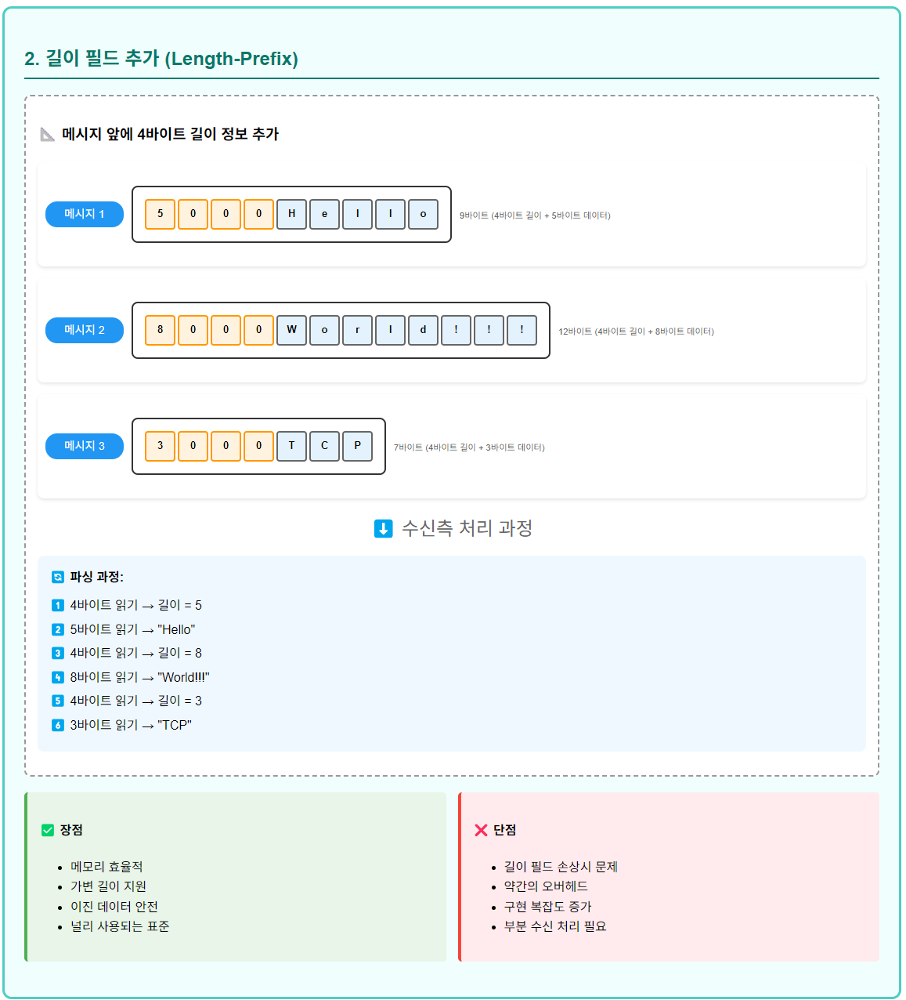   
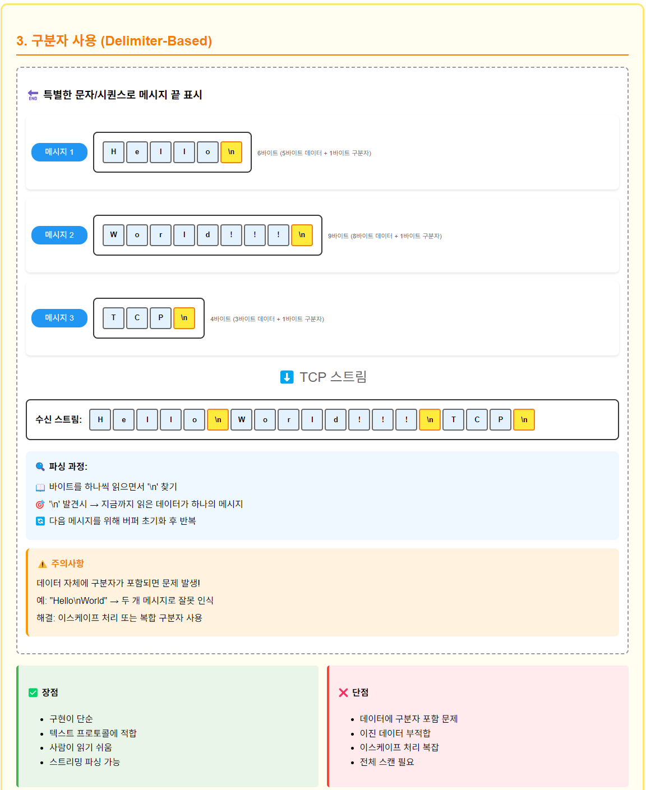   
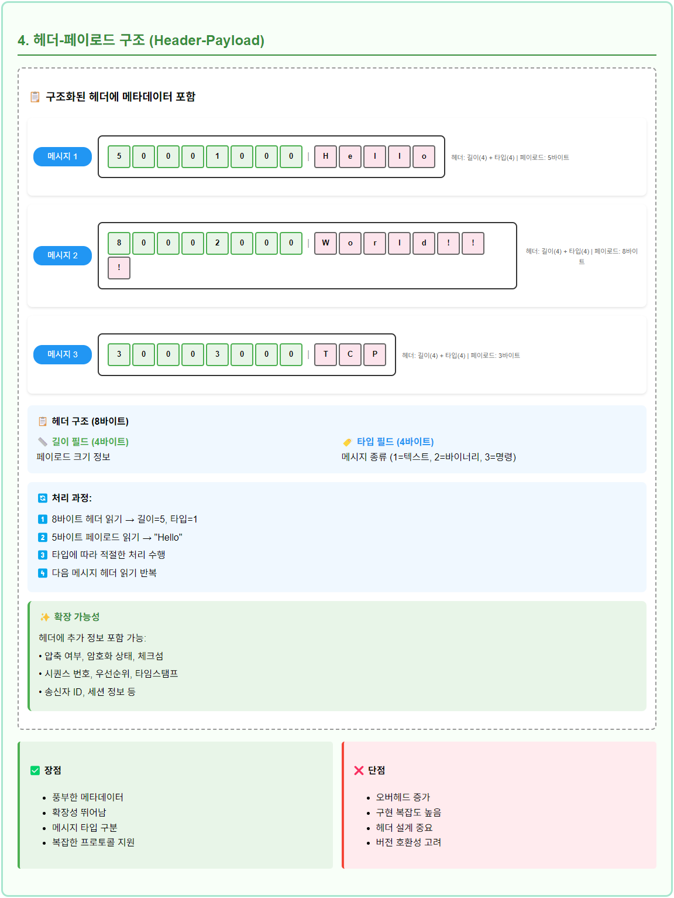      


## 실습: 고정 길이 데이터 전송 연습
고정 길이 데이터는 구현이 간단하지만 유연성이 떨어집니다. 다음은 플레이어 위치 정보를 고정 길이로 전송하는 예제입니다.    
  
<details>  
<summary>FixedLengthServer Code</summary>     
  
```cpp
#include <iostream>
#include <WinSock2.h>
#include <WS2tcpip.h>
#include <format>
#include <vector>
#include <thread>

#pragma comment(lib, "ws2_32.lib")

// 고정 길이 데이터 구조
#pragma pack(push, 1)
struct PlayerPosition {
    uint32_t playerId;
    float x;
    float y;
    float z;
    float rotation;
};
#pragma pack(pop)

// 서버 클래스
class FixedLengthServer {
private:
    SOCKET listenSocket;
    std::vector<std::thread> clientThreads;
    bool running;

public:
    FixedLengthServer() : listenSocket(INVALID_SOCKET), running(false) {}
    
    ~FixedLengthServer() {
        Stop();
    }
    
    bool Start(int port = 27015) {
        WSADATA wsaData;
        if (WSAStartup(MAKEWORD(2, 2), &wsaData) != 0) {
            std::cerr << "WSAStartup 실패\n";
            return false;
        }
        
        listenSocket = socket(AF_INET, SOCK_STREAM, IPPROTO_TCP);
        if (listenSocket == INVALID_SOCKET) {
            std::cerr << std::format("소켓 생성 실패: {}\n", WSAGetLastError());
            WSACleanup();
            return false;
        }
        
        sockaddr_in serverAddr;
        serverAddr.sin_family = AF_INET;
        serverAddr.sin_port = htons(port);
        serverAddr.sin_addr.s_addr = INADDR_ANY;
        
        if (bind(listenSocket, reinterpret_cast<sockaddr*>(&serverAddr), sizeof(serverAddr)) == SOCKET_ERROR) {
            std::cerr << std::format("바인딩 실패: {}\n", WSAGetLastError());
            closesocket(listenSocket);
            WSACleanup();
            return false;
        }
        
        if (listen(listenSocket, SOMAXCONN) == SOCKET_ERROR) {
            std::cerr << std::format("리슨 실패: {}\n", WSAGetLastError());
            closesocket(listenSocket);
            WSACleanup();
            return false;
        }
        
        running = true;
        std::cout << std::format("고정 길이 데이터 서버가 포트 {}에서 시작됨\n", port);
        
        // 클라이언트 연결 수락 스레드 시작
        std::thread acceptThread(&FixedLengthServer::AcceptClients, this);
        acceptThread.detach();
        
        return true;
    }
    
    void Stop() {
        running = false;
        
        if (listenSocket != INVALID_SOCKET) {
            closesocket(listenSocket);
            listenSocket = INVALID_SOCKET;
        }
        
        for (auto& thread : clientThreads) {
            if (thread.joinable()) {
                thread.join();
            }
        }
        
        clientThreads.clear();
        WSACleanup();
        std::cout << "서버가 중지됨\n";
    }
    
private:
    void AcceptClients() {
        while (running) {
            sockaddr_in clientAddr;
            int clientAddrLen = sizeof(clientAddr);
            
            SOCKET clientSocket = accept(listenSocket, reinterpret_cast<sockaddr*>(&clientAddr), &clientAddrLen);
            if (clientSocket == INVALID_SOCKET) {
                if (running) {
                    std::cerr << std::format("클라이언트 연결 수락 실패: {}\n", WSAGetLastError());
                }
                continue;
            }
            
            char clientIP[INET_ADDRSTRLEN];
            inet_ntop(AF_INET, &clientAddr.sin_addr, clientIP, INET_ADDRSTRLEN);
            std::cout << std::format("새 클라이언트 연결: {}:{}\n", clientIP, ntohs(clientAddr.sin_port));
            
            clientThreads.emplace_back(&FixedLengthServer::HandleClient, this, clientSocket);
        }
    }
    
    void HandleClient(SOCKET clientSocket) {
        PlayerPosition position;
        
        while (running) {
            // 고정 길이 데이터 수신 (한 번에 모두 받지 못할 수도 있음)
            int totalBytesReceived = 0;
            int bytesToReceive = sizeof(PlayerPosition);
            char* buffer = reinterpret_cast<char*>(&position);
            
            // 데이터를 완전히 수신할 때까지 반복
            while (totalBytesReceived < bytesToReceive) {
                int bytesReceived = recv(clientSocket, 
                                         buffer + totalBytesReceived, 
                                         bytesToReceive - totalBytesReceived, 
                                         0);
                
                if (bytesReceived <= 0) {
                    if (bytesReceived == 0) {
                        std::cout << "클라이언트 연결 종료\n";
                    } else {
                        std::cerr << std::format("recv 실패: {}\n", WSAGetLastError());
                    }
                    closesocket(clientSocket);
                    return;
                }
                
                totalBytesReceived += bytesReceived;
            }
            
            // 수신된 위치 정보 출력
            std::cout << std::format("플레이어 ID: {}, 위치: ({:.2f}, {:.2f}, {:.2f}), 회전: {:.2f}\n",
                                    position.playerId, position.x, position.y, position.z, position.rotation);
            
            // 응답으로 같은 데이터 전송
            int totalBytesSent = 0;
            int bytesToSend = sizeof(PlayerPosition);
            const char* sendBuffer = reinterpret_cast<const char*>(&position);
            
            while (totalBytesSent < bytesToSend) {
                int bytesSent = send(clientSocket, 
                                    sendBuffer + totalBytesSent, 
                                    bytesToSend - totalBytesSent, 
                                    0);
                
                if (bytesSent == SOCKET_ERROR) {
                    std::cerr << std::format("send 실패: {}\n", WSAGetLastError());
                    closesocket(clientSocket);
                    return;
                }
                
                totalBytesSent += bytesSent;
            }
        }
        
        closesocket(clientSocket);
    }
};

// 클라이언트 클래스
class FixedLengthClient {
private:
    SOCKET clientSocket;
    bool connected;
    
public:
    FixedLengthClient() : clientSocket(INVALID_SOCKET), connected(false) {}
    
    ~FixedLengthClient() {
        Disconnect();
    }
    
    bool Connect(const std::string& serverIP, int port = 27015) {
        WSADATA wsaData;
        if (WSAStartup(MAKEWORD(2, 2), &wsaData) != 0) {
            std::cerr << "WSAStartup 실패\n";
            return false;
        }
        
        clientSocket = socket(AF_INET, SOCK_STREAM, IPPROTO_TCP);
        if (clientSocket == INVALID_SOCKET) {
            std::cerr << std::format("소켓 생성 실패: {}\n", WSAGetLastError());
            WSACleanup();
            return false;
        }
        
        sockaddr_in serverAddr;
        serverAddr.sin_family = AF_INET;
        serverAddr.sin_port = htons(port);
        inet_pton(AF_INET, serverIP.c_str(), &serverAddr.sin_addr);
        
        if (connect(clientSocket, reinterpret_cast<sockaddr*>(&serverAddr), sizeof(serverAddr)) == SOCKET_ERROR) {
            std::cerr << std::format("서버 연결 실패: {}\n", WSAGetLastError());
            closesocket(clientSocket);
            WSACleanup();
            return false;
        }
        
        connected = true;
        std::cout << std::format("서버 {}:{}에 연결됨\n", serverIP, port);
        return true;
    }
    
    void Disconnect() {
        if (connected && clientSocket != INVALID_SOCKET) {
            closesocket(clientSocket);
            clientSocket = INVALID_SOCKET;
            connected = false;
            WSACleanup();
            std::cout << "서버와 연결 종료\n";
        }
    }
    
    bool SendPlayerPosition(uint32_t playerId, float x, float y, float z, float rotation) {
        if (!connected || clientSocket == INVALID_SOCKET) {
            std::cerr << "서버에 연결되지 않음\n";
            return false;
        }
        
        PlayerPosition position;
        position.playerId = playerId;
        position.x = x;
        position.y = y;
        position.z = z;
        position.rotation = rotation;
        
        // 고정 길이 데이터 전송
        int totalBytesSent = 0;
        int bytesToSend = sizeof(PlayerPosition);
        const char* buffer = reinterpret_cast<const char*>(&position);
        
        while (totalBytesSent < bytesToSend) {
            int bytesSent = send(clientSocket, 
                                buffer + totalBytesSent, 
                                bytesToSend - totalBytesSent, 
                                0);
            
            if (bytesSent == SOCKET_ERROR) {
                std::cerr << std::format("send 실패: {}\n", WSAGetLastError());
                return false;
            }
            
            totalBytesSent += bytesSent;
        }
        
        // 서버로부터 응답 수신
        PlayerPosition response;
        int totalBytesReceived = 0;
        int bytesToReceive = sizeof(PlayerPosition);
        char* recvBuffer = reinterpret_cast<char*>(&response);
        
        while (totalBytesReceived < bytesToReceive) {
            int bytesReceived = recv(clientSocket, 
                                    recvBuffer + totalBytesReceived, 
                                    bytesToReceive - totalBytesReceived, 
                                    0);
            
            if (bytesReceived <= 0) {
                if (bytesReceived == 0) {
                    std::cout << "서버 연결 종료\n";
                } else {
                    std::cerr << std::format("recv 실패: {}\n", WSAGetLastError());
                }
                return false;
            }
            
            totalBytesReceived += bytesReceived;
        }
        
        std::cout << "서버로부터 응답 수신: ";
        std::cout << std::format("플레이어 ID: {}, 위치: ({:.2f}, {:.2f}, {:.2f}), 회전: {:.2f}\n",
                                response.playerId, response.x, response.y, response.z, response.rotation);
        
        return true;
    }
};

// 테스트용 메인 함수 (서버)
int main() {
    // 한글 출력을 위한 설정
    SetConsoleOutputCP(CP_UTF8);
    
    std::cout << "1: 서버 모드, 2: 클라이언트 모드 - 선택: ";
    int mode;
    std::cin >> mode;
    
    if (mode == 1) {
        FixedLengthServer server;
        if (server.Start()) {
            std::cout << "서버가 시작되었습니다. 종료하려면 아무 키나 누르세요.\n";
            std::cin.ignore();
            std::cin.get();
            server.Stop();
        }
    } else if (mode == 2) {
        FixedLengthClient client;
        std::string serverIP;
        
        std::cout << "서버 IP를 입력하세요: ";
        std::cin.ignore();
        std::getline(std::cin, serverIP);
        
        if (client.Connect(serverIP)) {
            for (int i = 0; i < 5; i++) {
                // 랜덤 위치 데이터 생성 및 전송
                float x = static_cast<float>(rand() % 100);
                float y = static_cast<float>(rand() % 100);
                float z = static_cast<float>(rand() % 100);
                float rotation = static_cast<float>(rand() % 360);
                
                std::cout << std::format("위치 데이터 전송: ({:.2f}, {:.2f}, {:.2f}), 회전: {:.2f}\n", 
                                        x, y, z, rotation);
                
                client.SendPlayerPosition(1, x, y, z, rotation);
                std::this_thread::sleep_for(std::chrono::seconds(1));
            }
            
            client.Disconnect();
        }
    }
    
    return 0;
}
```  
</details>   
  

### C++ 소켓 통신 프로그램 분석
이 코드는 Windows 환경에서 동작하는 고정 길이 데이터 구조를 사용한 TCP 소켓 통신 프로그램입니다. 서버와 클라이언트 간에 플레이어의 위치 정보를 주고받는 기능을 구현하고 있습니다.

#### 주요 구성 요소
1. **PlayerPosition 구조체**: 플레이어 위치 데이터를 담는 고정 길이 구조체
2. **FixedLengthServer 클래스**: TCP 서버 기능 담당
3. **FixedLengthClient 클래스**: TCP 클라이언트 기능 담당
4. **메인 함수**: 서버/클라이언트 모드 선택 실행
  

#### 동작 원리 시각화  
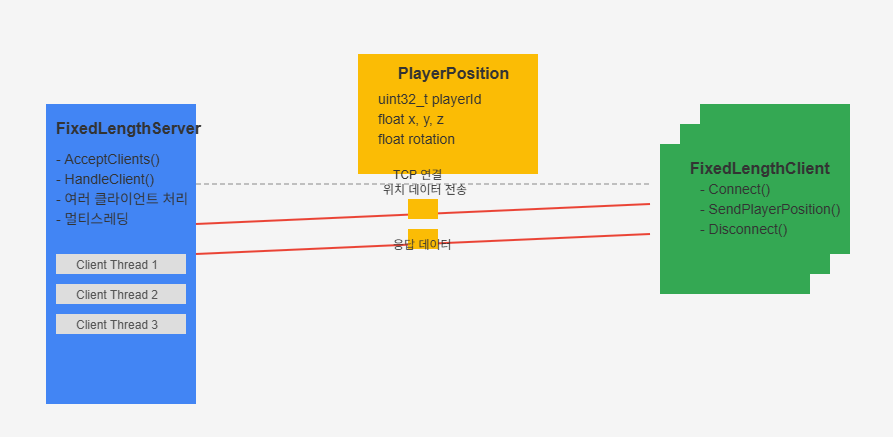  
  
  
#### 주요 특징 설명

##### 1. 고정 길이 데이터 구조
```cpp
#pragma pack(push, 1)
struct PlayerPosition {
    uint32_t playerId;
    float x;
    float y;
    float z;
    float rotation;
};
#pragma pack(pop)
```
- `#pragma pack(1)`을 사용하여 메모리 정렬 없이 1바이트 단위로 패킹
- 네트워크를 통해 바이너리 형태로 직접 전송 가능한 고정 길이 구조체
- 총 20바이트: playerId(4) + x(4) + y(4) + z(4) + rotation(4)
  
##### 2. 완전한 데이터 송수신 보장
```cpp
// 데이터를 완전히 수신할 때까지 반복
while (totalBytesReceived < bytesToReceive) {
    int bytesReceived = recv(clientSocket, 
                            buffer + totalBytesReceived, 
                            bytesToReceive - totalBytesReceived, 
                            0);
    // 오류 처리...
    totalBytesReceived += bytesReceived;
}
```
- TCP는 스트림 기반 프로토콜로 한 번에 모든 데이터가 오지 않을 수 있음
- 위 코드는 모든 데이터를 완전히 수신할 때까지 반복하여 데이터 무결성 보장

##### 3. 멀티스레딩 처리
- 서버는 클라이언트 연결 수락을 위한 별도 스레드 사용
- 각 클라이언트 연결마다 별도 스레드를 생성하여 동시에 여러 클라이언트 처리
- `clientThreads` 벡터로 모든 클라이언트 스레드 관리

##### 4. 서버-클라이언트 데이터 흐름
1. 클라이언트가 서버에 연결
2. 클라이언트가 PlayerPosition 데이터 생성 및 전송
3. 서버는 데이터 수신 후 내용 출력
4. 서버는 동일한 데이터를 클라이언트에게 응답으로 전송
5. 클라이언트는 응답 수신 후 내용 출력

#### 결론
이 코드는 게임 서버와 같은 환경에서 플레이어 위치 정보를 효율적으로 교환하기 위한 기본 구조를 제공합니다. 고정 길이 데이터 구조와 완전한 데이터 송수신 보장, 멀티스레딩을 통한 다중 클라이언트 처리가 주요 특징입니다.
  

## 실습: 가변 길이 데이터 전송 연습
가변 길이 데이터 전송은 길이 정보를 함께 전송하거나 특별한 종료 마커를 사용해야 합니다. 다음은 채팅 메시지를 가변 길이로 전송하는 예제입니다.  
패킷을 두 부분으로 나누어서 보냅니다. 
**고정 길이인 메시지의 Header를 먼저 보내고, 가변 길이가 되는 Body 데이터를 보냅니다**.
  
<details>
<summary>VariableLengthServer 코드</summary> 
  
```cpp
#include <iostream>
#include <WinSock2.h>
#include <WS2tcpip.h>
#include <format>
#include <vector>
#include <thread>
#include <string>

#pragma comment(lib, "ws2_32.lib")

// 채팅 메시지 헤더
#pragma pack(push, 1)
struct ChatMessageHeader {
    uint32_t messageLength;  // 메시지 내용 길이 (헤더 제외)
    uint32_t userId;         // 발신자 ID
};
#pragma pack(pop)

// 서버 클래스
class VariableLengthServer {
private:
    SOCKET listenSocket;
    std::vector<std::thread> clientThreads;
    bool running;

public:
    VariableLengthServer() : listenSocket(INVALID_SOCKET), running(false) {}
    
    ~VariableLengthServer() {
        Stop();
    }
    
    bool Start(int port = 27015) {
        WSADATA wsaData;
        if (WSAStartup(MAKEWORD(2, 2), &wsaData) != 0) {
            std::cerr << "WSAStartup 실패\n";
            return false;
        }
        
        listenSocket = socket(AF_INET, SOCK_STREAM, IPPROTO_TCP);
        if (listenSocket == INVALID_SOCKET) {
            std::cerr << std::format("소켓 생성 실패: {}\n", WSAGetLastError());
            WSACleanup();
            return false;
        }
        
        sockaddr_in serverAddr;
        serverAddr.sin_family = AF_INET;
        serverAddr.sin_port = htons(port);
        serverAddr.sin_addr.s_addr = INADDR_ANY;
        
        if (bind(listenSocket, reinterpret_cast<sockaddr*>(&serverAddr), sizeof(serverAddr)) == SOCKET_ERROR) {
            std::cerr << std::format("바인딩 실패: {}\n", WSAGetLastError());
            closesocket(listenSocket);
            WSACleanup();
            return false;
        }
        
        if (listen(listenSocket, SOMAXCONN) == SOCKET_ERROR) {
            std::cerr << std::format("리슨 실패: {}\n", WSAGetLastError());
            closesocket(listenSocket);
            WSACleanup();
            return false;
        }
        
        running = true;
        std::cout << std::format("가변 길이 데이터 서버가 포트 {}에서 시작됨\n", port);
        
        // 클라이언트 연결 수락 스레드 시작
        std::thread acceptThread(&VariableLengthServer::AcceptClients, this);
        acceptThread.detach();
        
        return true;
    }
    
    void Stop() {
        running = false;
        
        if (listenSocket != INVALID_SOCKET) {
            closesocket(listenSocket);
            listenSocket = INVALID_SOCKET;
        }
        
        for (auto& thread : clientThreads) {
            if (thread.joinable()) {
                thread.join();
            }
        }
        
        clientThreads.clear();
        WSACleanup();
        std::cout << "서버가 중지됨\n";
    }
    
private:
    void AcceptClients() {
        while (running) {
            sockaddr_in clientAddr;
            int clientAddrLen = sizeof(clientAddr);
            
            SOCKET clientSocket = accept(listenSocket, reinterpret_cast<sockaddr*>(&clientAddr), &clientAddrLen);
            if (clientSocket == INVALID_SOCKET) {
                if (running) {
                    std::cerr << std::format("클라이언트 연결 수락 실패: {}\n", WSAGetLastError());
                }
                continue;
            }
            
            char clientIP[INET_ADDRSTRLEN];
            inet_ntop(AF_INET, &clientAddr.sin_addr, clientIP, INET_ADDRSTRLEN);
            std::cout << std::format("새 클라이언트 연결: {}:{}\n", clientIP, ntohs(clientAddr.sin_port));
            
            clientThreads.emplace_back(&VariableLengthServer::HandleClient, this, clientSocket);
        }
    }
    
    void HandleClient(SOCKET clientSocket) {
        // 헤더 버퍼
        ChatMessageHeader header;
        
        while (running) {
            // 1. 헤더 수신 (고정 길이)
            int totalBytesReceived = 0;
            int bytesToReceive = sizeof(ChatMessageHeader);
            char* headerBuffer = reinterpret_cast<char*>(&header);
            
            // 헤더를 완전히 수신할 때까지 반복
            while (totalBytesReceived < bytesToReceive) {
                int bytesReceived = recv(clientSocket, 
                                        headerBuffer + totalBytesReceived, 
                                        bytesToReceive - totalBytesReceived, 
                                        0);
                
                if (bytesReceived <= 0) {
                    if (bytesReceived == 0) {
                        std::cout << "클라이언트 연결 종료\n";
                    } else {
                        std::cerr << std::format("헤더 수신 실패: {}\n", WSAGetLastError());
                    }
                    closesocket(clientSocket);
                    return;
                }
                
                totalBytesReceived += bytesReceived;
            }
            
            // 메시지 길이 및 사용자 ID 확인
            uint32_t messageLength = header.messageLength;
            uint32_t userId = header.userId;
            
            // 길이 검증 (최대 크기 제한)
            const uint32_t MAX_MESSAGE_LENGTH = 8192;
            if (messageLength == 0 || messageLength > MAX_MESSAGE_LENGTH) {
                std::cerr << std::format("잘못된 메시지 길이: {}\n", messageLength);
                closesocket(clientSocket);
                return;
            }
            
            // 2. 메시지 내용 수신 (가변 길이)
            std::vector<char> messageBuffer(messageLength + 1); // +1 for null terminator
            totalBytesReceived = 0;
            
            // 메시지를 완전히 수신할 때까지 반복
            while (totalBytesReceived < messageLength) {
                int bytesReceived = recv(clientSocket, 
                                        messageBuffer.data() + totalBytesReceived, 
                                        messageLength - totalBytesReceived, 
                                        0);
                
                if (bytesReceived <= 0) {
                    if (bytesReceived == 0) {
                        std::cout << "클라이언트 연결 종료\n";
                    } else {
                        std::cerr << std::format("메시지 내용 수신 실패: {}\n", WSAGetLastError());
                    }
                    closesocket(clientSocket);
                    return;
                }
                
                totalBytesReceived += bytesReceived;
            }
            
            // 문자열 종료 널 문자 추가
            messageBuffer[messageLength] = '\0';
            
            // 수신된 메시지 출력
            std::cout << std::format("사용자 ID {}: {}\n", userId, messageBuffer.data());
            
            // 3. 응답 메시지 생성 (에코)
            std::string responseMessage = std::format("서버 응답: {}", messageBuffer.data());
            
            // 4. 응답 헤더 준비
            ChatMessageHeader responseHeader;
            responseHeader.messageLength = static_cast<uint32_t>(responseMessage.length());
            responseHeader.userId = 0; // 서버 ID는 0
            
            // 5. 응답 헤더 전송
            int totalBytesSent = 0;
            int bytesToSend = sizeof(ChatMessageHeader);
            const char* sendHeaderBuffer = reinterpret_cast<const char*>(&responseHeader);
            
            while (totalBytesSent < bytesToSend) {
                int bytesSent = send(clientSocket, 
                                    sendHeaderBuffer + totalBytesSent, 
                                    bytesToSend - totalBytesSent, 
                                    0);
                
                if (bytesSent == SOCKET_ERROR) {
                    std::cerr << std::format("응답 헤더 전송 실패: {}\n", WSAGetLastError());
                    closesocket(clientSocket);
                    return;
                }
                
                totalBytesSent += bytesSent;
            }
            
            // 6. 응답 메시지 내용 전송
            totalBytesSent = 0;
            bytesToSend = static_cast<int>(responseMessage.length());
            
            while (totalBytesSent < bytesToSend) {
                int bytesSent = send(clientSocket, 
                                    responseMessage.c_str() + totalBytesSent, 
                                    bytesToSend - totalBytesSent, 
                                    0);
                
                if (bytesSent == SOCKET_ERROR) {
                    std::cerr << std::format("응답 메시지 전송 실패: {}\n", WSAGetLastError());
                    closesocket(clientSocket);
                    return;
                }
                
                totalBytesSent += bytesSent;
            }
        }
        
        closesocket(clientSocket);
    }
};

// 클라이언트 클래스
class VariableLengthClient {
private:
    SOCKET clientSocket;
    bool connected;
    
public:
    VariableLengthClient() : clientSocket(INVALID_SOCKET), connected(false) {}
    
    ~VariableLengthClient() {
        Disconnect();
    }
    
    bool Connect(const std::string& serverIP, int port = 27015) {
        WSADATA wsaData;
        if (WSAStartup(MAKEWORD(2, 2), &wsaData) != 0) {
            std::cerr << "WSAStartup 실패\n";
            return false;
        }
        
        clientSocket = socket(AF_INET, SOCK_STREAM, IPPROTO_TCP);
        if (clientSocket == INVALID_SOCKET) {
            std::cerr << std::format("소켓 생성 실패: {}\n", WSAGetLastError());
            WSACleanup();
            return false;
        }
        
        sockaddr_in serverAddr;
        serverAddr.sin_family = AF_INET;
        serverAddr.sin_port = htons(port);
        inet_pton(AF_INET, serverIP.c_str(), &serverAddr.sin_addr);
        
        if (connect(clientSocket, reinterpret_cast<sockaddr*>(&serverAddr), sizeof(serverAddr)) == SOCKET_ERROR) {
            std::cerr << std::format("서버 연결 실패: {}\n", WSAGetLastError());
            closesocket(clientSocket);
            WSACleanup();
            return false;
        }
        
        connected = true;
        std::cout << std::format("서버 {}:{}에 연결됨\n", serverIP, port);
        return true;
    }
    
    void Disconnect() {
        if (connected && clientSocket != INVALID_SOCKET) {
            closesocket(clientSocket);
            clientSocket = INVALID_SOCKET;
            connected = false;
            WSACleanup();
            std::cout << "서버와 연결 종료\n";
        }
    }
    
    bool SendChatMessage(uint32_t userId, const std::string& message) {
        if (!connected || clientSocket == INVALID_SOCKET) {
            std::cerr << "서버에 연결되지 않음\n";
            return false;
        }
        
        // 1. 헤더 준비
        ChatMessageHeader header;
        header.messageLength = static_cast<uint32_t>(message.length());
        header.userId = userId;
        
        // 2. 헤더 전송
        int totalBytesSent = 0;
        int bytesToSend = sizeof(ChatMessageHeader);
        const char* headerBuffer = reinterpret_cast<const char*>(&header);
        
        while (totalBytesSent < bytesToSend) {
            int bytesSent = send(clientSocket, 
                                headerBuffer + totalBytesSent, 
                                bytesToSend - totalBytesSent, 
                                0);
            
            if (bytesSent == SOCKET_ERROR) {
                std::cerr << std::format("헤더 전송 실패: {}\n", WSAGetLastError());
                return false;
            }
            
            totalBytesSent += bytesSent;
        }
        
        // 3. 메시지 내용 전송
        totalBytesSent = 0;
        bytesToSend = static_cast<int>(message.length());
        
        while (totalBytesSent < bytesToSend) {
            int bytesSent = send(clientSocket, 
                                message.c_str() + totalBytesSent, 
                                bytesToSend - totalBytesSent, 
                                0);
            
            if (bytesSent == SOCKET_ERROR) {
                std::cerr << std::format("메시지 내용 전송 실패: {}\n", WSAGetLastError());
                return false;
            }
            
            totalBytesSent += bytesSent;
        }
        
        // 4. 응답 헤더 수신
        ChatMessageHeader responseHeader;
        int totalBytesReceived = 0;
        int bytesToReceive = sizeof(ChatMessageHeader);
        char* responseHeaderBuffer = reinterpret_cast<char*>(&responseHeader);
        
        while (totalBytesReceived < bytesToReceive) {
            int bytesReceived = recv(clientSocket, 
                                    responseHeaderBuffer + totalBytesReceived, 
                                    bytesToReceive - totalBytesReceived, 
                                    0);
            
            if (bytesReceived <= 0) {
                if (bytesReceived == 0) {
                    std::cout << "서버 연결 종료\n";
                } else {
                    std::cerr << std::format("응답 헤더 수신 실패: {}\n", WSAGetLastError());
                }
                return false;
            }
            
            totalBytesReceived += bytesReceived;
        }
        
        // 5. 응답 메시지 내용 수신
        uint32_t responseMessageLength = responseHeader.messageLength;
        
        // 길이 검증
        const uint32_t MAX_MESSAGE_LENGTH = 8192;
        if (responseMessageLength == 0 || responseMessageLength > MAX_MESSAGE_LENGTH) {
            std::cerr << std::format("잘못된 응답 메시지 길이: {}\n", responseMessageLength);
            return false;
        }
        
        std::vector<char> responseBuffer(responseMessageLength + 1); // +1 for null terminator
        totalBytesReceived = 0;
        
        while (totalBytesReceived < responseMessageLength) {
            int bytesReceived = recv(clientSocket, 
                                    responseBuffer.data() + totalBytesReceived, 
                                    responseMessageLength - totalBytesReceived, 
                                    0);
            
            if (bytesReceived <= 0) {
                if (bytesReceived == 0) {
                    std::cout << "서버 연결 종료\n";
                } else {
                    std::cerr << std::format("응답 메시지 수신 실패: {}\n", WSAGetLastError());
                }
                return false;
            }
            
            totalBytesReceived += bytesReceived;
        }
        
        // 문자열 종료 널 문자 추가
        responseBuffer[responseMessageLength] = '\0';
        
        // 응답 메시지 출력
        std::cout << "서버로부터 응답: " << responseBuffer.data() << std::endl;
        
        return true;
    }
};

// 테스트용 메인 함수
int main() {
    // 한글 출력을 위한 설정
    SetConsoleOutputCP(CP_UTF8);
    
    std::cout << "1: 서버 모드, 2: 클라이언트 모드 - 선택: ";
    int mode;
    std::cin >> mode;
    
    if (mode == 1) {
        VariableLengthServer server;
        if (server.Start()) {
            std::cout << "서버가 시작되었습니다. 종료하려면 아무 키나 누르세요.\n";
            std::cin.ignore();
            std::cin.get();
            server.Stop();
        }
    } else if (mode == 2) {
        VariableLengthClient client;
        std::string serverIP;
        
        std::cout << "서버 IP를 입력하세요: ";
        std::cin.ignore();
        std::getline(std::cin, serverIP);
        
        if (client.Connect(serverIP)) {
            uint32_t userId = 1001;
            
            while (true) {
                std::string message;
                std::cout << "전송할 메시지 (종료: exit): ";
                std::getline(std::cin, message);
                
                if (message == "exit") {
                    break;
                }
                
                client.SendChatMessage(userId, message);
            }
            
            client.Disconnect();
        }
    }
    
    return 0;
}
```   
</details>  
    
이 코드는 **가변 길이 데이터를 처리하는 TCP 클라이언트-서버 시스템**이다. 채팅 메시지 형태로 헤더 + 데이터 구조를 사용하여 안전하게 가변 길이 데이터를 주고받는다.

### 핵심 구조

#### 1. 메시지 프로토콜 구조

```
[헤더 8바이트] + [메시지 내용 (가변길이)]
```    
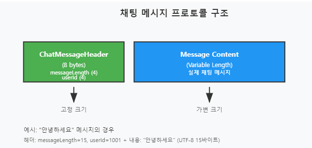    
  

#### 2. 핵심 클래스들
**VariableLengthServer**: 다중 클라이언트를 처리하는 서버
- 각 클라이언트마다 별도 스레드로 처리
- 가변 길이 메시지를 안전하게 수신/송신

**VariableLengthClient**: 서버와 통신하는 클라이언트
- 메시지 전송 후 응답 대기
- 에코 서버 형태로 서버 응답을 출력

### 주요 동작 과정
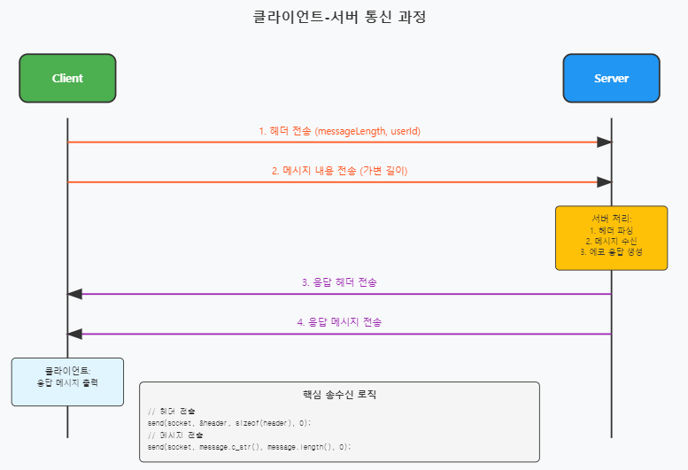    

### 중요한 기술적 특징들

#### 1. **완전한 데이터 수신/송신 보장**
```cpp
// 헤더를 완전히 수신할 때까지 반복
while (totalBytesReceived < bytesToReceive) {
    int bytesReceived = recv(clientSocket, 
                            headerBuffer + totalBytesReceived, 
                            bytesToReceive - totalBytesReceived, 
                            0);
    // ...
    totalBytesReceived += bytesReceived;
}
```

TCP는 스트림 방식이므로 한 번의 recv/send로 모든 데이터가 전송되지 않을 수 있다. 따라서 루프를 통해 완전한 전송을 보장한다.  

#### 2. **메모리 정렬과 헤더 구조**
```cpp
#pragma pack(push, 1)
struct ChatMessageHeader {
    uint32_t messageLength;  // 4바이트
    uint32_t userId;         // 4바이트
};
#pragma pack(pop)
```

`#pragma pack(1)`으로 구조체 패딩을 제거하여 정확히 8바이트 크기를 보장한다.

#### 3. **에러 처리 및 검증**
```cpp
const uint32_t MAX_MESSAGE_LENGTH = 8192;
if (messageLength == 0 || messageLength > MAX_MESSAGE_LENGTH) {
    std::cerr << std::format("잘못된 메시지 길이: {}\n", messageLength);
    closesocket(clientSocket);
    return;
}
```

메시지 길이 검증을 통해 비정상적인 데이터나 공격을 방지한다.

#### 4. **멀티스레딩 처리**
```cpp
std::thread acceptThread(&VariableLengthServer::AcceptClients, this);
acceptThread.detach();

// 클라이언트별 스레드 생성
clientThreads.emplace_back(&VariableLengthServer::HandleClient, this, clientSocket);
```

서버는 여러 클라이언트를 동시에 처리할 수 있도록 각 클라이언트마다 별도 스레드를 생성한다.

### 전체 동작 플로우
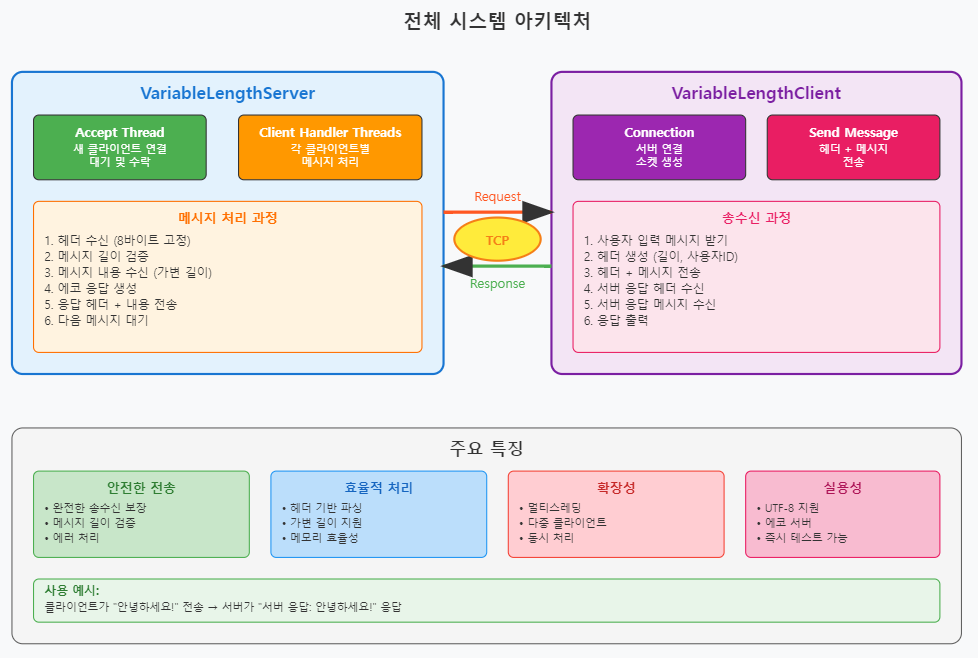 
  
### 실행 방법
1. **서버 실행**: 프로그램 실행 후 `1` 선택
2. **클라이언트 실행**: 다른 터미널에서 프로그램 실행 후 `2` 선택
3. **통신**: 클라이언트에서 메시지 입력하면 서버가 에코 응답

이 코드는 네트워크 프로그래밍에서 **가변 길이 데이터를 안전하게 처리하는 표준적인 방법**을 잘 보여준다. 특히 TCP의 스트림 특성을 고려한 완전한 송수신 보장과 헤더 기반 프로토콜 설계가 핵심이다.    
  
  

## 실습: 고정 길이 + 가변 길이 데이터 전송 연습
온라인 게임에서는 고정 길이 헤더와 가변 길이 페이로드 구조가 일반적입니다. 아이템 거래 시스템을 예로 구현해 보겠습니다.  
아래의 코드는 Server와 Client 코드 같이 있어서 실행할 때 어느쪽으로 실행할지 선택할 수 있다.  

코드를 보기 편하고, 동작을 쉽게 하기 위해서 두 개의 코드로 나누었고 아래 디렉토리에 있다.   
`codes/tcp_MixedLengthServer` , `codes/tcp_MixedLengthClient`      


<details>
<summary>MixedLength Server-Client 코드</summary>  
  
```cpp
#include <iostream>
#include <WinSock2.h>
#include <WS2tcpip.h>
#include <format>
#include <vector>
#include <thread>
#include <string>
#include <map>

#pragma comment(lib, "ws2_32.lib")

// 패킷 유형 정의
enum PacketType {
    PT_TRADE_REQUEST = 1,
    PT_TRADE_RESPONSE,
    PT_CHAT_MESSAGE,
    PT_PLAYER_MOVE
};

// 패킷 헤더 (고정 길이)
#pragma pack(push, 1)
struct PacketHeader {
    uint16_t totalSize;     // 헤더 포함 전체 패킷 크기
    uint16_t packetType;    // 패킷 유형 (PacketType enum)
};

// 아이템 구조체 (고정 길이)
struct Item {
    uint32_t itemId;        // 아이템 고유 ID
    uint16_t quantity;      // 수량
    uint16_t category;      // 카테고리 (무기, 방어구 등)
};

// 거래 요청 패킷 (고정 길이 + 가변 길이)
struct TradeRequestPacket {
    uint32_t requesterId;   // 요청자 ID
    uint32_t targetId;      // 대상자 ID
    uint16_t itemCount;     // 아이템 수
    // 이후에 Item 배열과 추가 메시지(문자열)이 가변 길이로 옴
};
#pragma pack(pop)

// 서버 클래스
class MixedLengthServer {
private:
    SOCKET listenSocket;
    std::vector<std::thread> clientThreads;
    bool running;
    
    // 클라이언트 ID와 소켓 매핑
    std::map<uint32_t, SOCKET> clientSockets;

public:
    MixedLengthServer() : listenSocket(INVALID_SOCKET), running(false) {}
    
    ~MixedLengthServer() {
        Stop();
    }
    
    bool Start(int port = 27015) {
        WSADATA wsaData;
        if (WSAStartup(MAKEWORD(2, 2), &wsaData) != 0) {
            std::cerr << "WSAStartup 실패\n";
            return false;
        }
        
        listenSocket = socket(AF_INET, SOCK_STREAM, IPPROTO_TCP);
        if (listenSocket == INVALID_SOCKET) {
            std::cerr << std::format("소켓 생성 실패: {}\n", WSAGetLastError());
            WSACleanup();
            return false;
        }
        
        sockaddr_in serverAddr;
        serverAddr.sin_family = AF_INET;
        serverAddr.sin_port = htons(port);
        serverAddr.sin_addr.s_addr = INADDR_ANY;
        
        if (bind(listenSocket, reinterpret_cast<sockaddr*>(&serverAddr), sizeof(serverAddr)) == SOCKET_ERROR) {
            std::cerr << std::format("바인딩 실패: {}\n", WSAGetLastError());
            closesocket(listenSocket);
            WSACleanup();
            return false;
        }
        
        if (listen(listenSocket, SOMAXCONN) == SOCKET_ERROR) {
            std::cerr << std::format("리슨 실패: {}\n", WSAGetLastError());
            closesocket(listenSocket);
            WSACleanup();
            return false;
        }
        
        running = true;
        std::cout << std::format("혼합 길이 데이터 서버가 포트 {}에서 시작됨\n", port);
        
        // 클라이언트 연결 수락 스레드 시작
        std::thread acceptThread(&MixedLengthServer::AcceptClients, this);
        acceptThread.detach();
        
        return true;
    }
    
    void Stop() {
        running = false;
        
        if (listenSocket != INVALID_SOCKET) {
            closesocket(listenSocket);
            listenSocket = INVALID_SOCKET;
        }
        
        // 모든 클라이언트 소켓 닫기
        for (const auto& [userId, socket] : clientSockets) {
            closesocket(socket);
        }
        clientSockets.clear();
        
        for (auto& thread : clientThreads) {
            if (thread.joinable()) {
                thread.join();
            }
        }
        
        clientThreads.clear();
        WSACleanup();
        std::cout << "서버가 중지됨\n";
    }
    
private:
    void AcceptClients() {
        while (running) {
            sockaddr_in clientAddr;
            int clientAddrLen = sizeof(clientAddr);
            
            SOCKET clientSocket = accept(listenSocket, reinterpret_cast<sockaddr*>(&clientAddr), &clientAddrLen);
            if (clientSocket == INVALID_SOCKET) {
                if (running) {
                    std::cerr << std::format("클라이언트 연결 수락 실패: {}\n", WSAGetLastError());
                }
                continue;
            }
            
            char clientIP[INET_ADDRSTRLEN];
            inet_ntop(AF_INET, &clientAddr.sin_addr, clientIP, INET_ADDRSTRLEN);
            std::cout << std::format("새 클라이언트 연결: {}:{}\n", clientIP, ntohs(clientAddr.sin_port));
            
            // 임시 사용자 ID 생성 (실제 게임에서는 로그인 과정에서 처리)
            static uint32_t nextUserId = 1000;
            uint32_t userId = nextUserId++;
            
            // 클라이언트 소켓 저장
            clientSockets[userId] = clientSocket;
            
            // 클라이언트 처리 스레드 시작
            clientThreads.emplace_back(&MixedLengthServer::HandleClient, this, clientSocket, userId);
        }
    }
    
    void HandleClient(SOCKET clientSocket, uint32_t userId) {
        std::cout << std::format("클라이언트 ID {}가 연결됨\n", userId);
        
        // 패킷 처리 루프
        while (running) {
            // 1. 패킷 헤더 수신
            PacketHeader header;
            int bytesReceived = recv(clientSocket, reinterpret_cast<char*>(&header), sizeof(header), 0);
            
            if (bytesReceived <= 0) {
                if (bytesReceived == 0) {
                    std::cout << std::format("클라이언트 ID {}가 연결 종료\n", userId);
                } else {
                    std::cerr << std::format("헤더 수신 실패: {}\n", WSAGetLastError());
                }
                break;
            }
            
            if (bytesReceived != sizeof(header)) {
                std::cerr << "불완전한 헤더 수신됨\n";
                break;
            }
            
            // 2. 패킷 크기 검증
            uint16_t totalSize = header.totalSize;
            uint16_t dataSize = totalSize - sizeof(header);
            
            if (totalSize < sizeof(header) || dataSize > 8192) {
                std::cerr << std::format("잘못된 패킷 크기: {}\n", totalSize);
                break;
            }
            
            // 3. 패킷 데이터 수신
            std::vector<char> packetData(dataSize);
            int totalBytesReceived = 0;
            
            while (totalBytesReceived < dataSize) {
                bytesReceived = recv(clientSocket, 
                                    packetData.data() + totalBytesReceived, 
                                    dataSize - totalBytesReceived, 
                                    0);
                
                if (bytesReceived <= 0) {
                    if (bytesReceived == 0) {
                        std::cout << "클라이언트 연결 종료\n";
                    } else {
                        std::cerr << std::format("데이터 수신 실패: {}\n", WSAGetLastError());
                    }
                    closesocket(clientSocket);
                    clientSockets.erase(userId);
                    return;
                }
                
                totalBytesReceived += bytesReceived;
            }
            
            // 4. 패킷 유형에 따른 처리
            switch (header.packetType) {
                case PT_TRADE_REQUEST:
                    HandleTradeRequest(clientSocket, userId, packetData.data(), dataSize);
                    break;
                    
                case PT_CHAT_MESSAGE:
                    // 채팅 메시지 처리 (구현 생략)
                    std::cout << "채팅 메시지 패킷 수신됨\n";
                    break;
                    
                case PT_PLAYER_MOVE:
                    // 플레이어 이동 처리 (구현 생략)
                    std::cout << "플레이어 이동 패킷 수신됨\n";
                    break;
                    
                default:
                    std::cerr << std::format("알 수 없는 패킷 유형: {}\n", header.packetType);
                    break;
            }
        }
        
        // 연결 종료 처리
        closesocket(clientSocket);
        clientSockets.erase(userId);
    }
    
    void HandleTradeRequest(SOCKET clientSocket, uint32_t senderId, const char* data, uint16_t dataSize) {
        // 거래 요청 패킷 파싱
        if (dataSize < sizeof(TradeRequestPacket)) {
            std::cerr << "거래 요청 패킷이 너무 작음\n";
            return;
        }
        
        const TradeRequestPacket* tradeRequest = reinterpret_cast<const TradeRequestPacket*>(data);
        
        // 아이템 목록의 시작 위치
        const char* itemsData = data + sizeof(TradeRequestPacket);
        uint16_t itemsDataSize = sizeof(Item) * tradeRequest->itemCount;
        
        // 아이템 데이터 크기 검증
        if (sizeof(TradeRequestPacket) + itemsDataSize > dataSize) {
            std::cerr << "아이템 데이터가 패킷보다 큼\n";
            return;
        }
        
        // 아이템 목록 파싱
        std::vector<Item> items;
        for (uint16_t i = 0; i < tradeRequest->itemCount; i++) {
            const Item* item = reinterpret_cast<const Item*>(itemsData + i * sizeof(Item));
            items.push_back(*item);
        }
        
        // 추가 메시지 파싱 (있는 경우)
        std::string message;
        if (sizeof(TradeRequestPacket) + itemsDataSize < dataSize) {
            const char* messageData = itemsData + itemsDataSize;
            uint16_t messageSize = dataSize - sizeof(TradeRequestPacket) - itemsDataSize;
            message = std::string(messageData, messageSize);
        }
        
        // 거래 요청 정보 출력
        std::cout << std::format("거래 요청 수신: 요청자={}, 대상자={}, 아이템 수={}\n", 
                             tradeRequest->requesterId, tradeRequest->targetId, tradeRequest->itemCount);
        
        for (const auto& item : items) {
            std::cout << std::format("  아이템 ID: {}, 수량: {}, 카테고리: {}\n", 
                                 item.itemId, item.quantity, item.category);
        }
        
        if (!message.empty()) {
            std::cout << std::format("  메시지: {}\n", message);
        }
        
        // 대상 클라이언트에게 거래 요청 전달 (실제 구현 생략)
        uint32_t targetId = tradeRequest->targetId;
        if (clientSockets.find(targetId) != clientSockets.end()) {
            std::cout << std::format("대상 클라이언트 ID {}에게 거래 요청 전달\n", targetId);
            
            // 여기서 대상 클라이언트에게 패킷 전달 로직 구현 필요
        } else {
            std::cout << std::format("대상 클라이언트 ID {}가 연결되어 있지 않음\n", targetId);
            
            // 요청자에게 실패 응답 보내기
            SendTradeResponse(clientSocket, senderId, tradeRequest->requesterId, false, "대상 플레이어가 접속 중이 아닙니다.");
        }
    }
    
    void SendTradeResponse(SOCKET clientSocket, uint32_t senderId, uint32_t targetId, bool accepted, const std::string& message) {
        // 1. 응답 패킷 헤더 준비
        PacketHeader header;
        header.packetType = PT_TRADE_RESPONSE;
        
        // 2. 응답 데이터 준비
        struct TradeResponseData {
            uint32_t senderId;
            uint32_t targetId;
            uint8_t accepted;
        };
        
        TradeResponseData responseData;
        responseData.senderId = senderId;
        responseData.targetId = targetId;
        responseData.accepted = accepted ? 1 : 0;
        
        // 3. 전체 패킷 크기 계산
        uint16_t totalSize = sizeof(header) + sizeof(responseData) + static_cast<uint16_t>(message.length());
        header.totalSize = totalSize;
        
        // 4. 패킷 버퍼 생성 및 데이터 복사
        std::vector<char> packetBuffer(totalSize);
        char* bufferPtr = packetBuffer.data();
        
        // 헤더 복사
        memcpy(bufferPtr, &header, sizeof(header));
        bufferPtr += sizeof(header);
        
        // 응답 데이터 복사
        memcpy(bufferPtr, &responseData, sizeof(responseData));
        bufferPtr += sizeof(responseData);
        
        // 메시지 복사
        memcpy(bufferPtr, message.c_str(), message.length());
        
        // 5. 패킷 전송
        int totalBytesSent = 0;
        while (totalBytesSent < totalSize) {
            int bytesSent = send(clientSocket, 
                                packetBuffer.data() + totalBytesSent, 
                                totalSize - totalBytesSent, 
                                0);
            
            if (bytesSent == SOCKET_ERROR) {
                std::cerr << std::format("거래 응답 전송 실패: {}\n", WSAGetLastError());
                return;
            }
            
            totalBytesSent += bytesSent;
        }
        
        std::cout << std::format("클라이언트 ID {}에게 거래 응답 전송됨. 수락: {}\n", targetId, accepted ? "예" : "아니오");
    }
};

// 클라이언트 클래스
class MixedLengthClient {
private:
    SOCKET clientSocket;
    bool connected;
    uint32_t userId;
    
public:
    MixedLengthClient() : clientSocket(INVALID_SOCKET), connected(false), userId(0) {}
    
    ~MixedLengthClient() {
        Disconnect();
    }
    
    bool Connect(const std::string& serverIP, int port = 27015, uint32_t userIdParam = 0) {
        WSADATA wsaData;
        if (WSAStartup(MAKEWORD(2, 2), &wsaData) != 0) {
            std::cerr << "WSAStartup 실패\n";
            return false;
        }
        
        clientSocket = socket(AF_INET, SOCK_STREAM, IPPROTO_TCP);
        if (clientSocket == INVALID_SOCKET) {
            std::cerr << std::format("소켓 생성 실패: {}\n", WSAGetLastError());
            WSACleanup();
            return false;
        }
        
        sockaddr_in serverAddr;
        serverAddr.sin_family = AF_INET;
        serverAddr.sin_port = htons(port);
        inet_pton(AF_INET, serverIP.c_str(), &serverAddr.sin_addr);
        
        if (connect(clientSocket, reinterpret_cast<sockaddr*>(&serverAddr), sizeof(serverAddr)) == SOCKET_ERROR) {
            std::cerr << std::format("서버 연결 실패: {}\n", WSAGetLastError());
            closesocket(clientSocket);
            WSACleanup();
            return false;
        }
        
        connected = true;
        userId = userIdParam;
        std::cout << std::format("서버 {}:{}에 연결됨\n", serverIP, port);
        return true;
    }
    
    void Disconnect() {
        if (connected && clientSocket != INVALID_SOCKET) {
            closesocket(clientSocket);
            clientSocket = INVALID_SOCKET;
            connected = false;
            WSACleanup();
            std::cout << "서버와 연결 종료\n";
        }
    }
    
    bool SendTradeRequest(uint32_t targetId, const std::vector<Item>& items, const std::string& message) {
        if (!connected || clientSocket == INVALID_SOCKET) {
            std::cerr << "서버에 연결되지 않음\n";
            return false;
        }
        
        // 1. 패킷 크기 계산
        uint16_t headerSize = sizeof(PacketHeader);
        uint16_t tradeRequestSize = sizeof(TradeRequestPacket);
        uint16_t itemsSize = static_cast<uint16_t>(items.size() * sizeof(Item));
        uint16_t messageSize = static_cast<uint16_t>(message.length());
        uint16_t totalSize = headerSize + tradeRequestSize + itemsSize + messageSize;
        
        // 2. 패킷 버퍼 생성
        std::vector<char> packetBuffer(totalSize);
        char* bufferPtr = packetBuffer.data();
        
        // 3. 헤더 설정
        PacketHeader header;
        header.totalSize = totalSize;
        header.packetType = PT_TRADE_REQUEST;
        memcpy(bufferPtr, &header, headerSize);
        bufferPtr += headerSize;
        
        // 4. 거래 요청 정보 설정
        TradeRequestPacket tradeRequest;
        tradeRequest.requesterId = userId;
        tradeRequest.targetId = targetId;
        tradeRequest.itemCount = static_cast<uint16_t>(items.size());
        memcpy(bufferPtr, &tradeRequest, tradeRequestSize);
        bufferPtr += tradeRequestSize;
        
        // 5. 아이템 정보 설정
        for (const auto& item : items) {
            memcpy(bufferPtr, &item, sizeof(Item));
            bufferPtr += sizeof(Item);
        }
        
        // 6. 메시지 추가 (있는 경우)
        if (!message.empty()) {
            memcpy(bufferPtr, message.c_str(), messageSize);
        }
        
        // 7. 패킷 전송
        int totalBytesSent = 0;
        while (totalBytesSent < totalSize) {
            int bytesSent = send(clientSocket, 
                               packetBuffer.data() + totalBytesSent, 
                               totalSize - totalBytesSent, 
                               0);
            
            if (bytesSent == SOCKET_ERROR) {
                std::cerr << std::format("거래 요청 전송 실패: {}\n", WSAGetLastError());
                return false;
            }
            
            totalBytesSent += bytesSent;
        }
        
        std::cout << std::format("플레이어 ID {}에게 거래 요청 전송됨. 아이템 {}개, 메시지: {}\n", 
                             targetId, items.size(), message);
        
        // 8. 응답 수신 (별도 스레드나 콜백으로 처리할 수 있음)
        // 여기서는 간단하게 동기적으로 응답 기다림
        PacketHeader responseHeader;
        int bytesReceived = recv(clientSocket, reinterpret_cast<char*>(&responseHeader), sizeof(responseHeader), 0);
        
        if (bytesReceived != sizeof(responseHeader)) {
            std::cerr << "응답 헤더 수신 실패\n";
            return false;
        }
        
        if (responseHeader.packetType != PT_TRADE_RESPONSE) {
            std::cerr << std::format("예상치 못한 응답 유형: {}\n", responseHeader.packetType);
            return false;
        }
        
        uint16_t responseDataSize = responseHeader.totalSize - sizeof(responseHeader);
        std::vector<char> responseBuffer(responseDataSize);
        
        bytesReceived = recv(clientSocket, responseBuffer.data(), responseDataSize, 0);
        if (bytesReceived != responseDataSize) {
            std::cerr << "응답 데이터 수신 실패\n";
            return false;
        }
        
        // 응답 데이터 파싱 (예시)
        if (responseDataSize >= 9) {  // 최소 응답 크기 (senderId(4) + targetId(4) + accepted(1))
            uint32_t responderId = *reinterpret_cast<uint32_t*>(responseBuffer.data());
            uint32_t respTargetId = *reinterpret_cast<uint32_t*>(responseBuffer.data() + 4);
            uint8_t accepted = responseBuffer[8];
            
            std::string responseMessage;
            if (responseDataSize > 9) {
                responseMessage = std::string(responseBuffer.data() + 9, responseDataSize - 9);
            }
            
            std::cout << std::format("거래 응답 수신: 발신자={}, 수신자={}, 수락={}, 메시지={}\n", 
                                 responderId, respTargetId, accepted ? "예" : "아니오", responseMessage);
        }
        
        return true;
    }
};

// 테스트용 메인 함수
int main() {
    // 한글 출력을 위한 설정
    SetConsoleOutputCP(CP_UTF8);
    
    std::cout << "1: 서버 모드, 2: 클라이언트 모드 - 선택: ";
    int mode;
    std::cin >> mode;
    
    if (mode == 1) {
        MixedLengthServer server;
        if (server.Start()) {
            std::cout << "서버가 시작되었습니다. 종료하려면 아무 키나 누르세요.\n";
            std::cin.ignore();
            std::cin.get();
            server.Stop();
        }
    } else if (mode == 2) {
        MixedLengthClient client;
        std::string serverIP;
        uint32_t userId, targetId;
        
        std::cout << "서버 IP를 입력하세요: ";
        std::cin.ignore();
        std::getline(std::cin, serverIP);
        
        std::cout << "당신의 사용자 ID를 입력하세요: ";
        std::cin >> userId;
        
        if (client.Connect(serverIP, 27015, userId)) {
            while (true) {
                std::cout << "\n1: 거래 요청 보내기, 2: 종료 - 선택: ";
                int choice;
                std::cin >> choice;
                
                if (choice == 2) {
                    break;
                } else if (choice == 1) {
                    std::cout << "거래할 대상 ID를 입력하세요: ";
                    std::cin >> targetId;
                    
                    // 아이템 목록 생성
                    std::vector<Item> items;
                    int itemCount;
                    std::cout << "보낼 아이템 수를 입력하세요: ";
                    std::cin >> itemCount;
                    
                    for (int i = 0; i < itemCount; i++) {
                        Item item;
                        std::cout << std::format("아이템 #{}:\n", i+1);
                        std::cout << "아이템 ID: ";
                        std::cin >> item.itemId;
                        std::cout << "수량: ";
                        std::cin >> item.quantity;
                        std::cout << "카테고리(0-무기, 1-방어구, 2-소모품): ";
                        std::cin >> item.category;
                        
                        items.push_back(item);
                    }
                    
                    std::string message;
                    std::cout << "거래 메시지를 입력하세요: ";
                    std::cin.ignore();
                    std::getline(std::cin, message);
                    
                    client.SendTradeRequest(targetId, items, message);
                }
            }
            
            client.Disconnect();
        }
    }
    
    return 0;
}
```  
</details>  
    
이 코드는 **게임에서 사용하는 복합 패킷 시스템**으로, 고정 길이와 가변 길이 데이터를 조합한 거래 요청 시스템을 구현한다. 온라인 게임의 아이템 거래 기능을 예시로 한 네트워크 프로그래밍이다.

### 패킷 구조 및 설계
    
#### 1. 기본 패킷 구조
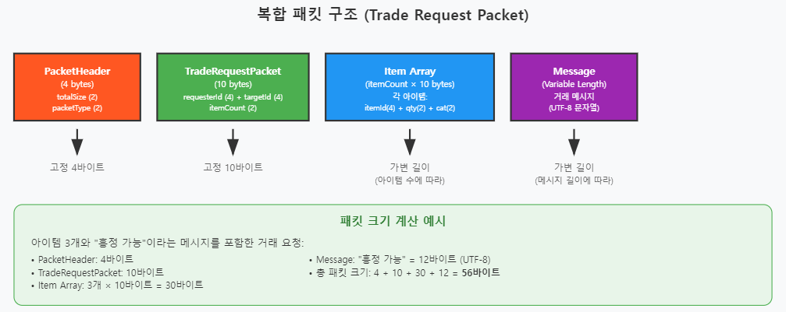    
  
#### 2. 패킷 타입과 구조체

```cpp
enum PacketType {
    PT_TRADE_REQUEST = 1,   // 거래 요청
    PT_TRADE_RESPONSE,      // 거래 응답
    PT_CHAT_MESSAGE,        // 채팅 메시지
    PT_PLAYER_MOVE          // 플레이어 이동
};
```

각 패킷 타입별로 다른 데이터 구조를 가지며, 헤더의 `packetType` 필드로 구분한다.
  

### 핵심 클래스 구조  
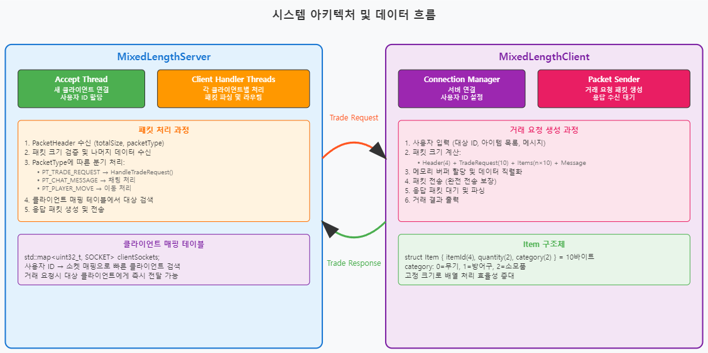   

### 핵심 기술적 특징

#### 1. **혼합형 데이터 구조**
```cpp
// 고정 길이 + 가변 길이 조합
struct TradeRequestPacket {
    uint32_t requesterId;   // 고정 4바이트
    uint32_t targetId;      // 고정 4바이트  
    uint16_t itemCount;     // 고정 2바이트
    // 이후 가변 길이: Item 배열 + 메시지 문자열
};
```

고정 길이 헤더로 기본 정보를 제공하고, 가변 길이 부분은 동적으로 처리한다.

#### 2. **패킷 크기 사전 계산**
```cpp
// 클라이언트에서 패킷 전송 전 크기 계산
uint16_t headerSize = sizeof(PacketHeader);
uint16_t tradeRequestSize = sizeof(TradeRequestPacket);
uint16_t itemsSize = static_cast<uint16_t>(items.size() * sizeof(Item));
uint16_t messageSize = static_cast<uint16_t>(message.length());
uint16_t totalSize = headerSize + tradeRequestSize + itemsSize + messageSize;
```

전체 패킷 크기를 미리 계산하여 헤더에 포함시킨다. 수신측에서 정확한 크기만큼만 읽을 수 있다.

#### 3. **메모리 직렬화 기법**
```cpp
// 패킷 데이터를 연속된 메모리에 직렬화
std::vector<char> packetBuffer(totalSize);
char* bufferPtr = packetBuffer.data();

memcpy(bufferPtr, &header, headerSize);
bufferPtr += headerSize;

memcpy(bufferPtr, &tradeRequest, tradeRequestSize);  
bufferPtr += tradeRequestSize;

// 아이템 배열 복사
for (const auto& item : items) {
    memcpy(bufferPtr, &item, sizeof(Item));
    bufferPtr += sizeof(Item);
}
```

구조체와 배열을 연속된 메모리에 순차적으로 복사하여 네트워크 전송용 버퍼를 만든다.

#### 4. **패킷 파싱 과정**
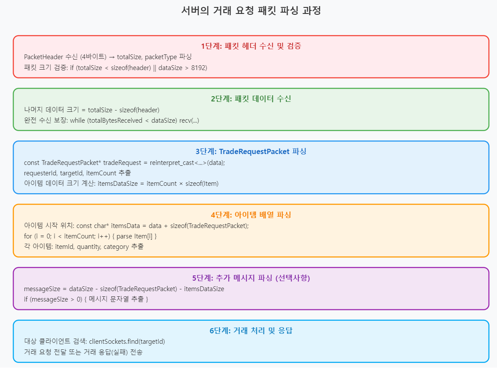    

#### 5. **클라이언트 매핑 테이블**
```cpp
std::map<uint32_t, SOCKET> clientSockets;
```

서버는 사용자 ID를 키로 하는 매핑 테이블을 유지한다. 거래 요청시 대상 클라이언트를 빠르게 찾을 수 있다.

#### 6. **에러 처리 및 검증**
```cpp
// 패킷 크기 검증
if (totalSize < sizeof(header) || dataSize > 8192) {
    std::cerr << std::format("잘못된 패킷 크기: {}\n", totalSize);
    break;
}

// 아이템 데이터 크기 검증  
if (sizeof(TradeRequestPacket) + itemsDataSize > dataSize) {
    std::cerr << "아이템 데이터가 패킷보다 큼\n";
    return;
}
```

패킷 크기와 내부 데이터 구조를 다중으로 검증하여 비정상 패킷을 방지한다.
  

### 실행 시나리오 예시  
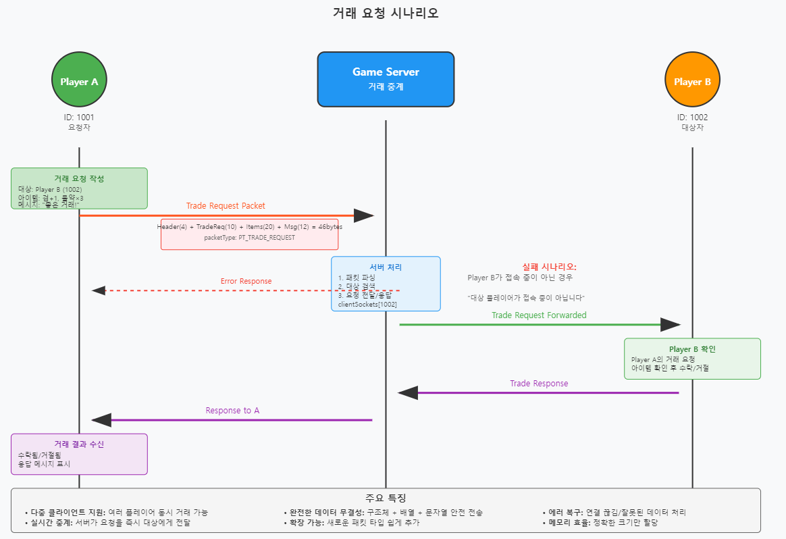 
   
### 주요 개선점과 장점

#### 1. **타입 안전성**
```cpp
enum PacketType {
    PT_TRADE_REQUEST = 1,
    PT_TRADE_RESPONSE,
    PT_CHAT_MESSAGE,
    PT_PLAYER_MOVE
};
```
열거형을 사용하여 패킷 타입을 명확히 정의하고, switch문으로 안전하게 분기 처리한다.

#### 2. **메모리 정렬 보장**
```cpp
#pragma pack(push, 1)
struct PacketHeader {
    uint16_t totalSize;
    uint16_t packetType;
};
#pragma pack(pop)
```
구조체 패딩을 제거하여 플랫폼 간 호환성을 보장한다.

#### 3. **효율적인 클라이언트 관리**
```cpp
std::map<uint32_t, SOCKET> clientSockets;
```
해시 맵을 사용하여 O(log n) 시간에 클라이언트 검색이 가능하다.

#### 4. **확장 가능한 설계**
새로운 패킷 타입을 추가할 때 enum에 타입 추가 후 switch문에 처리 로직만 추가하면 된다.

### 실제 사용법
**서버 실행:**
1. 프로그램 실행 후 `1` 선택
2. 다중 클라이언트 연결 대기

**클라이언트 실행:**
1. 프로그램 실행 후 `2` 선택  
2. 서버 IP와 사용자 ID 입력
3. 거래할 대상 ID, 아이템 정보, 메시지 입력
4. 자동으로 거래 요청 패킷 생성 및 전송

이 시스템은 **온라인 게임의 실시간 거래 시스템**을 구현한 것으로, 복잡한 데이터 구조를 안전하게 네트워크로 전송하는 좋은 예시다. 고정 길이와 가변 길이를 적절히 조합하여 메모리 효율성과 확장성을 동시에 확보했다.  
  
  
## 실습: 데이터 전송 후 종료 연습
네트워크 연결을 안전하게 종료하는 방법을 배우는 것은 중요합니다. 이 예제에서는 `shutdown`을 사용한 안전한 연결 종료 방법을 알아봅니다.   
아래 코드의 핵심적인 부분은 `GracefulDisconnect()` 함수이다.  

<details>
<summary>GracefulShutdownServer 코드</summary>  
  
```cpp
#include <iostream>
#include <WinSock2.h>
#include <WS2tcpip.h>
#include <format>
#include <string>
#include <thread>
#include <vector>
#include <chrono>

#pragma comment(lib, "ws2_32.lib")

// 파일 전송 패킷 헤더
#pragma pack(push, 1)
struct FileHeader {
    uint32_t fileSize;      // 파일 전체 크기
    uint16_t nameLength;    // 파일 이름 길이
    // 이후에 파일 이름과 파일 데이터가 옴
};
#pragma pack(pop)

// 안전한 종료를 구현한 서버 클래스
class GracefulShutdownServer {
private:
    SOCKET listenSocket;
    std::vector<std::thread> clientThreads;
    bool running;

public:
    GracefulShutdownServer() : listenSocket(INVALID_SOCKET), running(false) {}
    
    ~GracefulShutdownServer() {
        Stop();
    }
    
    bool Start(int port = 27015) {
        WSADATA wsaData;
        if (WSAStartup(MAKEWORD(2, 2), &wsaData) != 0) {
            std::cerr << "WSAStartup 실패\n";
            return false;
        }
        
        listenSocket = socket(AF_INET, SOCK_STREAM, IPPROTO_TCP);
        if (listenSocket == INVALID_SOCKET) {
            std::cerr << std::format("소켓 생성 실패: {}\n", WSAGetLastError());
            WSACleanup();
            return false;
        }
        
        sockaddr_in serverAddr;
        serverAddr.sin_family = AF_INET;
        serverAddr.sin_port = htons(port);
        serverAddr.sin_addr.s_addr = INADDR_ANY;
        
        if (bind(listenSocket, reinterpret_cast<sockaddr*>(&serverAddr), sizeof(serverAddr)) == SOCKET_ERROR) {
            std::cerr << std::format("바인딩 실패: {}\n", WSAGetLastError());
            closesocket(listenSocket);
            WSACleanup();
            return false;
        }
        
        if (listen(listenSocket, SOMAXCONN) == SOCKET_ERROR) {
            std::cerr << std::format("리슨 실패: {}\n", WSAGetLastError());
            closesocket(listenSocket);
            WSACleanup();
            return false;
        }
        
        running = true;
        std::cout << std::format("안전한 종료 서버가 포트 {}에서 시작됨\n", port);
        
        // 클라이언트 연결 수락 스레드 시작
        std::thread acceptThread(&GracefulShutdownServer::AcceptClients, this);
        acceptThread.detach();
        
        return true;
    }
    
    void Stop() {
        running = false;
        
        if (listenSocket != INVALID_SOCKET) {
            closesocket(listenSocket);
            listenSocket = INVALID_SOCKET;
        }
        
        for (auto& thread : clientThreads) {
            if (thread.joinable()) {
                thread.join();
            }
        }
        
        clientThreads.clear();
        WSACleanup();
        std::cout << "서버가 중지됨\n";
    }
    
private:
    void AcceptClients() {
        while (running) {
            sockaddr_in clientAddr;
            int clientAddrLen = sizeof(clientAddr);
            
            SOCKET clientSocket = accept(listenSocket, reinterpret_cast<sockaddr*>(&clientAddr), &clientAddrLen);
            if (clientSocket == INVALID_SOCKET) {
                if (running) {
                    std::cerr << std::format("클라이언트 연결 수락 실패: {}\n", WSAGetLastError());
                }
                continue;
            }
            
            char clientIP[INET_ADDRSTRLEN];
            inet_ntop(AF_INET, &clientAddr.sin_addr, clientIP, INET_ADDRSTRLEN);
            std::cout << std::format("새 클라이언트 연결: {}:{}\n", clientIP, ntohs(clientAddr.sin_port));
            
            clientThreads.emplace_back(&GracefulShutdownServer::HandleClient, this, clientSocket, std::string(clientIP));
        }
    }
    
    void HandleClient(SOCKET clientSocket, std::string clientIP) {
        // 파일 헤더 수신
        FileHeader header;
        int bytesReceived = recv(clientSocket, reinterpret_cast<char*>(&header), sizeof(header), 0);
        
        if (bytesReceived != sizeof(header)) {
            std::cerr << "파일 헤더 수신 실패\n";
            closesocket(clientSocket);
            return;
        }
        
        // 파일 이름 수신
        std::vector<char> fileNameBuffer(header.nameLength + 1, 0);
        bytesReceived = recv(clientSocket, fileNameBuffer.data(), header.nameLength, 0);
        
        if (bytesReceived != header.nameLength) {
            std::cerr << "파일 이름 수신 실패\n";
            closesocket(clientSocket);
            return;
        }
        
        std::string fileName(fileNameBuffer.data());
        std::cout << std::format("파일 수신 시작: {}, 크기: {} 바이트\n", fileName, header.fileSize);
        
        // 파일 데이터 수신
        std::vector<char> fileBuffer(header.fileSize);
        int totalBytesReceived = 0;
        
        // 진행 상황 업데이트 시간 추적
        auto lastUpdateTime = std::chrono::steady_clock::now();
        
        while (totalBytesReceived < header.fileSize) {
            bytesReceived = recv(clientSocket, 
                              fileBuffer.data() + totalBytesReceived,
                              header.fileSize - totalBytesReceived, 
                              0);
            
            if (bytesReceived <= 0) {
                if (bytesReceived == 0) {
                    std::cout << "클라이언트가 연결을 정상적으로 종료했습니다.\n";
                } else {
                    std::cerr << std::format("파일 데이터 수신 실패: {}\n", WSAGetLastError());
                }
                break;
            }
            
            totalBytesReceived += bytesReceived;
            
            // 1초마다 진행 상황 업데이트
            auto currentTime = std::chrono::steady_clock::now();
            if (std::chrono::duration_cast<std::chrono::seconds>(currentTime - lastUpdateTime).count() >= 1) {
                float progress = static_cast<float>(totalBytesReceived) / header.fileSize * 100.0f;
                std::cout << std::format("파일 수신 중: {:.1f}% 완료\n", progress);
                lastUpdateTime = currentTime;
            }
        }
        
        // 파일 수신 완료
        if (totalBytesReceived == header.fileSize) {
            std::cout << std::format("파일 '{}' 수신 완료 ({} 바이트)\n", fileName, totalBytesReceived);
            
            // 여기서 파일을 저장하거나 처리할 수 있음
            
            // 수신 완료 응답 보내기
            std::string response = "파일 수신 완료";
            send(clientSocket, response.c_str(), static_cast<int>(response.length()), 0);
            
            // 안전하게 연결 종료 (서버 측에서 먼저 종료)
            std::cout << "연결 종료 시작 (서버 측)...\n";
            
            // 송신 방향 종료 (더 이상 데이터를 보내지 않을 것임을 알림)
            shutdown(clientSocket, SD_SEND);
            
            // 클라이언트가 보낸 데이터가 있다면 모두 수신
            char buffer[1024];
            while ((bytesReceived = recv(clientSocket, buffer, sizeof(buffer), 0)) > 0) {
                std::cout << std::format("연결 종료 중 추가 데이터 {} 바이트 수신됨\n", bytesReceived);
            }
            
            std::cout << "연결 안전하게 종료됨\n";
        } else {
            std::cerr << std::format("파일 수신 불완전: 예상 {}, 실제 {} 바이트\n", header.fileSize, totalBytesReceived);
        }
        
        // 소켓 닫기
        closesocket(clientSocket);
    }
};

// 안전한 종료를 구현한 클라이언트 클래스
class GracefulShutdownClient {
private:
    SOCKET clientSocket;
    bool connected;
    
public:
    GracefulShutdownClient() : clientSocket(INVALID_SOCKET), connected(false) {}
    
    ~GracefulShutdownClient() {
        Disconnect();
    }
    
    bool Connect(const std::string& serverIP, int port = 27015) {
        WSADATA wsaData;
        if (WSAStartup(MAKEWORD(2, 2), &wsaData) != 0) {
            std::cerr << "WSAStartup 실패\n";
            return false;
        }
        
        clientSocket = socket(AF_INET, SOCK_STREAM, IPPROTO_TCP);
        if (clientSocket == INVALID_SOCKET) {
            std::cerr << std::format("소켓 생성 실패: {}\n", WSAGetLastError());
            WSACleanup();
            return false;
        }
        
        sockaddr_in serverAddr;
        serverAddr.sin_family = AF_INET;
        serverAddr.sin_port = htons(port);
        inet_pton(AF_INET, serverIP.c_str(), &serverAddr.sin_addr);
        
        if (connect(clientSocket, reinterpret_cast<sockaddr*>(&serverAddr), sizeof(serverAddr)) == SOCKET_ERROR) {
            std::cerr << std::format("서버 연결 실패: {}\n", WSAGetLastError());
            closesocket(clientSocket);
            WSACleanup();
            return false;
        }
        
        connected = true;
        std::cout << std::format("서버 {}:{}에 연결됨\n", serverIP, port);
        return true;
    }
    
    void Disconnect() {
        if (connected && clientSocket != INVALID_SOCKET) {
            // 안전한 연결 종료 시도
            GracefulDisconnect();
            
            // 소켓 닫기
            closesocket(clientSocket);
            clientSocket = INVALID_SOCKET;
            connected = false;
            WSACleanup();
        }
    }
    
    bool SendFile(const std::string& fileName, const std::vector<char>& fileData) {
        if (!connected || clientSocket == INVALID_SOCKET) {
            std::cerr << "서버에 연결되지 않음\n";
            return false;
        }
        
        // 1. 파일 헤더 준비
        FileHeader header;
        header.fileSize = static_cast<uint32_t>(fileData.size());
        header.nameLength = static_cast<uint16_t>(fileName.length());
        
        // 2. 헤더 전송
        int bytesSent = send(clientSocket, reinterpret_cast<char*>(&header), sizeof(header), 0);
        if (bytesSent != sizeof(header)) {
            std::cerr << "파일 헤더 전송 실패\n";
            return false;
        }
        
        // 3. 파일 이름 전송
        bytesSent = send(clientSocket, fileName.c_str(), header.nameLength, 0);
        if (bytesSent != header.nameLength) {
            std::cerr << "파일 이름 전송 실패\n";
            return false;
        }
        
        // 4. 파일 데이터 전송
        int totalBytesSent = 0;
        const int CHUNK_SIZE = 4096;  // 한 번에 4KB씩 전송
        
        // 진행 상황 업데이트 시간 추적
        auto lastUpdateTime = std::chrono::steady_clock::now();
        
        while (totalBytesSent < header.fileSize) {
            int bytesToSend = std::min(CHUNK_SIZE, static_cast<int>(header.fileSize - totalBytesSent));
            
            bytesSent = send(clientSocket, 
                           fileData.data() + totalBytesSent, 
                           bytesToSend, 
                           0);
            
            if (bytesSent == SOCKET_ERROR) {
                std::cerr << std::format("파일 데이터 전송 실패: {}\n", WSAGetLastError());
                return false;
            }
            
            totalBytesSent += bytesSent;
            
            // 진행 상황 업데이트 (1초마다)
            auto currentTime = std::chrono::steady_clock::now();
            if (std::chrono::duration_cast<std::chrono::seconds>(currentTime - lastUpdateTime).count() >= 1) {
                float progress = static_cast<float>(totalBytesSent) / header.fileSize * 100.0f;
                std::cout << std::format("파일 전송 중: {:.1f}% 완료\n", progress);
                lastUpdateTime = currentTime;
            }
            
            // 전송 속도 제어 (필요한 경우)
            // std::this_thread::sleep_for(std::chrono::milliseconds(10));
        }
        
        std::cout << std::format("파일 '{}' 전송 완료 ({} 바이트)\n", fileName, totalBytesSent);
        
        // 5. 서버 응답 수신
        char responseBuffer[1024] = {0};
        int bytesReceived = recv(clientSocket, responseBuffer, sizeof(responseBuffer) - 1, 0);
        
        if (bytesReceived > 0) {
            std::cout << "서버 응답: " << responseBuffer << std::endl;
        } else {
            std::cerr << "서버 응답 수신 실패\n";
            return false;
        }
        
        // 6. 안전한 연결 종료
        return GracefulDisconnect();
    }
    
private:
    bool GracefulDisconnect() {
        if (!connected || clientSocket == INVALID_SOCKET) {
            return false;
        }
        
        std::cout << "안전한 연결 종료 시작...\n";
        
        // 1. 송신 방향 종료 (더 이상 데이터를 보내지 않음)
        if (shutdown(clientSocket, SD_SEND) == SOCKET_ERROR) {
            std::cerr << std::format("shutdown 실패: {}\n", WSAGetLastError());
            return false;
        }
        
        // 2. 서버가 보낸 모든 데이터 수신
        char buffer[1024];
        int bytesReceived;
        
        while ((bytesReceived = recv(clientSocket, buffer, sizeof(buffer), 0)) > 0) {
            buffer[bytesReceived] = '\0';
            std::cout << std::format("연결 종료 중 추가 데이터 수신: {}\n", buffer);
        }
        
        if (bytesReceived == SOCKET_ERROR) {
            std::cerr << std::format("recv 실패: {}\n", WSAGetLastError());
            return false;
        }
        
        std::cout << "안전한 연결 종료 완료\n";
        return true;
    }
};

// 테스트용 메인 함수
int main() {
    // 한글 출력을 위한 설정
    SetConsoleOutputCP(CP_UTF8);
    
    std::cout << "1: 서버 모드, 2: 클라이언트 모드 - 선택: ";
    int mode;
    std::cin >> mode;
    
    if (mode == 1) {
        GracefulShutdownServer server;
        if (server.Start()) {
            std::cout << "서버가 시작되었습니다. 종료하려면 아무 키나 누르세요.\n";
            std::cin.ignore();
            std::cin.get();
            server.Stop();
        }
    } else if (mode == 2) {
        GracefulShutdownClient client;
        std::string serverIP;
        
        std::cout << "서버 IP를 입력하세요: ";
        std::cin.ignore();
        std::getline(std::cin, serverIP);
        
        if (client.Connect(serverIP)) {
            // 가상의 파일 데이터 생성 (실제로는 파일에서 읽어올 수 있음)
            std::string fileName = "test_data.bin";
            size_t fileSize;
            
            std::cout << "전송할 파일 크기(바이트)를 입력하세요: ";
            std::cin >> fileSize;
            
            std::vector<char> fileData(fileSize);
            
            // 파일 데이터 생성 (간단한 패턴으로 채움)
            for (size_t i = 0; i < fileSize; i++) {
                fileData[i] = static_cast<char>(i % 256);
            }
            
            // 파일 전송 및 안전한 종료
            client.SendFile(fileName, fileData);
            
            // 명시적으로 연결 종료
            client.Disconnect();
        }
    }
    
    return 0;
}
```  
</details>  
  
   
## 정리: 데이터 전송의 주요 고려사항

1. **응용 프로그램 프로토콜 설계**
   - 패킷 구조(헤더, 페이로드)
   - 바이트 정렬 처리
   - 데이터 경계 설정 방법

2. **데이터 송수신 전략**
   - 고정 길이: 구현 간단, 공간 낭비 가능성
   - 가변 길이: 효율적 공간 사용, 경계 처리 필요
   - 혼합 구조: 헤더는 고정, 페이로드는 가변 길이

3. **신뢰성 확보**
   - 패킷 크기 검증
   - 데이터 무결성 검사
   - 완전 수신 보장 (부분 수신 대응)

4. **연결 종료**
   - `shutdown` 함수로 안전한 종료
   - 송신과 수신을 독립적으로 제어
   - 모든 데이터 교환 완료 확인

온라인 게임 서버 개발에서는 이러한 기본적인 데이터 전송 방식을 바탕으로, 게임의 특성에 맞는 최적화된 프로토콜을 설계하고 구현하는 것이 중요합니다. 실시간성이 중요한 게임에서는 데이터 압축, 패킷 최적화, 우선순위 처리 등의 고급 기법도 함께 적용해 볼 수 있습니다.  
