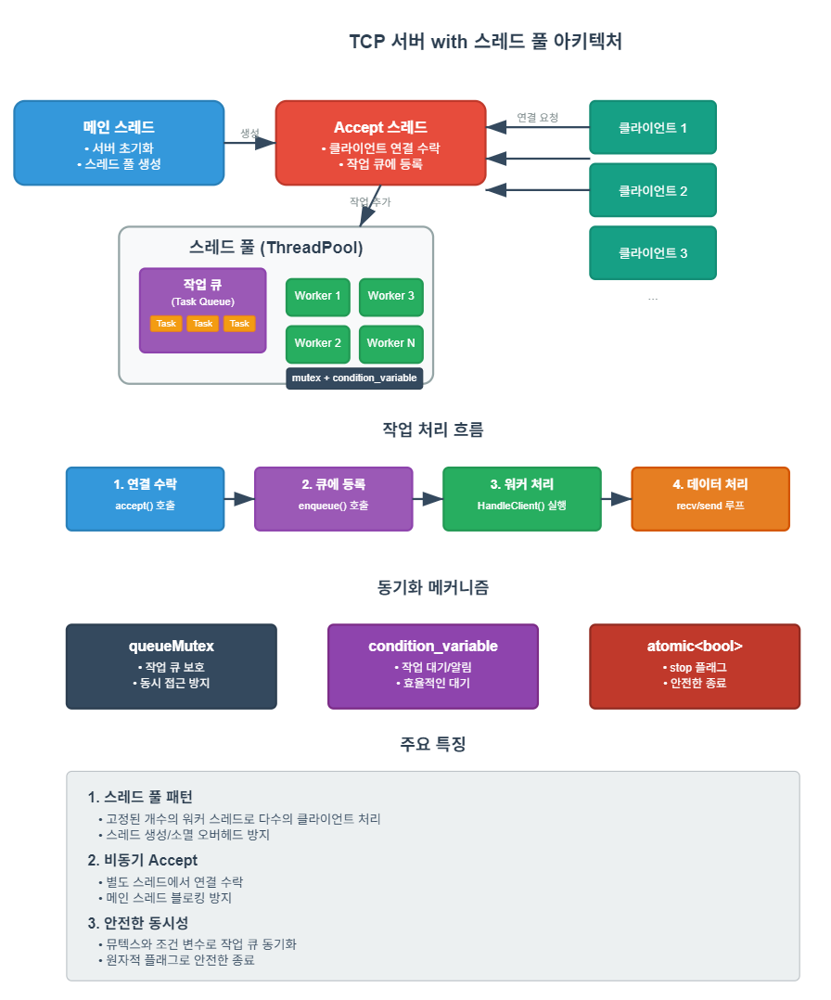

# 게임 서버 개발자가 알아야할 TCP/IP Windows 소켓 프로그래밍

저자: 최흥배, Claude AI  

- C++23
- Windows 11
- Visual Studio 2022 이상

-----  
# Chapter.06 멀티스레드 프로그래밍
  
## 01 스레드 기초
스레드(Thread)는 프로세스 내에서 실행되는 독립적인 실행 흐름으로, 온라인 게임 서버에서 매우 중요한 개념입니다. 대규모 온라인 게임은 수많은 클라이언트를 동시에 처리해야 하므로 효율적인 멀티스레딩이 필수적입니다.

### 스레드의 개념
프로세스는 운영체제로부터 할당받은 자원의 단위이며, 각 프로세스는 독립된 메모리 공간을 가집니다. 반면, 스레드는 하나의 프로세스 내에서 여러 개 생성될 수 있으며, 같은 프로세스 내의 스레드들은 메모리 공간을 공유합니다.
  

### 프로세스와 스레드의 차이점

| 구분 | 프로세스 | 스레드 |
|------|---------|--------|
| 정의 | 실행 중인 프로그램 | 프로세스 내 실행 흐름 |
| 자원 소유 | O | X (프로세스의 자원 공유) |
| 메모리 공간 | 독립적 | 공유 (스택 제외) |
| 통신 비용 | 높음 (IPC 필요) | 낮음 (직접 메모리 접근) |
| 문맥 전환 비용 | 높음 | 낮음 |
| 안정성 | 한 프로세스 중단 시 다른 프로세스는 영향 없음 | 한 스레드 중단 시 전체 프로세스 영향 |
  

### 스레드 사용의 장점
1. **병렬 처리**: 다중 코어 CPU에서 여러 작업을 동시에 실행하여 성능 향상
2. **응답성 향상**: UI 스레드와 작업 스레드를 분리하여 사용자 반응성 유지
3. **자원 공유**: 같은 메모리 공간을 공유하여 통신 비용 감소
4. **효율성**: 프로세스 생성보다 스레드 생성이 더 빠르고 경제적
  

### 스레드 사용의 단점
1. **동기화 문제**: 공유 자원 접근 시 레이스 컨디션(Race Condition) 발생 가능
2. **디버깅 어려움**: 동시성 관련 버그는 발견과 수정이 어려움
3. **교착 상태(Deadlock)**: 잘못된 락 획득 순서로 인한 상호 대기 상태
4. **기아 상태(Starvation)**: 특정 스레드가 필요한 자원을 계속 얻지 못하는 상태
  

### 게임 서버에서의 스레드 활용
온라인 게임 서버에서 멀티스레딩은 다음과 같은 용도로 활용됩니다:

1. **클라이언트 연결 관리**: 연결 수락 및 각 클라이언트 통신 처리
2. **게임 로직 처리**: 게임 상태 업데이트, AI, 물리 계산 등
3. **데이터베이스 작업**: 비동기 데이터 저장 및 로드
4. **주기적 작업**: 타이머 이벤트, 세션 관리, 자원 정리 등
  
    
   
**방식 1 (I/O와 처리 분리)이 적합한 경우:**
- 처리량이 중요한 게임 
- 게임 콘텐츠 중 공유 객체에 lock을 걸어야 한다.
- 패킷 순서가 크게 중요하지 않은 상황
```
// 방식 1: 네트워크 I/O와 패킷 처리 분리
#include <thread>
#include <queue>
#include <mutex>
#include <condition_variable>

// Thread-Safe 패킷 큐
class PacketQueue {
private:
    std::queue<Packet> packets;
    std::mutex mtx;
    std::condition_variable cv;

public:
    void push(const Packet& packet) {
        std::lock_guard<std::mutex> lock(mtx);
        packets.push(packet);
        cv.notify_one();
    }
    
    Packet pop() {
        std::unique_lock<std::mutex> lock(mtx);
        cv.wait(lock, [this]{ return !packets.empty(); });
        Packet packet = packets.front();
        packets.pop();
        return packet;
    }
};

class GameServer_Method1 {
private:
    PacketQueue packetQueue;
    std::vector<std::thread> ioThreads;
    std::vector<std::thread> processingThreads;
    
public:
    void start() {
        // 네트워크 I/O 스레드들 시작
        for (int i = 0; i < 4; ++i) {
            ioThreads.emplace_back([this]() {
                networkIOLoop();
            });
        }
        
        // 패킷 처리 스레드들 시작
        for (int i = 0; i < 8; ++i) {
            processingThreads.emplace_back([this]() {
                packetProcessingLoop();
            });
        }
    }
    
private:
    void networkIOLoop() {
        while (running) {
            // 소켓에서 데이터 수신
            Packet packet = receiveFromSocket();
            if (packet.isValid()) {
                // 큐에 패킷 추가 (스레드 안전)
                packetQueue.push(packet);
            }
        }
    }
    
    void packetProcessingLoop() {
        while (running) {
            // 큐에서 패킷 가져와서 처리
            Packet packet = packetQueue.pop();
            processPacket(packet);
        }
    }
};
```    


**방식 2 (기능별 분리)가 적합한 경우:**
- 패킷 처리 순서 보장 (단일 스레드)
- 게임 콘텐츠 중 공유 객체에 lock을 걸지 않아도 된다
- DB 작업이 많고 복잡한 게임
- 성능 튜닝과 모니터링이 중요한 상용 서비스     
```
// 방식 2: 기능별 스레드 분리 (전문화)
class GameServer_Method2 {
private:
    // 네트워크 스레드들 (2개 이상)
    std::vector<std::thread> networkThreads;
    
    // 패킷 처리 스레드 (1개 - 순서 보장)
    std::thread packetProcessThread;
    
    // DB 스레드들 (2개 이상)
    std::vector<std::thread> dbThreads;
    
    // 스레드 간 통신을 위한 큐들
    ThreadSafeQueue<Packet> networkToPacketQueue;
    ThreadSafeQueue<DBRequest> packetToDBQueue;
    ThreadSafeQueue<DBResponse> dbToPacketQueue;
    
public:
    void start() {
        // 네트워크 스레드들 시작 (최소 2개)
        for (int i = 0; i < 3; ++i) {
            networkThreads.emplace_back([this, i]() {
                networkThreadLoop(i);
            });
        }
        
        // 패킷 처리 스레드 시작 (1개만)
        packetProcessThread = std::thread([this]() {
            packetProcessingLoop();
        });
        
        // DB 스레드들 시작 (최소 2개)
        for (int i = 0; i < 4; ++i) {
            dbThreads.emplace_back([this, i]() {
                dbThreadLoop(i);
            });
        }
    }
    
private:
    // 네트워크 전담 스레드
    void networkThreadLoop(int threadId) {
        while (running) {
            // 각 스레드가 일부 클라이언트 담당
            auto clients = getAssignedClients(threadId);
            
            for (auto& client : clients) {
                Packet packet = receiveFromClient(client);
                if (packet.isValid()) {
                    // 패킷 처리 스레드로 전달
                    networkToPacketQueue.push(packet);
                }
            }
        }
    }
    
    // 패킷 처리 전담 스레드 (1개로 순서 보장)
    void packetProcessingLoop() {
        while (running) {
            // 네트워크에서 받은 패킷 처리
            if (!networkToPacketQueue.empty()) {
                Packet packet = networkToPacketQueue.pop();
                
                // 게임 로직 처리
                GameEvent event = processGameLogic(packet);
                
                // DB 작업이 필요하면 DB 스레드에 요청
                if (event.needsDB()) {
                    DBRequest dbReq = createDBRequest(event);
                    packetToDBQueue.push(dbReq);
                }
            }
            
            // DB에서 완료된 작업 처리
            if (!dbToPacketQueue.empty()) {
                DBResponse response = dbToPacketQueue.pop();
                handleDBResponse(response);
            }
        }
    }
    
    // DB 전담 스레드들
    void dbThreadLoop(int threadId) {
        // 각 스레드가 다른 DB 연결 사용
        DatabaseConnection db = createDBConnection(threadId);
        
        while (running) {
            if (!packetToDBQueue.empty()) {
                DBRequest request = packetToDBQueue.pop();
                
                // DB 작업 수행 (시간이 오래 걸릴 수 있음)
                DBResponse response = executeDBQuery(db, request);
                
                // 결과를 패킷 처리 스레드로 전달
                dbToPacketQueue.push(response);
            }
        }
    }
};
```


## 02 스레드 API
C++11부터 표준 라이브러리에서 스레드 지원이 추가되어 플랫폼 독립적인 멀티스레딩이 가능해졌습니다. 본 내용에서는 Win32 API 대신 C++의 표준 스레드 API를 중심으로 설명하겠습니다.

### C++ 스레드 라이브러리 vs Win32 스레드 API

| C++ 스레드 라이브러리 | Win32 스레드 API |
|---------------------|-----------------|
| std::thread | CreateThread |
| std::mutex | CRITICAL_SECTION |
| std::condition_variable | CONDITION_VARIABLE |
| std::async | - |
| std::future/promise | - |
  

### 스레드 생성과 관리

```cpp
#include <iostream>
#include <thread>
#include <format>

// 스레드 함수
void threadFunction() {
    std::cout << std::format("스레드 ID: {}\n", std::this_thread::get_id());
    for (int i = 0; i < 5; ++i) {
        std::cout << std::format("스레드에서 카운트: {}\n", i);
        std::this_thread::sleep_for(std::chrono::milliseconds(500));
    }
}

int main() {
    // 한글 출력을 위한 설정
    SetConsoleOutputCP(CP_UTF8);
    
    std::cout << std::format("메인 스레드 ID: {}\n", std::this_thread::get_id());
    
    // 스레드 생성
    std::thread t(threadFunction);
    
    // 메인 스레드 작업
    for (int i = 0; i < 3; ++i) {
        std::cout << std::format("메인에서 카운트: {}\n", i);
        std::this_thread::sleep_for(std::chrono::milliseconds(1000));
    }
    
    // 스레드 종료 대기
    t.join();
    
    std::cout << "모든 스레드 종료\n";
    
    return 0;
}
```

### 스레드에 인수 전달

```cpp
#include <iostream>
#include <thread>
#include <string>
#include <format>

// 값에 의한 전달
void threadFunction(int id, std::string name) {
    std::cout << std::format("스레드 {}({}): 실행 시작\n", id, name);
    std::this_thread::sleep_for(std::chrono::seconds(2));
    std::cout << std::format("스레드 {}({}): 실행 완료\n", id, name);
}

// 참조에 의한 전달
void threadFunctionRef(int id, const std::string& name, int& result) {
    std::cout << std::format("스레드 {}({}): 계산 시작\n", id, name);
    std::this_thread::sleep_for(std::chrono::seconds(2));
    
    // 결과값 계산 및 참조로 반환
    result = id * 10;
    
    std::cout << std::format("스레드 {}({}): 계산 완료 (결과: {})\n", id, name, result);
}

int main() {
    // 한글 출력을 위한 설정
    SetConsoleOutputCP(CP_UTF8);
    
    // 1. 값에 의한 전달
    std::thread t1(threadFunction, 1, "작업 스레드");
    
    // 2. 참조로 결과 반환
    int result = 0;
    std::thread t2(threadFunctionRef, 2, "계산 스레드", std::ref(result));
    
    // 3. 람다 함수로 스레드 생성
    std::thread t3([](int id) {
        std::cout << std::format("람다 스레드 {}: 실행\n", id);
        std::this_thread::sleep_for(std::chrono::seconds(1));
        std::cout << std::format("람다 스레드 {}: 완료\n", id);
    }, 3);
    
    // 모든 스레드 종료 대기
    t1.join();
    t2.join();
    t3.join();
    
    std::cout << std::format("계산 결과: {}\n", result);
    std::cout << "모든 스레드 종료\n";
    
    return 0;
}
```

### std::async와 std::future
`std::async`는 비동기 작업을 쉽게 생성하고 `std::future`를 통해 결과를 받을 수 있는 편리한 방법입니다.

```cpp
#include <iostream>
#include <future>
#include <chrono>
#include <format>

// 결과를 반환하는 함수
int calculateResult(int value) {
    std::cout << std::format("계산 시작 (입력: {})\n", value);
    std::this_thread::sleep_for(std::chrono::seconds(2)); // 무거운 작업 시뮬레이션
    return value * value;
}

int main() {
    // 한글 출력을 위한 설정
    SetConsoleOutputCP(CP_UTF8);
    
    std::cout << "비동기 작업 시작\n";
    
    // std::async로 비동기 작업 시작
    std::future<int> result1 = std::async(std::launch::async, calculateResult, 10);
    std::future<int> result2 = std::async(std::launch::async, calculateResult, 20);
    
    std::cout << "메인 스레드에서 다른 작업 수행 중...\n";
    
    // 결과가 준비될 때까지 블로킹
    int value1 = result1.get();
    int value2 = result2.get();
    
    std::cout << std::format("결과 1: {}\n", value1);
    std::cout << std::format("결과 2: {}\n", value2);
    std::cout << std::format("합계: {}\n", value1 + value2);
    
    return 0;
}
```
  

## 03 멀티스레드 TCP 서버
멀티스레드 TCP 서버는 다수의 클라이언트 연결을 효율적으로 처리하기 위한 구조입니다. 일반적으로 다음과 같은 모델을 사용합니다:

1. **Accept 스레드**: 새로운 클라이언트 연결을 수락하는 전용 스레드
2. **Worker 스레드 풀**: 클라이언트 요청을 처리하는 스레드 집합
3. **연결 관리**: 각 클라이언트 연결을 스레드에 할당하는 방식

### 스레드 풀 기반 TCP 서버 구현
다음은 스레드 풀을 사용한 간단한 멀티스레드 에코 서버 예제입니다.

<details>
<summary>ThreadPool Echo Server 코드</summary>  

```cpp
#include <iostream>
#include <thread>
#include <vector>
#include <queue>
#include <mutex>
#include <condition_variable>
#include <functional>
#include <WinSock2.h>
#include <WS2tcpip.h>
#include <format>
#include <atomic>

#pragma comment(lib, "ws2_32.lib")

class ThreadPool {
private:
    std::vector<std::thread> workers;
    std::queue<std::function<void()>> tasks;
    
    std::mutex queueMutex;
    std::condition_variable condition;
    std::atomic<bool> stop;

public:
    ThreadPool(size_t numThreads) : stop(false) {
        for (size_t i = 0; i < numThreads; ++i) {
            workers.emplace_back([this, i] {
                std::cout << std::format("워커 스레드 {} 시작\n", i);
                
                while (true) {
                    std::function<void()> task;
                    
                    {
                        std::unique_lock<std::mutex> lock(this->queueMutex);
                        
                        // 작업이 있거나 중단 신호가 올 때까지 대기
                        this->condition.wait(lock, [this] { 
                            return this->stop || !this->tasks.empty(); 
                        });
                        
                        // 중단 신호가 왔고 작업이 없으면 종료
                        if (this->stop && this->tasks.empty()) {
                            std::cout << std::format("워커 스레드 {} 종료\n", i);
                            return;
                        }
                        
                        // 작업 가져오기
                        task = std::move(this->tasks.front());
                        this->tasks.pop();
                    }
                    
                    // 작업 실행
                    task();
                }
            });
        }
    }
    
    ~ThreadPool() {
        {
            std::unique_lock<std::mutex> lock(queueMutex);
            stop = true;
        }
        
        condition.notify_all();
        
        for (std::thread &worker : workers) {
            if (worker.joinable()) {
                worker.join();
            }
        }
    }
    
    // 작업 추가
    template<class F>
    void enqueue(F&& f) {
        {
            std::unique_lock<std::mutex> lock(queueMutex);
            if (stop) {
                throw std::runtime_error("스레드 풀 중단 후 작업 추가 시도");
            }
            tasks.emplace(std::forward<F>(f));
        }
        condition.notify_one();
    }
};

class TCPServer {
private:
    SOCKET listenSocket;
    ThreadPool threadPool;
    std::atomic<bool> running;
    std::mutex consoleMutex; // 콘솔 출력용 뮤텍스

public:
    TCPServer(size_t numThreads) : threadPool(numThreads), running(false), listenSocket(INVALID_SOCKET) {}
    
    ~TCPServer() {
        Stop();
    }
    
    bool Start(int port = 27015) {
        WSADATA wsaData;
        if (WSAStartup(MAKEWORD(2, 2), &wsaData) != 0) {
            std::cerr << "WSAStartup 실패\n";
            return false;
        }
        
        listenSocket = socket(AF_INET, SOCK_STREAM, IPPROTO_TCP);
        if (listenSocket == INVALID_SOCKET) {
            std::cerr << std::format("소켓 생성 실패: {}\n", WSAGetLastError());
            WSACleanup();
            return false;
        }
        
        sockaddr_in serverAddr;
        serverAddr.sin_family = AF_INET;
        serverAddr.sin_port = htons(port);
        serverAddr.sin_addr.s_addr = INADDR_ANY;
        
        if (bind(listenSocket, reinterpret_cast<sockaddr*>(&serverAddr), sizeof(serverAddr)) == SOCKET_ERROR) {
            std::cerr << std::format("바인딩 실패: {}\n", WSAGetLastError());
            closesocket(listenSocket);
            WSACleanup();
            return false;
        }
        
        if (listen(listenSocket, SOMAXCONN) == SOCKET_ERROR) {
            std::cerr << std::format("리슨 실패: {}\n", WSAGetLastError());
            closesocket(listenSocket);
            WSACleanup();
            return false;
        }
        
        running = true;
        
        {
            std::lock_guard<std::mutex> lock(consoleMutex);
            std::cout << std::format("TCP 서버가 포트 {}에서 시작됨\n", port);
        }
        
        // Accept 스레드 시작
        std::thread acceptThread(&TCPServer::AcceptConnections, this);
        acceptThread.detach();
        
        return true;
    }
    
    void Stop() {
        running = false;
        
        if (listenSocket != INVALID_SOCKET) {
            closesocket(listenSocket);
            listenSocket = INVALID_SOCKET;
        }
        
        WSACleanup();
        
        {
            std::lock_guard<std::mutex> lock(consoleMutex);
            std::cout << "서버가 중지됨\n";
        }
    }
    
private:
    void AcceptConnections() {
        while (running) {
            sockaddr_in clientAddr;
            int clientAddrLen = sizeof(clientAddr);
            
            SOCKET clientSocket = accept(listenSocket, reinterpret_cast<sockaddr*>(&clientAddr), &clientAddrLen);
            if (clientSocket == INVALID_SOCKET) {
                if (running) {
                    std::cerr << std::format("클라이언트 연결 수락 실패: {}\n", WSAGetLastError());
                }
                continue;
            }
            
            char clientIP[INET_ADDRSTRLEN];
            inet_ntop(AF_INET, &clientAddr.sin_addr, clientIP, INET_ADDRSTRLEN);
            
            {
                std::lock_guard<std::mutex> lock(consoleMutex);
                std::cout << std::format("새 클라이언트 연결: {}:{}\n", clientIP, ntohs(clientAddr.sin_port));
            }
            
            // 클라이언트 처리 작업을 스레드 풀에 추가
            threadPool.enqueue([this, clientSocket, clientIP]() {
                this->HandleClient(clientSocket, std::string(clientIP));
            });
        }
    }
    
    void HandleClient(SOCKET clientSocket, const std::string& clientIP) {
        const int BUFFER_SIZE = 1024;
        char buffer[BUFFER_SIZE];
        
        while (running) {
            int bytesReceived = recv(clientSocket, buffer, BUFFER_SIZE - 1, 0);
            if (bytesReceived <= 0) {
                if (bytesReceived == 0) {
                    std::lock_guard<std::mutex> lock(consoleMutex);
                    std::cout << std::format("클라이언트 {}가 연결을 종료함\n", clientIP);
                } else {
                    std::lock_guard<std::mutex> lock(consoleMutex);
                    std::cerr << std::format("recv 실패: {}\n", WSAGetLastError());
                }
                break;
            }
            
            buffer[bytesReceived] = '\0';
            
            {
                std::lock_guard<std::mutex> lock(consoleMutex);
                std::cout << std::format("{}로부터 수신: {}\n", clientIP, buffer);
            }
            
            // 에코 응답
            int bytesSent = send(clientSocket, buffer, bytesReceived, 0);
            if (bytesSent == SOCKET_ERROR) {
                std::lock_guard<std::mutex> lock(consoleMutex);
                std::cerr << std::format("send 실패: {}\n", WSAGetLastError());
                break;
            }
        }
        
        closesocket(clientSocket);
    }
};

int main() {
    // 한글 출력을 위한 설정
    SetConsoleOutputCP(CP_UTF8);
    
    // 하드웨어 스레드 수에 기반한 스레드 풀 크기 계산
    size_t numThreads = std::thread::hardware_concurrency();
    if (numThreads == 0) numThreads = 4; // 감지 실패 시 기본값
    
    std::cout << std::format("스레드 풀 크기: {}\n", numThreads);
    
    TCPServer server(numThreads);
    if (server.Start()) {
        std::cout << "서버가 시작되었습니다. 종료하려면 아무 키나 누르세요.\n";
        std::cin.get();
        server.Stop();
    }
    
    return 0;
}
```  
</details>  
  
     
  
**주요 구성 요소:**
1. **메인 스레드**: 서버를 초기화하고 스레드 풀을 생성한다
2. **Accept 스레드**: 클라이언트 연결을 지속적으로 수락하고, 각 클라이언트 처리 작업을 스레드 풀의 큐에 추가한다
3. **스레드 풀**: 고정된 개수의 워커 스레드들이 작업 큐에서 클라이언트 처리 작업을 가져와 실행한다
  
**동작 흐름:**
1. 클라이언트가 연결을 요청하면 Accept 스레드가 수락
2. Accept 스레드가 `HandleClient` 작업을 큐에 등록 
3. 대기 중인 워커 스레드가 작업을 가져와 클라이언트와 통신
4. recv/send 루프를 통해 에코 서버 역할 수행
  
**동기화 메커니즘:**
- `queueMutex`: 작업 큐의 동시 접근을 방지
- `condition_variable`: 워커 스레드가 효율적으로 작업을 대기
- `atomic<bool> stop`: 안전한 서버 종료를 위한 플래그
- `consoleMutex`: 콘솔 출력의 동기화

이 설계의 장점은 스레드 생성/소멸 오버헤드 없이 다수의 클라이언트를 동시에 처리할 수 있다는 것이다. 워커 스레드 개수는 하드웨어 스레드 수에 맞춰 자동 조정된다.  
  

### 스레드 풀 설계의 장점
1. **자원 효율성**: 미리 생성된 스레드를 재사용하여 스레드 생성/소멸 비용 절감
2. **부하 분산**: 여러 스레드에 작업을 고르게 분산 가능
3. **시스템 안정성**: 동시 실행 스레드 수를 제한하여 시스템 과부하 방지
4. **확장성**: 필요에 따라 스레드 수를 조정 가능
  
  
## 04 스레드 동기화
멀티스레드 프로그래밍에서 가장 중요한 문제 중 하나는 공유 자원에 대한 접근을 동기화하는 것입니다. 잘못된 동기화는 데이터 경쟁(Data Race), 교착 상태(Deadlock), 기아 상태(Starvation) 등의 문제를 일으킬 수 있습니다.  
    
       
  
### 뮤텍스(Mutex)
뮤텍스는 상호 배제(Mutual Exclusion)를 구현하는 동기화 기법으로, 공유 자원에 대한 접근을 한 번에 하나의 스레드로 제한합니다.

```cpp
#include <iostream>
#include <thread>
#include <mutex>
#include <vector>
#include <format>

class Counter {
private:
    int value = 0;
    std::mutex mutex;

public:
    void increment() {
        std::lock_guard<std::mutex> lock(mutex);
        ++value;
    }
    
    int getValue() {
        std::lock_guard<std::mutex> lock(mutex);
        return value;
    }
};

int main() {
    // 한글 출력을 위한 설정
    SetConsoleOutputCP(CP_UTF8);
    
    Counter counter;
    std::vector<std::thread> threads;
    
    const int NUM_THREADS = 10;
    const int NUM_INCREMENTS = 100000;
    
    // 여러 스레드에서 동시에 카운터 증가
    for (int i = 0; i < NUM_THREADS; ++i) {
        threads.emplace_back([&counter, i, NUM_INCREMENTS]{
            for (int j = 0; j < NUM_INCREMENTS; ++j) {
                counter.increment();
            }
            std::cout << std::format("스레드 {} 완료\n", i);
        });
    }
    
    // 모든 스레드 종료 대기
    for (auto& t : threads) {
        t.join();
    }
    
    // 최종 결과 출력
    std::cout << std::format("예상 값: {}\n", NUM_THREADS * NUM_INCREMENTS);
    std::cout << std::format("실제 값: {}\n", counter.getValue());
    
    return 0;
}
```

### 락 가드와 유니크 락
C++에서는 RAII(Resource Acquisition Is Initialization) 원칙에 따라 뮤텍스를 자동으로 잠그고 해제하는 여러 유틸리티를 제공합니다.

1. **std::lock_guard**: 생성 시 락을 획득하고 소멸 시 자동으로 해제
2. **std::unique_lock**: lock_guard보다 유연하며, 수동으로 잠금/해제 가능
3. **std::shared_lock**: 공유 뮤텍스와 함께 사용하여 읽기 공유 락 구현
  
  
### 데드락(Deadlock) 방지
데드락은 두 개 이상의 스레드가 서로 상대방이 점유한 자원을 기다리며 무한히 대기하는 상황입니다.  
  
   

```cpp
#include <iostream>
#include <thread>
#include <mutex>
#include <format>

class Resource {
private:
    std::mutex mutex;
    int value = 0;
    
public:
    Resource(int initialValue) : value(initialValue) {}
    
    // 안전하지 않은 전송 방법 (데드락 가능성)
    void transferUnsafe(Resource& other, int amount) {
        // 내 리소스 락 획득
        std::lock_guard<std::mutex> lockThis(mutex);
        
        // 작업 지연 시뮬레이션
        std::this_thread::sleep_for(std::chrono::milliseconds(100));
        
        // 상대 리소스 락 획득 (이미 다른 스레드가 잠갔다면 데드락!)
        std::lock_guard<std::mutex> lockOther(other.mutex);
        
        if (value >= amount) {
            value -= amount;
            other.value += amount;
            std::cout << std::format("전송 성공: {} 단위\n", amount);
        } else {
            std::cout << "전송 실패: 잔액 부족\n";
        }
    }
    
    // 안전한 전송 방법 (std::lock 사용)
    void transferSafe(Resource& other, int amount) {
        // 두 뮤텍스를 한 번에 안전하게 락
        std::unique_lock<std::mutex> lockThis(mutex, std::defer_lock);
        std::unique_lock<std::mutex> lockOther(other.mutex, std::defer_lock);
        
        // 데드락 없이 두 뮤텍스 모두 획득
        std::lock(lockThis, lockOther);
        
        if (value >= amount) {
            value -= amount;
            other.value += amount;
            std::cout << std::format("전송 성공: {} 단위\n", amount);
        } else {
            std::cout << "전송 실패: 잔액 부족\n";
        }
    }
    
    // C++17의 scoped_lock을 사용한 더 간단한 방법
    void transferSafeScoped(Resource& other, int amount) {
        // 한 줄로 여러 뮤텍스를 안전하게 락
        std::scoped_lock lock(mutex, other.mutex);
        
        if (value >= amount) {
            value -= amount;
            other.value += amount;
            std::cout << std::format("전송 성공: {} 단위\n", amount);
        } else {
            std::cout << "전송 실패: 잔액 부족\n";
        }
    }
    
    int getValue() const {
        std::lock_guard<std::mutex> lock(mutex);
        return value;
    }
};

int main() {
    // 한글 출력을 위한 설정
    SetConsoleOutputCP(CP_UTF8);
    
    Resource resource1(1000);
    Resource resource2(1000);
    
    // 안전하지 않은 방법 - 데드락 가능성 있음
    /*
    std::thread t1([&resource1, &resource2]() {
        for (int i = 0; i < 5; ++i) {
            resource1.transferUnsafe(resource2, 100);
        }
    });
    
    std::thread t2([&resource1, &resource2]() {
        for (int i = 0; i < 5; ++i) {
            resource2.transferUnsafe(resource1, 50);
        }
    });
    */
    
    // 안전한 방법 - 데드락 방지
    std::thread t1([&resource1, &resource2]() {
        for (int i = 0; i < 5; ++i) {
            resource1.transferSafeScoped(resource2, 100);
            std::this_thread::sleep_for(std::chrono::milliseconds(10));
        }
    });
    
    std::thread t2([&resource1, &resource2]() {
        for (int i = 0; i < 5; ++i) {
            resource2.transferSafeScoped(resource1, 50);
            std::this_thread::sleep_for(std::chrono::milliseconds(10));
        }
    });
    
    t1.join();
    t2.join();
    
    std::cout << std::format("최종 상태 - 리소스 1: {}, 리소스 2: {}\n", 
                        resource1.getValue(), resource2.getValue());
    
    return 0;
}
```

### 조건 변수(Condition Variable)
조건 변수는 스레드 간 신호를 주고받기 위한 동기화 기법으로, 특정 조건이 만족될 때까지 스레드를 대기시키는 데 사용됩니다.  
  
     

```cpp
#include <iostream>
#include <thread>
#include <mutex>
#include <condition_variable>
#include <queue>
#include <format>

// 스레드 안전한 큐 구현
template<typename T>
class ThreadSafeQueue {
private:
    std::queue<T> queue;
    mutable std::mutex mutex;
    std::condition_variable condVar;
    
public:
    // 아이템 추가
    void push(T item) {
        {
            std::lock_guard<std::mutex> lock(mutex);
            queue.push(std::move(item));
        }
        condVar.notify_one();  // 대기 중인 스레드에 신호
    }
    
    // 아이템 가져오기 (비어있으면 대기)
    T pop() {
        std::unique_lock<std::mutex> lock(mutex);
        
        // 큐가 비어있지 않을 때까지 대기
        condVar.wait(lock, [this]{ return !queue.empty(); });
        
        T item = std::move(queue.front());
        queue.pop();
        return item;
    }
    
    // 비어있는지 확인
    bool isEmpty() const {
        std::lock_guard<std::mutex> lock(mutex);
        return queue.empty();
    }
    
    // 크기 확인
    size_t size() const {
        std::lock_guard<std::mutex> lock(mutex);
        return queue.size();
    }
};

int main() {
    // 한글 출력을 위한 설정
    SetConsoleOutputCP(CP_UTF8);
    
    ThreadSafeQueue<int> queue;
    
    // 생산자 스레드
    std::thread producer([&queue]() {
        for (int i = 0; i < 10; ++i) {
            std::this_thread::sleep_for(std::chrono::milliseconds(500));
            std::cout << std::format("생산: {}\n", i);
            queue.push(i);
        }
    });
    
    // 소비자 스레드
    std::thread consumer([&queue]() {
        for (int i = 0; i < 10; ++i) {
            int value = queue.pop();  // 아이템이 없으면 대기
            std::cout << std::format("소비: {}\n", value);
            std::this_thread::sleep_for(std::chrono::milliseconds(1000));
        }
    });
    
    producer.join();
    consumer.join();
    
    std::cout << "모든 작업 완료\n";
    
    return 0;
}
```
  

### 원자적 연산(Atomic Operations)
락 대신 원자적 연산을 사용하면 성능을 향상시킬 수 있습니다. C++에서는 `std::atomic` 타입을 제공합니다.

```cpp
#include <iostream>
#include <thread>
#include <atomic>
#include <vector>
#include <format>

class AtomicCounter {
private:
    std::atomic<int> value{0};

public:
    void increment() {
        ++value;  // 원자적 증가 연산
    }
    
    int getValue() const {
        return value.load();  // 원자적 읽기 연산
    }
};

int main() {
    // 한글 출력을 위한 설정
    SetConsoleOutputCP(CP_UTF8);
    
    AtomicCounter counter;
    std::vector<std::thread> threads;
    
    const int NUM_THREADS = 10;
    const int NUM_INCREMENTS = 100000;
    
    // 여러 스레드에서 동시에 카운터 증가
    for (int i = 0; i < NUM_THREADS; ++i) {
        threads.emplace_back([&counter, i, NUM_INCREMENTS]{
            for (int j = 0; j < NUM_INCREMENTS; ++j) {
                counter.increment();
            }
            std::cout << std::format("스레드 {} 완료\n", i);
        });
    }
    
    // 모든 스레드 종료 대기
    for (auto& t : threads) {
        t.join();
    }
    
    // 최종 결과 출력
    std::cout << std::format("예상 값: {}\n", NUM_THREADS * NUM_INCREMENTS);
    std::cout << std::format("실제 값: {}\n", counter.getValue());
    
    return 0;
}
```
  

## 실습: 스레드 생성과 종료, 인수 전달 연습
다양한 방식으로 스레드를 생성하고 인수를 전달하는 방법을 연습해 봅시다.

```cpp
#include <iostream>
#include <thread>
#include <vector>
#include <string>
#include <functional>
#include <format>
#include <Windows.h>

// 일반 함수
void threadFunction(int id) {
    std::cout << std::format("일반 함수 스레드 {}: 시작\n", id);
    std::this_thread::sleep_for(std::chrono::seconds(1));
    std::cout << std::format("일반 함수 스레드 {}: 종료\n", id);
}

// 여러 매개변수를 받는 함수
void parameterizedFunction(int id, std::string name, bool flag) {
    std::cout << std::format("스레드 {}({}): 시작, 플래그={}\n", id, name, flag ? "true" : "false");
    std::this_thread::sleep_for(std::chrono::seconds(2));
    std::cout << std::format("스레드 {}({}): 종료\n", id, name);
}

// 참조 매개변수가 있는 함수
void referenceFunction(int id, std::vector<int>& values) {
    std::cout << std::format("참조 스레드 {}: 시작\n", id);
    std::this_thread::sleep_for(std::chrono::seconds(1));
    
    // 벡터 수정 (참조로 전달된 벡터가 원본에 반영됨)
    for (int i = 0; i < 5; ++i) {
        values.push_back(id * 10 + i);
    }
    
    std::cout << std::format("참조 스레드 {}: 종료\n", id);
}

// 함수 객체 (Functor)
class ThreadFunctor {
private:
    int id;
    
public:
    ThreadFunctor(int id) : id(id) {}
    
    void operator()() {
        std::cout << std::format("함수 객체 스레드 {}: 시작\n", id);
        std::this_thread::sleep_for(std::chrono::seconds(1));
        std::cout << std::format("함수 객체 스레드 {}: 종료\n", id);
    }
};

// 멤버 함수를 스레드에서 실행하는 클래스
class ThreadTask {
private:
    int id;
    
public:
    ThreadTask(int id) : id(id) {}
    
    void task() {
        std::cout << std::format("멤버 함수 스레드 {}: 시작\n", id);
        std::this_thread::sleep_for(std::chrono::seconds(1));
        std::cout << std::format("멤버 함수 스레드 {}: 종료\n", id);
    }
};

int main() {
    // 한글 출력을 위한 설정
    SetConsoleOutputCP(CP_UTF8);
    
    std::cout << "===== 스레드 생성 및 인수 전달 연습 =====\n";
    
    // 1. 일반 함수로 스레드 생성
    std::thread t1(threadFunction, 1);
    
    // 2. 여러 인수를 받는 함수로 스레드 생성
    std::thread t2(parameterizedFunction, 2, "테스트 스레드", true);
    
    // 3. 참조 전달 (std::ref 필요)
    std::vector<int> shared_data;
    std::thread t3(referenceFunction, 3, std::ref(shared_data));
    
    // 4. 함수 객체(Functor)로 스레드 생성
    ThreadFunctor functor(4);
    std::thread t4(functor);
    
    // 5. 람다 표현식으로 스레드 생성
    std::thread t5([](int id) {
        std::cout << std::format("람다 스레드 {}: 시작\n", id);
        std::this_thread::sleep_for(std::chrono::seconds(1));
        std::cout << std::format("람다 스레드 {}: 종료\n", id);
    }, 5);
    
    // 6. 클래스 멤버 함수로 스레드 생성
    ThreadTask task(6);
    std::thread t6(&ThreadTask::task, &task);
    
    // 모든 스레드 종료 대기
    t1.join();
    t2.join();
    t3.join();
    t4.join();
    t5.join();
    t6.join();
    
    // 공유 데이터 확인
    std::cout << "공유 데이터 내용: ";
    for (int value : shared_data) {
        std::cout << value << " ";
    }
    std::cout << std::endl;
    
    std::cout << "모든 스레드가 종료되었습니다.\n";
    
    return 0;
}
```

## 실습: 스레드 실행 제어와 종료 기다리기 연습

스레드의 실행을 제어하고 안전하게 종료하는 방법을 연습해 봅시다.

```cpp
#include <iostream>
#include <thread>
#include <chrono>
#include <mutex>
#include <atomic>
#include <condition_variable>
#include <format>

class WorkerThread {
private:
    std::thread thread;
    std::mutex mutex;
    std::condition_variable cv;
    std::atomic<bool> stopRequested{false};
    std::atomic<bool> pauseRequested{false};
    std::atomic<bool> isRunning{false};
    
public:
    WorkerThread(int id) {
        thread = std::thread([this, id]() {
            std::cout << std::format("작업자 스레드 {} 시작\n", id);
            isRunning = true;
            
            int count = 0;
            while (!stopRequested) {
                // 일시 중지 요청 처리
                if (pauseRequested) {
                    std::unique_lock<std::mutex> lock(mutex);
                    std::cout << std::format("작업자 스레드 {} 일시 중지됨\n", id);
                    
                    // 재개 신호나 종료 신호를 기다림
                    cv.wait(lock, [this]() {
                        return !pauseRequested || stopRequested;
                    });
                    
                    if (!pauseRequested) {
                        std::cout << std::format("작업자 스레드 {} 재개됨\n", id);
                    }
                }
                
                if (stopRequested) break;
                
                // 작업 시뮬레이션
                std::cout << std::format("작업자 스레드 {}: 카운트 {}\n", id, count++);
                std::this_thread::sleep_for(std::chrono::milliseconds(500));
            }
            
            std::cout << std::format("작업자 스레드 {} 종료\n", id);
            isRunning = false;
        });
    }
    
    ~WorkerThread() {
        if (thread.joinable()) {
            requestStop();
            thread.join();
        }
    }
    
    // 스레드 일시 중지
    void pause() {
        if (isRunning && !pauseRequested) {
            pauseRequested = true;
        }
    }
    
    // 스레드 재개
    void resume() {
        if (isRunning && pauseRequested) {
            pauseRequested = false;
            cv.notify_one();
        }
    }
    
    // 스레드 중지 요청
    void requestStop() {
        stopRequested = true;
        // 일시 중지 상태일 수 있으므로 조건 변수에 신호
        cv.notify_one();
    }
    
    // 스레드가 실행 중인지 확인
    bool running() const {
        return isRunning;
    }
    
    // 스레드가 일시 중지 상태인지 확인
    bool paused() const {
        return pauseRequested;
    }
    
    // 스레드 종료 대기
    void join() {
        if (thread.joinable()) {
            thread.join();
        }
    }
};

int main() {
    // 한글 출력을 위한 설정
    SetConsoleOutputCP(CP_UTF8);
    
    std::cout << "===== 스레드 실행 제어 연습 =====\n";
    
    // 작업자 스레드 생성
    WorkerThread worker(1);
    
    // 잠시 실행
    std::this_thread::sleep_for(std::chrono::seconds(2));
    
    // 스레드 일시 중지
    std::cout << "메인: 스레드 일시 중지 요청\n";
    worker.pause();
    std::this_thread::sleep_for(std::chrono::seconds(2));
    
    // 스레드 재개
    std::cout << "메인: 스레드 재개 요청\n";
    worker.resume();
    std::this_thread::sleep_for(std::chrono::seconds(2));
    
    // 스레드 중지
    std::cout << "메인: 스레드 중지 요청\n";
    worker.requestStop();
    
    // 스레드 종료 대기
    std::cout << "메인: 스레드 종료 대기\n";
    worker.join();
    
    std::cout << "메인: 모든 작업 완료\n";
    
    return 0;
}
```
  

## 실습: 멀티스레드 TCP 서버 작성과 테스트
게임 서버와 유사한 구조의 고급 멀티스레드 TCP 서버를 구현해 봅시다. 이 서버는 각 클라이언트를 세션으로 관리하고, 간단한 명령어를 처리합니다.  
  
   

```cpp
#include <iostream>
#include <thread>
#include <vector>
#include <map>
#include <queue>
#include <mutex>
#include <condition_variable>
#include <functional>
#include <string>
#include <sstream>
#include <chrono>
#include <atomic>
#include <memory>
#include <WinSock2.h>
#include <WS2tcpip.h>
#include <format>

#pragma comment(lib, "ws2_32.lib")

// 스레드 풀 클래스
class ThreadPool {
private:
    std::vector<std::thread> workers;
    std::queue<std::function<void()>> tasks;
    
    std::mutex queueMutex;
    std::condition_variable condition;
    std::atomic<bool> stop;
    std::atomic<int> activeThreads{0};

public:
    ThreadPool(size_t numThreads) : stop(false) {
        for (size_t i = 0; i < numThreads; ++i) {
            workers.emplace_back([this, i] {
                while (true) {
                    std::function<void()> task;
                    
                    {
                        std::unique_lock<std::mutex> lock(this->queueMutex);
                        
                        this->condition.wait(lock, [this] { 
                            return this->stop || !this->tasks.empty(); 
                        });
                        
                        if (this->stop && this->tasks.empty()) {
                            return;
                        }
                        
                        task = std::move(this->tasks.front());
                        this->tasks.pop();
                    }
                    
                    activeThreads++;
                    task();
                    activeThreads--;
                }
            });
        }
    }
    
    ~ThreadPool() {
        {
            std::unique_lock<std::mutex> lock(queueMutex);
            stop = true;
        }
        
        condition.notify_all();
        
        for (std::thread &worker : workers) {
            if (worker.joinable()) {
                worker.join();
            }
        }
    }
    
    template<class F>
    void enqueue(F&& f) {
        {
            std::unique_lock<std::mutex> lock(queueMutex);
            if (stop) {
                throw std::runtime_error("스레드 풀 중단 후 작업 추가 시도");
            }
            tasks.emplace(std::forward<F>(f));
        }
        condition.notify_one();
    }
    
    size_t getTaskCount() {
        std::unique_lock<std::mutex> lock(queueMutex);
        return tasks.size();
    }
    
    int getActiveThreadCount() {
        return activeThreads;
    }
    
    size_t getThreadCount() {
        return workers.size();
    }
};

// 클라이언트 세션 클래스
class ClientSession : public std::enable_shared_from_this<ClientSession> {
public:
    using Pointer = std::shared_ptr<ClientSession>;
    
private:
    SOCKET socket;
    std::string address;
    uint16_t port;
    std::atomic<bool> connected{false};
    
    std::vector<char> receiveBuffer;
    std::mutex sendMutex;
    
    // 세션에 붙은 플레이어 데이터 (실제 게임에서는 더 복잡할 것)
    struct PlayerData {
        std::string name;
        int x = 0;
        int y = 0;
        int hp = 100;
    } player;

public:
    ClientSession(SOCKET socket, const std::string& address, uint16_t port)
        : socket(socket), address(address), port(port), receiveBuffer(1024) {
        connected = true;
    }
    
    ~ClientSession() {
        close();
    }
    
    void start(ThreadPool& threadPool) {
        auto self = shared_from_this();
        threadPool.enqueue([self]() {
            self->readData();
        });
    }
    
    void close() {
        if (connected) {
            connected = false;
            closesocket(socket);
            socket = INVALID_SOCKET;
        }
    }
    
    bool isConnected() const {
        return connected;
    }
    
    std::string getAddress() const {
        return address;
    }
    
    uint16_t getPort() const {
        return port;
    }
    
    std::string getPlayerName() const {
        return player.name;
    }
    
    void sendData(const std::string& data) {
        if (!connected) return;
        
        std::lock_guard<std::mutex> lock(sendMutex);
        
        int totalSent = 0;
        int remaining = static_cast<int>(data.size());
        const char* buffer = data.c_str();
        
        while (totalSent < remaining) {
            int sent = send(socket, buffer + totalSent, remaining - totalSent, 0);
            if (sent == SOCKET_ERROR) {
                std::cerr << std::format("데이터 전송 실패: {}\n", WSAGetLastError());
                close();
                return;
            }
            totalSent += sent;
        }
    }

private:
    void readData() {
        if (!connected) return;
        
        int bytesReceived = recv(socket, receiveBuffer.data(), static_cast<int>(receiveBuffer.size()) - 1, 0);
        
        if (bytesReceived <= 0) {
            if (bytesReceived == 0) {
                std::cout << std::format("클라이언트 {}:{} 연결 종료\n", address, port);
            } else {
                std::cerr << std::format("데이터 수신 실패: {}\n", WSAGetLastError());
            }
            close();
            return;
        }
        
        receiveBuffer[bytesReceived] = '\0';
        std::string data(receiveBuffer.data(), bytesReceived);
        
        processCommand(data);
        
        if (connected) {
            auto self = shared_from_this();
            // 다시 읽기 작업 예약 (재귀적으로 호출하지 않고 예약)
            std::thread([self]() {
                self->readData();
            }).detach();
        }
    }
    
    void processCommand(const std::string& data) {
        std::istringstream iss(data);
        std::string command;
        iss >> command;
        
        if (command == "NAME") {
            std::string name;
            iss >> name;
            player.name = name;
            sendData(std::format("OK 이름이 {}(으)로 설정되었습니다.\n", name));
        }
        else if (command == "MOVE") {
            int x, y;
            iss >> x >> y;
            player.x = x;
            player.y = y;
            sendData(std::format("OK 위치가 ({}, {})로 이동했습니다.\n", x, y));
        }
        else if (command == "ATTACK") {
            std::string target;
            iss >> target;
            sendData(std::format("OK {}을(를) 공격했습니다.\n", target));
        }
        else if (command == "WHERE") {
            sendData(std::format("현재 위치: ({}, {})\n", player.x, player.y));
        }
        else if (command == "STATS") {
            sendData(std::format("플레이어: {}, 위치: ({}, {}), HP: {}\n", 
                             player.name, player.x, player.y, player.hp));
        }
        else if (command == "HELP") {
            sendData("사용 가능한 명령어:\n"
                     "NAME <이름> - 플레이어 이름 설정\n"
                     "MOVE <x> <y> - 지정된 좌표로 이동\n"
                     "ATTACK <대상> - 대상 공격\n"
                     "WHERE - 현재 위치 확인\n"
                     "STATS - 플레이어 상태 확인\n"
                     "HELP - 도움말 표시\n"
                     "QUIT - 접속 종료\n");
        }
        else if (command == "QUIT") {
            sendData("서버와의 연결을 종료합니다. 안녕히 가세요!\n");
            close();
        }
        else {
            sendData(std::format("알 수 없는 명령어: {}. 'HELP'를 입력하여 도움말을 확인하세요.\n", command));
        }
    }
};

// 게임 서버 클래스
class GameServer {
private:
    SOCKET listenSocket;
    ThreadPool threadPool;
    std::atomic<bool> running;
    
    std::map<SOCKET, ClientSession::Pointer> sessions;
    std::mutex sessionsMutex;
    
    std::thread maintenanceThread;

public:
    GameServer(size_t numThreads) 
        : threadPool(numThreads), running(false), listenSocket(INVALID_SOCKET) {}
    
    ~GameServer() {
        stop();
    }
    
    bool start(int port = 27015) {
        WSADATA wsaData;
        if (WSAStartup(MAKEWORD(2, 2), &wsaData) != 0) {
            std::cerr << "WSAStartup 실패\n";
            return false;
        }
        
        listenSocket = socket(AF_INET, SOCK_STREAM, IPPROTO_TCP);
        if (listenSocket == INVALID_SOCKET) {
            std::cerr << std::format("소켓 생성 실패: {}\n", WSAGetLastError());
            WSACleanup();
            return false;
        }
        
        sockaddr_in serverAddr;
        serverAddr.sin_family = AF_INET;
        serverAddr.sin_port = htons(port);
        serverAddr.sin_addr.s_addr = INADDR_ANY;
        
        if (bind(listenSocket, reinterpret_cast<sockaddr*>(&serverAddr), sizeof(serverAddr)) == SOCKET_ERROR) {
            std::cerr << std::format("바인딩 실패: {}\n", WSAGetLastError());
            closesocket(listenSocket);
            WSACleanup();
            return false;
        }
        
        if (listen(listenSocket, SOMAXCONN) == SOCKET_ERROR) {
            std::cerr << std::format("리슨 실패: {}\n", WSAGetLastError());
            closesocket(listenSocket);
            WSACleanup();
            return false;
        }
        
        running = true;
        
        std::cout << std::format("게임 서버가 포트 {}에서 시작됨\n", port);
        
        // Accept 스레드 시작
        std::thread acceptThread(&GameServer::acceptClients, this);
        acceptThread.detach();
        
        // 유지보수 스레드 시작
        maintenanceThread = std::thread(&GameServer::maintenanceTask, this);
        
        return true;
    }
    
    void stop() {
        running = false;
        
        if (listenSocket != INVALID_SOCKET) {
            closesocket(listenSocket);
            listenSocket = INVALID_SOCKET;
        }
        
        // 모든 세션 종료
        {
            std::lock_guard<std::mutex> lock(sessionsMutex);
            for (auto& [_, session] : sessions) {
                session->close();
            }
            sessions.clear();
        }
        
        if (maintenanceThread.joinable()) {
            maintenanceThread.join();
        }
        
        WSACleanup();
        
        std::cout << "서버가 중지됨\n";
    }
    
    // 서버 상태 보고
    void printStatus() {
        size_t sessionCount;
        {
            std::lock_guard<std::mutex> lock(sessionsMutex);
            sessionCount = sessions.size();
        }
        
        std::cout << std::format("=== 서버 상태 ===\n");
        std::cout << std::format("활성 연결: {}\n", sessionCount);
        std::cout << std::format("스레드 풀: {}/{} 스레드 활성화, {} 작업 대기 중\n", 
                             threadPool.getActiveThreadCount(), 
                             threadPool.getThreadCount(),
                             threadPool.getTaskCount());
        
        // 연결된 클라이언트 정보 출력
        {
            std::lock_guard<std::mutex> lock(sessionsMutex);
            if (!sessions.empty()) {
                std::cout << "연결된 클라이언트:\n";
                for (const auto& [_, session] : sessions) {
                    std::cout << std::format("  {}:{} - {}\n", 
                                         session->getAddress(), 
                                         session->getPort(),
                                         session->getPlayerName().empty() ? "(이름 없음)" : session->getPlayerName());
                }
            }
        }
        
        std::cout << std::format("==================\n");
    }
    
private:
    void acceptClients() {
        while (running) {
            sockaddr_in clientAddr;
            int clientAddrLen = sizeof(clientAddr);
            
            SOCKET clientSocket = accept(listenSocket, reinterpret_cast<sockaddr*>(&clientAddr), &clientAddrLen);
            if (clientSocket == INVALID_SOCKET) {
                if (running) {
                    std::cerr << std::format("클라이언트 연결 수락 실패: {}\n", WSAGetLastError());
                }
                continue;
            }
            
            char clientIP[INET_ADDRSTRLEN];
            inet_ntop(AF_INET, &clientAddr.sin_addr, clientIP, INET_ADDRSTRLEN);
            uint16_t clientPort = ntohs(clientAddr.sin_port);
            
            std::cout << std::format("새 클라이언트 연결: {}:{}\n", clientIP, clientPort);
            
            // 클라이언트 세션 생성 및 관리
            auto session = std::make_shared<ClientSession>(clientSocket, clientIP, clientPort);
            
            {
                std::lock_guard<std::mutex> lock(sessionsMutex);
                sessions[clientSocket] = session;
            }
            
            // 환영 메시지 전송
            session->sendData("게임 서버에 연결되었습니다. 'HELP'를 입력하여 사용 가능한 명령어를 확인하세요.\n");
            
            // 세션 처리 시작
            session->start(threadPool);
        }
    }
    
    void maintenanceTask() {
        while (running) {
            // 5초마다 끊어진 세션 정리
            std::this_thread::sleep_for(std::chrono::seconds(5));
            
            std::lock_guard<std::mutex> lock(sessionsMutex);
            for (auto it = sessions.begin(); it != sessions.end();) {
                if (!it->second->isConnected()) {
                    std::cout << std::format("세션 정리: {}:{}\n", 
                                         it->second->getAddress(), 
                                         it->second->getPort());
                    it = sessions.erase(it);
                } else {
                    ++it;
                }
            }
        }
    }
};

// 테스트용 클라이언트
class GameClient {
private:
    SOCKET socket;
    bool connected;
    std::thread receiveThread;
    std::atomic<bool> running;

public:
    GameClient() : socket(INVALID_SOCKET), connected(false), running(false) {}
    
    ~GameClient() {
        disconnect();
    }
    
    bool connect(const std::string& serverIP, int port = 27015) {
        WSADATA wsaData;
        if (WSAStartup(MAKEWORD(2, 2), &wsaData) != 0) {
            std::cerr << "WSAStartup 실패\n";
            return false;
        }
        
        socket = ::socket(AF_INET, SOCK_STREAM, IPPROTO_TCP);
        if (socket == INVALID_SOCKET) {
            std::cerr << std::format("소켓 생성 실패: {}\n", WSAGetLastError());
            WSACleanup();
            return false;
        }
        
        sockaddr_in serverAddr;
        serverAddr.sin_family = AF_INET;
        serverAddr.sin_port = htons(port);
        inet_pton(AF_INET, serverIP.c_str(), &serverAddr.sin_addr);
        
        if (::connect(socket, reinterpret_cast<sockaddr*>(&serverAddr), sizeof(serverAddr)) == SOCKET_ERROR) {
            std::cerr << std::format("서버 연결 실패: {}\n", WSAGetLastError());
            closesocket(socket);
            WSACleanup();
            return false;
        }
        
        connected = true;
        running = true;
        
        // 수신 스레드 시작
        receiveThread = std::thread(&GameClient::receiveData, this);
        
        std::cout << std::format("서버 {}:{}에 연결됨\n", serverIP, port);
        return true;
    }
    
    void disconnect() {
        running = false;
        
        if (connected) {
            closesocket(socket);
            socket = INVALID_SOCKET;
            connected = false;
        }
        
        if (receiveThread.joinable()) {
            receiveThread.join();
        }
        
        WSACleanup();
    }
    
    bool sendCommand(const std::string& command) {
        if (!connected) {
            std::cerr << "서버에 연결되어 있지 않음\n";
            return false;
        }
        
        int result = send(socket, command.c_str(), static_cast<int>(command.length()), 0);
        if (result == SOCKET_ERROR) {
            std::cerr << std::format("명령 전송 실패: {}\n", WSAGetLastError());
            disconnect();
            return false;
        }
        
        return true;
    }
    
private:
    void receiveData() {
        std::vector<char> buffer(1024);
        
        while (running) {
            if (!connected) break;
            
            int bytesReceived = recv(socket, buffer.data(), static_cast<int>(buffer.size()) - 1, 0);
            
            if (bytesReceived <= 0) {
                if (bytesReceived == 0) {
                    std::cout << "서버가 연결을 종료함\n";
                } else {
                    std::cerr << std::format("데이터 수신 실패: {}\n", WSAGetLastError());
                }
                break;
            }
            
            buffer[bytesReceived] = '\0';
            std::cout << buffer.data();
        }
        
        connected = false;
    }
};

int main() {
    // 한글 출력을 위한 설정
    SetConsoleOutputCP(CP_UTF8);
    
    std::cout << "1: 서버 모드, 2: 클라이언트 모드 - 선택: ";
    int mode;
    std::cin >> mode;
    std::cin.ignore(); // 버퍼 비우기
    
    if (mode == 1) {
        // 하드웨어 스레드 수에 기반한 스레드 풀 크기 계산
        size_t numThreads = std::thread::hardware_concurrency();
        if (numThreads == 0) numThreads = 4; // 감지 실패 시 기본값
        
        std::cout << std::format("스레드 풀 크기: {}\n", numThreads);
        
        GameServer server(numThreads);
        if (server.start()) {
            std::cout << "서버가 시작되었습니다.\n";
            std::cout << "명령어 입력 (status: 상태 확인, exit: 종료): ";
            
            std::string command;
            while (true) {
                std::getline(std::cin, command);
                
                if (command == "exit") {
                    break;
                } else if (command == "status") {
                    server.printStatus();
                } else {
                    std::cout << "알 수 없는 명령어. 사용 가능: status, exit\n";
                }
                
                std::cout << "> ";
            }
            
            server.stop();
        }
    } else if (mode == 2) {
        GameClient client;
        std::string serverIP;
        
        std::cout << "서버 IP를 입력하세요: ";
        std::getline(std::cin, serverIP);
        
        if (client.connect(serverIP)) {
            std::cout << "서버에 연결되었습니다. 명령어를 입력하세요 (종료: QUIT):\n";
            
            std::string command;
            while (true) {
                std::cout << "> ";
                std::getline(std::cin, command);
                
                if (command == "QUIT") {
                    client.sendCommand(command);
                    break;
                }
                
                if (!client.sendCommand(command)) {
                    std::cout << "서버 연결이 끊겼습니다.\n";
                    break;
                }
                
                // 잠시 대기하여 응답 출력이 명령 입력보다 먼저 표시되도록 함
                std::this_thread::sleep_for(std::chrono::milliseconds(100));
            }
            
            client.disconnect();
        }
    }
    
    return 0;
}
```

## 실습 임계 영역 연습

여러 스레드가 공유 데이터에 안전하게 접근하는 임계 영역(Critical Section) 처리 방법을 연습해 봅시다.

```cpp
#include <iostream>
#include <thread>
#include <mutex>
#include <shared_mutex>
#include <vector>
#include <chrono>
#include <atomic>
#include <format>

// 임계 영역이 없는 클래스 (스레드 안전하지 않음)
class UnsafeCounter {
private:
    int value = 0;
    
public:
    void increment() {
        ++value;  // 스레드 안전하지 않은 연산
    }
    
    int getValue() const {
        return value;
    }
};

// std::mutex를 사용하는 스레드 안전 클래스
class ThreadSafeCounter {
private:
    int value = 0;
    mutable std::mutex mutex;
    
public:
    void increment() {
        std::lock_guard<std::mutex> lock(mutex);
        ++value;
    }
    
    int getValue() const {
        std::lock_guard<std::mutex> lock(mutex);
        return value;
    }
};

// std::atomic을 사용하는 스레드 안전 클래스
class AtomicCounter {
private:
    std::atomic<int> value{0};
    
public:
    void increment() {
        ++value;  // 원자적 연산
    }
    
    int getValue() const {
        return value.load();
    }
};

// 읽기-쓰기 락을 사용하는 스레드 안전 클래스
class RWLockCounter {
private:
    int value = 0;
    mutable std::shared_mutex rwMutex;
    
public:
    void increment() {
        // 쓰기 락 (독점적)
        std::unique_lock<std::shared_mutex> lock(rwMutex);
        ++value;
    }
    
    int getValue() const {
        // 읽기 락 (공유 가능)
        std::shared_lock<std::shared_mutex> lock(rwMutex);
        return value;
    }
};

template<typename Counter>
void testCounter(const std::string& counterName) {
    const int NUM_THREADS = 10;
    const int NUM_INCREMENTS = 100000;
    
    Counter counter;
    std::vector<std::thread> threads;
    
    auto startTime = std::chrono::high_resolution_clock::now();
    
    // 여러 스레드에서 동시에 카운터 증가
    for (int i = 0; i < NUM_THREADS; ++i) {
        threads.emplace_back([&counter, NUM_INCREMENTS]{
            for (int j = 0; j < NUM_INCREMENTS; ++j) {
                counter.increment();
            }
        });
    }
    
    // 모든 스레드 종료 대기
    for (auto& t : threads) {
        t.join();
    }
    
    auto endTime = std::chrono::high_resolution_clock::now();
    auto duration = std::chrono::duration_cast<std::chrono::milliseconds>(endTime - startTime);
    
    // 결과 확인
    std::cout << std::format("{} 결과:\n", counterName);
    std::cout << std::format("  예상 값: {}\n", NUM_THREADS * NUM_INCREMENTS);
    std::cout << std::format("  실제 값: {}\n", counter.getValue());
    std::cout << std::format("  실행 시간: {} ms\n", duration.count());
    std::cout << std::endl;
}

// 데드락 시뮬레이션
void demonstrateDeadlock() {
    std::mutex mutex1, mutex2;
    
    auto thread1 = std::thread([&mutex1, &mutex2]{
        std::cout << "스레드 1: mutex1 잠금 시도\n";
        std::lock_guard<std::mutex> lock1(mutex1);
        std::cout << "스레드 1: mutex1 잠금 성공\n";
        
        // 약간의 지연 추가
        std::this_thread::sleep_for(std::chrono::milliseconds(100));
        
        std::cout << "스레드 1: mutex2 잠금 시도\n";
        std::lock_guard<std::mutex> lock2(mutex2);  // 데드락 가능성
        std::cout << "스레드 1: mutex2 잠금 성공\n";
        
        std::cout << "스레드 1: 작업 완료\n";
    });
    
    auto thread2 = std::thread([&mutex1, &mutex2]{
        std::cout << "스레드 2: mutex2 잠금 시도\n";
        std::lock_guard<std::mutex> lock2(mutex2);
        std::cout << "스레드 2: mutex2 잠금 성공\n";
        
        // 약간의 지연 추가
        std::this_thread::sleep_for(std::chrono::milliseconds(100));
        
        std::cout << "스레드 2: mutex1 잠금 시도\n";
        std::lock_guard<std::mutex> lock1(mutex1);  // 데드락 가능성
        std::cout << "스레드 2: mutex1 잠금 성공\n";
        
        std::cout << "스레드 2: 작업 완료\n";
    });
    
    // 스레드 분리하여 데드락 시뮬레이션 (실제로는 join 필요)
    thread1.detach();
    thread2.detach();
    
    // 데드락 시뮬레이션을 위한 대기
    std::this_thread::sleep_for(std::chrono::seconds(3));
    std::cout << "데드락이 발생했을 가능성이 있습니다.\n";
}

// 데드락 방지 시연
void demonstrateDeadlockPrevention() {
    std::mutex mutex1, mutex2;
    
    auto thread1 = std::thread([&mutex1, &mutex2]{
        std::cout << "스레드 1: 두 뮤텍스 잠금 시도 (안전하게)\n";
        
        // std::lock을 사용한 데드락 방지
        std::unique_lock<std::mutex> lock1(mutex1, std::defer_lock);
        std::unique_lock<std::mutex> lock2(mutex2, std::defer_lock);
        std::lock(lock1, lock2);  // 원자적으로 두 락 모두 획득
        
        std::cout << "스레드 1: 두 뮤텍스 잠금 성공\n";
        
        // 작업 시뮬레이션
        std::this_thread::sleep_for(std::chrono::milliseconds(100));
        
        std::cout << "스레드 1: 작업 완료\n";
        // 락은 스코프 종료 시 자동으로 해제됨
    });
    
    auto thread2 = std::thread([&mutex1, &mutex2]{
        std::cout << "스레드 2: 두 뮤텍스 잠금 시도 (안전하게)\n";
        
        // C++17의 scoped_lock 사용 (더 간단한 방법)
        std::scoped_lock lock(mutex1, mutex2);  // 원자적으로 모든 락 획득
        
        std::cout << "스레드 2: 두 뮤텍스 잠금 성공\n";
        
        // 작업 시뮬레이션
        std::this_thread::sleep_for(std::chrono::milliseconds(100));
        
        std::cout << "스레드 2: 작업 완료\n";
        // 락은 스코프 종료 시 자동으로 해제됨
    });
    
    thread1.join();
    thread2.join();
    
    std::cout << "두 스레드가 안전하게 완료되었습니다 (데드락 없음).\n";
}

int main() {
    // 한글 출력을 위한 설정
    SetConsoleOutputCP(CP_UTF8);
    
    std::cout << "===== 임계 영역 사용 연습 =====\n\n";
    
    // 각 카운터 클래스 테스트
    std::cout << "각 카운터 구현의 성능 및 정확성 비교:\n";
    testCounter<UnsafeCounter>("안전하지 않은 카운터");
    testCounter<ThreadSafeCounter>("mutex를 사용한 카운터");
    testCounter<AtomicCounter>("atomic을 사용한 카운터");
    testCounter<RWLockCounter>("읽기-쓰기 락을 사용한 카운터");
    
    std::cout << "데드락 시뮬레이션 (3초 후 중단됨):\n";
    demonstrateDeadlock();
    
    std::cout << "\n데드락 방지 시연:\n";
    demonstrateDeadlockPrevention();
    
    return 0;
}
```

## 실습: 이벤트 연습
스레드 간 이벤트 통지를 위한 `std::condition_variable`의 사용 방법을 연습해 봅시다. 생산자-소비자 패턴을 구현합니다.

```cpp
#include <iostream>
#include <thread>
#include <mutex>
#include <condition_variable>
#include <queue>
#include <chrono>
#include <random>
#include <atomic>
#include <format>

// 스레드 안전한 큐
template<typename T>
class ThreadSafeQueue {
private:
    std::queue<T> queue;
    mutable std::mutex mutex;
    std::condition_variable dataCondition;
    std::condition_variable spaceCondition;
    size_t capacity;
    
public:
    ThreadSafeQueue(size_t maxCapacity = SIZE_MAX) : capacity(maxCapacity) {}
    
    // 아이템 추가 (큐가 꽉 찬 경우 대기)
    void push(T item) {
        std::unique_lock<std::mutex> lock(mutex);
        
        // 큐가 꽉 찼으면 공간이 생길 때까지 대기
        spaceCondition.wait(lock, [this]{ return queue.size() < capacity; });
        
        queue.push(std::move(item));
        
        // 대기 중인 소비자에게 신호
        dataCondition.notify_one();
    }
    
    // 아이템 가져오기 (큐가 비어있는 경우 대기)
    T pop() {
        std::unique_lock<std::mutex> lock(mutex);
        
        // 큐가 비어있으면 데이터가 들어올 때까지 대기
        dataCondition.wait(lock, [this]{ return !queue.empty(); });
        
        T item = std::move(queue.front());
        queue.pop();
        
        // 대기 중인 생산자에게 신호
        spaceCondition.notify_one();
        
        return item;
    }
    
    // 타임아웃이 있는 팝 메서드
    bool tryPopFor(T& item, std::chrono::milliseconds timeout) {
        std::unique_lock<std::mutex> lock(mutex);
        
        // 큐가 비어있으면 타임아웃까지 데이터가 들어올 때까지 대기
        bool dataAvailable = dataCondition.wait_for(lock, timeout, [this]{ return !queue.empty(); });
        
        if (!dataAvailable) {
            return false;  // 타임아웃
        }
        
        item = std::move(queue.front());
        queue.pop();
        
        // 대기 중인 생산자에게 신호
        spaceCondition.notify_one();
        
        return true;
    }
    
    // 현재 큐 크기
    size_t size() const {
        std::lock_guard<std::mutex> lock(mutex);
        return queue.size();
    }
    
    // 비어있는지 확인
    bool empty() const {
        std::lock_guard<std::mutex> lock(mutex);
        return queue.empty();
    }
};

// 이벤트 관리자 클래스
class EventManager {
private:
    std::mutex mutex;
    std::condition_variable eventCondition;
    std::atomic<bool> eventTriggered{false};
    
public:
    // 이벤트 대기
    void waitForEvent() {
        std::unique_lock<std::mutex> lock(mutex);
        eventCondition.wait(lock, [this]{ return eventTriggered.load(); });
    }
    
    // 타임아웃이 있는 이벤트 대기
    bool waitForEventWithTimeout(std::chrono::milliseconds timeout) {
        std::unique_lock<std::mutex> lock(mutex);
        return eventCondition.wait_for(lock, timeout, [this]{ return eventTriggered.load(); });
    }
    
    // 이벤트 발생 (하나의 대기 스레드에 신호)
    void triggerEvent() {
        {
            std::lock_guard<std::mutex> lock(mutex);
            eventTriggered = true;
        }
        eventCondition.notify_one();
    }
    
    // 이벤트 발생 (모든 대기 스레드에 신호)
    void triggerEventForAll() {
        {
            std::lock_guard<std::mutex> lock(mutex);
            eventTriggered = true;
        }
        eventCondition.notify_all();
    }
    
    // 이벤트 재설정
    void reset() {
        std::lock_guard<std::mutex> lock(mutex);
        eventTriggered = false;
    }
};

// 생산자-소비자 패턴 데모
void producerConsumerDemo() {
    const int MAX_QUEUE_SIZE = 5;           // 최대 큐 크기
    const int NUM_ITEMS = 20;               // 생산할 총 아이템 수
    const int NUM_CONSUMERS = 3;            // 소비자 스레드 수
    
    ThreadSafeQueue<int> queue(MAX_QUEUE_SIZE);
    std::atomic<int> itemsConsumed{0};
    std::atomic<bool> done{false};
    
    // 생산자 스레드
    std::thread producer([&queue, &done, NUM_ITEMS]() {
        std::mt19937 rng(std::random_device{}());
        std::uniform_int_distribution<int> dist(100, 1000);
        
        for (int i = 0; i < NUM_ITEMS; ++i) {
            int sleepTime = dist(rng);
            std::this_thread::sleep_for(std::chrono::milliseconds(sleepTime / 5));
            
            int item = i + 1;
            std::cout << std::format("생산자: 아이템 {} 생산\n", item);
            queue.push(item);
        }
        
        std::cout << "생산자: 모든 아이템 생산 완료\n";
        done = true;
    });
    
    // 소비자 스레드들
    std::vector<std::thread> consumers;
    for (int i = 0; i < NUM_CONSUMERS; ++i) {
        consumers.emplace_back([&queue, &itemsConsumed, &done, i]() {
            std::mt19937 rng(std::random_device{}());
            std::uniform_int_distribution<int> dist(200, 2000);
            
            while (!done || !queue.empty()) {
                int item;
                if (queue.tryPopFor(item, std::chrono::milliseconds(100))) {
                    int sleepTime = dist(rng);
                    std::this_thread::sleep_for(std::chrono::milliseconds(sleepTime / 2));
                    
                    std::cout << std::format("소비자 {}: 아이템 {} 소비\n", i, item);
                    itemsConsumed++;
                }
            }
            
            std::cout << std::format("소비자 {}: 종료\n", i);
        });
    }
    
    producer.join();
    for (auto& consumer : consumers) {
        consumer.join();
    }
    
    std::cout << std::format("생산자-소비자 데모 완료. 총 {} 아이템 처리됨.\n", itemsConsumed.load());
}

// 이벤트 기반 동기화 데모
void eventBasedSyncDemo() {
    EventManager eventManager;
    
    // 이벤트를 기다릴 스레드들
    std::vector<std::thread> waiters;
    for (int i = 0; i < 5; ++i) {
        waiters.emplace_back([&eventManager, i]() {
            std::cout << std::format("대기자 {}: 이벤트 대기 시작\n", i);
            
            if (i % 2 == 0) {
                // 일반 대기
                eventManager.waitForEvent();
                std::cout << std::format("대기자 {}: 이벤트 수신\n", i);
            } else {
                // 타임아웃 있는 대기
                auto timeout = std::chrono::seconds(10);
                bool received = eventManager.waitForEventWithTimeout(timeout);
                if (received) {
                    std::cout << std::format("대기자 {}: 이벤트 수신 (타임아웃 전)\n", i);
                } else {
                    std::cout << std::format("대기자 {}: 타임아웃 발생\n", i);
                }
            }
        });
    }
    
    // 이벤트 발생 전 잠시 대기
    std::cout << "메인 스레드: 3초 후 이벤트 발생 예정\n";
    std::this_thread::sleep_for(std::chrono::seconds(3));
    
    // 모든 대기자에게 이벤트 발생
    std::cout << "메인 스레드: 이벤트 발생!\n";
    eventManager.triggerEventForAll();
    
    // 모든 스레드 종료 대기
    for (auto& waiter : waiters) {
        waiter.join();
    }
    
    std::cout << "이벤트 기반 동기화 데모 완료.\n";
}

int main() {
    // 한글 출력을 위한 설정
    SetConsoleOutputCP(CP_UTF8);
    
    std::cout << "===== 이벤트 및 조건 변수 연습 =====\n\n";
    
    std::cout << "1. 생산자-소비자 패턴 데모\n";
    producerConsumerDemo();
    
    std::cout << "\n2. 이벤트 기반 동기화 데모\n";
    eventBasedSyncDemo();
    
    return 0;
}
```

이 코드 예제들을 통해 Windows 환경에서의 멀티스레드 프로그래밍과 동기화 기법을 효과적으로 학습할 수 있습니다. 온라인 게임 서버 개발자가 되기 위해 이러한 멀티스레딩 개념은 매우 중요하며, 실제 게임 서버에서는 여기서 다룬 기법들이 더 복잡하게 조합되어 사용됩니다.  

