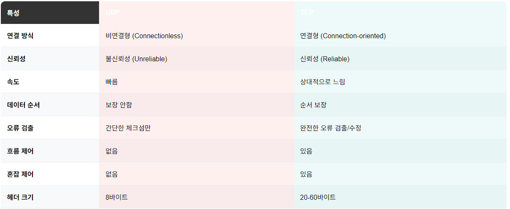
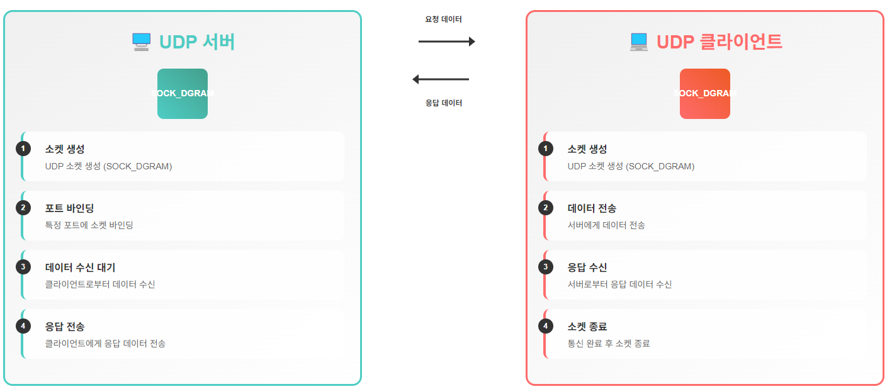
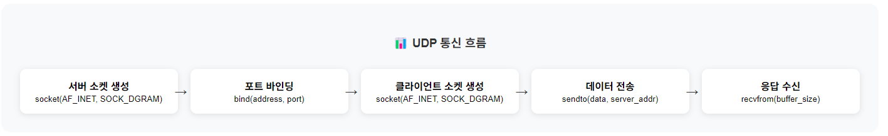
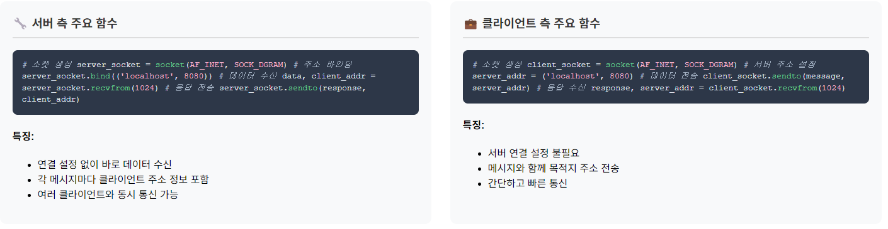
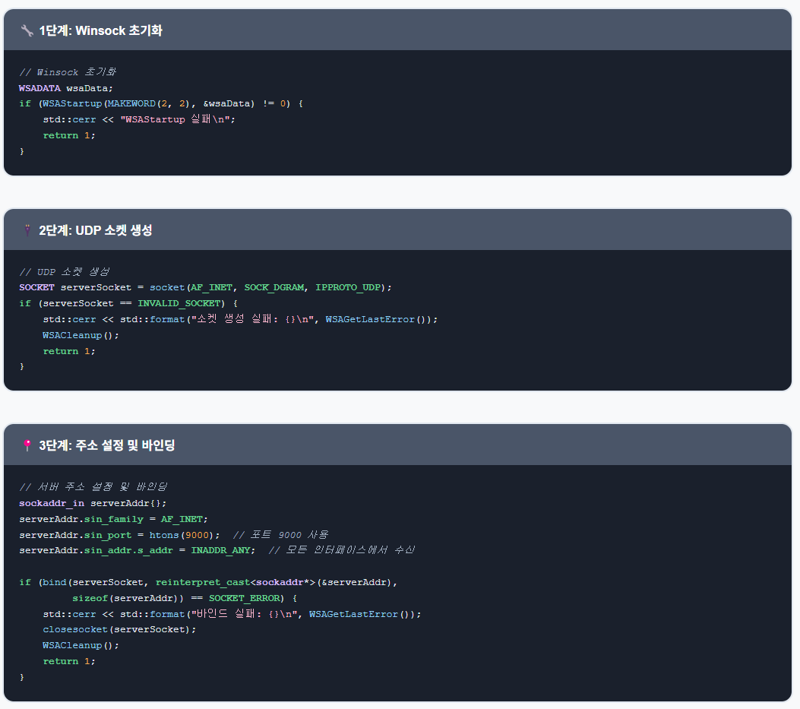
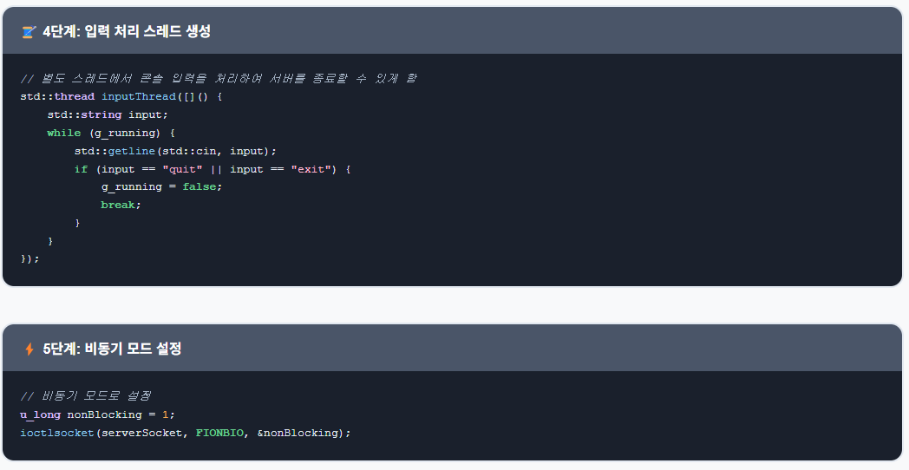
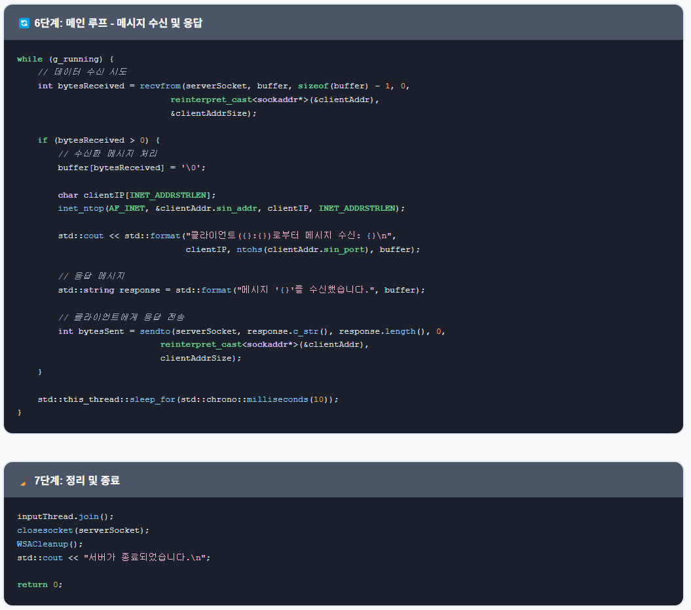
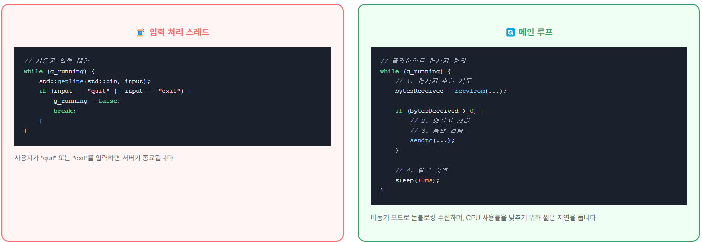
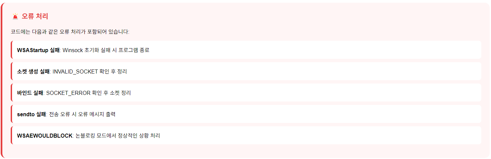

# 게임 서버 개발자가 알아야할 TCP/IP Windows 소켓 프로그래밍

저자: 최흥배, Claude AI  

- C++23
- Windows 11
- Visual Studio 2022 이상
  

-----  
# Chapter.07 UDP 네트워크 프로그래밍
  
## 01. UDP 특징
UDP(User Datagram Protocol)는 TCP와 달리 연결 지향적이지 않은 프로토콜로, 온라인 게임에서 실시간성이 중요한 데이터 전송에 자주 사용됩니다.

### UDP의 특징
- **비연결성**: 연결 설정 과정 없이 바로 데이터 전송
- **비신뢰성**: 패킷 전달 보장 없음, 순서 보장 없음
- **낮은 오버헤드**: TCP보다 헤더 크기가 작고 처리 과정이 단순함
- **빠른 속도**: 연결 관리, 흐름 제어, 혼잡 제어 없음
  
  
  

### UDP 서버-클라이언트 기본 구조
   
  
   
  
1. **서버 측**:
   - 소켓 생성 (SOCK_DGRAM)
   - 특정 포트에 바인딩
   - 클라이언트로부터 데이터 수신
   - 클라이언트에게 데이터 전송

2. **클라이언트 측**:
   - 소켓 생성 (SOCK_DGRAM)
   - 서버에게 데이터 전송
   - 서버로부터 데이터 수신 

### UDP의 게임 서버 활용
- 실시간 위치 정보, 플레이어 동작 등 지연이 중요한 데이터
- 음성 채팅 같은 실시간 미디어 전송
- 패킷 손실이 있어도 게임 플레이에 큰 영향이 없는 정보
  

## 02. UDP 프로그래밍

### Winsock2 초기화
Windows에서 네트워크 프로그래밍을 하기 위해서는 Winsock 라이브러리를 초기화해야 합니다.

```cpp
#include <winsock2.h>
#include <ws2tcpip.h>
#include <iostream>
#include <string>
#include <format>

#pragma comment(lib, "ws2_32.lib")

bool InitializeWinsock() {
    WSADATA wsaData;
    int result = WSAStartup(MAKEWORD(2, 2), &wsaData);
    if (result != 0) {
        std::cerr << std::format("WSAStartup 실패: {}\n", result);
        return false;
    }
    return true;
}
```

### UDP 소켓 생성
UDP 소켓은 SOCK_DGRAM 타입으로 생성합니다.

```cpp
SOCKET CreateUdpSocket() {
    SOCKET udpSocket = socket(AF_INET, SOCK_DGRAM, IPPROTO_UDP);
    if (udpSocket == INVALID_SOCKET) {
        std::cerr << std::format("소켓 생성 실패: {}\n", WSAGetLastError());
        WSACleanup();
        return INVALID_SOCKET;
    }
    return udpSocket;
}
```

### 서버 소켓 바인딩
UDP 서버는 특정 주소와 포트에 바인딩되어야 합니다.

```cpp
bool BindSocket(SOCKET socket, const char* ip, unsigned short port) {
    sockaddr_in serverAddr{};
    serverAddr.sin_family = AF_INET;
    serverAddr.sin_port = htons(port);
    
    // IP 주소 변환
    inet_pton(AF_INET, ip, &serverAddr.sin_addr);
    
    // 소켓을 주소와 포트에 바인딩
    int result = bind(socket, reinterpret_cast<sockaddr*>(&serverAddr), sizeof(serverAddr));
    if (result == SOCKET_ERROR) {
        std::cerr << std::format("바인드 실패: {}\n", WSAGetLastError());
        closesocket(socket);
        WSACleanup();
        return false;
    }
    
    return true;
}
```

### 데이터 송수신
UDP에서는 `sendto()`, `recvfrom()` 함수를 사용하여 데이터를 송수신합니다.

```cpp
// 데이터 전송
bool SendData(SOCKET socket, const char* data, int dataLength, const sockaddr_in& destination) {
    int bytesSent = sendto(socket, data, dataLength, 0, 
                         reinterpret_cast<const sockaddr*>(&destination), 
                         sizeof(destination));
    
    if (bytesSent == SOCKET_ERROR) {
        std::cerr << std::format("sendto 실패: {}\n", WSAGetLastError());
        return false;
    }
    
    return true;
}

// 데이터 수신
int ReceiveData(SOCKET socket, char* buffer, int bufferSize, sockaddr_in& sender) {
    int senderAddrSize = sizeof(sender);
    int bytesReceived = recvfrom(socket, buffer, bufferSize, 0,
                               reinterpret_cast<sockaddr*>(&sender),
                               &senderAddrSize);
    
    if (bytesReceived == SOCKET_ERROR) {
        std::cerr << std::format("recvfrom 실패: {}\n", WSAGetLastError());
        return -1;
    }
    
    return bytesReceived;
}
```
  

## 03. UDP IPv6
IPv6는 128비트 주소 체계로, 기존 IPv4의 주소 고갈 문제를 해결하기 위해 개발되었습니다.

### IPv6 소켓 생성 및 바인딩

```cpp
SOCKET CreateUdpSocketIPv6() {
    SOCKET udpSocket = socket(AF_INET6, SOCK_DGRAM, IPPROTO_UDP);
    if (udpSocket == INVALID_SOCKET) {
        std::cerr << std::format("IPv6 소켓 생성 실패: {}\n", WSAGetLastError());
        WSACleanup();
        return INVALID_SOCKET;
    }
    return udpSocket;
}

bool BindSocketIPv6(SOCKET socket, const char* ip, unsigned short port) {
    sockaddr_in6 serverAddr{};
    serverAddr.sin6_family = AF_INET6;
    serverAddr.sin6_port = htons(port);
    
    // IPv6 주소 변환
    inet_pton(AF_INET6, ip, &serverAddr.sin6_addr);
    
    // 소켓을 주소와 포트에 바인딩
    int result = bind(socket, reinterpret_cast<sockaddr*>(&serverAddr), sizeof(serverAddr));
    if (result == SOCKET_ERROR) {
        std::cerr << std::format("IPv6 바인드 실패: {}\n", WSAGetLastError());
        closesocket(socket);
        WSACleanup();
        return false;
    }
    
    return true;
}
```

### IPv6 데이터 송수신

```cpp
// IPv6 데이터 전송
bool SendDataIPv6(SOCKET socket, const char* data, int dataLength, const sockaddr_in6& destination) {
    int bytesSent = sendto(socket, data, dataLength, 0, 
                         reinterpret_cast<const sockaddr*>(&destination), 
                         sizeof(destination));
    
    if (bytesSent == SOCKET_ERROR) {
        std::cerr << std::format("IPv6 sendto 실패: {}\n", WSAGetLastError());
        return false;
    }
    
    return true;
}

// IPv6 데이터 수신
int ReceiveDataIPv6(SOCKET socket, char* buffer, int bufferSize, sockaddr_in6& sender) {
    int senderAddrSize = sizeof(sender);
    int bytesReceived = recvfrom(socket, buffer, bufferSize, 0,
                               reinterpret_cast<sockaddr*>(&sender),
                               &senderAddrSize);
    
    if (bytesReceived == SOCKET_ERROR) {
        std::cerr << std::format("IPv6 recvfrom 실패: {}\n", WSAGetLastError());
        return -1;
    }
    
    return bytesReceived;
}
```
  

## 실습: UDP 서버-클라이언트 작성과 테스트

### UDP 서버 구현  
  
  
  
  
  

```cpp
// UdpServer.cpp
#include <winsock2.h>
#include <ws2tcpip.h>
#include <iostream>
#include <string>
#include <format>
#include <thread>
#include <atomic>

#pragma comment(lib, "ws2_32.lib")

std::atomic<bool> g_running = true;

int main() {
    // Winsock 초기화
    WSADATA wsaData;
    if (WSAStartup(MAKEWORD(2, 2), &wsaData) != 0) {
        std::cerr << "WSAStartup 실패\n";
        return 1;
    }
    
    // UDP 소켓 생성
    SOCKET serverSocket = socket(AF_INET, SOCK_DGRAM, IPPROTO_UDP);
    if (serverSocket == INVALID_SOCKET) {
        std::cerr << std::format("소켓 생성 실패: {}\n", WSAGetLastError());
        WSACleanup();
        return 1;
    }
    
    // 서버 주소 설정 및 바인딩
    sockaddr_in serverAddr{};
    serverAddr.sin_family = AF_INET;
    serverAddr.sin_port = htons(9000);  // 포트 9000 사용
    serverAddr.sin_addr.s_addr = INADDR_ANY;  // 모든 인터페이스에서 수신
    
    if (bind(serverSocket, reinterpret_cast<sockaddr*>(&serverAddr), sizeof(serverAddr)) == SOCKET_ERROR) {
        std::cerr << std::format("바인드 실패: {}\n", WSAGetLastError());
        closesocket(serverSocket);
        WSACleanup();
        return 1;
    }
    
    std::cout << "UDP 서버가 시작되었습니다. 포트 9000에서 대기 중...\n";
    
    // 클라이언트로부터 메시지 수신 및 응답
    char buffer[1024];
    sockaddr_in clientAddr{};
    int clientAddrSize = sizeof(clientAddr);
    
    // 별도 스레드에서 콘솔 입력을 처리하여 서버를 종료할 수 있게 함
    std::thread inputThread([]() {
        std::string input;
        while (g_running) {
            std::getline(std::cin, input);
            if (input == "quit" || input == "exit") {
                g_running = false;
                break;
            }
        }
    });
    
    // 비동기 모드로 설정
    u_long nonBlocking = 1;
    ioctlsocket(serverSocket, FIONBIO, &nonBlocking);
    
    while (g_running) {
        // 데이터 수신 시도
        int bytesReceived = recvfrom(serverSocket, buffer, sizeof(buffer) - 1, 0,
                                  reinterpret_cast<sockaddr*>(&clientAddr), 
                                  &clientAddrSize);
        
        if (bytesReceived > 0) {
            // 수신한 메시지 처리
            buffer[bytesReceived] = '\0';
            
            char clientIP[INET_ADDRSTRLEN];
            inet_ntop(AF_INET, &clientAddr.sin_addr, clientIP, INET_ADDRSTRLEN);
            
            std::cout << std::format("클라이언트({}:{})로부터 메시지 수신: {}\n", 
                                     clientIP, ntohs(clientAddr.sin_port), buffer);
            
            // 응답 메시지
            std::string response = std::format("메시지 '{}'를 수신했습니다.", buffer);
            
            // 클라이언트에게 응답 전송
            int bytesSent = sendto(serverSocket, response.c_str(), response.length(), 0,
                                reinterpret_cast<sockaddr*>(&clientAddr), 
                                clientAddrSize);
            
            if (bytesSent == SOCKET_ERROR) {
                std::cerr << std::format("sendto 실패: {}\n", WSAGetLastError());
            }
        } else if (bytesReceived == SOCKET_ERROR) {
            int error = WSAGetLastError();
            if (error != WSAEWOULDBLOCK) {
                std::cerr << std::format("recvfrom 실패: {}\n", error);
            }
        }
        
        // CPU 사용률을 낮추기 위한 짧은 지연
        std::this_thread::sleep_for(std::chrono::milliseconds(10));
    }
    
    inputThread.join();
    closesocket(serverSocket);
    WSACleanup();
    std::cout << "서버가 종료되었습니다.\n";
    
    return 0;
}
```

### UDP 클라이언트 구현

```cpp
// UdpClient.cpp
#include <winsock2.h>
#include <ws2tcpip.h>
#include <iostream>
#include <string>
#include <format>

#pragma comment(lib, "ws2_32.lib")

int main() {
    // Winsock 초기화
    WSADATA wsaData;
    if (WSAStartup(MAKEWORD(2, 2), &wsaData) != 0) {
        std::cerr << "WSAStartup 실패\n";
        return 1;
    }
    
    // UDP 소켓 생성
    SOCKET clientSocket = socket(AF_INET, SOCK_DGRAM, IPPROTO_UDP);
    if (clientSocket == INVALID_SOCKET) {
        std::cerr << std::format("소켓 생성 실패: {}\n", WSAGetLastError());
        WSACleanup();
        return 1;
    }
    
    // 서버 주소 설정
    sockaddr_in serverAddr{};
    serverAddr.sin_family = AF_INET;
    serverAddr.sin_port = htons(9000);  // 서버 포트 9000
    
    // 서버 IP 주소 설정 (로컬호스트)
    inet_pton(AF_INET, "127.0.0.1", &serverAddr.sin_addr);
    
    std::cout << "UDP 클라이언트가 시작되었습니다. 서버(127.0.0.1:9000)에 연결 중...\n";
    std::cout << "메시지를 입력하세요 ('quit' 또는 'exit'를 입력하면 종료):\n";
    
    std::string message;
    char buffer[1024];
    
    while (true) {
        std::cout << "> ";
        std::getline(std::cin, message);
        
        if (message == "quit" || message == "exit") {
            break;
        }
        
        // 서버로 메시지 전송
        int bytesSent = sendto(clientSocket, message.c_str(), message.length(), 0,
                            reinterpret_cast<sockaddr*>(&serverAddr), 
                            sizeof(serverAddr));
        
        if (bytesSent == SOCKET_ERROR) {
            std::cerr << std::format("sendto 실패: {}\n", WSAGetLastError());
            continue;
        }
        
        // 서버로부터 응답 수신
        sockaddr_in fromAddr{};
        int fromAddrSize = sizeof(fromAddr);
        
        int bytesReceived = recvfrom(clientSocket, buffer, sizeof(buffer) - 1, 0,
                                   reinterpret_cast<sockaddr*>(&fromAddr), 
                                   &fromAddrSize);
        
        if (bytesReceived == SOCKET_ERROR) {
            std::cerr << std::format("recvfrom 실패: {}\n", WSAGetLastError());
            continue;
        }
        
        buffer[bytesReceived] = '\0';
        std::cout << "서버 응답: " << buffer << "\n";
    }
    
    closesocket(clientSocket);
    WSACleanup();
    std::cout << "클라이언트가 종료되었습니다.\n";
    
    return 0;
}
```

### 코드 컴파일 및 실행 방법
1. Visual Studio에서 두 개의 별도 프로젝트를 생성합니다.
2. 서버 코드와 클라이언트 코드를 각 프로젝트에 추가합니다.
3. 컴파일하고 실행합니다.
4. 먼저 서버를 실행한 다음 클라이언트를 실행합니다.
5. 클라이언트에서 메시지를 입력하면 서버로 전송되고 서버에서 응답을 받습니다.
  

## 실습: UDP 서버-클라이언트(IPv6) 작성과 테스트

### IPv6 UDP 서버 구현

```cpp
// UdpServerIPv6.cpp
#include <winsock2.h>
#include <ws2tcpip.h>
#include <iostream>
#include <string>
#include <format>
#include <thread>
#include <atomic>

#pragma comment(lib, "ws2_32.lib")

std::atomic<bool> g_running = true;

int main() {
    // Winsock 초기화
    WSADATA wsaData;
    if (WSAStartup(MAKEWORD(2, 2), &wsaData) != 0) {
        std::cerr << "WSAStartup 실패\n";
        return 1;
    }
    
    // IPv6 UDP 소켓 생성
    SOCKET serverSocket = socket(AF_INET6, SOCK_DGRAM, IPPROTO_UDP);
    if (serverSocket == INVALID_SOCKET) {
        std::cerr << std::format("소켓 생성 실패: {}\n", WSAGetLastError());
        WSACleanup();
        return 1;
    }
    
    // IPv4-매핑된 IPv6 주소를 허용하지 않음 (순수 IPv6 모드)
    // 이 옵션을 변경하면 IPv4 클라이언트도 접속 가능
    DWORD v6Only = 1;
    if (setsockopt(serverSocket, IPPROTO_IPV6, IPV6_V6ONLY, 
                   reinterpret_cast<char*>(&v6Only), sizeof(v6Only)) == SOCKET_ERROR) {
        std::cerr << std::format("setsockopt IPV6_V6ONLY 실패: {}\n", WSAGetLastError());
        closesocket(serverSocket);
        WSACleanup();
        return 1;
    }
    
    // 서버 주소 설정 및 바인딩
    sockaddr_in6 serverAddr{};
    serverAddr.sin6_family = AF_INET6;
    serverAddr.sin6_port = htons(9000);  // 포트 9000 사용
    serverAddr.sin6_addr = in6addr_any;  // 모든 인터페이스에서 수신
    
    if (bind(serverSocket, reinterpret_cast<sockaddr*>(&serverAddr), sizeof(serverAddr)) == SOCKET_ERROR) {
        std::cerr << std::format("바인드 실패: {}\n", WSAGetLastError());
        closesocket(serverSocket);
        WSACleanup();
        return 1;
    }
    
    std::cout << "IPv6 UDP 서버가 시작되었습니다. 포트 9000에서 대기 중...\n";
    
    // 클라이언트로부터 메시지 수신 및 응답
    char buffer[1024];
    sockaddr_in6 clientAddr{};
    int clientAddrSize = sizeof(clientAddr);
    
    // 별도 스레드에서 콘솔 입력을 처리하여 서버를 종료할 수 있게 함
    std::thread inputThread([]() {
        std::string input;
        while (g_running) {
            std::getline(std::cin, input);
            if (input == "quit" || input == "exit") {
                g_running = false;
                break;
            }
        }
    });
    
    // 비동기 모드로 설정
    u_long nonBlocking = 1;
    ioctlsocket(serverSocket, FIONBIO, &nonBlocking);
    
    while (g_running) {
        // 데이터 수신 시도
        int bytesReceived = recvfrom(serverSocket, buffer, sizeof(buffer) - 1, 0,
                                  reinterpret_cast<sockaddr*>(&clientAddr), 
                                  &clientAddrSize);
        
        if (bytesReceived > 0) {
            // 수신한 메시지 처리
            buffer[bytesReceived] = '\0';
            
            char clientIP[INET6_ADDRSTRLEN];
            inet_ntop(AF_INET6, &clientAddr.sin6_addr, clientIP, INET6_ADDRSTRLEN);
            
            std::cout << std::format("클라이언트([{}]:{})로부터 메시지 수신: {}\n", 
                                     clientIP, ntohs(clientAddr.sin6_port), buffer);
            
            // 응답 메시지
            std::string response = std::format("IPv6 메시지 '{}'를 수신했습니다.", buffer);
            
            // 클라이언트에게 응답 전송
            int bytesSent = sendto(serverSocket, response.c_str(), response.length(), 0,
                                reinterpret_cast<sockaddr*>(&clientAddr), 
                                clientAddrSize);
            
            if (bytesSent == SOCKET_ERROR) {
                std::cerr << std::format("sendto 실패: {}\n", WSAGetLastError());
            }
        } else if (bytesReceived == SOCKET_ERROR) {
            int error = WSAGetLastError();
            if (error != WSAEWOULDBLOCK) {
                std::cerr << std::format("recvfrom 실패: {}\n", error);
            }
        }
        
        // CPU 사용률을 낮추기 위한 짧은 지연
        std::this_thread::sleep_for(std::chrono::milliseconds(10));
    }
    
    inputThread.join();
    closesocket(serverSocket);
    WSACleanup();
    std::cout << "서버가 종료되었습니다.\n";
    
    return 0;
}
```

### IPv6 UDP 클라이언트 구현

```cpp
// UdpClientIPv6.cpp
#include <winsock2.h>
#include <ws2tcpip.h>
#include <iostream>
#include <string>
#include <format>

#pragma comment(lib, "ws2_32.lib")

int main() {
    // Winsock 초기화
    WSADATA wsaData;
    if (WSAStartup(MAKEWORD(2, 2), &wsaData) != 0) {
        std::cerr << "WSAStartup 실패\n";
        return 1;
    }
    
    // IPv6 UDP 소켓 생성
    SOCKET clientSocket = socket(AF_INET6, SOCK_DGRAM, IPPROTO_UDP);
    if (clientSocket == INVALID_SOCKET) {
        std::cerr << std::format("소켓 생성 실패: {}\n", WSAGetLastError());
        WSACleanup();
        return 1;
    }
    
    // 서버 주소 설정
    sockaddr_in6 serverAddr{};
    serverAddr.sin6_family = AF_INET6;
    serverAddr.sin6_port = htons(9000);  // 서버 포트 9000
    
    // 서버 IPv6 주소 설정 (로컬호스트 - ::1)
    inet_pton(AF_INET6, "::1", &serverAddr.sin6_addr);
    
    std::cout << "IPv6 UDP 클라이언트가 시작되었습니다. 서버([::1]:9000)에 연결 중...\n";
    std::cout << "메시지를 입력하세요 ('quit' 또는 'exit'를 입력하면 종료):\n";
    
    std::string message;
    char buffer[1024];
    
    while (true) {
        std::cout << "> ";
        std::getline(std::cin, message);
        
        if (message == "quit" || message == "exit") {
            break;
        }
        
        // 서버로 메시지 전송
        int bytesSent = sendto(clientSocket, message.c_str(), message.length(), 0,
                            reinterpret_cast<sockaddr*>(&serverAddr), 
                            sizeof(serverAddr));
        
        if (bytesSent == SOCKET_ERROR) {
            std::cerr << std::format("sendto 실패: {}\n", WSAGetLastError());
            continue;
        }
        
        // 서버로부터 응답 수신
        sockaddr_in6 fromAddr{};
        int fromAddrSize = sizeof(fromAddr);
        
        int bytesReceived = recvfrom(clientSocket, buffer, sizeof(buffer) - 1, 0,
                                   reinterpret_cast<sockaddr*>(&fromAddr), 
                                   &fromAddrSize);
        
        if (bytesReceived == SOCKET_ERROR) {
            std::cerr << std::format("recvfrom 실패: {}\n", WSAGetLastError());
            continue;
        }
        
        buffer[bytesReceived] = '\0';
        std::cout << "서버 응답: " << buffer << "\n";
    }
    
    closesocket(clientSocket);
    WSACleanup();
    std::cout << "클라이언트가 종료되었습니다.\n";
    
    return 0;
}
```

### IPv6 코드 실행 방법
1. IPv6가 활성화된 시스템에서 코드를 컴파일하고 실행합니다.
2. 먼저 IPv6 서버를 실행한 다음 IPv6 클라이언트를 실행합니다.
3. `::1`은 IPv6 루프백 주소로, IPv4의 127.0.0.1과 동일한 역할을 합니다.

### IPv6 테스트 시 주의 사항
1. Windows에서 IPv6가 활성화되어 있는지 확인하세요.
2. 방화벽 설정이 IPv6 트래픽을 허용하는지 확인하세요.
3. 네트워크 어댑터에서 IPv6 프로토콜이 활성화되어 있는지 확인하세요.
  

-----  
이 UDP 서버-클라이언트 코드는 온라인 게임 서버 개발을 위한 기초적인 구현입니다. 실제 게임 서버 개발 시에는 다음과 같은 기능을 추가로 구현해야 할 수 있습니다:

1. 패킷 손실 처리 및 재전송 메커니즘
2. 패킷 순서 보장 시스템
3. 패킷 세그먼테이션 및 재조립
4. 패킷 인증 및 암호화
5. 게임 로직과의 통합
6. 성능 최적화 및 부하 테스트

UDP는 빠른 속도와 낮은 오버헤드로 실시간 게임에 적합하지만, 신뢰성이 떨어지는 점은 애플리케이션 레벨에서 보완해야 합니다.   
  