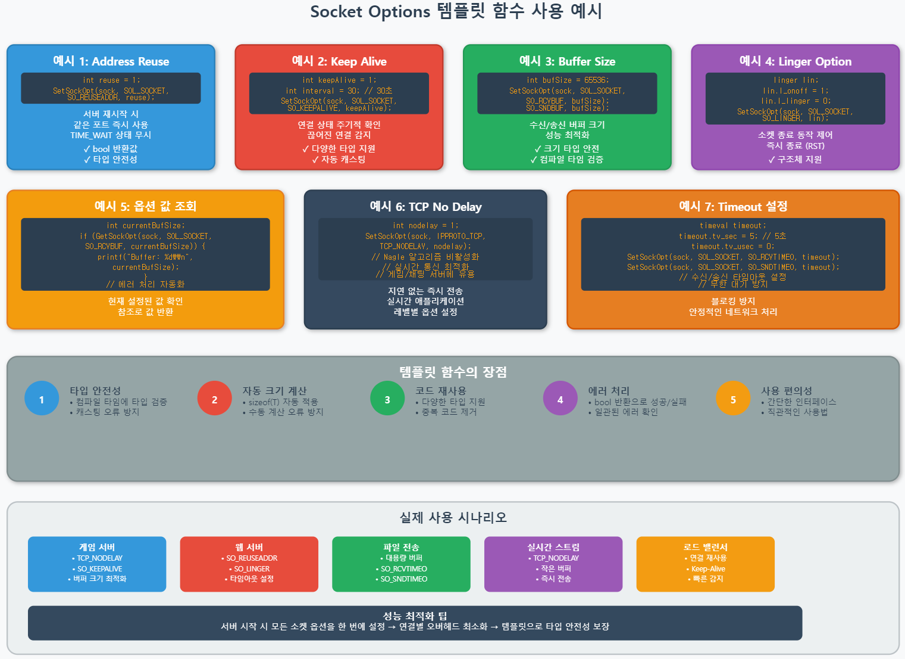
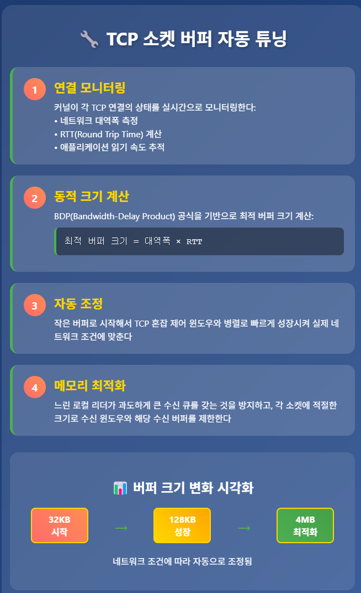
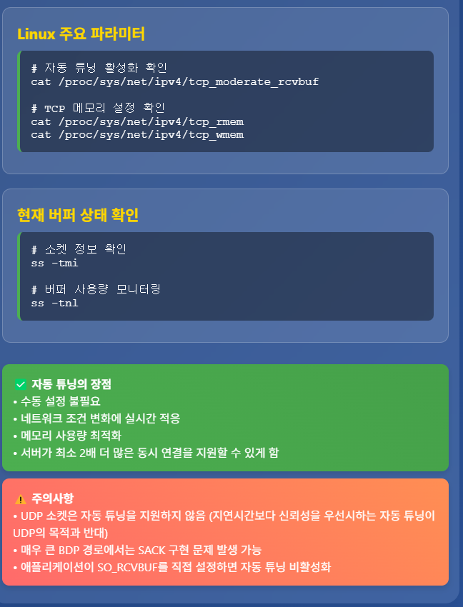
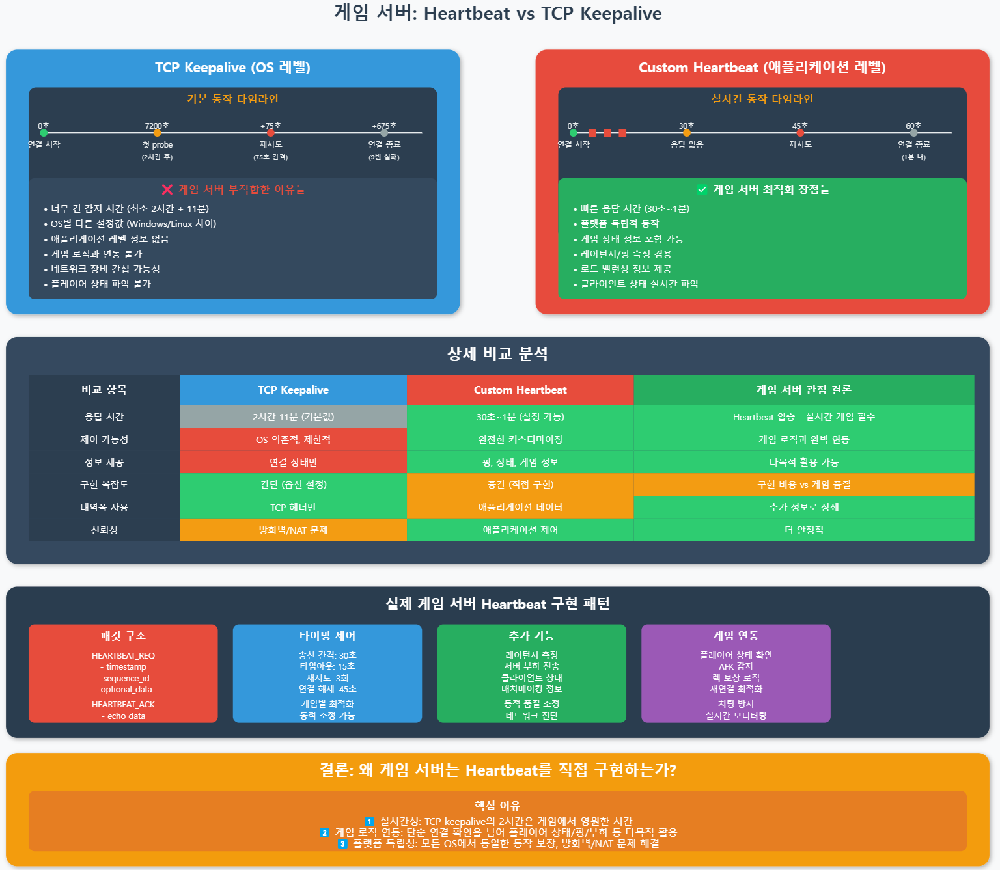
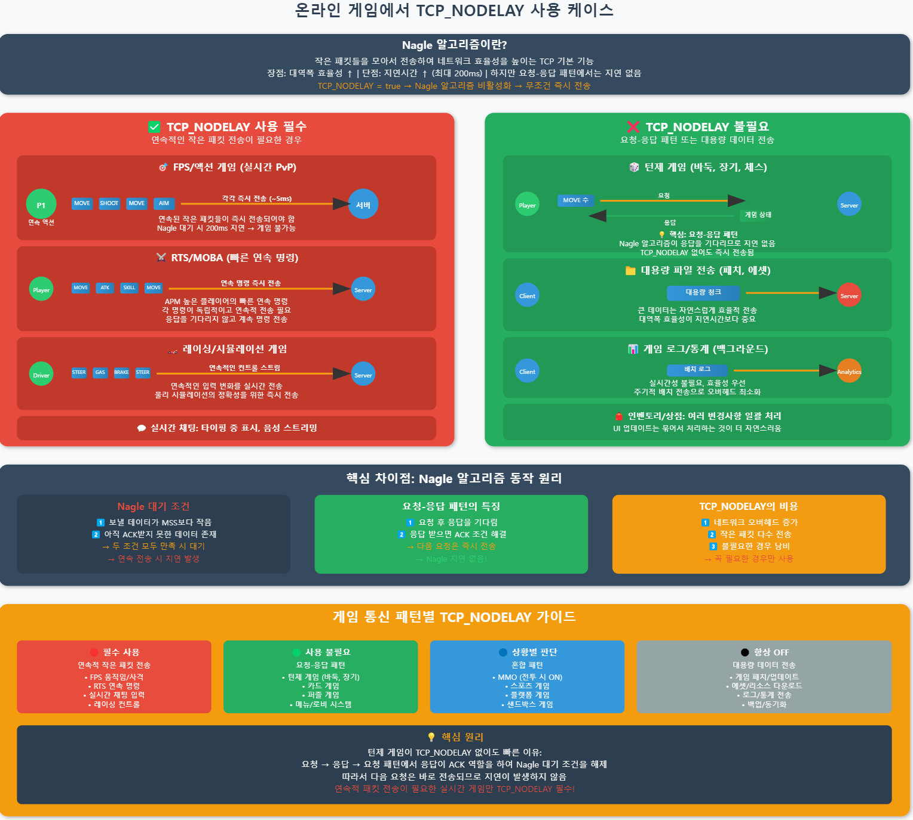

# 게임 서버 개발자가 알아야할 TCP/IP Windows 소켓 프로그래밍

저자: 최흥배, Claude AI  

- C++23
- Windows 11
- Visual Studio 2022 이상
  

-----  
# Chapter.08 소켓 옵션
   
## 01. 소켓 옵션의 종류와 관련 함수
소켓 옵션은 소켓의 동작 방식을 세부적으로 제어할 수 있게 해주는 매개변수들입니다. 온라인 게임 서버 개발 시 이러한 옵션들을 적절히 설정하면 성능 향상과 안정성을 높일 수 있습니다.  

### 소켓 옵션 설정/조회 함수
Windows에서는 다음 두 함수를 통해 소켓 옵션을 설정하고 조회할 수 있습니다:

```cpp
#include <winsock2.h>
#include <ws2tcpip.h>
#include <iostream>
#include <format>

#pragma comment(lib, "ws2_32.lib")

// 소켓 옵션 설정 함수
int setsockopt(
    SOCKET s,               // 대상 소켓
    int level,              // 옵션 레벨
    int optname,            // 옵션 이름
    const char* optval,     // 옵션 값
    int optlen              // 옵션 값의 크기
);

// 소켓 옵션 조회 함수
int getsockopt(
    SOCKET s,               // 대상 소켓
    int level,              // 옵션 레벨
    int optname,            // 옵션 이름
    char* optval,           // 옵션 값을 저장할 버퍼
    int* optlen             // 버퍼 크기 및 반환된 옵션 값 크기
);
```

### 소켓 옵션 레벨
소켓 옵션은 다양한 프로토콜 레벨에서 적용됩니다:

1. **SOL_SOCKET**: 소켓 자체에 적용되는 일반적인 옵션
2. **IPPROTO_IP**: IPv4 프로토콜에 적용되는 옵션
3. **IPPROTO_IPV6**: IPv6 프로토콜에 적용되는 옵션
4. **IPPROTO_TCP**: TCP 프로토콜에 적용되는 옵션
5. **IPPROTO_UDP**: UDP 프로토콜에 적용되는 옵션

### 소켓 옵션 헬퍼 함수
C++23에서는 템플릿을 활용하여 소켓 옵션 설정을 편리하게 할 수 있는 헬퍼 함수를 만들 수 있습니다:

```cpp
template <typename T>
bool SetSockOpt(SOCKET sock, int level, int optname, const T& value) {
    return setsockopt(sock, level, optname, 
                     reinterpret_cast<const char*>(&value), 
                     sizeof(T)) != SOCKET_ERROR;
}

template <typename T>
bool GetSockOpt(SOCKET sock, int level, int optname, T& value) {
    int len = sizeof(T);
    return getsockopt(sock, level, optname, 
                     reinterpret_cast<char*>(&value), 
                     &len) != SOCKET_ERROR;
}
```

       
  
  
## 02. SOL_SOCKET 레벨 옵션
SOL_SOCKET 레벨 옵션은 모든 소켓 유형에 적용되는 일반적인 옵션입니다.

### SO_REUSEADDR
서버 재시작 시 이전에 사용했던 주소와 포트를 즉시 재사용할 수 있게 합니다.

```cpp
BOOL optVal = TRUE;
if (!SetSockOpt(serverSocket, SOL_SOCKET, SO_REUSEADDR, optVal)) {
    std::cerr << std::format("SO_REUSEADDR 설정 실패: {}\n", WSAGetLastError());
}
```
  
**게임 서버에서는 서버 다운 후 빠른 재시작을 위해 중요합니다.**
  
### SO_RCVBUF와 SO_SNDBUF
수신 및 송신 버퍼의 크기를 설정합니다.

```cpp
int recvBufSize = 64 * 1024; // 64KB
int sendBufSize = 64 * 1024; // 64KB

if (!SetSockOpt(gameSocket, SOL_SOCKET, SO_RCVBUF, recvBufSize)) {
    std::cerr << std::format("SO_RCVBUF 설정 실패: {}\n", WSAGetLastError());
}

if (!SetSockOpt(gameSocket, SOL_SOCKET, SO_SNDBUF, sendBufSize)) {
    std::cerr << std::format("SO_SNDBUF 설정 실패: {}\n", WSAGetLastError());
}
```

게임 서버에서는 대량의 데이터 처리를 위해 버퍼 크기를 조정하는 것이 중요합니다.  

그러나 **최신 OS에서는 소켓 버퍼 크기가 자동으로 조정된다**. 이를 **TCP 자동 튜닝(Auto-tuning)**이라고 한다.

#### 주요 특징
**Linux 커널 2.6.17 이후**: 기본적으로 4MB 최대 버퍼 크기를 가진 전체 자동 튜닝 기능이 제공된다. /proc/sys/net/ipv4/tcp_moderate_rcvbuf가 1로 설정되면 자동 튜닝이 활성화되고 버퍼 크기가 동적으로 조정된다.  
**Windows Vista 이후**: Microsoft도 수신측 버퍼 자동 튜닝을 도입했다.  
**FreeBSD 7.0**: 버퍼 자동 튜닝 기능을 포함하여 출시되었다.  
  
#### 동작 원리
   
   
  
**Linux의 경우**: 커널이 로컬 애플리케이션이 수신 큐에서 데이터를 읽는 속도를 추적하고 세션 RTT도 알고 있어서, 애플리케이션 레이어나 네트워크 병목 링크가 처리량의 제약이 될 때까지 자동으로 버퍼와 수신 윈도우를 증가시킨다.  
**FreeBSD의 경우**: 작은 버퍼로 시작해서 TCP 혼잡 윈도우와 병렬로 빠르게 성장시켜 실제 네트워크 조건에 맞춘다.  
**Windows의 경우**: [Windows TCP 자동 튜닝 설정 가이드](https://claude.ai/public/artifacts/624c04c3-96df-491b-aeb1-00ec290c0a47 )  
  

#### 실제 예시 코드

```c
// 자동 튜닝 상태 확인 (Linux)
#include <sys/socket.h>
#include <netinet/tcp.h>

int check_autotuning() {
    int sockfd = socket(AF_INET, SOCK_STREAM, 0);
    
    // 현재 수신 버퍼 크기 확인
    int rcvbuf_size;
    socklen_t len = sizeof(rcvbuf_size);
    getsockopt(sockfd, SOL_SOCKET, SO_RCVBUF, &rcvbuf_size, &len);
    
    printf("Current receive buffer: %d bytes\n", rcvbuf_size);
    
    // 자동 튜닝이 동작 중이면 이 값이 동적으로 변한다
    return rcvbuf_size;
}
```

#### 성능 효과
기본 시스템 설정 대비 큰 대역폭 지연 경로에서 성능이 대폭 개선되고, 수동 튜닝된 연결 대비 메모리 사용량이 현저히 줄어들어 서버가 최소 2배 더 많은 동시 연결을 지원할 수 있다.  
대부분의 최신 OS들이 TCP 버퍼를 잘 자동 튜닝하지만, 10G 네트워크의 경우 기본 최대 TCP 버퍼 크기가 여전히 작을 수 있다는 점은 유의해야 한다.  
  

### SO_LINGER
소켓 종료 시 전송 대기 중인 데이터 처리 방식을 설정합니다.

```cpp
linger lingerOpt{};
lingerOpt.l_onoff = 1;    // linger 사용
lingerOpt.l_linger = 10;  // 10초 동안 대기

if (!SetSockOpt(clientSocket, SOL_SOCKET, SO_LINGER, lingerOpt)) {
    std::cerr << std::format("SO_LINGER 설정 실패: {}\n", WSAGetLastError());
}
```

**게임 서버에서는 클라이언트 연결 종료 시 미전송 데이터를 어떻게 처리할지 결정하는 데 사용됩니다.**

### SO_KEEPALIVE
TCP 연결이 여전히 활성 상태인지 주기적으로 확인합니다.

```cpp
BOOL keepAlive = TRUE;
if (!SetSockOpt(playerSocket, SOL_SOCKET, SO_KEEPALIVE, keepAlive)) {
    std::cerr << std::format("SO_KEEPALIVE 설정 실패: {}\n", WSAGetLastError());
}
```

게임 서버에서는 플레이어 연결이 갑자기 끊겼는지 감지하는 데 유용합니다. (잘 사용하지 않음)    
 
    
  
### SO_BROADCAST
UDP 소켓에서 브로드캐스트 메시지 전송을 허용합니다.

```cpp
BOOL broadcast = TRUE;
if (!SetSockOpt(broadcastSocket, SOL_SOCKET, SO_BROADCAST, broadcast)) {
    std::cerr << std::format("SO_BROADCAST 설정 실패: {}\n", WSAGetLastError());
}
```

  
### SO_ERROR
소켓의 마지막 에러 코드를 가져옵니다.

```cpp
int errorCode;
if (!GetSockOpt(socket, SOL_SOCKET, SO_ERROR, errorCode)) {
    std::cerr << std::format("SO_ERROR 조회 실패: {}\n", WSAGetLastError());
} else {
    if (errorCode != 0) {
        std::cerr << std::format("소켓 에러 발생: {}\n", errorCode);
    }
}
```

비동기 작업 후 오류 확인에 유용합니다.

### SO_DONTLINGER
SO_LINGER의 반대 동작을 설정합니다.

```cpp
BOOL dontLinger = TRUE;
if (!SetSockOpt(socket, SOL_SOCKET, SO_DONTLINGER, dontLinger)) {
    std::cerr << std::format("SO_DONTLINGER 설정 실패: {}\n", WSAGetLastError());
}
```

closesocket() 호출 즉시 반환되게 하여 게임 종료 시 지연이 없도록 합니다.
  

## 03. IPPROTO_IP, IPPROTO_IPV6 레벨 옵션
이 레벨 옵션들은 IP 프로토콜 관련 설정을 제어합니다.

### IP_TTL (Time To Live)
패킷의 생존 시간을 설정합니다.

```cpp
int ttl = 64;  // 홉 수
if (!SetSockOpt(socket, IPPROTO_IP, IP_TTL, ttl)) {
    std::cerr << std::format("IP_TTL 설정 실패: {}\n", WSAGetLastError());
}
```

게임 서버에서는 패킷이 네트워크에서 너무 오래 떠돌지 않도록 제한하는 데 사용됩니다.
  
### IP_MULTICAST_TTL
멀티캐스트 패킷의 TTL 값을 설정합니다.

```cpp
int multicastTTL = 8;  // 멀티캐스트 범위 제한
if (!SetSockOpt(multicastSocket, IPPROTO_IP, IP_MULTICAST_TTL, multicastTTL)) {
    std::cerr << std::format("IP_MULTICAST_TTL 설정 실패: {}\n", WSAGetLastError());
}
```

온라인 게임에서 로컬 네트워크 내의 멀티캐스트를 제어하는 데 유용합니다.

### IP_MULTICAST_LOOP
멀티캐스트 패킷이 송신자에게도 수신되는지 여부를 설정합니다.

```cpp
BOOL loopback = FALSE;  // 송신자에게 수신되지 않음
if (!SetSockOpt(multicastSocket, IPPROTO_IP, IP_MULTICAST_LOOP, loopback)) {
    std::cerr << std::format("IP_MULTICAST_LOOP 설정 실패: {}\n", WSAGetLastError());
}
```

게임에서 자신이 보낸 메시지는 받지 않도록 설정하는 데 사용됩니다.

### IP_ADD_MEMBERSHIP / IP_DROP_MEMBERSHIP
멀티캐스트 그룹에 가입하거나 탈퇴합니다.

```cpp
ip_mreq multicastRequest{};
inet_pton(AF_INET, "239.255.0.1", &multicastRequest.imr_multiaddr);
multicastRequest.imr_interface.s_addr = INADDR_ANY;

if (!SetSockOpt(socket, IPPROTO_IP, IP_ADD_MEMBERSHIP, multicastRequest)) {
    std::cerr << std::format("IP_ADD_MEMBERSHIP 설정 실패: {}\n", WSAGetLastError());
}
```

게임 방 검색이나 지역 기반 게임 이벤트 알림 등에 활용됩니다.

### IPV6_V6ONLY
IPv6 소켓에서 IPv4 매핑된 주소를 허용할지 설정합니다.

```cpp
BOOL v6Only = TRUE;
if (!SetSockOpt(socket, IPPROTO_IPV6, IPV6_V6ONLY, v6Only)) {
    std::cerr << std::format("IPV6_V6ONLY 설정 실패: {}\n", WSAGetLastError());
}
```

IPv6 전용 게임 서버 구현 시 사용됩니다.
  

## 04. IPPROTO_TCP 레벨 옵션
TCP 프로토콜 관련 설정을 제어하는 옵션들입니다.

### TCP_NODELAY (Nagle 알고리즘 비활성화)
가장 중요한 TCP 옵션 중 하나로, 작은 패킷들을 모아서 전송하는 Nagle 알고리즘을 비활성화합니다.

```cpp
BOOL noDelay = TRUE;
if (!SetSockOpt(playerSocket, IPPROTO_TCP, TCP_NODELAY, noDelay)) {
    std::cerr << std::format("TCP_NODELAY 설정 실패: {}\n", WSAGetLastError());
}
```

**게임 서버에서 매우 중요**: 아주 빠른 실시간 게임(예, FPS)에서는 패킷 지연이 게임 경험에 직접적인 영향을 미치므로, 대부분의 게임 서버에서는 이 옵션을 활성화하여 지연을 최소화합니다.  
   
   
완료했다! 수정된 다이어그램에서 핵심 포인트는:

#### **턴제 게임에서 TCP_NODELAY가 불필요한 이유**

**Nagle 알고리즘 대기 조건:**
1. 보낼 데이터가 MSS(Maximum Segment Size)보다 작음
2. 아직 ACK를 받지 못한 데이터가 존재

**턴제 게임의 특별함:**
- **요청-응답 패턴**: 플레이어가 수를 두면 → 서버가 응답 → 다음 요청
- 서버 응답이 이전 요청에 대한 **ACK 역할**을 함
- 따라서 다음 요청을 보낼 때는 이미 ACK를 받은 상태
- **Nagle 대기 조건이 충족되지 않아** 즉시 전송됨

**실제 시나리오 비교:**
- **FPS 게임**: MOVE → SHOOT → AIM → MOVE (연속 전송, 응답 대기 안함) → **지연 발생**
- **바둑 게임**: MOVE → (서버 응답 대기) → MOVE → (서버 응답 대기) → **지연 없음**

결론적으로 턴제 게임은 통신 패턴 자체가 Nagle 알고리즘과 충돌하지 않기 때문에 TCP_NODELAY를 설정할 필요가 없고, 오히려 불필요한 네트워크 오버헤드만 증가시킬 수 있다.
  

### TCP_KEEPIDLE
TCP keepalive 패킷을 보내기 전에 대기하는 시간을 설정합니다.

```cpp
DWORD keepIdle = 60; // 60초
if (!SetSockOpt(clientSocket, IPPROTO_TCP, TCP_KEEPIDLE, keepIdle)) {
    std::cerr << std::format("TCP_KEEPIDLE 설정 실패: {}\n", WSAGetLastError());
}
```

게임 서버에서는 비활성 클라이언트 검출 타이밍을 조정하는 데 사용됩니다.

### TCP_KEEPINTVL
keepalive 프로브 재전송 간격을 설정합니다.

```cpp
DWORD keepInterval = 5; // 5초
if (!SetSockOpt(clientSocket, IPPROTO_TCP, TCP_KEEPINTVL, keepInterval)) {
    std::cerr << std::format("TCP_KEEPINTVL 설정 실패: {}\n", WSAGetLastError());
}
```

클라이언트 연결 상태 확인 빈도를 조정하는 데 사용됩니다.

### TCP_MAXRT
TCP 재전송 최대 시간을 설정합니다.

```cpp
DWORD maxRt = 5000; // 5초
if (!SetSockOpt(socket, IPPROTO_TCP, TCP_MAXRT, maxRt)) {
    std::cerr << std::format("TCP_MAXRT 설정 실패: {}\n", WSAGetLastError());
}
```

불안정한 네트워크 환경에서 게임 연결이 끊어지는 시간을 조절하는 데 유용합니다.
  

## 실습: SO_REUSEADDR 옵션 테스트
SO_REUSEADDR 옵션은 서버 프로그램이 종료 후 재시작할 때 "Address already in use" 오류를 방지하기 위해 중요합니다. 이 실습에서는 이 옵션의 효과를 테스트해보겠습니다.

### 테스트 프로그램 1: SO_REUSEADDR 없이 실행

```cpp
// ReuseAddrTest1.cpp
#include <winsock2.h>
#include <ws2tcpip.h>
#include <iostream>
#include <string>
#include <format>
#include <thread>
#include <chrono>

#pragma comment(lib, "ws2_32.lib")

int main() {
    // Winsock 초기화
    WSADATA wsaData;
    if (WSAStartup(MAKEWORD(2, 2), &wsaData) != 0) {
        std::cerr << "WSAStartup 실패\n";
        return 1;
    }
    
    // TCP 소켓 생성
    SOCKET serverSocket = socket(AF_INET, SOCK_STREAM, IPPROTO_TCP);
    if (serverSocket == INVALID_SOCKET) {
        std::cerr << std::format("소켓 생성 실패: {}\n", WSAGetLastError());
        WSACleanup();
        return 1;
    }
    
    // 서버 주소 설정
    sockaddr_in serverAddr{};
    serverAddr.sin_family = AF_INET;
    serverAddr.sin_port = htons(9000);  // 포트 9000 사용
    serverAddr.sin_addr.s_addr = INADDR_ANY;
    
    // SO_REUSEADDR 옵션 없이 바인딩
    std::cout << "SO_REUSEADDR 옵션 없이 바인딩 시도...\n";
    
    if (bind(serverSocket, reinterpret_cast<sockaddr*>(&serverAddr), sizeof(serverAddr)) == SOCKET_ERROR) {
        std::cerr << std::format("바인드 실패: {}\n", WSAGetLastError());
        closesocket(serverSocket);
        WSACleanup();
        return 1;
    }
    
    std::cout << "바인딩 성공!\n";
    
    // 5초 대기 후 종료 (TIME_WAIT 상태로 만들기 위함)
    if (listen(serverSocket, SOMAXCONN) == SOCKET_ERROR) {
        std::cerr << std::format("listen 실패: {}\n", WSAGetLastError());
        closesocket(serverSocket);
        WSACleanup();
        return 1;
    }
    
    std::cout << "서버 소켓이 9000 포트에서 리스닝 중입니다.\n";
    std::cout << "5초 후 종료됩니다...\n";
    
    std::this_thread::sleep_for(std::chrono::seconds(5));
    
    // 소켓 닫기
    closesocket(serverSocket);
    WSACleanup();
    
    std::cout << "프로그램이 종료되었습니다. 즉시 다시 실행해보세요.\n";
    return 0;
}
```

### 테스트 프로그램 2: SO_REUSEADDR 사용

```cpp
// ReuseAddrTest2.cpp
#include <winsock2.h>
#include <ws2tcpip.h>
#include <iostream>
#include <string>
#include <format>
#include <thread>
#include <chrono>

#pragma comment(lib, "ws2_32.lib")

template <typename T>
bool SetSockOpt(SOCKET sock, int level, int optname, const T& value) {
    return setsockopt(sock, level, optname, 
                     reinterpret_cast<const char*>(&value), 
                     sizeof(T)) != SOCKET_ERROR;
}

int main() {
    // Winsock 초기화
    WSADATA wsaData;
    if (WSAStartup(MAKEWORD(2, 2), &wsaData) != 0) {
        std::cerr << "WSAStartup 실패\n";
        return 1;
    }
    
    // TCP 소켓 생성
    SOCKET serverSocket = socket(AF_INET, SOCK_STREAM, IPPROTO_TCP);
    if (serverSocket == INVALID_SOCKET) {
        std::cerr << std::format("소켓 생성 실패: {}\n", WSAGetLastError());
        WSACleanup();
        return 1;
    }
    
    // SO_REUSEADDR 옵션 설정
    std::cout << "SO_REUSEADDR 옵션 설정 중...\n";
    BOOL reuseAddr = TRUE;
    if (!SetSockOpt(serverSocket, SOL_SOCKET, SO_REUSEADDR, reuseAddr)) {
        std::cerr << std::format("SO_REUSEADDR 설정 실패: {}\n", WSAGetLastError());
        closesocket(serverSocket);
        WSACleanup();
        return 1;
    }
    
    // 서버 주소 설정
    sockaddr_in serverAddr{};
    serverAddr.sin_family = AF_INET;
    serverAddr.sin_port = htons(9000);  // 포트 9000 사용
    serverAddr.sin_addr.s_addr = INADDR_ANY;
    
    // SO_REUSEADDR 옵션으로 바인딩
    std::cout << "SO_REUSEADDR 옵션으로 바인딩 시도...\n";
    
    if (bind(serverSocket, reinterpret_cast<sockaddr*>(&serverAddr), sizeof(serverAddr)) == SOCKET_ERROR) {
        std::cerr << std::format("바인드 실패: {}\n", WSAGetLastError());
        closesocket(serverSocket);
        WSACleanup();
        return 1;
    }
    
    std::cout << "바인딩 성공!\n";
    
    // 5초 대기 후 종료
    if (listen(serverSocket, SOMAXCONN) == SOCKET_ERROR) {
        std::cerr << std::format("listen 실패: {}\n", WSAGetLastError());
        closesocket(serverSocket);
        WSACleanup();
        return 1;
    }
    
    std::cout << "서버 소켓이 9000 포트에서 리스닝 중입니다.\n";
    std::cout << "5초 후 종료됩니다...\n";
    
    std::this_thread::sleep_for(std::chrono::seconds(5));
    
    // 소켓 닫기
    closesocket(serverSocket);
    WSACleanup();
    
    std::cout << "프로그램이 종료되었습니다.\n";
    return 0;
}
```

### 테스트 방법
1. 먼저 첫 번째 프로그램(ReuseAddrTest1)을 컴파일하고 실행합니다.
2. 프로그램이 종료된 직후(5초 이내) 다시 같은 프로그램을 실행합니다. "Address already in use" 오류가 발생할 것입니다.
3. 이제 두 번째 프로그램(ReuseAddrTest2)을 컴파일하고 실행합니다.
4. 프로그램이 종료된 직후(5초 이내) 다시 같은 프로그램을 실행합니다. SO_REUSEADDR 옵션 덕분에 오류 없이 실행됩니다.

### 테스트 결과 분석
**SO_REUSEADDR 없이 실행 시**:
첫 번째 프로그램이 종료된 후에도 TCP 연결은 TIME_WAIT 상태로 일정 시간 유지됩니다. 이 상태에서 같은 포트에 바인딩하려고 하면 "Address already in use" 오류가 발생합니다.

**SO_REUSEADDR 사용 시**:
두 번째 프로그램은 SO_REUSEADDR 옵션을 설정했기 때문에 TIME_WAIT 상태의 포트에도 바인딩이 가능합니다. 이는 게임 서버를 재시작할 때 기존 포트를 즉시 재사용할 수 있음을 의미합니다.

### 게임 서버 개발에서의 중요성
온라인 게임 서버 개발에서 SO_REUSEADDR 옵션은 다음과 같은 이유로 중요합니다:

1. **빠른 서버 재시작**: 서버 크래시나 업데이트 후 즉시 재시작 가능
2. **다운타임 최소화**: 포트 대기 시간 없이 서비스 재개 가능
3. **멀티프로세스 서버**: 여러 프로세스가 같은 포트를 공유할 수 있음

그러나 주의할 점은 SO_REUSEADDR 옵션이 보안상의 위험을 증가시킬 수 있다는 것입니다. 다른 프로그램이 같은 포트를 사용할 가능성이 있으므로, 게임 서버 환경에서는 추가적인 보안 조치를 고려해야 합니다.

### 최적의 서버 옵션 설정 예제
다음은 게임 서버에서 일반적으로 사용되는 소켓 옵션 조합입니다:

```cpp
bool ConfigureGameServerSocket(SOCKET serverSocket) {
    // 주소 재사용 허용
    BOOL reuseAddr = TRUE;
    if (!SetSockOpt(serverSocket, SOL_SOCKET, SO_REUSEADDR, reuseAddr)) {
        std::cerr << std::format("SO_REUSEADDR 설정 실패: {}\n", WSAGetLastError());
        return false;
    }
    
    // 수신 버퍼 크기 설정
    int recvBufSize = 256 * 1024; // 256KB
    if (!SetSockOpt(serverSocket, SOL_SOCKET, SO_RCVBUF, recvBufSize)) {
        std::cerr << std::format("SO_RCVBUF 설정 실패: {}\n", WSAGetLastError());
        return false;
    }
    
    // 송신 버퍼 크기 설정
    int sendBufSize = 256 * 1024; // 256KB
    if (!SetSockOpt(serverSocket, SOL_SOCKET, SO_SNDBUF, sendBufSize)) {
        std::cerr << std::format("SO_SNDBUF 설정 실패: {}\n", WSAGetLastError());
        return false;
    }
    
    // Nagle 알고리즘 비활성화 (실시간 게임에 중요)
    BOOL noDelay = TRUE;
    if (!SetSockOpt(serverSocket, IPPROTO_TCP, TCP_NODELAY, noDelay)) {
        std::cerr << std::format("TCP_NODELAY 설정 실패: {}\n", WSAGetLastError());
        return false;
    }
    
    // keepalive 활성화
    BOOL keepAlive = TRUE;
    if (!SetSockOpt(serverSocket, SOL_SOCKET, SO_KEEPALIVE, keepAlive)) {
        std::cerr << std::format("SO_KEEPALIVE 설정 실패: {}\n", WSAGetLastError());
        return false;
    }
    
    // 모든 옵션이 성공적으로 설정됨
    return true;
}
```

이러한 설정을 통해 게임 서버의 성능과 안정성을 최적화할 수 있습니다. 특히 TCP_NODELAY 옵션은 실시간 게임에서 지연 시간을 최소화하는 데 매우 중요합니다.

-----  
소켓 옵션은 게임 서버의 성능, 안정성, 그리고 사용자 경험에 직접적인 영향을 미칩니다. 각 게임의 특성과 요구사항에 맞게 적절한 옵션을 선택하고 설정하는 것이 중요합니다. 실제 서버 개발 시에는 다양한 부하 테스트를 통해 최적의 설정을 찾는 과정이 필요합니다.   
