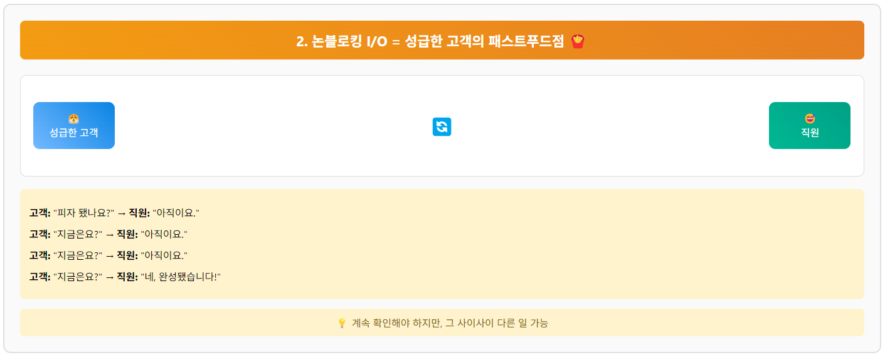
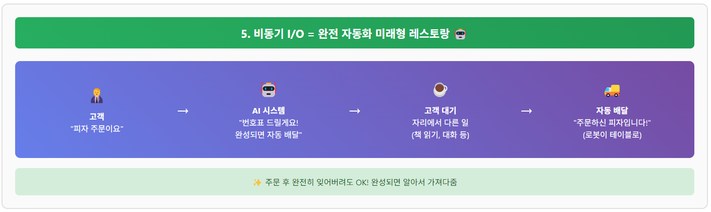

# 게임 서버 개발자가 알아야할 TCP/IP Windows 소켓 프로그래밍

저자: 최흥배, Claude AI  

- C++23
- Windows 11
- Visual Studio 2022 이상
  

-----  
# Chapter.9 소켓 입출력 모델

## 01 소켓 입출력 모델 개요
윈도우 환경에서의 네트워크 프로그래밍을 위한 다양한 소켓 입출력 모델에 대해 알아보겠습니다. 온라인 게임 서버와 같은 고성능 네트워크 애플리케이션 개발에 있어 적절한 입출력 모델의 선택은 매우 중요합니다.

### 윈도우에서 지원하는 소켓 입출력 모델
1. **블로킹(Blocking) 소켓**
   - 가장 기본적인 모델로, 작업이 완료될 때까지 대기
   - 구현이 간단하지만 다중 클라이언트 처리에 비효율적
   - 단일 클라이언트 처리나 멀티스레드 환경에서 활용

2. **넌블로킹(Non-blocking) 소켓**
   - 작업 완료 여부와 관계없이 즉시 반환
   - 반환 값과 오류 코드를 통해 작업 완료 여부 확인
   - 폴링(polling) 방식으로 지속적인 확인 필요

3. **I/O 멀티플렉싱(Multiplexing)**
   - **select**: 다수의 소켓을 모니터링하는 기본적인 방식
   - WSAPoll: select 모델의 확장 버전
   - WSAAsyncSelect: 윈도우 메시지를 활용한 비동기 처리

4. **비동기 I/O**
   - WSAEventSelect: 이벤트 객체를 활용한 비동기 모델
   - Overlapped I/O: 중첩 I/O 모델
   - **IOCP(I/O Completion Port)**: 고성능 서버를 위한 완성 포트 모델
  
   


### 🔌 소켓 입출력 모델 동작 다이어그램    
  
   
   
   
   
   
   
### 소켓 입출력 모델 선택 시 고려사항
- 처리해야 할 동시 연결 수
- 응답 시간 요구사항
- 개발 복잡도
- 리소스 사용량
- 확장성 요구사항

온라인 게임 서버와 같은 고성능 서버는 일반적으로 **IOCP** 모델을 활용하는 것이 권장됩니다.
  
  

## 02. 넌블로킹 소켓
넌블로킹 소켓을 사용한 기본적인 에코 서버를 구현해보겠습니다.  

   
   
  

### 🎯 주요 특징
1. **Single Thread**: 모든 소켓을 하나의 스레드에서 순차적으로 처리
2. **Non-Blocking**: `ioctlsocket(FIONBIO)`로 소켓을 즉시 반환하도록 설정
3. **Polling 방식**: 메인 루프에서 지속적으로 모든 소켓 상태 확인
4. **WSAEWOULDBLOCK**: 데이터가 없을 때 발생하는 정상적인 에러
 

### ⚙️ 작동 흐름
1. **연결 수락**: `accept()`가 즉시 반환, 새 클라이언트는 vector에 추가
2. **데이터 처리**: 모든 클라이언트 소켓에 `recv()` 시도
3. **에코 응답**: 받은 데이터를 `send()`로 즉시 전송
4. **CPU 절약**: `Sleep(1)`로 과도한 CPU 사용 방지
  

### 📊 장단점
- **장점**: 구현 단순, 적은 메모리 사용, 많은 동시 연결 가능
- **단점**: 높은 CPU 사용률(폴링), IOCP보다 낮은 성능


```cpp
#include <iostream>
#include <winsock2.h>
#include <ws2tcpip.h>
#include <vector>
#include <string>
#include <format>

#pragma comment(lib, "ws2_32.lib")

class NonBlockingServer {
private:
    SOCKET listenSocket;
    std::vector<SOCKET> clientSockets;
    
public:
    NonBlockingServer() : listenSocket(INVALID_SOCKET) {}
    
    ~NonBlockingServer() {
        for (auto& socket : clientSockets) {
            closesocket(socket);
        }
        if (listenSocket != INVALID_SOCKET) {
            closesocket(listenSocket);
        }
        WSACleanup();
    }
    
    bool Initialize(const std::string& port) {
        WSADATA wsaData;
        int result = WSAStartup(MAKEWORD(2, 2), &wsaData);
        if (result != 0) {
            std::cerr << std::format("WSAStartup 실패: {}\n", result);
            return false;
        }
        
        addrinfo hints{};
        hints.ai_family = AF_INET;
        hints.ai_socktype = SOCK_STREAM;
        hints.ai_protocol = IPPROTO_TCP;
        hints.ai_flags = AI_PASSIVE;
        
        addrinfo* addrResult = nullptr;
        result = getaddrinfo(nullptr, port.c_str(), &hints, &addrResult);
        if (result != 0) {
            std::cerr << std::format("getaddrinfo 실패: {}\n", gai_strerrorA(result));
            WSACleanup();
            return false;
        }
        
        listenSocket = socket(addrResult->ai_family, addrResult->ai_socktype, addrResult->ai_protocol);
        if (listenSocket == INVALID_SOCKET) {
            std::cerr << std::format("소켓 생성 실패: {}\n", WSAGetLastError());
            freeaddrinfo(addrResult);
            WSACleanup();
            return false;
        }
        
        // 소켓을 넌블로킹 모드로 설정
        u_long nonBlocking = 1;
        result = ioctlsocket(listenSocket, FIONBIO, &nonBlocking);
        if (result == SOCKET_ERROR) {
            std::cerr << std::format("ioctlsocket 실패: {}\n", WSAGetLastError());
            closesocket(listenSocket);
            freeaddrinfo(addrResult);
            WSACleanup();
            return false;
        }
        
        result = bind(listenSocket, addrResult->ai_addr, (int)addrResult->ai_addrlen);
        freeaddrinfo(addrResult);
        
        if (result == SOCKET_ERROR) {
            std::cerr << std::format("bind 실패: {}\n", WSAGetLastError());
            closesocket(listenSocket);
            WSACleanup();
            return false;
        }
        
        return true;
    }
    
    void Run() {
        if (listen(listenSocket, SOMAXCONN) == SOCKET_ERROR) {
            std::cerr << std::format("listen 실패: {}\n", WSAGetLastError());
            return;
        }
        
        std::cout << "서버가 시작되었습니다. 클라이언트 대기 중...\n";
        
        while (true) {
            // 새 클라이언트 연결 확인
            SOCKET clientSocket = accept(listenSocket, nullptr, nullptr);
            if (clientSocket != INVALID_SOCKET) {
                // 클라이언트 소켓도 넌블로킹으로 설정
                u_long nonBlocking = 1;
                int result = ioctlsocket(clientSocket, FIONBIO, &nonBlocking);
                if (result == SOCKET_ERROR) {
                    std::cerr << std::format("클라이언트 ioctlsocket 실패: {}\n", WSAGetLastError());
                    closesocket(clientSocket);
                }
                else {
                    clientSockets.push_back(clientSocket);
                    std::cout << std::format("새 클라이언트 연결: {}\n", clientSocket);
                }
            }
            else {
                // WSAEWOULDBLOCK 에러는 넌블로킹 소켓에서 정상적인 상황
                int error = WSAGetLastError();
                if (error != WSAEWOULDBLOCK) {
                    std::cerr << std::format("accept 실패: {}\n", error);
                }
            }
            
            // 모든 클라이언트 소켓 처리
            auto it = clientSockets.begin();
            while (it != clientSockets.end()) {
                SOCKET socket = *it;
                char buffer[4096];
                
                // 데이터 수신 시도
                int bytesReceived = recv(socket, buffer, sizeof(buffer), 0);
                
                if (bytesReceived > 0) {
                    // 데이터 수신 성공
                    buffer[bytesReceived] = '\0';
                    std::cout << std::format("데이터 수신 ({}바이트): {}\n", bytesReceived, buffer);
                    
                    // 에코: 받은 데이터 다시 전송
                    int bytesSent = 0;
                    while (bytesSent < bytesReceived) {
                        int result = send(socket, buffer + bytesSent, bytesReceived - bytesSent, 0);
                        if (result > 0) {
                            bytesSent += result;
                        }
                        else if (result == SOCKET_ERROR) {
                            int error = WSAGetLastError();
                            if (error != WSAEWOULDBLOCK) {
                                std::cerr << std::format("send 실패: {}\n", error);
                                break;
                            }
                        }
                    }
                    
                    ++it;
                }
                else if (bytesReceived == 0) {
                    // 클라이언트 연결 종료
                    std::cout << std::format("클라이언트 연결 종료: {}\n", socket);
                    closesocket(socket);
                    it = clientSockets.erase(it);
                }
                else {
                    // 에러 발생
                    int error = WSAGetLastError();
                    if (error == WSAEWOULDBLOCK) {
                        // 데이터가 아직 없음 - 정상
                        ++it;
                    }
                    else {
                        // 다른 에러 - 연결 종료
                        std::cerr << std::format("recv 실패: {}\n", error);
                        closesocket(socket);
                        it = clientSockets.erase(it);
                    }
                }
            }
            
            // CPU 사용률 절약을 위한 짧은 슬립
            Sleep(1);
        }
    }
};

int main() {
    NonBlockingServer server;
    
    if (server.Initialize("12345")) {
        server.Run();
    }
    
    return 0;
}
```
  

## 03 Select 모델
Select 모델은 가장 기본적인 I/O 멀티플렉싱 방식으로, 단일 스레드에서 여러 소켓을 모니터링할 수 있습니다.

### Select 모델의 기본 원리
Select 함수는 지정된 소켓 집합에서 읽기, 쓰기, 예외 상태를 확인하여 준비된 소켓만 반환합니다.  
  
  
   
    

### 에제코드: SelectServer
     
  
  
  
  
**핵심 동작 흐름:**
1. **초기화**: WSAStartup → 소켓 생성 → 바인딩
2. **리슨 시작**: listen() 호출 후 masterSet에 리슨 소켓 등록
3. **메인 루프**: 
   - `fd_set readSet = masterSet` (매번 복사)
   - `select()` 호출로 I/O 가능한 소켓들 대기
   - 준비된 소켓들을 순회하며 처리
  
**두 가지 주요 이벤트 처리:**
- **새 연결**: `socket == listenSocket`인 경우 → `accept()` → masterSet 추가
- **데이터 수신**: 기존 클라이언트 소켓 → `recv()` → `send()`로 에코
  
**중요한 구현 세부사항:**
- `std::vector<SOCKET> clientSockets`로 클라이언트 소켓 별도 관리
- 연결 종료 시 masterSet에서 `FD_CLR()`, 벡터에서도 제거
- C++20의 `std::format` 사용으로 현대적인 코드 스타일
- RAII 패턴으로 소멸자에서 자동 리소스 정리
  
  
```cpp
#include <iostream>
#include <winsock2.h>
#include <ws2tcpip.h>
#include <vector>
#include <string>
#include <format>

#pragma comment(lib, "ws2_32.lib")

class SelectServer {
private:
    SOCKET listenSocket;
    fd_set masterSet;
    std::vector<SOCKET> clientSockets;
    
public:
    SelectServer() : listenSocket(INVALID_SOCKET) {
        FD_ZERO(&masterSet);
    }
    
    ~SelectServer() {
        for (auto& socket : clientSockets) {
            closesocket(socket);
        }
        if (listenSocket != INVALID_SOCKET) {
            closesocket(listenSocket);
        }
        WSACleanup();
    }
    
    bool Initialize(const std::string& port) {
        WSADATA wsaData;
        int result = WSAStartup(MAKEWORD(2, 2), &wsaData);
        if (result != 0) {
            std::cerr << std::format("WSAStartup 실패: {}\n", result);
            return false;
        }
        
        addrinfo hints{};
        hints.ai_family = AF_INET;
        hints.ai_socktype = SOCK_STREAM;
        hints.ai_protocol = IPPROTO_TCP;
        hints.ai_flags = AI_PASSIVE;
        
        addrinfo* addrResult = nullptr;
        result = getaddrinfo(nullptr, port.c_str(), &hints, &addrResult);
        if (result != 0) {
            std::cerr << std::format("getaddrinfo 실패: {}\n", gai_strerrorA(result));
            WSACleanup();
            return false;
        }
        
        listenSocket = socket(addrResult->ai_family, addrResult->ai_socktype, addrResult->ai_protocol);
        if (listenSocket == INVALID_SOCKET) {
            std::cerr << std::format("소켓 생성 실패: {}\n", WSAGetLastError());
            freeaddrinfo(addrResult);
            WSACleanup();
            return false;
        }
        
        result = bind(listenSocket, addrResult->ai_addr, (int)addrResult->ai_addrlen);
        freeaddrinfo(addrResult);
        
        if (result == SOCKET_ERROR) {
            std::cerr << std::format("bind 실패: {}\n", WSAGetLastError());
            closesocket(listenSocket);
            WSACleanup();
            return false;
        }
        
        return true;
    }
    
    void Run() {
        if (listen(listenSocket, SOMAXCONN) == SOCKET_ERROR) {
            std::cerr << std::format("listen 실패: {}\n", WSAGetLastError());
            return;
        }
        
        // 리슨 소켓을 마스터 세트에 추가
        FD_SET(listenSocket, &masterSet);
        
        std::cout << "서버가 시작되었습니다. 클라이언트 대기 중...\n";
        
        while (true) {
            fd_set readSet = masterSet;
            
            // select 함수로 소켓 상태 모니터링
            int socketCount = select(0, &readSet, nullptr, nullptr, nullptr);
            
            if (socketCount == SOCKET_ERROR) {
                std::cerr << std::format("select 실패: {}\n", WSAGetLastError());
                break;
            }
            
            // 모든 소켓 확인
            for (int i = 0; i < readSet.fd_count; i++) {
                SOCKET socket = readSet.fd_array[i];
                
                if (socket == listenSocket) {
                    // 새 연결 수락
                    SOCKET clientSocket = accept(listenSocket, nullptr, nullptr);
                    if (clientSocket == INVALID_SOCKET) {
                        std::cerr << std::format("accept 실패: {}\n", WSAGetLastError());
                        continue;
                    }
                    
                    // 새 클라이언트 소켓을 마스터 세트에 추가
                    FD_SET(clientSocket, &masterSet);
                    clientSockets.push_back(clientSocket);
                    
                    std::cout << std::format("새 클라이언트 연결: {}\n", clientSocket);
                }
                else {
                    // 기존 클라이언트로부터 데이터 수신
                    char buffer[4096];
                    int bytesReceived = recv(socket, buffer, sizeof(buffer), 0);
                    
                    if (bytesReceived <= 0) {
                        // 연결 종료 또는 오류
                        if (bytesReceived == 0) {
                            std::cout << std::format("클라이언트 연결 종료: {}\n", socket);
                        }
                        else {
                            std::cerr << std::format("recv 실패: {}\n", WSAGetLastError());
                        }
                        
                        // 소켓 정리
                        closesocket(socket);
                        FD_CLR(socket, &masterSet);
                        
                        // clientSockets 벡터에서 제거
                        auto it = std::find(clientSockets.begin(), clientSockets.end(), socket);
                        if (it != clientSockets.end()) {
                            clientSockets.erase(it);
                        }
                    }
                    else {
                        // 에코 서버: 받은 데이터를 다시 전송
                        buffer[bytesReceived] = '\0';
                        std::cout << std::format("데이터 수신 ({}바이트): {}\n", bytesReceived, buffer);
                        
                        int bytesSent = send(socket, buffer, bytesReceived, 0);
                        if (bytesSent == SOCKET_ERROR) {
                            std::cerr << std::format("send 실패: {}\n", WSAGetLastError());
                        }
                    }
                }
            }
        }
    }
};
```

### Select 모델의 장단점
**장점:**
- 구현이 비교적 간단함
- 단일 스레드에서 여러 클라이언트 처리 가능
- 크로스 플랫폼 호환성이 좋음

**단점:**
- 소켓 수가 많아지면 성능이 급격히 저하됨 (O(n) 복잡도)
- Windows에서 최대 64개의 소켓만 처리 가능 (FD_SETSIZE 제한)
- 대규모 연결에는 적합하지 않음
    
 
### FD_SETSIZE 의 최대 크기

#### Windows
- 기본값: **64개**
- 컴파일 시 `#define FD_SETSIZE 128` 같은 방식으로 쉽게 변경 가능
- 실제로는 64K까지도 설정 가능하다고 함
  
```cpp
// winsock2.h 포함 전에 정의하면 됨
#define FD_SETSIZE 1024  // 64 → 1024로 증가
#include <winsock2.h>
```
  
#### Linux
**기본값**: 1024 (대부분의 리눅스 배포판)
**이론적 최대값**: 일반적으로 65536 (64K)까지 확장 가능하지만, 실제로는 더 제한적입니다.

##### 확장 방법과 한계

###### 1. 컴파일 타임 확장
```c
#define FD_SETSIZE 4096
#include <sys/select.h>
```

###### 2. 실제 한계 요인들

**메모리 제약**:
- fd_set 구조체 크기 = FD_SETSIZE / 8 바이트
- FD_SETSIZE 65536 → fd_set 크기 8KB
- select() 호출마다 3개의 fd_set (read, write, except) 복사 필요

**성능 저하**:
- FD_SETSIZE가 클수록 select() 성능 급격히 저하
- O(n) 복잡도로 모든 FD를 순회해야 함
- 일반적으로 1024~4096 이상에서는 성능 문제 발생

###### 3. 시스템 한계 확인 방법

```bash
# 프로세스당 최대 파일 디스크립터 수 확인
ulimit -n

# 시스템 전체 최대 파일 디스크립터 수
cat /proc/sys/fs/file-max

# 현재 사용 중인 파일 디스크립터 수
cat /proc/sys/fs/file-nr
```

###### 권장 최대값
- **일반적인 경우**: 4096 이하
- **고성능이 필요한 경우**: 1024 이하 또는 다른 모델 사용

###### 대안 솔루션
FD_SETSIZE를 크게 늘리는 대신 더 효율적인 I/O 모델 사용을 권장합니다:

1. **epoll** (리눅스 고유)
   - 최대 약 100만 개의 FD 처리 가능
   - O(1) 성능

2. **poll**
   - FD_SETSIZE 제한 없음
   - 하지만 여전히 O(n) 성능

3. **io_uring** (리눅스 5.1+)
   - 최신 비동기 I/O 인터페이스
   - 최고 성능

###### 결론
기술적으로는 FD_SETSIZE를 65536까지 늘릴 수 있지만, **실용적으로는 4096 이하를 권장**합니다. 더 많은 연결을 처리해야 한다면 `epoll`이나 `io_uring` 같은 현대적인 I/O 모델을 사용하는 것이 훨씬 효율적입니다.

  

## 비동기 I/O  
  
   

### 비동기 I/O 실생활 비유 다이어그램
  
   
   
   
   
     
     


### 비동기 I/O가 게임 서버 성능에 미치는 영향
  
     
  
  
## 04 IOCP 모델
**"IOCP는 Input/Output Completion Port의 줄임말로, 윈도우에서 제공하는 고성능 비동기 I/O 모델입니다."**

**핵심 특징 3가지:**
- **완료 기반(Completion-based)**: I/O 작업이 완료되면 알려줌
- **커널 레벨 큐**: 운영체제가 직접 관리하는 효율적인 큐 시스템
- **워커 스레드 풀**: 제한된 수의 스레드로 많은 연결을 처리

### 2단계: 동작 원리 설명 

```
1. I/O 요청 단계
   - WSARecv(), WSASend() 등으로 비동기 I/O 요청
   - 함수는 즉시 반환 (블록되지 않음)

2. 백그라운드 처리
   - 커널이 백그라운드에서 실제 I/O 작업 수행
   - 애플리케이션은 다른 작업 계속 가능

3. 완료 통지
   - I/O 완료 시 결과를 Completion Port 큐에 삽입
   - 성공/실패, 전송된 바이트 수 등 정보 포함

4. 워커 스레드 처리
   - GetQueuedCompletionStatus()로 완료된 I/O 결과 획득
   - 워커 스레드가 후속 비즈니스 로직 처리
```

### 3단계: 왜 뛰어난지 설명

#### **성능 면에서:**
- **O(1) 복잡도**: select는 O(n), IOCP는 상수 시간
- **커널 최적화**: 운영체제 레벨에서 최적화된 구조
- **메모리 효율성**: fd_set 복사 불필요, 큐 기반 처리

#### **확장성 면에서:**
- **동시 연결 수**: 수만~수십만 연결 처리 가능
- **스레드 효율성**: 연결 수와 무관하게 고정된 워커 스레드 수
- **CPU 코어 활용**: 멀티코어 시스템에서 최적의 성능

#### **게임 서버에 최적인 이유:**
- **낮은 지연시간**: 실시간 게임에 필수
- **높은 처리량**: 대규모 동시 사용자 지원
- **안정성**: 커널 레벨 보장으로 안정적


### Q&A 
 
#### Q: "IOCP의 단점은 없나요?"
**A:** "네, 몇 가지 제약이 있습니다."
- **윈도우 전용**: 플랫폼 종속성 (리눅스는 epoll 사용)
- **복잡성**: 구현이 select보다 복잡함
- **디버깅**: 비동기 특성상 디버깅이 어려움
- **오버헤드**: 적은 연결 수에서는 오히려 비효율적일 수 있음

#### Q: "워커 스레드는 몇 개가 적당한가요?"
**A:** "일반적으로 **CPU 코어 수 × 2** 정도가 권장됩니다."
- CPU 집약적 작업: CPU 코어 수와 동일
- I/O 집약적 작업: CPU 코어 수 × 2~4
- 실제로는 성능 테스트를 통해 최적값 찾아야 함

#### Q: "다른 플랫폼에서는 뭘 사용하나요?"
**A:**
- **리눅스**: epoll, io_uring
- **macOS**: kqueue
- **크로스 플랫폼**: libevent, libuv 같은 라이브러리


### 스레드 효율성: 연결 수와 무관하게 고정된 워커 스레드 수

#### **기존 모델의 문제점**
**Thread-per-Connection 모델:**
```
클라이언트 1 ←→ 스레드 1
클라이언트 2 ←→ 스레드 2  
클라이언트 3 ←→ 스레드 3
...
클라이언트 10,000 ←→ 스레드 10,000
```

**문제점:**
- **메모리 폭증**: 스레드 하나당 스택 메모리 1~8MB 필요
  - 10,000 연결 = 10GB~80GB 메모리 사용!
- **컨텍스트 스위칭 오버헤드**: 스레드 전환 비용 급증
- **스케줄링 부담**: OS가 관리해야 할 스레드 수 폭증

#### **IOCP 모델의 해결**
**고정된 워커 스레드 풀:**
```
워커 스레드 1 ┐
워커 스레드 2 ├─→ IOCP 큐 ←─ 클라이언트 1~10,000
워커 스레드 3 ┘
```

**핵심 아이디어:**
```c++
// 전통적인 방식 (BAD)
for(int i = 0; i < clientCount; i++) {
    CreateThread(HandleClient, clients[i]);  // 클라이언트 수만큼 스레드 생성
}

// IOCP 방식 (GOOD)
const int WORKER_THREADS = GetSystemInfo().dwNumberOfProcessors * 2;
for(int i = 0; i < WORKER_THREADS; i++) {
    CreateThread(WorkerThread, completionPort);  // 고정된 수의 워커 스레드
}
```

#### **실제 숫자로 보는 효율성**

| 연결 수 | Thread-per-Connection | IOCP |
|---------|----------------------|------|
| 1,000명 | 1,000개 스레드 (1~8GB) | 8개 스레드 (8~64MB) |
| 10,000명 | 10,000개 스레드 (10~80GB) | 8개 스레드 (8~64MB) |
| 100,000명 | 불가능 (메모리 부족) | 8개 스레드 (8~64MB) |


### CPU 코어 활용: 멀티코어 시스템에서 최적의 성능

#### IOCP의 스마트한 작업 분산
**자동 로드 밸런싱:**
```
CPU Core 1: 워커 스레드 1, 2
CPU Core 2: 워커 스레드 3, 4  
CPU Core 3: 워커 스레드 5, 6
CPU Core 4: 워커 스레드 7, 8

IOCP 큐에서 완료된 I/O를 가장 여유로운 워커 스레드가 자동으로 처리
```

#### **GetQueuedCompletionStatus()의 스마트함**

```c++
// 여러 워커 스레드가 동시에 대기
DWORD WorkerThread(LPVOID param) {
    while(true) {
        DWORD bytesTransferred;
        OVERLAPPED* overlapped;
        SOCKET clientSocket;
        
        // 이 함수가 스마트하게 작업을 분산함
        BOOL result = GetQueuedCompletionStatus(
            completionPort,           // IOCP 핸들
            &bytesTransferred,        // 전송된 바이트
            (PULONG_PTR)&clientSocket,// 완료된 소켓
            &overlapped,              // 완료된 작업
            INFINITE                  // 무한 대기
        );
        
        if(result) {
            // 이 워커 스레드가 이 작업을 처리
            ProcessCompletedIO(clientSocket, bytesTransferred, overlapped);
        }
    }
}
```

#### **왜 최적의 성능일까?**
**1. 워크 스틸링 (Work Stealing) 효과**
```
상황: Core 1은 바쁘고, Core 2는 여유로움

기존 방식:
Core 1: [작업1][작업2][작업3] ← 대기열 길어짐
Core 2: [      비어있음      ] ← 놀고 있음

IOCP 방식:
Core 1: [작업1] ← IOCP 큐에서 가져옴
Core 2: [작업2] ← IOCP 큐에서 가져옴 (자동 분산!)
```

**2. NUMA (Non-Uniform Memory Access) 최적화**
```
대용량 서버에서:
CPU 소켓 1 (Core 1-8) ←→ 메모리 뱅크 1
CPU 소켓 2 (Core 9-16) ←→ 메모리 뱅크 2

IOCP는 같은 소켓의 코어와 메모리를 함께 사용하도록 최적화
→ 메모리 접근 속도 향상
```

    
### IOCP (I/O Completion Port) 아키텍처  
  
```
┌─────────────────────────────────────────────────────────────────┐
│                      응용 프로그램                                │
│                                                                 │
│  스레드1    스레드2    스레드3    스레드4    ... 워커 스레드 풀       │
│    │         │         │         │                              │
│    └─────────┼─────────┼─────────┼─────────────┐                │
└──────────────┼─────────┼─────────┼─────────────┼────────────────┘
               │         │         │             │
               ▼         ▼         ▼             ▼
┌─────────────────────────────────────────────────────────────────┐
│            GetQueuedCompletionStatus() 호출                      │
│                     (블로킹 대기)                                 │
└─────────────────────────────────────────────────────────────────┘
               ▲
               │ 완료 통지
               │
┌─────────────────────────────────────────────────────────────────┐
│                   I/O Completion Port                           │
│                      (커널 객체)                                 │
│                                                                 │
│  ┌─────────────────┐  ┌─────────────────┐  ┌─────────────────┐  │
│  │   완료된 I/O     │  │   완료된 I/O     │  │   완료된 I/O     │ │
│  │   작업 큐        │  │   작업 큐        │  │   작업 큐        │ │
│  │                 │  │                 │  │                 │ │
│  │ [소켓A-수신완료]  │  │ [소켓B-송신완료]  │  │ [소켓C-연결완료]  │ │
│  │ [소켓D-수신완료]  │  │ [소켓E-송신완료]  │  │ [소켓F-오류발생]  │ │
│  └─────────────────┘  └─────────────────┘  └─────────────────┘ │
└─────────────────────────────────────────────────────────────────┘
               ▲
               │ I/O 완료 통지
               │
┌─────────────────────────────────────────────────────────────────┐
│                      커널 영역                                   │
│                                                                 │
│  소켓1 ◄──── 비동기 수신 작업 진행중                                │
│  소켓2 ◄──── 비동기 송신 작업 진행중                                │
│  소켓3 ◄──── 비동기 연결 작업 진행중                                │
│  소켓4 ◄──── 비동기 수신 작업 진행중                                │
│                                                                 │
└─────────────────────────────────────────────────────────────────┘
```

**IOCP 동작 과정:**

**1단계 - IOCP 생성 및 소켓 연결**
```
CreateIoCompletionPort() 호출
         │
         ▼
┌─────────────────┐
│   IOCP 객체      │ ◄─── 소켓들을 IOCP에 연결
│    생성          │      CreateIoCompletionPort(소켓, IOCP, ...)
└─────────────────┘
```

**2단계 - 비동기 I/O 작업 시작**
```
┌─────────────────────────────────────────────────────────────┐
│                비동기 I/O 작업 시작                           │
│                                                             │
│  WSARecv()     WSASend()     AcceptEx()     ConnectEx()     │
│     │             │             │             │             │
│     ▼             ▼             ▼             ▼             │
│  즉시 반환      즉시 반환      즉시 반환      즉시 반환          │
│ (WSA_IO_       (WSA_IO_       (WSA_IO_       (WSA_IO_      │
│  PENDING)       PENDING)       PENDING)       PENDING)     │
└─────────────────────────────────────────────────────────────┘
```

**3단계 - 워커 스레드의 완료 대기**
```
워커 스레드 풀
┌─────────┐  ┌─────────┐  ┌─────────┐  ┌─────────┐
│스레드 1  │  │스레드 2  │  │스레드 3  │  │스레드 4  │
└────┬────┘  └────┬────┘  └────┬────┘  └────┬────┘
     │            │            │            │
     └────────────┼────────────┼────────────┘
                  │            │
                  ▼            ▼
         GetQueuedCompletionStatus()
              (블로킹 대기)
```

**4단계 - I/O 완료 처리**
```
I/O 작업 완료!
┌─────────────────────────────────────────────────────────────┐
│                    커널에서 IOCP로                            │
│                                                             │
│  완료된 작업 정보:                                            │
│  • 전송된 바이트 수                                           │
│  • 오버랩 구조체 포인터                                        │
│  • 완료 키 (Completion Key)                                  │
│  • 오류 코드                                                 │
│                                                             │
└─────────────────────┬───────────────────────────────────────┘
                      │
                      ▼
┌─────────────────────────────────────────────────────────────┐
│              워커 스레드가 깨어남                              │
│                                                             │
│  GetQueuedCompletionStatus() 반환                            │
│  • dwNumberOfBytes: 전송 바이트                               │
│  • lpOverlapped: 오버랩 구조체                                │
│  • lpCompletionKey: 완료 키                                   │
│                                                             │
└─────────────────────────────────────────────────────────────┘
```

**IOCP의 주요 특징:**

**확장성 (Scalability)**
```
        클라이언트 수
             ▲
             │     IOCP
             │    ┌─────
             │   ╱
             │  ╱
             │ ╱
             │╱     Select 모델
             └─────────────────► 성능
            낮은 성능          높은 성능
```

**비동기 처리 방식**
```
동기 방식 (Select):
응용프로그램 ──► I/O 요청 ──► 대기 ──► 완료 ──► 처리

비동기 방식 (IOCP):
응용프로그램 ──► I/O 요청 ──► 즉시 반환
      │                        ▲
      ▼                        │
   다른 작업 수행 ──────────► 완료 통지 받음
```
  

### IOCP 프로그래밍 기초 

#### 1. 핵심 IOCP API 개요

```cpp
// 주요 IOCP API들
HANDLE CreateIoCompletionPort(
    HANDLE FileHandle,           // 소켓 핸들
    HANDLE ExistingCompletionPort, // 기존 IOCP 핸들
    ULONG_PTR CompletionKey,     // 완료 키
    DWORD NumberOfConcurrentThreads // 동시 실행 스레드 수
);

BOOL GetQueuedCompletionStatus(
    HANDLE CompletionPort,       // IOCP 핸들
    LPDWORD lpNumberOfBytes,     // 전송된 바이트 수
    PULONG_PTR lpCompletionKey,  // 완료 키
    LPOVERLAPPED* lpOverlapped,  // 오버랩 구조체
    DWORD dwMilliseconds         // 타임아웃
);

// 비동기 소켓 API들
int WSARecv(...);
int WSASend(...);
BOOL AcceptEx(...);
BOOL ConnectEx(...);
```

#### 2. 단계별 IOCP 구현

##### 2.1 IOCP 객체 생성 및 초기화

```cpp
class IOCPServer {
private:
    HANDLE m_hIOCP;              // IOCP 핸들
    std::vector<HANDLE> m_workerThreads;  // 워커 스레드들
    
public:
    bool InitializeIOCP() {
        // 1. IOCP 객체 생성
        m_hIOCP = CreateIoCompletionPort(
            INVALID_HANDLE_VALUE,    // 새 IOCP 생성
            NULL,                    // 기존 IOCP 없음
            0,                       // 완료 키 (나중에 설정)
            0                        // 시스템이 자동으로 스레드 수 결정
        );
        
        if (m_hIOCP == NULL) {
            printf("CreateIoCompletionPort failed: %d\n", GetLastError());
            return false;
        }
        
        // 2. 워커 스레드 생성
        SYSTEM_INFO sysInfo;
        GetSystemInfo(&sysInfo);
        int threadCount = sysInfo.dwNumberOfProcessors * 2;
        
        for (int i = 0; i < threadCount; ++i) {
            HANDLE hThread = CreateThread(
                NULL, 0, WorkerThread, this, 0, NULL
            );
            m_workerThreads.push_back(hThread);
        }
        
        return true;
    }
};
```  

   
 

##### 2.2 소켓을 IOCP에 연결

```cpp
// 클라이언트 정보를 담는 구조체
struct ClientInfo {
    SOCKET socket;
    SOCKADDR_IN addr;
    char recvBuffer[1024];
    WSAOVERLAPPED overlapped;
    WSABUF wsaBuf;
    DWORD recvBytes;
    DWORD flags;
};

bool AssociateWithIOCP(SOCKET clientSocket) {
    // 클라이언트 정보 객체 생성
    ClientInfo* pClientInfo = new ClientInfo;
    ZeroMemory(pClientInfo, sizeof(ClientInfo));
    pClientInfo->socket = clientSocket;
    
    // 소켓을 IOCP에 연결
    HANDLE hResult = CreateIoCompletionPort(
        (HANDLE)clientSocket,        // 소켓 핸들
        m_hIOCP,                     // 기존 IOCP 핸들
        (ULONG_PTR)pClientInfo,      // 완료 키 (클라이언트 정보)
        0                            // 스레드 수 (이미 설정됨)
    );
    
    if (hResult != m_hIOCP) {
        printf("소켓을 IOCP에 연결 실패: %d\n", GetLastError());
        delete pClientInfo;
        return false;
    }
    
    // 첫 번째 비동기 수신 작업 시작
    return PostRecv(pClientInfo);
}
```

##### 2.3 비동기 수신 작업 시작

```cpp
bool PostRecv(ClientInfo* pClientInfo) {
    // 오버랩 구조체 초기화
    ZeroMemory(&pClientInfo->overlapped, sizeof(WSAOVERLAPPED));
    
    // WSABUF 설정
    pClientInfo->wsaBuf.buf = pClientInfo->recvBuffer;
    pClientInfo->wsaBuf.len = sizeof(pClientInfo->recvBuffer);
    
    // 플래그 설정
    pClientInfo->flags = 0;
    
    // 비동기 수신 시작
    int result = WSARecv(
        pClientInfo->socket,         // 소켓
        &pClientInfo->wsaBuf,        // 버퍼 정보
        1,                           // 버퍼 개수
        &pClientInfo->recvBytes,     // 수신된 바이트 수
        &pClientInfo->flags,         // 플래그
        &pClientInfo->overlapped,    // 오버랩 구조체
        NULL                         // 완료 루틴 (IOCP 사용시 NULL)
    );
    
    // WSARecv는 즉시 완료되거나 WSA_IO_PENDING 반환
    if (result == SOCKET_ERROR) {
        int error = WSAGetLastError();
        if (error != WSA_IO_PENDING) {
            printf("WSARecv 실패: %d\n", error);
            return false;
        }
    }
    
    return true;
}
```

##### 2.4 비동기 송신 작업

```cpp
bool PostSend(ClientInfo* pClientInfo, const char* data, int dataLen) {
    // 송신용 오버랩 구조체 (별도로 할당)
    WSAOVERLAPPED* pSendOverlapped = new WSAOVERLAPPED;
    ZeroMemory(pSendOverlapped, sizeof(WSAOVERLAPPED));
    
    // 송신 데이터 복사 (비동기이므로 데이터 보존 필요)
    char* pSendBuffer = new char[dataLen];
    memcpy(pSendBuffer, data, dataLen);
    
    WSABUF sendBuf;
    sendBuf.buf = pSendBuffer;
    sendBuf.len = dataLen;
    
    DWORD sendBytes = 0;
    
    int result = WSASend(
        pClientInfo->socket,
        &sendBuf,
        1,
        &sendBytes,
        0,
        pSendOverlapped,
        NULL
    );
    
    if (result == SOCKET_ERROR) {
        int error = WSAGetLastError();
        if (error != WSA_IO_PENDING) {
            printf("WSASend 실패: %d\n", error);
            delete[] pSendBuffer;
            delete pSendOverlapped;
            return false;
        }
    }
    
    return true;
}
```

##### 2.5 워커 스레드 구현

```cpp
static DWORD WINAPI WorkerThread(LPVOID lpParam) {
    IOCPServer* pServer = (IOCPServer*)lpParam;
    HANDLE hIOCP = pServer->m_hIOCP;
    
    DWORD bytesTransferred = 0;
    ClientInfo* pClientInfo = nullptr;
    WSAOVERLAPPED* pOverlapped = nullptr;
    
    while (true) {
        // 완료된 I/O 작업 대기
        BOOL result = GetQueuedCompletionStatus(
            hIOCP,                           // IOCP 핸들
            &bytesTransferred,               // 전송된 바이트 수
            (PULONG_PTR)&pClientInfo,        // 완료 키 (클라이언트 정보)
            &pOverlapped,                    // 오버랩 구조체
            INFINITE                         // 무한 대기
        );
        
        // 서버 종료 신호 처리
        if (pClientInfo == nullptr) {
            break;
        }
        
        // I/O 작업 실패 처리
        if (!result || bytesTransferred == 0) {
            printf("클라이언트 연결 종료\n");
            pServer->DisconnectClient(pClientInfo);
            continue;
        }
        
        // 수신 작업 완료 처리
        if (pOverlapped == &pClientInfo->overlapped) {
            pServer->ProcessRecv(pClientInfo, bytesTransferred);
        }
        // 송신 작업 완료 처리 (별도 오버랩 구조체)
        else {
            pServer->ProcessSend(pOverlapped);
        }
    }
    
    return 0;
}
```  
[IOCP 워커 스레드 동작 과정](https://poe.com/preview/Kpot06Ia8Gxsget1hf94 )  
  

##### 2.6 I/O 완료 처리

```cpp
void ProcessRecv(ClientInfo* pClientInfo, DWORD bytesTransferred) {
    // 수신된 데이터 처리
    pClientInfo->recvBuffer[bytesTransferred] = '\0';
    printf("수신: %s\n", pClientInfo->recvBuffer);
    
    // 에코 서버 예제: 받은 데이터를 그대로 송신
    PostSend(pClientInfo, pClientInfo->recvBuffer, bytesTransferred);
    
    // 다음 수신 작업 시작
    PostRecv(pClientInfo);
}

void ProcessSend(WSAOVERLAPPED* pOverlapped) {
    // 송신 완료 후 메모리 정리
    // 오버랩 구조체에서 버퍼 포인터를 얻어야 함
    // (실제로는 커스텀 오버랩 구조체 사용 권장)
    
    delete pOverlapped;
    // 송신 버퍼도 함께 해제해야 함 (별도 관리 필요)
}
```

##### 2.7 AcceptEx를 이용한 비동기 Accept

```cpp
bool PostAccept() {
    SOCKET acceptSocket = WSASocket(
        AF_INET, SOCK_STREAM, IPPROTO_TCP, 
        NULL, 0, WSA_FLAG_OVERLAPPED
    );
    
    if (acceptSocket == INVALID_SOCKET) {
        return false;
    }
    
    // AcceptEx용 오버랩 구조체
    WSAOVERLAPPED* pAcceptOverlapped = new WSAOVERLAPPED;
    ZeroMemory(pAcceptOverlapped, sizeof(WSAOVERLAPPED));
    
    // AcceptEx용 버퍼 (주소 정보 저장용)
    char* pAcceptBuffer = new char[1024];
    
    DWORD bytesReceived = 0;
    BOOL result = AcceptEx(
        m_listenSocket,              // 리슨 소켓
        acceptSocket,                // 새 클라이언트 소켓
        pAcceptBuffer,               // 주소 정보 버퍼
        0,                           // 데이터 수신 길이 (0 = 연결만)
        sizeof(SOCKADDR_IN) + 16,    // 로컬 주소 크기
        sizeof(SOCKADDR_IN) + 16,    // 원격 주소 크기
        &bytesReceived,              // 수신된 바이트
        pAcceptOverlapped            // 오버랩 구조체
    );
    
    if (!result) {
        int error = WSAGetLastError();
        if (error != WSA_IO_PENDING) {
            printf("AcceptEx 실패: %d\n", error);
            closesocket(acceptSocket);
            delete pAcceptOverlapped;
            delete[] pAcceptBuffer;
            return false;
        }
    }
    
    return true;
}
```

#### 3. 고급 활용 팁

##### 3.1 커스텀 오버랩 구조체

```cpp
// 확장된 오버랩 구조체
struct ExtendedOverlapped {
    WSAOVERLAPPED overlapped;
    enum IOType { IO_RECV, IO_SEND, IO_ACCEPT } ioType;
    char* buffer;
    int bufferLen;
    ClientInfo* pClientInfo;
};
```

##### 3.2 메모리 풀 사용

```cpp
class MemoryPool {
private:
    std::queue<ClientInfo*> m_clientPool;
    std::mutex m_mutex;
    
public:
    ClientInfo* Allocate() {
        std::lock_guard<std::mutex> lock(m_mutex);
        if (m_clientPool.empty()) {
            return new ClientInfo;
        }
        ClientInfo* pClient = m_clientPool.front();
        m_clientPool.pop();
        return pClient;
    }
    
    void Deallocate(ClientInfo* pClient) {
        std::lock_guard<std::mutex> lock(m_mutex);
        ZeroMemory(pClient, sizeof(ClientInfo));
        m_clientPool.push(pClient);
    }
};
```

##### 3.3 PostQueuedCompletionStatus 활용

```cpp
// 서버 종료시 워커 스레드들에게 종료 신호 전송
void Shutdown() {
    for (size_t i = 0; i < m_workerThreads.size(); ++i) {
        PostQueuedCompletionStatus(m_hIOCP, 0, 0, nullptr);
    }
    
    // 모든 워커 스레드 종료 대기
    WaitForMultipleObjects(
        m_workerThreads.size(), 
        m_workerThreads.data(), 
        TRUE, 
        INFINITE
    );
}
```


#### IOCP 예제 코드
  
  


`codes/first_IOCP`에는 아래와 코드는 동일하지만 헤더와 cpp로 파일이 분리 되어 있습니다.  

```cpp
#include <iostream>
#include <winsock2.h> // 윈도우 소켓 프로그래밍 기본 헤더
#include <ws2tcpip.h> // TCP/IP 프로토콜 관련 헤더
#include <mswsock.h>  // AcceptEx 등 확장 함수 헤더
#include <windows.h>  // 윈도우 API 기본 헤더
#include <vector>     // 동적 배열 사용
#include <string>     // 문자열 사용
#include <thread>     // 스레드 사용
#include <memory>     // 스마트 포인터 사용 (shared_ptr)
#include <format>     // C++20 문자열 포매팅

// 라이브러리 링크
#pragma comment(lib, "ws2_32.lib") // Winsock2 라이브러리
#pragma comment(lib, "mswsock.lib") // Mswsock 라이브러리 (AcceptEx 등)

// 상수 정의
constexpr int BUFFER_SIZE = 4096; // I/O 작업 시 사용할 버퍼 크기

// IOCP 연산 타입 정의 (어떤 종류의 I/O 작업인지 구분)
enum class IOType {
    ACCEPT, // 클라이언트 접속 요청 수락
    RECV,   // 데이터 수신
    SEND    // 데이터 송신
};

// IOCP에서 사용할 확장 OVERLAPPED 구조체
// 비동기 I/O 작업의 상태와 정보를 담음
struct IOContext {
    OVERLAPPED overlapped;      // 비동기 I/O 작업 상태를 저장하는 구조체 (필수)
    WSABUF wsaBuf;              // 데이터 버퍼 정보 (버퍼 포인터, 길이)
    IOType ioType;              // I/O 작업 종류 (ACCEPT, RECV, SEND)
    SOCKET socket;              // 작업과 관련된 소켓 (주로 Accept 작업 시 사용)
    char buffer[BUFFER_SIZE];   // 실제 데이터가 저장되는 버퍼

    // 생성자: I/O 타입과 소켓 초기화, 메모리 초기화
    IOContext(IOType type) : ioType(type), socket(INVALID_SOCKET) {
        ZeroMemory(&overlapped, sizeof(OVERLAPPED)); // overlapped 구조체 0으로 초기화
        ZeroMemory(buffer, BUFFER_SIZE);            // 데이터 버퍼 0으로 초기화
        wsaBuf.buf = buffer;                        // wsaBuf의 버퍼 포인터를 내부 버퍼로 설정
        wsaBuf.len = BUFFER_SIZE;                   // wsaBuf의 길이를 버퍼 크기로 설정
    }

    // 소멸자: 소켓이 유효하면 닫음
    ~IOContext() {
        if (socket != INVALID_SOCKET) {
            closesocket(socket);
            socket = INVALID_SOCKET;
        }
    }
};

// 클라이언트 정보 구조체
// 연결된 각 클라이언트의 정보를 관리
struct ClientInfo {
    SOCKET socket;                          // 클라이언트와 통신하는 소켓
    SOCKADDR_IN clientAddr;                 // 클라이언트 주소 정보
    std::shared_ptr<IOContext> recvContext; // 데이터 수신용 IOContext
    std::shared_ptr<IOContext> sendContext; // 데이터 송신용 IOContext

    // 생성자: 소켓 및 주소 정보 초기화
    ClientInfo() : socket(INVALID_SOCKET) {
        ZeroMemory(&clientAddr, sizeof(clientAddr));
    }

    // 소멸자: 소켓이 유효하면 닫음
    ~ClientInfo() {
        if (socket != INVALID_SOCKET) {
            closesocket(socket);
            socket = INVALID_SOCKET;
        }
    }
};

// IOCP 서버 클래스
class IOCPServer {
private:
    SOCKET listenSocket;                   // 클라이언트 연결 요청을 받는 리슨 소켓
    HANDLE iocpHandle;                     // IOCP 커널 객체 핸들
    std::vector<std::thread> workerThreads; // I/O 작업을 처리하는 워커 스레드들
    bool isRunning;                        // 서버 실행 상태 플래그
    LPFN_ACCEPTEX lpfnAcceptEx;             // AcceptEx 함수 포인터 (동적으로 로드)

public:
    // 생성자: 멤버 변수 초기화
    IOCPServer() : listenSocket(INVALID_SOCKET), iocpHandle(NULL), isRunning(false), lpfnAcceptEx(nullptr) {}

    // 소멸자: 서버 중지 및 자원 해제
    ~IOCPServer() {
        Stop(); // 서버 실행 중지
        if (listenSocket != INVALID_SOCKET) {
            closesocket(listenSocket); // 리슨 소켓 닫기
        }
        if (iocpHandle != NULL) {
            CloseHandle(iocpHandle); // IOCP 핸들 닫기
        }
        WSACleanup(); // Winsock 라이브러리 정리
    }

    // 서버 초기화 함수
    bool Initialize(const std::string& port, int workerThreadCount) {
        WSADATA wsaData;
        // Winsock 라이브러리 초기화 (버전 2.2)
        int result = WSAStartup(MAKEWORD(2, 2), &wsaData);
        if (result != 0) {
            std::cerr << std::format("WSAStartup 실패: {}\n", result);
            return false;
        }

        // 리슨 소켓 생성 (TCP, Overlapped I/O 사용)
        listenSocket = WSASocket(AF_INET, SOCK_STREAM, IPPROTO_TCP, NULL, 0, WSA_FLAG_OVERLAPPED);
        if (listenSocket == INVALID_SOCKET) {
            std::cerr << std::format("소켓 생성 실패: {}\n", WSAGetLastError());
            WSACleanup();
            return false;
        }

        // 서버 주소 설정 (IP: 모든 주소, Port: 입력받은 포트)
        SOCKADDR_IN serverAddr;
        serverAddr.sin_family = AF_INET;
        serverAddr.sin_addr.s_addr = htonl(INADDR_ANY); // 모든 IP 주소에서 오는 연결 허용
        serverAddr.sin_port = htons(std::stoi(port));   // 문자열 포트를 정수로 변환 후 네트워크 바이트 순서로 변경

        // 소켓에 주소 바인딩
        result = bind(listenSocket, (SOCKADDR*)&serverAddr, sizeof(serverAddr));
        if (result == SOCKET_ERROR) {
            std::cerr << std::format("bind 실패: {}\n", WSAGetLastError());
            closesocket(listenSocket);
            WSACleanup();
            return false;
        }

        // AcceptEx 함수 포인터 가져오기 (확장 함수이므로 동적으로 로드)
        GUID guidAcceptEx = WSAID_ACCEPTEX;
        DWORD dwBytes = 0;
        result = WSAIoctl(
            listenSocket,
            SIO_GET_EXTENSION_FUNCTION_POINTER, // 확장 함수 포인터를 가져오는 제어 코드
            &guidAcceptEx,                      // AcceptEx 함수의 GUID
            sizeof(guidAcceptEx),
            &lpfnAcceptEx,                      // AcceptEx 함수 포인터를 저장할 변수
            sizeof(lpfnAcceptEx),
            &dwBytes,
            NULL,
            NULL
        );
        if (result == SOCKET_ERROR) {
            std::cerr << std::format("AcceptEx 함수 포인터 얻기 실패: {}\n", WSAGetLastError());
            closesocket(listenSocket);
            WSACleanup();
            return false;
        }

        // IOCP 커널 객체 생성
        // 첫 번째 인자: INVALID_HANDLE_VALUE (새 IOCP 생성)
        // 세 번째 인자: CompletionKey (여기서는 0)
        // 네 번째 인자: 동시 실행 가능한 스레드 수 (0이면 CPU 코어 수만큼)
        iocpHandle = CreateIoCompletionPort(INVALID_HANDLE_VALUE, NULL, 0, 0);
        if (iocpHandle == NULL) {
            std::cerr << std::format("IOCP 생성 실패: {}\n", GetLastError());
            closesocket(listenSocket);
            WSACleanup();
            return false;
        }

        // 리슨 소켓을 IOCP에 연결 (등록)
        // 이렇게 하면 리슨 소켓에서 발생하는 I/O 완료 이벤트도 IOCP 큐로 들어감
        // 세 번째 인자 (CompletionKey): 여기서는 리슨 소켓을 구분할 필요가 없으므로 nullptr 또는 0 사용
        if (CreateIoCompletionPort((HANDLE)listenSocket, iocpHandle, (ULONG_PTR)nullptr, 0) == NULL) {
            std::cerr << std::format("리슨 소켓을 IOCP에 연결 실패: {}\n", GetLastError());
            CloseHandle(iocpHandle);
            closesocket(listenSocket);
            WSACleanup();
            return false;
        }

        // 워커 스레드 생성 및 시작
        isRunning = true;
        for (int i = 0; i < workerThreadCount; i++) {
            // 각 스레드는 WorkerThread 함수를 실행
            workerThreads.emplace_back(&IOCPServer::WorkerThread, this);
        }

        return true;
    }

    // 서버 시작 함수
    void Start() {
        // 리슨 소켓을 통해 클라이언트 연결 대기 시작
        // SOMAXCONN: 시스템이 허용하는 최대 연결 대기 큐 크기
        if (listen(listenSocket, SOMAXCONN) == SOCKET_ERROR) {
            std::cerr << std::format("listen 실패: {}\n", WSAGetLastError());
            return;
        }

        std::cout << "서버가 시작되었습니다. 클라이언트 대기 중...\n";

        // 초기 Accept 작업 등록 (여러 개의 Accept 요청을 미리 걸어둠)
        // 서버 시작 시 미리 여러 개의 클라이언트 연결을 받을 준비를 해두어 성능 향상
        for (int i = 0; i < 10; i++) { // 예시로 10개
            PostAccept();
        }
    }

    // 서버 중지 함수
    void Stop() {
        isRunning = false; // 워커 스레드 루프 종료 조건 변경

        // 모든 워커 스레드에 종료 신호 전송
        // PostQueuedCompletionStatus를 사용하여 워커 스레드의 GetQueuedCompletionStatus 함수를 깨움
        // CompletionKey를 0으로 설정하여 종료 신호임을 알림 (사용자 정의)
        for (size_t i = 0; i < workerThreads.size(); i++) {
            PostQueuedCompletionStatus(iocpHandle, 0, 0, NULL);
        }

        // 모든 워커 스레드가 종료될 때까지 대기
        for (auto& thread : workerThreads) {
            if (thread.joinable()) { // 스레드가 아직 실행 중이고 join 가능하면
                thread.join();       // 스레드 종료 대기
            }
        }
        workerThreads.clear(); // 스레드 벡터 비우기
    }

private:
    // 워커 스레드 함수 (IOCP에서 완료된 I/O 작업을 처리)
    void WorkerThread() {
        while (isRunning) { // 서버 실행 중인 동안 반복
            DWORD bytesTransferred = 0;   // 전송된 바이트 수
            ULONG_PTR completionKey = 0;  // 완료된 I/O 작업과 관련된 키 (여기서는 ClientInfo 포인터 또는 0)
            LPOVERLAPPED pOverlapped = nullptr; // 완료된 I/O 작업의 OVERLAPPED 구조체 포인터

            // IOCP 큐에서 완료된 작업 가져오기 (블로킹 함수, 작업이 완료될 때까지 대기)
            // INFINITE: 완료된 작업이 있을 때까지 무한정 대기
            BOOL result = GetQueuedCompletionStatus(
                iocpHandle,
                &bytesTransferred,
                &completionKey,
                &pOverlapped,
                INFINITE
            );

            // 서버 종료 신호 확인 (Stop 함수에서 PostQueuedCompletionStatus로 보낸 신호)
            if (!isRunning) {
                break; // 루프 탈출하여 스레드 종료
            }

            // 오류 또는 클라이언트 연결 종료 확인
            // result가 FALSE이거나, bytesTransferred가 0이면 I/O 오류 또는 정상적인 연결 종료
            if (!result || (bytesTransferred == 0 && pOverlapped != nullptr)) {
                if (pOverlapped != nullptr) {
                    // 클라이언트 연결 종료 또는 오류 처리
                    IOContext* pIOContext = CONTAINING_RECORD(pOverlapped, IOContext, overlapped);

                    if (!result) { // I/O 작업 자체에서 오류 발생
                        int error = GetLastError();
                        // ERROR_OPERATION_ABORTED (995)는 소켓이 닫힐 때 흔히 발생하므로,
                        // 필요에 따라 특정 오류 코드는 무시할 수 있음
                        if (error != ERROR_OPERATION_ABORTED) {
                           std::cerr << std::format("I/O 작업 실패 (GetQueuedCompletionStatus): {}\n", error);
                        }
                    }
                     // bytesTransferred == 0 이면 정상적인 연결 종료 (FIN 패킷 수신)

                    // 클라이언트 정보 정리
                    // completionKey에는 ClientInfo 포인터가 저장되어 있음 (Accept 성공 시)
                    ClientInfo* pClientInfo = (ClientInfo*)completionKey;
                    if (pClientInfo != nullptr) {
                        std::cout << std::format("클라이언트 연결 종료 또는 오류: 소켓 {}\n", (int)pClientInfo->socket);
                        delete pClientInfo; // ClientInfo 객체 메모리 해제
                                            // ClientInfo 소멸자에서 소켓 자동 닫힘
                    } else {
                         // completionKey가 nullptr인 경우 (예: 리슨 소켓 관련 이벤트, 현재 코드에서는 특별히 처리 안 함)
                         // 또는 Accept 실패 후 정리 과정에서 pIOContext만 있는 경우
                        if(pIOContext->ioType == IOType::ACCEPT && pIOContext->socket != INVALID_SOCKET) {
                            // AcceptEx에 사용된 소켓은 여기서 닫아줘야 할 수 있음.
                            // 하지만通常은 pClientInfo가 nullptr이면서 pOverlapped가 유효한 경우는 드묾.
                            // (AcceptEx 실패 시 PostAccept에서 이미 closesocket 처리)
                            std::cout << std::format("Accept 작업 관련 소켓 정리: {}\n", (int)pIOContext->socket);
                            // closesocket(pIOContext->socket); // 이미 IOContext 소멸자에서 처리될 수 있음
                        }
                    }
                    // IOContext 객체는 shared_ptr로 관리되므로, 해당 포인터를 직접 delete하지 않음.
                    // 만약 IOContext가 new로 할당되었다면 여기서 delete 필요. (현재 코드는 shared_ptr)
                }
                continue; // 다음 완료된 작업 처리
            }

            // I/O 컨텍스트 및 클라이언트 정보 가져오기
            // pOverlapped 포인터로부터 IOContext 구조체의 시작 주소를 계산
            IOContext* pIOContext = CONTAINING_RECORD(pOverlapped, IOContext, overlapped);
            ClientInfo* pClientInfo = (ClientInfo*)completionKey; // Accept 성공 시 ClientInfo 포인터

            // I/O 작업 타입에 따른 처리
            switch (pIOContext->ioType) {
                case IOType::ACCEPT: // 클라이언트 연결 수락 완료
                    HandleAccept(pIOContext);
                    break;

                case IOType::RECV:   // 데이터 수신 완료
                    if (pClientInfo) HandleRecv(pClientInfo, bytesTransferred);
                    break;

                case IOType::SEND:   // 데이터 송신 완료
                    if (pClientInfo) HandleSend(pClientInfo, bytesTransferred);
                    break;
            }
        }
    }

    // Accept 작업을 IOCP에 등록하는 함수
    void PostAccept() {
        // 새 클라이언트 연결을 위한 소켓 생성 (Overlapped I/O)
        SOCKET acceptSocket = WSASocket(AF_INET, SOCK_STREAM, IPPROTO_TCP, NULL, 0, WSA_FLAG_OVERLAPPED);
        if (acceptSocket == INVALID_SOCKET) {
            std::cerr << std::format("AcceptSocket 생성 실패: {}\n", WSAGetLastError());
            return;
        }

        // Accept 작업을 위한 IOContext 생성 (스마트 포인터로 관리)
        // IOContext는 AcceptEx 호출 시 OVERLAPPED 구조체로 사용됨
        // 이 IOContext는 Accept 작업이 완료될 때까지 살아 있어야 함.
        std::shared_ptr<IOContext> acceptContext = std::make_shared<IOContext>(IOType::ACCEPT);
        acceptContext->socket = acceptSocket; // 생성된 acceptSocket을 IOContext에 저장

        DWORD bytesReceived = 0; // AcceptEx에서는 사용되지 않지만, 형식상 필요
        // 로컬 및 원격 주소 정보를 받기 위한 버퍼 공간.
        // AcceptEx는 첫 번째 데이터도 함께 받을 수 있지만, 여기서는 주소 정보만 받도록 설정 (dwReceiveDataLength = 0).
        // 로컬 주소 길이 + 원격 주소 길이 + 약간의 여유 공간
        int addrLen = sizeof(SOCKADDR_IN) + 16;

        // 비동기 AcceptEx 호출
        // dwReceiveDataLength: 연결 수락 시 함께 받을 데이터 크기 (0이면 데이터 안 받음)
        // lpOutputBuffer: 로컬 주소, 원격 주소, (선택적) 초기 데이터가 저장될 버퍼
        // overlapped: 비동기 작업을 위한 OVERLAPPED 구조체 포인터
        BOOL result = lpfnAcceptEx(
            listenSocket,                      // 리슨 소켓
            acceptSocket,                      // 새로 연결될 클라이언트 소켓
            acceptContext->buffer,             // 주소 정보를 받을 버퍼 (IOContext 내부 버퍼 사용)
            0,                                 // 초기 수신 데이터 크기 (0으로 설정)
            addrLen,                           // 로컬 주소 버퍼 크기
            addrLen,                           // 원격 주소 버퍼 크기
            &bytesReceived,                    // 실제로 수신된 바이트 (여기서는 의미 없음)
            &acceptContext->overlapped         // 비동기 I/O를 위한 OVERLAPPED 구조체
        );

        if (result == FALSE && WSAGetLastError() != ERROR_IO_PENDING) {
            // ERROR_IO_PENDING: 작업이 비동기적으로 진행 중임을 의미 (정상)
            // 그 외의 오류는 AcceptEx 호출 실패
            std::cerr << std::format("AcceptEx 실패: {}\n", WSAGetLastError());
            closesocket(acceptSocket); // 실패했으므로 accept 소켓 닫기
            // acceptContext는 shared_ptr이므로 스코프 벗어나면 자동 해제
            return;
        }
        // 성공 또는 ERROR_IO_PENDING이면 작업이 IOCP에 등록된 것임.
        // 완료되면 WorkerThread의 GetQueuedCompletionStatus에서 감지됨.
        // 이때 CompletionKey는 리슨 소켓에 연결된 것이므로 ClientInfo가 아님 (여기서는 nullptr).
        // HandleAccept에서 새로운 ClientInfo를 생성하고 IOCP에 등록할 때 ClientInfo 포인터를 CompletionKey로 사용.
    }

    // 클라이언트 연결 수락 완료 처리 함수
    void HandleAccept(IOContext* pIOContext) {
        // pIOContext->socket에 새로 연결된 클라이언트 소켓이 들어있음.
        SOCKET clientSocket = pIOContext->socket;

        // 새로운 클라이언트 정보 생성
        ClientInfo* pClientInfo = new ClientInfo(); // 나중에 delete 필요
        pClientInfo->socket = clientSocket;
        // pIOContext의 socket은 이제 ClientInfo가 관리하므로, IOContext에서는 더 이상 관리하지 않도록 INVALID_SOCKET으로 설정.
        // 이렇게 하지 않으면 IOContext 소멸 시 clientSocket이 또 닫힐 수 있음.
        pIOContext->socket = INVALID_SOCKET;


        // 소켓 옵션 설정 (SO_UPDATE_ACCEPT_CONTEXT)
        // AcceptEx로 생성된 소켓은 리슨 소켓의 속성을 상속받으므로,
        // 해당 소켓을 독립적으로 사용하기 위해 컨텍스트 업데이트 필요
        if (setsockopt(clientSocket, SOL_SOCKET, SO_UPDATE_ACCEPT_CONTEXT,
                       (char*)&listenSocket, sizeof(listenSocket)) == SOCKET_ERROR) {
            std::cerr << std::format("setsockopt(SO_UPDATE_ACCEPT_CONTEXT) 실패: {}\n", WSAGetLastError());
            delete pClientInfo; // 실패 시 ClientInfo 메모리 해제
            closesocket(clientSocket); // 클라이언트 소켓 닫기

            PostAccept(); // 다음 연결 요청을 위해 새 Accept 작업 등록
            return;
        }

        // 클라이언트 정보 초기화 (Recv, Send를 위한 IOContext 생성)
        pClientInfo->recvContext = std::make_shared<IOContext>(IOType::RECV);
        pClientInfo->recvContext->socket = clientSocket; // Recv 작업용 소켓 설정
        pClientInfo->sendContext = std::make_shared<IOContext>(IOType::SEND);
        pClientInfo->sendContext->socket = clientSocket; // Send 작업용 소켓 설정

        // 새로 연결된 클라이언트 소켓을 IOCP에 연결 (등록)
        // 세 번째 인자 (CompletionKey): 이 클라이언트 소켓과 관련된 I/O 작업 완료 시
        // GetQueuedCompletionStatus에서 반환될 값. ClientInfo 객체의 포인터를 전달하여
        // 어떤 클라이언트의 작업인지 식별할 수 있도록 함.
        if (CreateIoCompletionPort((HANDLE)clientSocket, iocpHandle, (ULONG_PTR)pClientInfo, 0) == NULL) {
            std::cerr << std::format("클라이언트 소켓을 IOCP에 연결 실패: {}\n", GetLastError());
            delete pClientInfo;
            closesocket(clientSocket);

            PostAccept();
            return;
        }

        // 새 클라이언트 연결 정보 출력
        int clientAddrLen = sizeof(pClientInfo->clientAddr);
        // 연결된 클라이언트의 주소 정보 가져오기
        getpeername(clientSocket, (SOCKADDR*)&pClientInfo->clientAddr, &clientAddrLen);

        char clientIP[INET_ADDRSTRLEN]; // IPv4 주소 문자열 저장 버퍼
        // 숫자 형태의 IP 주소를 문자열 형태로 변환
        inet_ntop(AF_INET, &(pClientInfo->clientAddr.sin_addr), clientIP, INET_ADDRSTRLEN);
        unsigned short clientPort = ntohs(pClientInfo->clientAddr.sin_port); // 네트워크 바이트 순서를 호스트 바이트 순서로

        std::cout << std::format("새 클라이언트 연결: {}:{}\n", clientIP, clientPort);

        // 첫 데이터 수신 작업 등록
        PostRecv(pClientInfo);

        // 다음 클라이언트 연결 요청을 받기 위해 또 다른 Accept 작업 등록
        PostAccept();
    }

    // 데이터 수신 작업을 IOCP에 등록하는 함수
    void PostRecv(ClientInfo* pClientInfo) {
        DWORD flags = 0;         // 수신 작업 플래그 (보통 0)
        DWORD bytesRecvd = 0;    // 실제로 수신된 바이트 수 (비동기 호출 시에는 의미 없음)

        // WSARecv 호출하여 비동기 데이터 수신 시작
        // pClientInfo->recvContext->wsaBuf: 수신 데이터를 저장할 버퍼 정보
        // &pClientInfo->recvContext->overlapped: 비동기 작업을 위한 OVERLAPPED 구조체
        int result = WSARecv(
            pClientInfo->socket,
            &pClientInfo->recvContext->wsaBuf, // WSABUF 배열 (여기서는 1개)
            1,                                 // WSABUF 배열의 크기
            &bytesRecvd,                       // 수신된 바이트 수 (비동기 완료 시 채워짐)
            &flags,                            // 플래그 (MSG_PARTIAL 등)
            &pClientInfo->recvContext->overlapped, // OVERLAPPED 구조체
            NULL                               // 완료 루틴 (여기서는 사용 안 함)
        );

        if (result == SOCKET_ERROR && WSAGetLastError() != ERROR_IO_PENDING) {
            // ERROR_IO_PENDING: 작업이 비동기적으로 진행 중 (정상)
            // 그 외의 오류는 WSARecv 호출 실패
            std::cerr << std::format("WSARecv 실패 ({}:{}): {}\n",
                inet_ntoa(pClientInfo->clientAddr.sin_addr), ntohs(pClientInfo->clientAddr.sin_port), WSAGetLastError());
            // 연결 종료 처리 (ClientInfo 객체 삭제 -> 소켓 자동 닫힘)
            delete pClientInfo;
        }
        // 성공 또는 ERROR_IO_PENDING이면 작업이 IOCP에 등록됨.
        // 완료되면 WorkerThread에서 감지. CompletionKey는 pClientInfo.
    }

    // 데이터 수신 완료 처리 함수
    void HandleRecv(ClientInfo* pClientInfo, DWORD bytesTransferred) {
        if (bytesTransferred == 0) {
            // 클라이언트가 정상적으로 연결을 종료함 (FIN 패킷 수신)
            std::cout << std::format("클라이언트 연결 정상 종료 (Recv 0 byte): {}:{}\n",
                inet_ntoa(pClientInfo->clientAddr.sin_addr), ntohs(pClientInfo->clientAddr.sin_port));
            delete pClientInfo; // ClientInfo 정리
            return;
        }

        // 수신된 데이터 처리 (버퍼 끝에 NULL 문자 추가하여 문자열로 만듦)
        pClientInfo->recvContext->buffer[bytesTransferred] = '\0';
        std::cout << std::format("데이터 수신 ({}:{} {}바이트): {}\n",
            inet_ntoa(pClientInfo->clientAddr.sin_addr), ntohs(pClientInfo->clientAddr.sin_port),
            bytesTransferred, pClientInfo->recvContext->buffer);

        // 에코 서버: 받은 데이터 그대로 전송하기 위해 send 버퍼에 복사
        memcpy(pClientInfo->sendContext->buffer, pClientInfo->recvContext->buffer, bytesTransferred);
        pClientInfo->sendContext->wsaBuf.len = bytesTransferred; // 전송할 데이터 길이 설정

        // 데이터 송신 작업 등록
        PostSend(pClientInfo, bytesTransferred);
    }

    // 데이터 송신 작업을 IOCP에 등록하는 함수
    void PostSend(ClientInfo* pClientInfo, DWORD bytesToSend) {
        DWORD flags = 0;         // 송신 작업 플래그 (보통 0)
        DWORD bytesSent = 0;     // 실제로 송신된 바이트 수 (비동기 호출 시에는 의미 없음)

        // WSASend 호출하여 비동기 데이터 송신 시작
        // pClientInfo->sendContext->wsaBuf: 송신할 데이터가 담긴 버퍼 정보
        // &pClientInfo->sendContext->overlapped: 비동기 작업을 위한 OVERLAPPED 구조체
        int result = WSASend(
            pClientInfo->socket,
            &pClientInfo->sendContext->wsaBuf, // WSABUF 배열 (여기서는 1개)
            1,                                 // WSABUF 배열의 크기
            &bytesSent,                        // 송신된 바이트 수 (비동기 완료 시 채워짐)
            flags,                             // 플래그
            &pClientInfo->sendContext->overlapped, // OVERLAPPED 구조체
            NULL                               // 완료 루틴 (여기서는 사용 안 함)
        );

        if (result == SOCKET_ERROR && WSAGetLastError() != ERROR_IO_PENDING) {
            // ERROR_IO_PENDING: 작업이 비동기적으로 진행 중 (정상)
            // 그 외의 오류는 WSASend 호출 실패
            std::cerr << std::format("WSASend 실패 ({}:{}): {}\n",
                inet_ntoa(pClientInfo->clientAddr.sin_addr), ntohs(pClientInfo->clientAddr.sin_port), WSAGetLastError());
            // 연결 종료 처리
            delete pClientInfo;
        }
        // 성공 또는 ERROR_IO_PENDING이면 작업이 IOCP에 등록됨.
        // 완료되면 WorkerThread에서 감지. CompletionKey는 pClientInfo.
    }

    // 데이터 송신 완료 처리 함수
    void HandleSend(ClientInfo* pClientInfo, DWORD bytesTransferred) {
        std::cout << std::format("데이터 전송 완료 ({}:{} {}바이트)\n",
            inet_ntoa(pClientInfo->clientAddr.sin_addr), ntohs(pClientInfo->clientAddr.sin_port),
            bytesTransferred);

        // 중요: Send 완료 후 Recv 버퍼를 다시 사용할 수 있도록 초기화
        pClientInfo->recvContext->wsaBuf.len = BUFFER_SIZE;
        ZeroMemory(pClientInfo->recvContext->buffer, BUFFER_SIZE);

        // 다음 데이터 수신 작업 등록 (에코 서버이므로 계속해서 수신 대기)
        PostRecv(pClientInfo);
    }
};
```  
  
#### IOCP의 장단점
**장점:**
- 매우 높은 확장성과 성능
- 효율적인 스레드 관리 (CPU 코어 수에 맞게 스레드 풀 운영)
- 다양한 I/O 모델과 통합 가능
- 대규모 동시 연결 처리에 적합

**단점:**
- 구현이 복잡함
- 윈도우 플랫폼에서만 사용 가능
- 디버깅이 상대적으로 어려움
  

  
#### 단계 별로 IOCP 실습하기
간단한 코드를 시작으로 채팅 서버까지 만들어보는 학습 자료를 소개한다.  
- [GitHub](https://github.com/jacking75/edu_cpp_IOCP )  
    - [YOUTUBE](https://www.youtube.com/watch?v=RMRsvll7hrM&list=PLW_xyUw4fSdbYjgwC-JCCFWznhayrZv77 )
    - [학습가이드](https://github.com/jacking75/edu_cpp_IOCP/blob/master/iocp_learning_guide.md  )  
    - [DeepWiki](https://deepwiki.com/jacking75/edu_cpp_IOCP/1-overview )


## 04 소켓 입출력 모델 비교
다양한 소켓 입출력 모델의 특성을 비교해보겠습니다.

### 성능 및 확장성 비교

| 모델 | 확장성 | CPU 사용률 | 메모리 사용량 | 구현 복잡도 |
|------|--------|------------|--------------|------------|
| 블로킹 | 매우 낮음 | 높음 (스레드 다수) | 높음 | 매우 낮음 |
| 넌블로킹 | 낮음 | 매우 높음 (폴링) | 낮음 | 낮음 |
| Select | 중간 (64개 제한) | 중간 | 낮음 | 중간 |
| WSAAsyncSelect | 중간 | 중간 | 낮음 | 중간 |
| IOCP | 매우 높음 | 낮음 | 중간 | 높음 |

### 적합한 사용 시나리오
- **블로킹 소켓**: 간단한 클라이언트, 저사양 서버
- **넌블로킹 소켓**: 단일 스레드에서 소수의 연결 처리
- **Select 모델**: 중소규모 서버, 크로스 플랫폼 필요 시
- **IOCP 모델**: 고성능 온라인 게임 서버, 대규모 웹 서버
   