# 게임 서버 개발자가 알아야할 네트워크 이론    
이 문서는 신입 게임 서버 개발자가 되기 위한 분들을 위한 것이다.  
글은 대부분 AI를 사용하여 만들었다.  
     
  
# 1. 네트워크 중요 이론

## 1. OSI 7계층과 TCP/IP 모델
게임 서버는 본질적으로 네트워크 통신에 의존한다. OSI 7계층과 TCP/IP 모델은 네트워크 통신의 기본 구조를 이해하는 데 필수적인 개념이다.

```
[클라이언트] <-----> [네트워크] <-----> [게임 서버]
```

1. **성능 최적화**: 네트워크 계층 이해를 통해 데이터 전송 최적화 가능
2. **문제 해결**: 네트워크 이슈 발생 시 계층별 접근으로 빠른 디버깅 가능
3. **보안 강화**: 각 계층에서 발생할 수 있는 보안 취약점 대응
4. **프로토콜 선택**: 게임에 적합한 전송 프로토콜(TCP/UDP) 선택에 도움
5. **패킷 설계**: 효율적인 게임 데이터 패킷 구조 설계 가능

### OSI 7계층과 게임 서버 연관성
아래 이미지는 OSI 7계층과 TCP/IP 모델의 관계, 그리고 게임 서버가 주로 관여하는 계층을 보여준다:  
  
  
### 실제 게임 개발에서의 활용 예시

1. **전송 계층(4계층)** - TCP vs UDP 선택:
   - 실시간 액션게임: 속도가 중요하므로 UDP 사용
   - 턴제 전략게임: 신뢰성이 중요하므로 TCP 사용

2. **세션 계층(5계층)** - 게임 세션 관리:
   - 플레이어 연결 관리
   - 방 생성 및 관리
   - 게임 상태 동기화

3. **응용 계층(7계층)** - 게임 프로토콜 설계:
   - 게임 데이터 포맷 정의
   - 클라이언트-서버 통신 규약 설정
  

네트워크 지식이 부족하면 발생할 수 있는 문제:
- 비효율적인 패킷 설계로 대역폭 낭비
- 잘못된 프로토콜 선택으로 게임 경험 저하
- 네트워크 지연 문제 해결 불가
- 보안 취약점 노출
  
결론적으로, OSI 7계층과 TCP/IP 모델에 대한 이해는 게임 서버 개발자가 효율적이고 안정적인 네트워크 통신을 구현하는 데 필수적인 지식이다.  
  
   
### OSI 7계층 개요  
OSI(Open Systems Interconnection) 모델은 컴퓨터 네트워크 프로토콜 설계와 통신을 7개의 계층으로 나누어 표준화한 것입니다.   
  
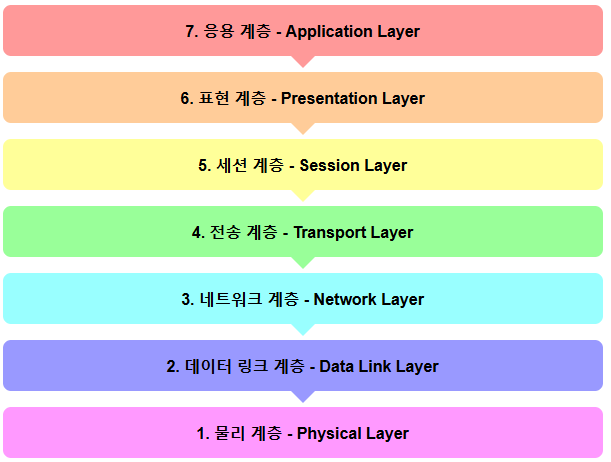  
  
  
### 각 계층별 설명 및 예제

#### 1. 물리 계층 (Physical Layer)
- **역할**: 비트 단위의 데이터를 전기 신호로 변환하여 전송
- **장비**: 케이블, 리피터, 허브
- **예시**: 이더넷 케이블을 통한 비트 전송
- 게임 서버 개발자에게는: 하드웨어 인프라 이해 정도만 필요, 직접 다룰 일은 적음.

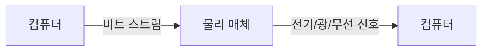

#### 2. 데이터 링크 계층 (Data Link Layer)
- **역할**: 물리적 네트워크를 통한 신뢰성 있는 데이터 전송 보장
- **단위**: 프레임(Frame)
- **프로토콜**: Ethernet, MAC, PPP
- **장비**: 스위치, 브릿지
- **예시**: MAC 주소를 사용한 로컬 네트워크 통신  
- 게임 서버 개발자에게는: 기본적인 이해 필요, 특히 네트워크 문제 디버깅 시 유용  

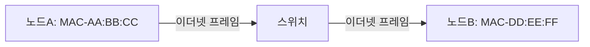

#### 3. 네트워크 계층 (Network Layer)
- **역할**: 서로 다른 네트워크 간 패킷 라우팅
- **단위**: 패킷(Packet)
- **프로토콜**: IP, ICMP, OSPF
- **장비**: 라우터
- **예시**: 인터넷을 통한 데이터 패킷 라우팅
- 게임 서버 개발자에게는: IP 주소 체계, 서브넷, 라우팅 원리 이해 필요, 서버 배포와 관련

```mermaid
graph LR
    A[클라이언트 IP: 192.168.1.5] --IP 패킷--> B[라우터]
    B --IP 패킷--> C[서버 IP: 203.0.113.10]
 ```

#### 4. 전송 계층 (Transport Layer)
- **역할**: 종단간 신뢰성 있는 데이터 전송 보장
- **단위**: 세그먼트(Segment)
- **프로토콜**: TCP, UDP
- **예시**: 게임 서버와 클라이언트 간의 데이터 교환  
- 게임 서버 개발자에게는: 매우 중요, TCP vs UDP 선택, 소켓 프로그래밍, 패킷 설계 등이 필수  

```mermaid
graph LR
    A[게임 클라이언트] --TCP 3-way 핸드셰이크--> B[게임 서버]
    B --확인 응답--> A
    A --게임 데이터--> B
```

#### 5. 세션 계층 (Session Layer)
- **역할**: 통신 세션 구성, 유지, 종료
- **프로토콜**: NetBIOS, RPC
- **예시**: 게임 로그인 세션 유지
- 게임 서버 개발자에게는: 게임 세션 관리, 연결 상태 관리 등에 중요  

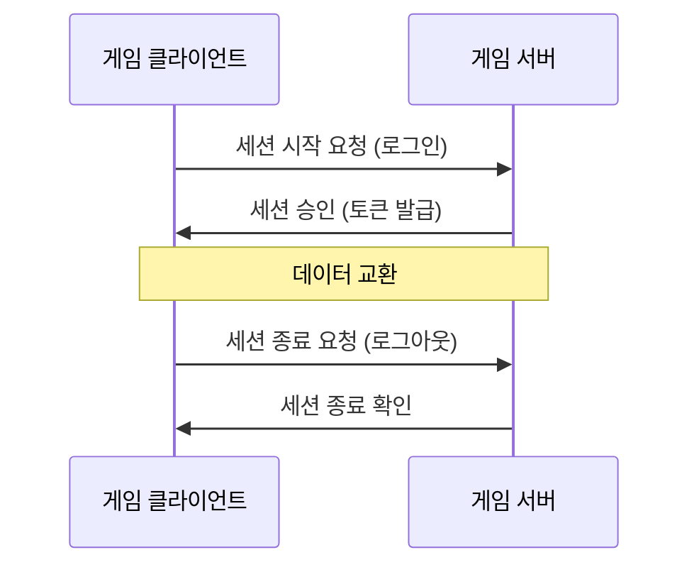

#### 6. 표현 계층 (Presentation Layer)
- **역할**: 데이터 형식 변환, 암호화/복호화
- **프로토콜**: SSL/TLS, JPEG, PNG
- **예시**: 게임 데이터 암호화 및 압축
게임 서버 개발자에게는: 데이터 직렬화, 암호화, 압축 기술 이해 필요  


#### 7. 응용 계층 (Application Layer)
- **역할**: 사용자 인터페이스와 애플리케이션 기능 제공
- **프로토콜**: HTTP, FTP, SMTP, DNS, WebSocket
- **예시**: 게임 데이터 요청 및 응답
- 게임 서버 개발자에게는: HTTP, WebSocket 등 응용 프로토콜 이해, API 설계에 중요  

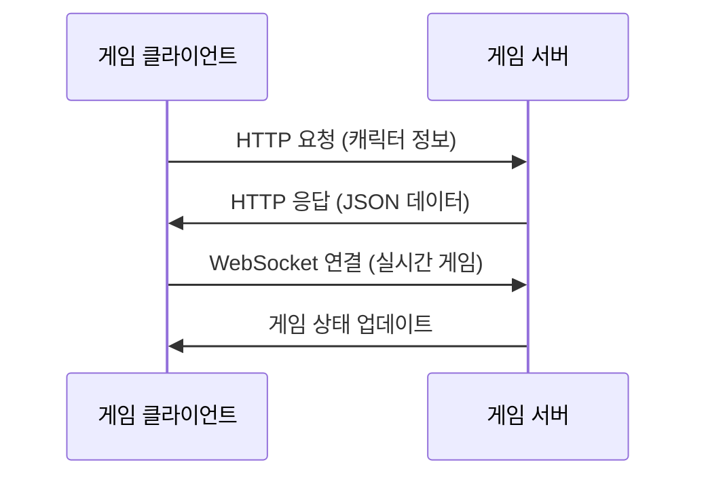
  

### 데이터 캡슐화 과정
데이터가 상위 계층에서 하위 계층으로 전달될 때 각 계층마다 헤더가 추가되는 과정입니다.

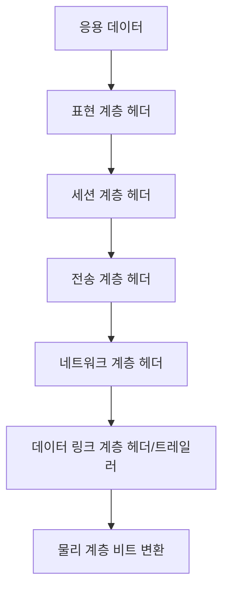
  
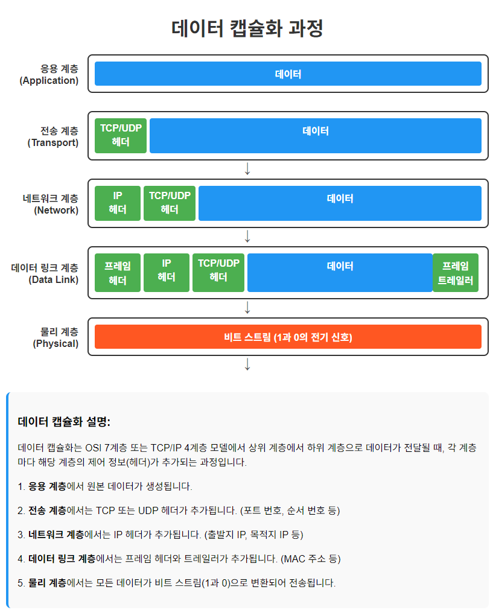    
  

### 게임 서버 개발에서의 OSI 모델 활용
게임 서버 개발자로서 특히 중요한 계층:

1. **전송 계층**: TCP/UDP 프로토콜 선택 (실시간성 vs 신뢰성)
2. **세션 계층**: 사용자 인증 및 세션 관리
3. **응용 계층**: 게임 로직 및 데이터 처리

```mermaid
graph TD
    subgraph "게임 서버 개발"
        A[HTTP/REST API<br>게임 상태 관리] -->|응용 계층| B[JSON/프로토콜 버퍼<br>데이터 직렬화] 
        B -->|표현 계층| C[세션 관리<br>인증]
        C -->|세션 계층| D[TCP/UDP 선택<br>패킷 처리]
    end
 ```

### 실제 게임 통신 예제

```mermaid
sequenceDiagram
    participant 클라이언트
    participant 서버
    
    클라이언트->>서버: TCP 연결 요청
    서버->>클라이언트: 연결 수락
    클라이언트->>서버: 로그인 요청 (ID/PW)
    서버->>클라이언트: 인증 토큰 발급
    클라이언트->>서버: 게임 입장 요청
    서버->>클라이언트: 게임 상태 초기화
    
    loop 게임 진행
        클라이언트->>서버: 플레이어 액션 전송
        서버->>클라이언트: 게임 상태 업데이트
    end
    
    클라이언트->>서버: 게임 종료 요청
    서버->>클라이언트: 게임 결과 저장 확인
    클라이언트->>서버: 연결 종료
```
  
<br>    
  
## TCP/IP 4계층

TCP/IP 4계층 모델:  
1. 네트워크 인터페이스 계층 (Network Interface Layer) - OSI의 물리 계층과 데이터링크 계층에 해당
2. 인터넷 계층 (Internet Layer) - OSI의 네트워크 계층에 해당
3. 전송 계층 (Transport Layer) - OSI의 전송 계층에 해당
4. 응용 계층 (Application Layer) - OSI의 세션, 표현, 응용 계층에 해당
   
  
온라인 게임 서버 개발자 관점에서 네트워크 인터페이스 계층에서 중요한 부분:
  
1. 기본 이해:
   - 이더넷, Wi-Fi, 광섬유 등 다양한 물리적 네트워크 매체의 특성
   - MAC 주소와 물리적 주소 지정 방식
   - 프레임(Frame) 구조와 처리 방식
  
2. 온라인 게임 서버 개발 관점에서의 중요성:
   - 네트워크 인터페이스의 성능 특성 이해 (대역폭, 지연 시간 등)
   - 유선과 무선 네트워크의 차이점과 게임 성능에 미치는 영향
   - 데이터 전송 시 발생할 수 있는 물리적 제약사항 (MTU 크기 등)
   - 네트워크 병목 현상 이해와 대응 방안
   - 다양한 네트워크 환경에서의 게임 서버 동작 이해
  
3. 실무적 적용:
   - 클라우드 환경에서의 가상 네트워크 인터페이스 이해
   - 다양한 클라이언트 네트워크 환경을 고려한 서버 설계
   - 네트워크 모니터링과 문제 해결 기법
   - 게임 트래픽에 최적화된 네트워크 설정
  
  
### 기본 이해 사항

- **물리적 매체 특성**: 이더넷, 광섬유, 무선 네트워크의 차이점과 게임 서버 성능에 미치는 영향
- **프레임 구조와 MTU**: 데이터 전송 단위의 크기 제한이 패킷 설계에 미치는 영향
- **MAC 주소 체계**: 네트워크 장비 식별 방식과 기본 원리

### 게임 서버 개발자가 알아야 할 핵심 지식

1. **네트워크 성능 지표 이해**:
   - 대역폭(Bandwidth)과 처리량(Throughput)이 게임 서버 성능에 미치는 영향
   - 지연 시간(Latency)과 지터(Jitter)가 게임 경험에 미치는 영향
   - 패킷 손실(Packet Loss)의 원인과 대응 방안

2. **다양한 네트워크 환경 대응**:
   - 유선과 무선 네트워크의 차이점을 고려한 프로토콜 설계
   - 모바일 네트워크(4G/5G)에서의 게임 서버 최적화 방법
   - 글로벌 서비스를 위한 지역별 네트워크 특성 고려사항

3. **네트워크 인프라 구성**:
   - 로드 밸런서와 게임 서버 연동 방식
   - CDN(Content Delivery Network) 활용 전략
   - 클라우드 환경에서의 가상 네트워크 인터페이스 이해

4. **문제 해결과 디버깅**:
   - 네트워크 병목 현상 식별 방법
   - 패킷 캡처 및 분석 도구 활용법(Wireshark 등)
   - 네트워크 수준의 장애 진단 기법
  
  

## 2. TCP 프로토콜 심층 이해

### 연결 관리: 3-way Handshake 
3-way Handshake는 TCP 연결을 수립하는 핵심 과정으로, 클라이언트와 서버 간에 신뢰성 있는 통신 채널을 구축하기 위한 세 단계의 메시지 교환 프로세스입니다:  
  
TCP 3-way Handshake의 개념:    
- TCP 연결 설정 과정의 핵심 메커니즘
- 클라이언트와 서버 간 신뢰성 있는 연결을 수립하는 단계
- 3단계로 이루어진 메시지 교환 과정
   
TCP 3-way Handshake의 절차:  
1. SYN (클라이언트 → 서버): 클라이언트가 연결 요청
2. SYN-ACK (서버 → 클라이언트): 서버가 요청 수락 및 응답
3. ACK (클라이언트 → 서버): 클라이언트가 응답 확인
   
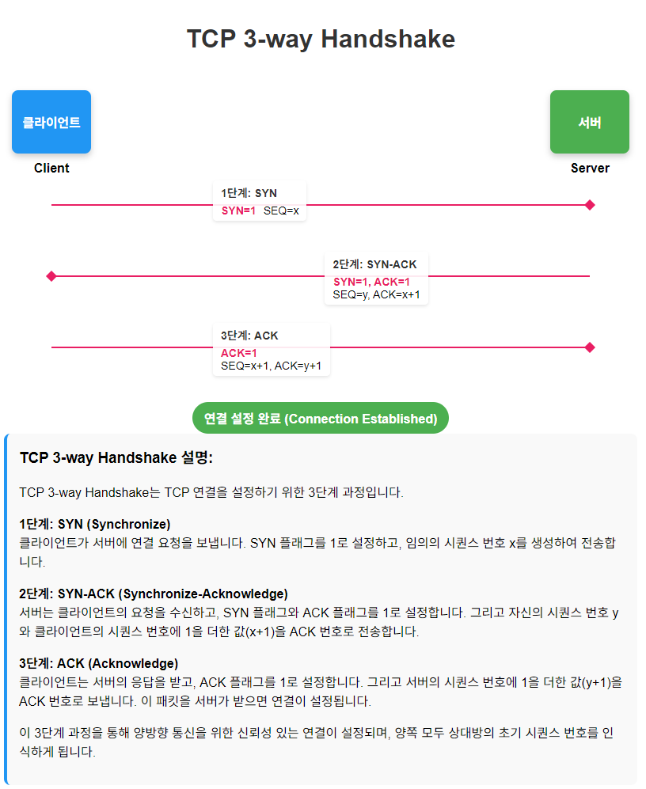  
    
게임 서버 개발자가 알아야 할 중요성:  
1. 연결 관리와 관련된 성능 영향
2. 대규모 접속 처리 시 최적화 필요성
3. 연결 실패 및 비정상 종료 처리
4. 보안 관련 이슈 (SYN Flooding 등)
5. 네트워크 디버깅 시 문제 진단
     
    
#### 게임 서버 개발자가 배워야 할 핵심 내용
1. **시퀀스 번호 관리**:
   - 초기 시퀀스 번호(ISN) 생성 방식과 의미
   - 패킷 순서 보장 및 중복 감지 메커니즘

2. **상태 관리**:
   - LISTEN, SYN-SENT, SYN-RECEIVED, ESTABLISHED 등 TCP 상태 전이
   - 각 상태별 타임아웃 처리 및 재시도 전략

3. **소켓 옵션과 튜닝**:
   - 백로그(backlog) 큐 크기 설정
   - 연결 타임아웃 매개변수 최적화
   - 연결 설정 시간 단축을 위한 설정
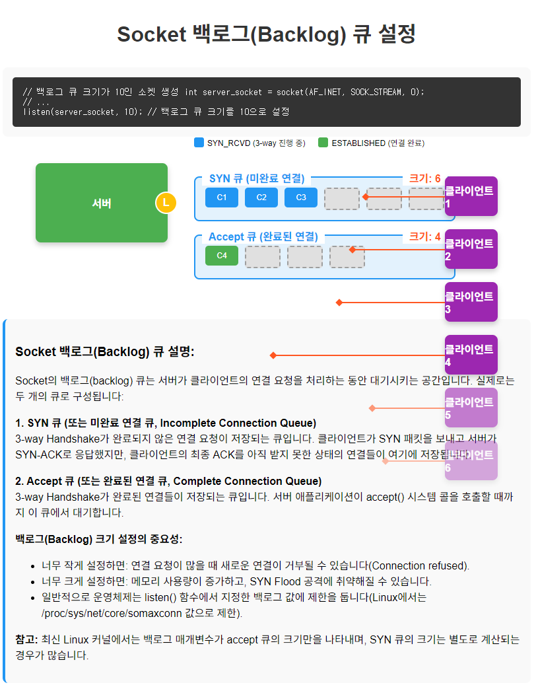    

4. **실패 처리**:
   - SYN 패킷 손실 상황 대응
   - 네트워크 단절 시 부분적 연결 정리

#### 왜 중요한가?  
1. 성능 영향
- **연결 설정 오버헤드**: 대규모 동시 접속 환경에서 3-way Handshake는 상당한 시간과 리소스를 소모
- **서버 수용력 제한**: SYN 큐와 Accept 큐의 제한으로 인한 최대 동시 연결 수립 한계
  
2. 게임 플레이 경험
- **초기 접속 지연**: 플레이어의 첫인상을 결정하는 게임 접속 속도
- **재연결 메커니즘**: 네트워크 불안정 시 신속한 재연결을 위한 최적화
  
3. 보안 취약점
- **SYN 플러딩 공격**: 악의적인 SYN 패킷으로 서버 리소스 고갈 위험
- **IP 스푸핑 방어**: TCP 연결 수립 과정의 보안 취약성 이해
  
4. 서버 확장성
- **로드 밸런서 통합**: 3-way Handshake와 로드 밸런싱 메커니즘 연계
- **커넥션 풀링**: 연결 재사용을 통한 설정 오버헤드 감소
  
5. 실제 적용 사례
- **대규모 MMO 접속 처리**: 수만 명의 동시 접속자 관리
- **게임 매치메이킹 서버**: 빠른 연결 설정이 필요한 매치메이킹 시스템
- **글로벌 서비스**: 지역 간 높은 지연시간 환경에서의 연결 최적화
   

#### 개발자가 갖춰야 할 실무 지식
1. **소켓 API에서의 구현**:
   ```c
   listen(sockfd, SOMAXCONN);  // 백로그 큐 크기 설정
   ```

2. **연결 상태 모니터링**: 
   - netstat, ss 등의 도구로 연결 상태 확인 방법
   - ESTABLISHED, SYN_RECV 등 상태별 통계 분석

3. **최적화 전략**:
   - TCP Fast Open 구현
   - 연결 풀링과 영속 연결 관리
   - 비동기 연결 처리 패턴

TCP 3-way Handshake를 심층적으로 이해하면 안정적이고 확장성 있는 게임 서버를 구축할 수 있으며, 네트워크 성능 병목 현상을 식별하고 해결하는 능력이 향상됩니다. 이는 플레이어에게 끊김 없는 게임 경험을 제공하는 기반이 됩니다. 

    

### 연결 종료: 4-way Handshake
TCP 4-way Handshake는 TCP 연결을 안전하게 종료하기 위한 프로토콜입니다.  
```
  클라이언트 → FIN → 서버
  클라이언트 ← ACK ← 서버
  클라이언트 ← FIN ← 서버
  클라이언트 → ACK → 서버
```
- **게임 관련성**: 플레이어 접속 종료 처리, 리소스 해제 타이밍 중요  
  
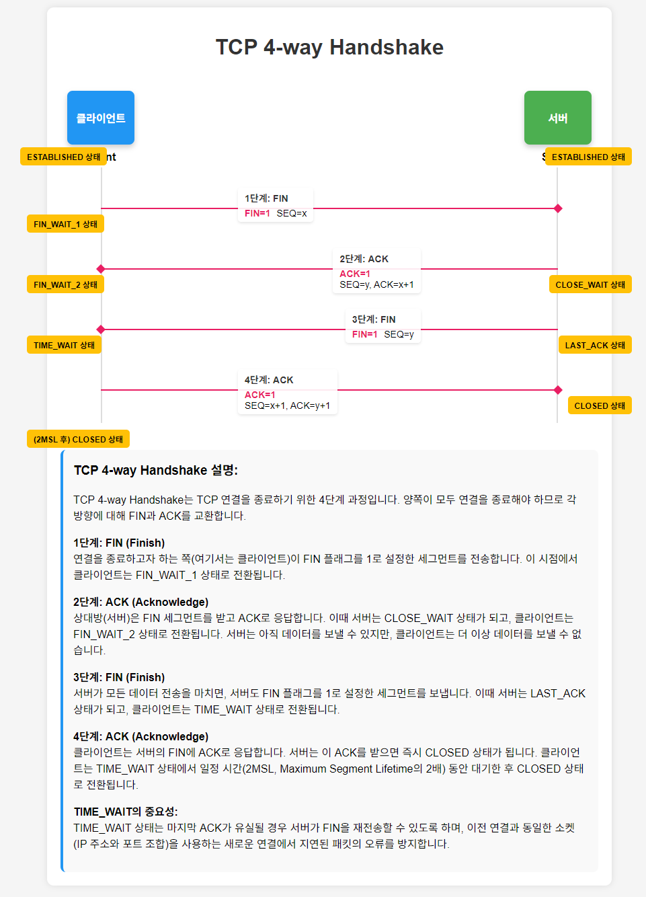    
    
#### 기본 개념
TCP 4-way Handshake는 TCP 연결을 안전하게 종료하기 위한 프로토콜로, 데이터 손실 없이 양방향 통신을 완전히 종료하기 위해 4단계의 메시지 교환 과정을 거칩니다.

#### 4-way Handshake 상세 과정

1단계: FIN (Finish) - 첫 번째 종료 요청
- **발신자**: 더 이상 보낼 데이터가 없음을 알리는 FIN 플래그 전송
- **내부 상태**: 발신자는 FIN_WAIT_1 상태로 전환
- **패킷 내용**: FIN=1, ACK=1, seq=x, ack=y

2단계: ACK - 종료 요청 수락
- **수신자**: FIN을 수신하고 이를 확인하는 ACK 전송
- **내부 상태**: 수신자는 CLOSE_WAIT 상태로, 발신자는 ACK 수신 후 FIN_WAIT_2 상태로 전환
- **패킷 내용**: ACK=1, seq=y, ack=x+1
- **중요 특징**: 이 시점에서 "반이중 연결(Half-Close)" 상태 발생 - 발신자→수신자 방향 연결만 종료됨

3단계: FIN - 두 번째 종료 요청
- **수신자**: 남은 데이터 전송 완료 후 자신의 FIN 플래그 전송
- **내부 상태**: 수신자는 LAST_ACK 상태로 전환
- **패킷 내용**: FIN=1, ACK=1, seq=z, ack=x+1
- **시점**: 수신자가 처리할 모든 데이터를 전송한 후 발생 (즉시 또는 지연될 수 있음)

4단계: ACK - 최종 확인
- **발신자**: 수신자의 FIN에 대한 ACK 전송
- **내부 상태**: 발신자는 TIME_WAIT 상태로, 수신자는 ACK 수신 후 CLOSED 상태로 전환
- **패킷 내용**: ACK=1, seq=x+1, ack=z+1
- **종료 과정**: 발신자는 TIME_WAIT 상태에서 일정 시간(2MSL) 대기 후 CLOSED 상태로 전환
  

#### TIME_WAIT 상태의 중요성
  
##### 목적
- **지연 패킷 처리**: 네트워크에 지연된 패킷이 새 연결에 영향을 주지 않도록 함
- **신뢰성 보장**: 마지막 ACK 손실 시 수신자가 FIN을 재전송할 경우 대응 가능

##### 시간 설정
- **2MSL(Maximum Segment Lifetime)**: 일반적으로 30초~4분 (OS별 차이)
- **의미**: 네트워크에서 패킷이 살아있을 수 있는 최대 시간의 2배

#### 게임 서버 개발에서의 중요성

1. 리소스 관리
- **소켓 리소스 효율**: TIME_WAIT 상태의 소켓이 다수 존재할 경우 리소스 부족 발생 가능
- **포트 고갈**: 고부하 환경에서 사용 가능한 로컬 포트 번호 소진 위험

2. 클라이언트 연결 패턴 관리
- **빈번한 재연결**: 모바일 게임에서 네트워크 불안정으로 인한 재연결 시 고려사항
- **비정상 종료 처리**: 클라이언트 충돌이나 네트워크 단절 시 연결 정리 메커니즘

3. 서버 성능과 확장성
- **동시 접속자 처리**: 대규모 동시 접속 환경에서 연결 종료 오버헤드 고려
- **서버 재시작**: 빠른 서버 재시작이 필요한 경우 TIME_WAIT 소켓의 영향
    

#### 최적화 전략 및 구현 기법

##### 소켓 옵션 설정
```c
// SO_REUSEADDR 옵션 활성화 (동일 포트 빠른 재사용)
int reuse = 1;
setsockopt(sockfd, SOL_SOCKET, SO_REUSEADDR, &reuse, sizeof(reuse));

// SO_LINGER 옵션 설정 (연결 종료 동작 제어)
struct linger ling;
ling.l_onoff = 1;   // 활성화
ling.l_linger = 0;  // 즉시 종료 (RST 발생)
setsockopt(sockfd, SOL_SOCKET, SO_LINGER, &ling, sizeof(ling));
```

##### 연결 관리 패턴
- **연결 풀링**: 연결의 재사용으로 Handshake 오버헤드 감소
- **keepalive 메커니즘**: 불필요한 연결 종료/재연결 방지
- **지능형 재연결**: 네트워크 상태에 따른 자동 재연결 구현
 
서버와 클라이언트의 연결 상태를 체크하는 방법은 keepalive 보다는 하트비트를 구현해서 체크한다.  
예를들어 유선 네트워크의 경우 컴퓨터 A와 B가 연결된 상태에서 A의 유선 선을 컴퓨터에서 빼도 B는 연결이 끊어짐을 알 수 없다. 시간이 어느 정도 흐른 후에나 알게된다. 이것은 무선에서도 비슷한 상황이 발생한다. 만약 대중교통 기간을 타고 가다가 통신 상태가 나빠져서 통신이 되지 않는 상태가 되어서 서버에는 이런 상황이 알려지지 않는다. 이런 문제를 위해 keepalive를 사용할 수 있지만 구현 상의 이유로 애플리케이션에서 허트비트를 구현해서 이런 문제를 감지하는 것이 더 좋다.  
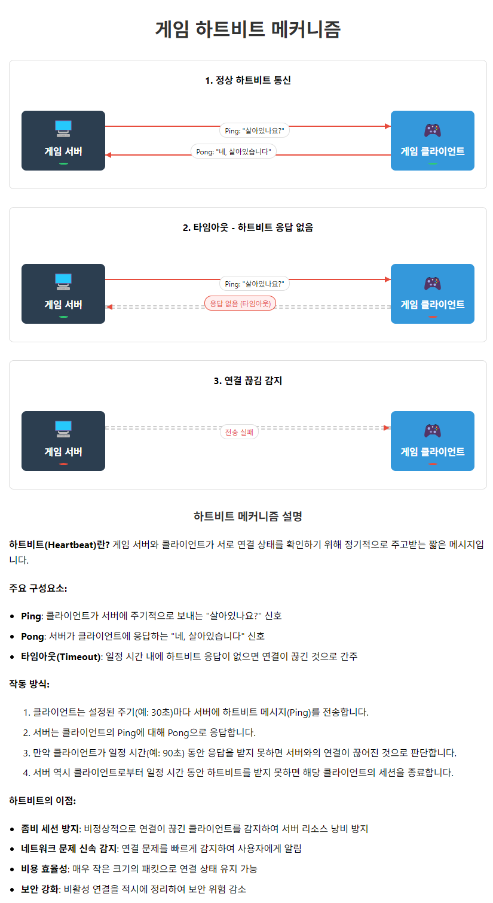   
   

##### 일반적인 문제 및 해결 방법  

1. TIME_WAIT 소켓 과다 누적
- **증상**: `netstat`에서 많은 TIME_WAIT 상태 연결 발견, 포트 부족 오류
- **해결책**:
  - TCP 재사용 옵션 활성화
  - 클라이언트 주도 종료 패턴 설계
  - 연결 풀링 적용

2. 비정상 종료 처리
- **증상**: 연결이 명시적으로 종료되지 않고 남아있는 상황
- **해결책**:
  - 클라이언트 활성 감지(heartbeat)
  - 연결 타임아웃 설정
  - 적절한 소켓 옵션 활용

3. 분산 시스템에서의 연결 종료 조정
- **증상**: 로드밸런서나 프록시 경유 시 불완전한 종료
- **해결책**:
  - 종료 타임아웃 및 정책 일관성 유지
  - 종료 이벤트의 분산 시스템 전파 메커니즘 구현
  

#### 게임 서버 개발 시 실전 적용 지침

1. **클라이언트 네트워크 코드 설계**:
   - 재연결 시 이전 연결의 명시적 종료 보장
   - 네트워크 변경 감지와 연결 관리 연계

2. **서버 모니터링 체계**:
   - 연결 상태별 통계 수집 및 분석 (ESTABLISHED, TIME_WAIT 등)
   - 비정상적 연결 종료 패턴 감지 알림

3. **테스트 시나리오 구성**:
   - 네트워크 단절 및 재연결 시뮬레이션
   - 대규모 동시 접속/종료 성능 테스트
   - 장시간 운영 중 연결 상태 건전성 검증
  

4-way Handshake의 심층적 이해와 적절한 구현은 안정적이고 확장성 있는 온라인 게임 서버 개발의 핵심 요소입니다. 특히 모바일 환경이나 대규모 동시 접속 게임에서는 이 과정의 최적화가 전체 서비스 성능에 큰 영향을 미칩니다.  
    
  
  
## 게임 서버 개발자가 알아야할 TCP 이론

### 1. TCP 신뢰성 메커니즘

#### 1. 시퀀스 번호와 ACK: 데이터 순서 보장과 손실 패킷 감지
TCP는 신뢰성 있는 데이터 전송을 위해 시퀀스 번호(Sequence Number)와 응답 확인(Acknowledgment, ACK) 메커니즘을 사용합니다. 이 메커니즘은 게임 서버에서 중요한 역할을 합니다.

#### 시퀀스 번호와 ACK의 작동 원리
- **시퀀스 번호**: 각 데이터 바이트에 고유한 번호 부여
- **ACK 번호**: 다음에 수신할 것으로 예상되는 바이트의 시퀀스 번호
  

##### 1. 기본 개념

###### 시퀀스 번호(Sequence Number)
- 송신자가 전송하는 각 데이터 바이트에 부여되는 고유 번호
- 32비트 필드로 표현되며 최대 약 43억(2^32)까지의 값 사용 가능
- 데이터의 순서를 유지하고 손실된 바이트를 식별하는 데 사용

###### ACK 번호(Acknowledgment Number)
- 수신자가 다음에 받기를 기대하는 바이트의 시퀀스 번호
- 지금까지 성공적으로 수신한 모든 데이터에 대한 확인 응답 역할
- 수신자가 받은 데이터의 시퀀스 번호 + 데이터 길이로 계산

##### 2. 연결 설정 과정에서의 시퀀스 번호 (3-way Handshake)

```
클라이언트                                     서버
    |                                           |
    |  SYN (SEQ=x, 초기 시퀀스 번호)            |
    |------------------------------------------>|
    |                                           |
    |  SYN-ACK (SEQ=y, ACK=x+1)                |
    |<------------------------------------------|
    |                                           |
    |  ACK (SEQ=x+1, ACK=y+1)                  |
    |------------------------------------------>|
    |                                           |
```

1. **SYN 패킷**: 클라이언트가 초기 시퀀스 번호(ISN_C = x)를 무작위로 선택하여 서버에 전송
2. **SYN-ACK 패킷**: 서버가 자신의 초기 시퀀스 번호(ISN_S = y)를 선택하고, ACK 번호로 x+1을 설정하여 응답
3. **ACK 패킷**: 클라이언트가 시퀀스 번호 x+1과 ACK 번호 y+1을 설정하여 응답하면 연결이 설정됨

##### 3. 데이터 전송 과정에서의 시퀀스 번호와 ACK

###### 구체적인 예시:

```
클라이언트 (SEQ=1000)                        서버 (SEQ=2000)
    |                                           |
    |  데이터 100바이트 (SEQ=1000, ACK=2000)    |
    |------------------------------------------>|
    |                                           |
    |  ACK (SEQ=2000, ACK=1100)                |
    |<------------------------------------------|
    |                                           |
    |  데이터 200바이트 (SEQ=1100, ACK=2000)    |
    |------------------------------------------>|
    |                                           |
    |  데이터 50바이트 (SEQ=2000, ACK=1300)     |
    |<------------------------------------------|
    |                                           |
    |  ACK (SEQ=1300, ACK=2050)                |
    |------------------------------------------>|
    |                                           |
```

위 예시에서:
- 클라이언트가 시퀀스 번호 1000부터 시작하여 100바이트 전송
- 서버는 ACK=1100으로 응답 (1000 + 100 = 다음에 받기를 기대하는 바이트)
- 클라이언트가 시퀀스 번호 1100부터 시작하여 200바이트 전송
- 서버는 자신의 데이터 50바이트를 전송하면서 ACK=1300으로 응답 (1100 + 200)
- 클라이언트는 ACK=2050으로 응답 (2000 + 50)

##### 4. 시퀀스 번호 계산 방법

TCP 헤더에서 시퀀스 번호는 첫 번째 데이터 바이트의 번호를 나타냅니다.

```cpp
// TCP 헤더 구조체 (Windows 소켓 API 사용)
struct TCPHeader {
    uint16_t sourcePort;
    uint16_t destPort;
    uint32_t sequenceNumber;   // 시퀀스 번호
    uint32_t acknowledgmentNumber; // ACK 번호
    uint8_t  dataOffset;       // 헤더 길이 (4비트) + 예약 필드 (4비트)
    uint8_t  flags;            // 각종 플래그 (SYN, ACK, FIN 등)
    uint16_t windowSize;       // 수신 윈도우 크기
    uint16_t checksum;         // 오류 검사
    uint16_t urgentPointer;    // 긴급 데이터 포인터
    // 옵션 필드 (가변 길이)
};
```

##### 5. 패킷 손실 및 재전송 메커니즘

###### 타임아웃 기반 재전송
송신자는 데이터를 전송한 후 ACK를 기다립니다. 일정 시간(RTO, Retransmission Timeout) 내에 ACK가 도착하지 않으면, 해당 데이터를 손실로 간주하고 재전송합니다.

```
클라이언트                                     서버
    |                                           |
    |  데이터 (SEQ=1000)                        |
    |------------------------------------------>|
    |                       (패킷 손실)         X
    |                                           |
    |  [타임아웃]                               |
    |                                           |
    |  데이터 재전송 (SEQ=1000)                 |
    |------------------------------------------>|
    |                                           |
    |  ACK (ACK=1100)                          |
    |<------------------------------------------|
    |                                           |
```

###### 중복 ACK 기반 빠른 재전송 (Fast Retransmit)
같은 ACK가 3번 이상 수신되면(트리플 중복 ACK), 패킷 손실로 간주하고 타임아웃을 기다리지 않고 즉시 재전송합니다.

```
클라이언트                                     서버
    |                                           |
    |  데이터 1 (SEQ=1000)                      |
    |------------------------------------------>|
    |                       (패킷 손실)         X
    |                                           |
    |  데이터 2 (SEQ=1100)                      |
    |------------------------------------------>|
    |                                           |
    |  ACK (ACK=1000)                          |
    |<------------------------------------------|
    |                                           |
    |  데이터 3 (SEQ=1200)                      |
    |------------------------------------------>|
    |                                           |
    |  ACK (ACK=1000) - 중복 ACK #1            |
    |<------------------------------------------|
    |                                           |
    |  데이터 4 (SEQ=1300)                      |
    |------------------------------------------>|
    |                                           |
    |  ACK (ACK=1000) - 중복 ACK #2            |
    |<------------------------------------------|
    |                                           |
    |  [트리플 중복 ACK 감지]                   |
    |                                           |
    |  데이터 1 재전송 (SEQ=1000)               |
    |------------------------------------------>|
    |                                           |
    |  ACK (ACK=1400)                          |
    |<------------------------------------------|
    |                                           |
```
  
  
  
### 2. 흐름 제어: 수신 윈도우 기반 전송 속도 조절
TCP의 흐름 제어(Flow Control)는 송신자가 수신자의 처리 능력을 초과하여 데이터를 전송하는 것을 방지하는 메커니즘입니다.

#### 수신 윈도우의 개념

- 수신자는 처리할 수 있는 데이터의 양을 '수신 윈도우'로 표시
- 송신자는 수신 윈도우 크기를 초과하여 데이터를 전송하지 않음
- 수신자는 데이터를 처리한 후 윈도우 크기를 업데이트
  
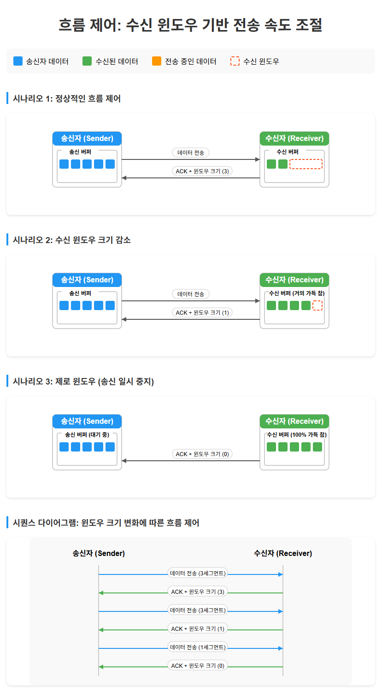    
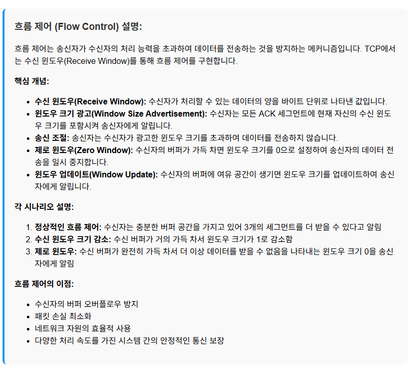    

#### Windows API에서 수신 버퍼 조정 예제

```cpp
// TCP 소켓의 수신 버퍼 크기 설정 예제
bool SetTCPReceiveBufferSize(SOCKET socket, int size) {
    // 수신 버퍼 크기 설정 (바이트 단위)
    if (setsockopt(socket, SOL_SOCKET, SO_RCVBUF, (char*)&size, sizeof(size)) == SOCKET_ERROR) {
        std::cerr << std::format("수신 버퍼 크기 설정 실패: {}\n", WSAGetLastError());
        return false;
    }
    
    // 설정된 버퍼 크기 확인
    int actualSize = 0;
    int len = sizeof(actualSize);
    if (getsockopt(socket, SOL_SOCKET, SO_RCVBUF, (char*)&actualSize, &len) == SOCKET_ERROR) {
        std::cerr << std::format("수신 버퍼 크기 확인 실패: {}\n", WSAGetLastError());
        return false;
    }
    
    std::cout << std::format("설정된 TCP 수신 버퍼 크기: {} 바이트\n", actualSize);
    return true;
}

// 사용 예시
void ConfigureGameServerSocket(SOCKET serverSocket) {
    // 게임 서버에 적합한 큰 수신 버퍼 설정 (예: 256KB)
    const int GAME_SERVER_BUFFER_SIZE = 256 * 1024;
    if (SetTCPReceiveBufferSize(serverSocket, GAME_SERVER_BUFFER_SIZE)) {
        std::cout << "게임 서버 소켓 수신 버퍼가 설정되었습니다.\n";
    }
}
```
  
>>>대부분의 최신 운영체제들은 네트워크의 송수신버퍼(TCP 윈도우 크기)를 자동으로 조절해주는 기능을 제공합니다. 이 기능은 TCP 윈도우 스케일링 또는 자동 튜닝이라고 불리며, Windows, Linux, macOS 등 주요 OS에서 기본적으로 활성화되어 있습니다.
>>>
>>>OS에서 제공하는 자동 조절 기능이 대부분의 일반적인 상황에서는 적절하게 작동하지만, 특정 상황에서는 수동 조절이 필요할 수 있습니다:
>>>
>>>특수한 네트워크 환경(매우 높은 지연시간이나 매우 큰 대역폭을 가진 환경)
특정 애플리케이션의 성능 최적화가 필요한 경우
특수 목적의 서버나 대규모 데이터 전송 시스템
일반적인 사용자나 일반적인 서버 환경에서는 OS의 자동 조절 기능을 신뢰하고 그대로 사용하는 것이 좋습니다. 불필요한 수동 튜닝은 오히려 성능 저하를 가져올 수 있습니다. 하지만 특수한 요구사항이 있거나 네트워크 성능에 문제가 있는 경우에는 전문가의 도움을 받아 수동 조절을 고려해 볼 수 있습니다.
  
  
#### 게임 서버에서의 흐름 제어 영향

1. **클라이언트 처리 능력 차이**: 다양한 하드웨어를 가진 클라이언트들이 서버와 통신할 때, 흐름 제어는 느린 클라이언트가 데이터 과부하되는 것을 방지
2. **버퍼 관리**: 적절한 크기의 버퍼 설정이 게임 서버 성능에 중요
3. **지연 감소**: 적절한 윈도우 크기는 버퍼링에 의한 지연을 줄임
  

### 3. 혼잡 제어: 네트워크 상황에 따른 전송 조절

TCP 혼잡 제어(Congestion Control)는 네트워크의 혼잡 상태에 따라 데이터 전송 속도를 동적으로 조절하는 메커니즘입니다.

#### 주요 혼잡 제어 알고리즘

- **슬로우 스타트(Slow Start)**: 연결 초기에 전송량을 점진적으로 증가
- **혼잡 회피(Congestion Avoidance)**: 혼잡이 감지되면 전송량을 점진적으로 줄임
- **빠른 재전송(Fast Retransmit)**: 중복 ACK를 감지하여 손실된 패킷을 빠르게 재전송
- **빠른 회복(Fast Recovery)**: 네트워크 혼잡 시 전송 속도를 효율적으로 조절
  

#### 게임 서버 영향: 패킷 지연과 대역폭 조절
게임 서버에서 TCP 혼잡 제어는 두 가지 관점에서 영향을 미칩니다:
  
1. **패킷 지연**: 혼잡 제어로 인한 전송 지연이 실시간 게임에서 문제될 수 있음
2. **대역폭 활용**: 네트워크 상황에 따라 가용 대역폭이 효율적으로 사용됨
      
  
### 4. Nagle 알고리즘

#### Nagle 알고리즘이란?
Nagle 알고리즘은 작은 패킷들을 모아서 전송함으로써 네트워크 효율성을 높이는 메커니즘입니다. 그러나 이로 인해 지연이 발생할 수 있어 실시간 게임에서는 문제가 될 수 있습니다.

#### TCP_NODELAY 옵션 사용
게임 서버에서는 종종 Nagle 알고리즘을 비활성화하여 지연을 줄이는 것이 좋습니다.  

```cpp
// Nagle 알고리즘 비활성화 함수
bool DisableNagleAlgorithm(SOCKET socket) {
    // TCP_NODELAY 옵션 활성화
    BOOL noDelay = TRUE;
    if (setsockopt(socket, IPPROTO_TCP, TCP_NODELAY, (char*)&noDelay, sizeof(noDelay)) == SOCKET_ERROR) {
        std::cerr << std::format("Nagle 알고리즘 비활성화 실패: {}\n", WSAGetLastError());
        return false;
    }
    
    std::cout << "Nagle 알고리즘이 비활성화되었습니다. (TCP_NODELAY 활성화)\n";
    return true;
}

// TCP 소켓 최적화 설정 함수
void OptimizeGameSocketSettings(SOCKET socket) {
    // 1. Nagle 알고리즘 비활성화
    DisableNagleAlgorithm(socket);
    
    // 2. 적절한 버퍼 크기 설정
    int sendBufferSize = 128 * 1024; // 128KB
    int recvBufferSize = 256 * 1024; // 256KB
    
    setsockopt(socket, SOL_SOCKET, SO_SNDBUF, (char*)&sendBufferSize, sizeof(sendBufferSize));
    setsockopt(socket, SOL_SOCKET, SO_RCVBUF, (char*)&recvBufferSize, sizeof(recvBufferSize));
    
    // 3. 링거(linger) 옵션 설정 - 소켓 종료 시 동작 정의
    struct linger lingerOpt;
    lingerOpt.l_onoff = 1;    // 링거 활성화
    lingerOpt.l_linger = 0;   // 즉시 종료 (대기 시간 없음)
    setsockopt(socket, SOL_SOCKET, SO_LINGER, (char*)&lingerOpt, sizeof(lingerOpt));
    
    std::cout << "게임 서버 소켓이 최적화되었습니다.\n";
}
```

#### Nagle 알고리즘 비활성화의 장단점

**장점:**
- **지연 감소**: 즉시 패킷 전송으로 게임 반응성 향상
- **일정한 패킷 전송**: 예측 가능한 네트워크 동작

**단점:**
- **네트워크 오버헤드 증가**: 작은 패킷이 많이 생성됨
- **대역폭 사용량 증가**: 헤더 오버헤드로 인한 효율성 감소

#### 게임 유형별 권장 설정

1. **실시간 액션 게임 (FPS, MOBA)**: 
   - Nagle 알고리즘 비활성화 (TCP_NODELAY 활성화)
   - 작은 패킷 크기, 높은 전송 빈도

2. **턴 기반 또는 전략 게임**:
   - Nagle 알고리즘 유지 가능
   - 더 큰 패킷 크기, 효율적인 대역폭 사용
      
  
### 결론
TCP 신뢰성 메커니즘은 게임 서버 개발에서 중요한 역할을 합니다:

1. **시퀀스 번호와 ACK**를 통해 데이터의 순서와 무결성을 보장
2. **흐름 제어**로 클라이언트의 처리 능력에 맞게 데이터 전송 조절
3. **혼잡 제어**로 네트워크 상황에 따라 전송 속도 최적화
4. **Nagle 알고리즘 비활성화**로 실시간 게임에서의 지연 최소화
  
게임 서버 개발자는 이러한 메커니즘을 이해하고 적절히 설정함으로써, 안정적이고 반응성 높은 게임 경험을 제공할 수 있습니다. 각 게임의 특성과 요구사항에 맞게 TCP 설정을 최적화하는 것이 중요합니다.  

<pre>
대체적으로는 응용 프로그램의 성격에 따라 결정하는 것이 가장 좋습니다. 하지만 현대의 고속 네트워크 환경에서는 다음과 같은 이유로 Nagle 알고리즘을 비활성화하는 경향이 증가하고 있습니다:

현대 네트워크는 과거보다 대역폭이 크게 향상되어 작은 패킷 전송의 오버헤드가 상대적으로 덜 중요해짐
저지연 응용 프로그램(게임, 실시간 통신, 스트리밍 등)의 증가
웹 기반 서비스에서 응답성이 사용자 경험의 핵심 요소로 부각됨
클라우드 환경과 마이크로서비스 아키텍처에서 빠른 통신이 중요해짐
특히 다음과 같은 상황에서는 비활성화를 고려해볼 만합니다:

웹 서버나 API 서버와 같이 많은 짧은 응답을 보내는 시스템
게임 서버나 금융 트레이딩 시스템처럼 지연 시간이 매우 중요한 애플리케이션
대부분의 실시간 통신 애플리케이션
그러나 대량의 작은 데이터 패킷을 전송하는 IoT 장치나 제한된 대역폭 환경에서는 여전히 Nagle 알고리즘이 유용할 수 있습니다.

결론적으로, 반응성과 지연 시간이 중요한 현대 애플리케이션에서는 Nagle 알고리즘을 비활성화하는 것이 일반적인 추세라고 할 수 있습니다.
</pre>    
   


### 5. MSS와 MTU의 이해

#### MTU(Maximum Transmission Unit)
MTU는 네트워크 인터페이스에서 한 번에 전송할 수 있는 가장 큰 패킷 또는 프레임의 크기(바이트)입니다. 이는 데이터 링크 계층에서의 제한값으로, 헤더를 포함한 전체 패킷 크기를 의미합니다.

일반적인 MTU 값:
- 이더넷: 1500 바이트
- PPPoE: 1492 바이트
- Wi-Fi: 2304 바이트 (실제로는 보통 1500바이트 사용)

#### MSS(Maximum Segment Size)
MSS는 TCP 연결에서 한 번에 전송할 수 있는 데이터의 최대 크기입니다. MTU에서 IP 헤더(20바이트)와 TCP 헤더(20바이트)를 뺀 값입니다.

표준 이더넷 환경에서:
- MTU = 1500 바이트
- MSS = MTU - IP 헤더 - TCP 헤더 = 1500 - 20 - 20 = 1460 바이트
  
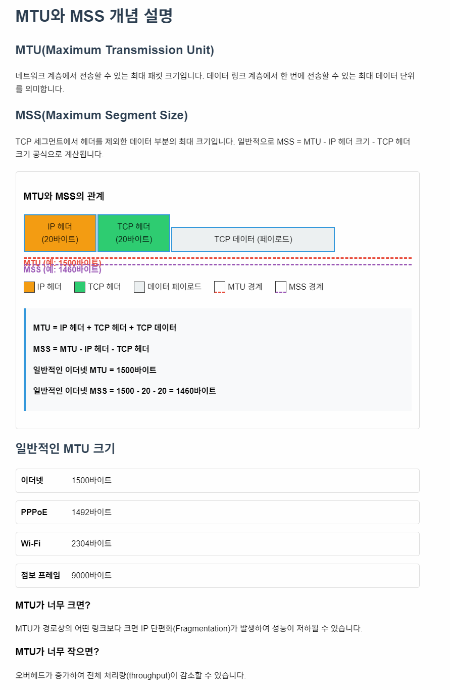   
  

#### Windows API에서 MTU 확인하기

```cpp
#include <iostream>
#include <winsock2.h>
#include <ws2tcpip.h>
#include <iphlpapi.h>
#include <format>

#pragma comment(lib, "ws2_32.lib")
#pragma comment(lib, "iphlpapi.lib")

// 네트워크 인터페이스의 MTU 값을 확인하는 함수
void CheckNetworkMTU() {
    WSADATA wsaData;
    if (WSAStartup(MAKEWORD(2, 2), &wsaData) != 0) {
        std::cerr << "WSAStartup 실패\n";
        return;
    }

    // 인터페이스 정보를 저장할 버퍼 할당
    ULONG bufferSize = 15000;
    PIP_ADAPTER_ADDRESSES pAddresses = (IP_ADAPTER_ADDRESSES*)malloc(bufferSize);
    
    // 인터페이스 정보 가져오기
    ULONG result = GetAdaptersAddresses(AF_UNSPEC, GAA_FLAG_INCLUDE_PREFIX, nullptr, pAddresses, &bufferSize);
    
    if (result == ERROR_BUFFER_OVERFLOW) {
        free(pAddresses);
        pAddresses = (IP_ADAPTER_ADDRESSES*)malloc(bufferSize);
        result = GetAdaptersAddresses(AF_UNSPEC, GAA_FLAG_INCLUDE_PREFIX, nullptr, pAddresses, &bufferSize);
    }
    
    if (result != NO_ERROR) {
        std::cerr << std::format("GetAdaptersAddresses 실패: {}\n", result);
        free(pAddresses);
        WSACleanup();
        return;
    }
    
    // 각 인터페이스의 MTU 값 출력
    std::cout << "네트워크 인터페이스 MTU 정보:\n";
    for (PIP_ADAPTER_ADDRESSES pAdapter = pAddresses; pAdapter; pAdapter = pAdapter->Next) {
        std::wstring wAdapterName(pAdapter->FriendlyName);
        std::string adapterName(wAdapterName.begin(), wAdapterName.end());
        
        std::cout << std::format("인터페이스: {}\n", adapterName);
        std::cout << std::format("  MTU: {} 바이트\n", pAdapter->Mtu);
        
        // MSS 계산 (대략적인 값, 실제로는 TCP 옵션에 따라 달라질 수 있음)
        int estimatedMSS = pAdapter->Mtu - 40;  // IP(20) + TCP(20) 헤더
        std::cout << std::format("  예상 MSS: {} 바이트\n", estimatedMSS);
    }
    
    free(pAddresses);
    WSACleanup();
}
```
  

#### TCP 소켓에서 MSS 설정하기

```cpp
#include <iostream>
#include <winsock2.h>
#include <ws2tcpip.h>
#include <format>

#pragma comment(lib, "ws2_32.lib")

// TCP 소켓의 MSS 값을 설정하는 함수
bool SetTCPMaxSegmentSize(SOCKET socket, int mss) {
    // TCP_MAXSEG 옵션 설정
    if (setsockopt(socket, IPPROTO_TCP, TCP_MAXSEG, (char*)&mss, sizeof(mss)) == SOCKET_ERROR) {
        std::cerr << std::format("MSS 설정 실패: {}\n", WSAGetLastError());
        return false;
    }
    
    // 설정된 MSS 값 확인
    int actualMSS = 0;
    int len = sizeof(actualMSS);
    if (getsockopt(socket, IPPROTO_TCP, TCP_MAXSEG, (char*)&actualMSS, &len) == SOCKET_ERROR) {
        std::cerr << std::format("MSS 확인 실패: {}\n", WSAGetLastError());
        return false;
    }
    
    std::cout << std::format("TCP MSS 설정: 요청={}, 실제={} 바이트\n", mss, actualMSS);
    return true;
}

// 게임 서버 소켓 설정 예시
void ConfigureGameServerSocket() {
    WSADATA wsaData;
    if (WSAStartup(MAKEWORD(2, 2), &wsaData) != 0) {
        std::cerr << "WSAStartup 실패\n";
        return;
    }
    
    // TCP 소켓 생성
    SOCKET serverSocket = socket(AF_INET, SOCK_STREAM, IPPROTO_TCP);
    if (serverSocket == INVALID_SOCKET) {
        std::cerr << std::format("소켓 생성 실패: {}\n", WSAGetLastError());
        WSACleanup();
        return;
    }
    
    // MSS 설정 (예: 1460 바이트)
    if (SetTCPMaxSegmentSize(serverSocket, 1460)) {
        std::cout << "게임 서버 소켓 MSS가 설정되었습니다.\n";
    }
    
    // 소켓 사용 후 정리
    closesocket(serverSocket);
    WSACleanup();
}
```

#### 게임 서버에서 MTU와 MSS의 중요성
1. **패킷 단편화 방지**: MTU보다 큰 패킷은 단편화(fragmentation)되어 지연과 손실 가능성이 증가합니다. 게임 서버는 MTU를 고려하여 패킷 크기를 조절해야 합니다.

2. **네트워크 효율성**: 최적의 MSS 값을 사용하면 네트워크 효율성이 향상됩니다. 너무 작은 패킷은 헤더 오버헤드 비율이 증가하고, 너무 큰 패킷은 단편화 문제가 발생합니다.

3. **지연 시간 최적화**: 게임에서는 지연 시간이 중요하므로, 적절한 패킷 크기 설정은 반응성과 직결됩니다.
   
[애니메이션으로 보기](https://drive.google.com/file/d/1Qeb63vbT3OPGz7DmMscjXB7V3cy1Uyev/view?usp=sharing )

  
```cpp
// 게임 데이터 전송 시 MTU를 고려한 패킷 분할 예시
class GamePacketSender {
private:
    SOCKET socket_;
    int mtu_;
    int maxPayloadSize_;  // MTU에서 헤더를 뺀 실제 사용 가능한 페이로드 크기

public:
    GamePacketSender(SOCKET socket, int mtu = 1500) 
        : socket_(socket), mtu_(mtu) {
        // UDP 헤더(8바이트) + IP 헤더(20바이트)를 고려한 최대 페이로드 크기
        maxPayloadSize_ = mtu_ - 28;
        std::cout << std::format("최대 게임 데이터 페이로드 크기: {} 바이트\n", maxPayloadSize_);
    }
    
    // 큰 데이터를 MTU 고려하여 분할 전송
    bool SendLargeData(const std::vector<uint8_t>& data, const sockaddr_in& target) {
        if (data.empty()) return true;
        
        size_t totalSize = data.size();
        size_t offset = 0;
        
        std::cout << std::format("전송할 총 데이터 크기: {} 바이트\n", totalSize);
        
        // 데이터를 MTU에 맞게 분할하여 전송
        while (offset < totalSize) {
            // 이번에 전송할 크기 계산
            size_t chunkSize = std::min(maxPayloadSize_, totalSize - offset);
            
            // 데이터 전송
            int result = sendto(socket_, 
                              reinterpret_cast<const char*>(&data[offset]), 
                              static_cast<int>(chunkSize), 
                              0, 
                              reinterpret_cast<const sockaddr*>(&target), 
                              sizeof(target));
            
            if (result == SOCKET_ERROR) {
                std::cerr << std::format("데이터 전송 실패: {}\n", WSAGetLastError());
                return false;
            }
            
            offset += chunkSize;
            std::cout << std::format("패킷 전송: {} 바이트 ({}/{})\n", 
                                   chunkSize, offset, totalSize);
        }
        
        return true;
    }
};
```
  

### 5. UDP (User Datagram Protocol)
UDP는 비연결형, 비신뢰성 전송 프로토콜로, 오버헤드가 적고 지연 시간이 짧은 특징이 있습니다.

#### UDP의 특징

1. **비연결성(Connectionless)**: 통신 전에 연결 설정 과정이 없습니다.
2. **비신뢰성(Unreliable)**: 패킷 전달 보장, 순서 보장, 중복 방지가 없습니다.
3. **낮은 오버헤드**: 헤더 크기가 작고(8바이트) 추가 프로토콜 기능이 없어 빠릅니다.
4. **브로드캐스트/멀티캐스트 지원**: 여러 대상에게 효율적으로 데이터를 보낼 수 있습니다.
  
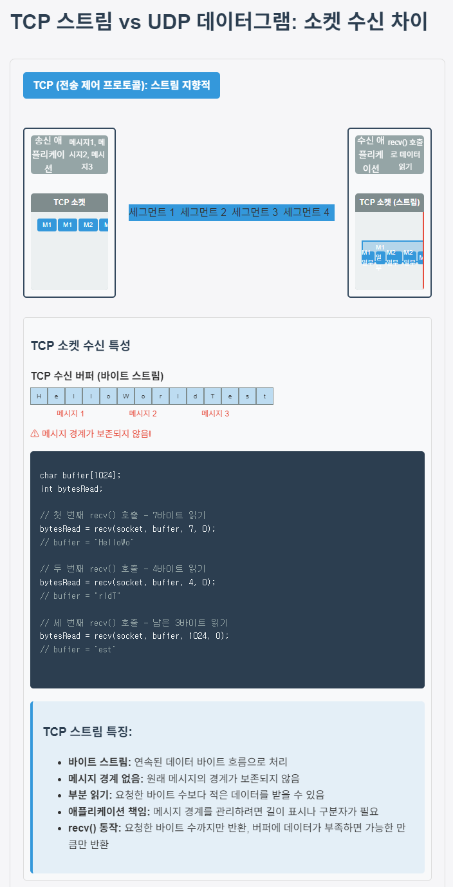  
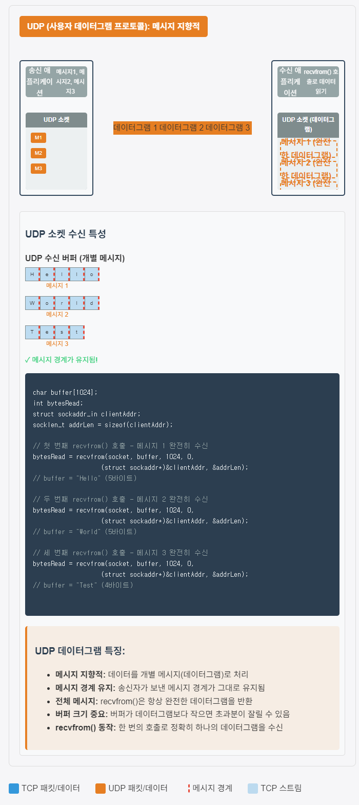  
위 그림은 TCP의 스트림 방식과 UDP의 데이터그램 방식에서 소켓 수신이 어떻게 다른지 시각적으로 표현합니다. 주요 차이점을 강조하여 보여줍니다:  
  
TCP (스트림 기반)  
- 연속된 바이트 스트림으로 데이터를 처리
- 메시지 경계가 유지되지 않음
- 애플리케이션이 요청한 바이트 수보다 적은 데이터를 받을 수 있음
- 여러 recv() 호출에 걸쳐 데이터가 나뉠 수 있음
- 메시지 경계를 유지하기 위해 애플리케이션 수준의 프로토콜이 필요함
  
UDP (데이터그램 기반)  
- 개별 메시지(데이터그램)로 데이터를 처리
- 메시지 경계가 유지됨
- recvfrom()은 항상 완전한 하나의 데이터그램을 반환
- 각 호출마다 송신자가 보낸 그대로의 메시지를 수신  
  
시각화에는 실제 코드 예제와 함께 두 프로토콜의 수신 버퍼 동작 방식도 포함되어 있어, 같은 데이터를 보내고 받을 때 두 프로토콜이 어떻게 다르게 처리하는지 명확하게 보여줍니다.  

  
#### Windows API에서 UDP 소켓 기본 사용법

```cpp
#include <iostream>
#include <winsock2.h>
#include <ws2tcpip.h>
#include <string>
#include <format>

#pragma comment(lib, "ws2_32.lib")

// UDP 서버 예제
class UDPGameServer {
private:
    SOCKET serverSocket_;
    sockaddr_in serverAddr_;
    bool isRunning_;
    
public:
    UDPGameServer() : serverSocket_(INVALID_SOCKET), isRunning_(false) {}
    
    // UDP 서버 시작
    bool Start(int port) {
        WSADATA wsaData;
        if (WSAStartup(MAKEWORD(2, 2), &wsaData) != 0) {
            std::cerr << "WSAStartup 실패\n";
            return false;
        }
        
        // UDP 소켓 생성
        serverSocket_ = socket(AF_INET, SOCK_DGRAM, IPPROTO_UDP);
        if (serverSocket_ == INVALID_SOCKET) {
            std::cerr << std::format("UDP 소켓 생성 실패: {}\n", WSAGetLastError());
            WSACleanup();
            return false;
        }
        
        // 서버 주소 설정
        serverAddr_ = {};
        serverAddr_.sin_family = AF_INET;
        serverAddr_.sin_addr.s_addr = INADDR_ANY;
        serverAddr_.sin_port = htons(port);
        
        // 소켓 바인딩
        if (bind(serverSocket_, (sockaddr*)&serverAddr_, sizeof(serverAddr_)) == SOCKET_ERROR) {
            std::cerr << std::format("UDP 소켓 바인딩 실패: {}\n", WSAGetLastError());
            closesocket(serverSocket_);
            WSACleanup();
            return false;
        }
        
        isRunning_ = true;
        std::cout << std::format("UDP 게임 서버가 포트 {}에서 시작되었습니다.\n", port);
        return true;
    }
    
    // 메시지 수신 및 처리
    void ProcessMessages() {
        char buffer[1024];
        sockaddr_in clientAddr;
        int clientAddrSize = sizeof(clientAddr);
        
        while (isRunning_) {
            // 데이터 수신 (블로킹)
            int bytesReceived = recvfrom(serverSocket_, buffer, sizeof(buffer), 0,
                                       (sockaddr*)&clientAddr, &clientAddrSize);
                                       
            if (bytesReceived == SOCKET_ERROR) {
                std::cerr << std::format("UDP 데이터 수신 실패: {}\n", WSAGetLastError());
                continue;
            }
            
            // 클라이언트 정보 출력
            char clientIP[INET_ADDRSTRLEN];
            inet_ntop(AF_INET, &clientAddr.sin_addr, clientIP, sizeof(clientIP));
            
            // 수신 데이터 처리
            buffer[bytesReceived] = '\0';  // 문자열 종료 처리
            std::cout << std::format("UDP 패킷 수신: {}:{} - {}\n", 
                                   clientIP, ntohs(clientAddr.sin_port), buffer);
            
            // 응답 전송 (에코 서버)
            std::string response = std::format("에코: {}", buffer);
            sendto(serverSocket_, response.c_str(), static_cast<int>(response.length()), 0,
                  (sockaddr*)&clientAddr, clientAddrSize);
        }
    }
    
    // 서버 종료
    void Stop() {
        isRunning_ = false;
        if (serverSocket_ != INVALID_SOCKET) {
            closesocket(serverSocket_);
            serverSocket_ = INVALID_SOCKET;
        }
        WSACleanup();
        std::cout << "UDP 게임 서버가 종료되었습니다.\n";
    }
    
    ~UDPGameServer() {
        Stop();
    }
};

// UDP 클라이언트 예제
class UDPGameClient {
private:
    SOCKET clientSocket_;
    sockaddr_in serverAddr_;
    
public:
    UDPGameClient() : clientSocket_(INVALID_SOCKET) {}
    
    // 서버에 연결
    bool Connect(const std::string& serverIP, int serverPort) {
        WSADATA wsaData;
        if (WSAStartup(MAKEWORD(2, 2), &wsaData) != 0) {
            std::cerr << "WSAStartup 실패\n";
            return false;
        }
        
        // UDP 소켓 생성
        clientSocket_ = socket(AF_INET, SOCK_DGRAM, IPPROTO_UDP);
        if (clientSocket_ == INVALID_SOCKET) {
            std::cerr << std::format("UDP 소켓 생성 실패: {}\n", WSAGetLastError());
            WSACleanup();
            return false;
        }
        
        // 서버 주소 설정
        serverAddr_ = {};
        serverAddr_.sin_family = AF_INET;
        inet_pton(AF_INET, serverIP.c_str(), &serverAddr_.sin_addr);
        serverAddr_.sin_port = htons(serverPort);
        
        std::cout << std::format("UDP 클라이언트 준비 완료 (대상 서버: {}:{})\n", 
                               serverIP, serverPort);
        return true;
    }
    
    // 메시지 전송
    bool SendMessage(const std::string& message) {
        int bytesSent = sendto(clientSocket_, message.c_str(), static_cast<int>(message.length()), 0,
                             (sockaddr*)&serverAddr_, sizeof(serverAddr_));
                             
        if (bytesSent == SOCKET_ERROR) {
            std::cerr << std::format("UDP 메시지 전송 실패: {}\n", WSAGetLastError());
            return false;
        }
        
        std::cout << std::format("UDP 메시지 전송: {} 바이트\n", bytesSent);
        
        // 응답 대기
        char buffer[1024];
        sockaddr_in fromAddr;
        int fromAddrSize = sizeof(fromAddr);
        
        // 비블로킹 수신 설정 (타임아웃 1초)
        DWORD timeout = 1000;  // 밀리초
        setsockopt(clientSocket_, SOL_SOCKET, SO_RCVTIMEO, (char*)&timeout, sizeof(timeout));
        
        int bytesReceived = recvfrom(clientSocket_, buffer, sizeof(buffer), 0,
                                    (sockaddr*)&fromAddr, &fromAddrSize);
                                    
        if (bytesReceived == SOCKET_ERROR) {
            if (WSAGetLastError() == WSAETIMEDOUT) {
                std::cerr << "응답 수신 타임아웃\n";
            } else {
                std::cerr << std::format("UDP 응답 수신 실패: {}\n", WSAGetLastError());
            }
            return false;
        }
        
        buffer[bytesReceived] = '\0';
        std::cout << std::format("UDP 응답 수신: {}\n", buffer);
        
        return true;
    }
    
    // 연결 종료
    void Disconnect() {
        if (clientSocket_ != INVALID_SOCKET) {
            closesocket(clientSocket_);
            clientSocket_ = INVALID_SOCKET;
        }
        WSACleanup();
        std::cout << "UDP 클라이언트가 종료되었습니다.\n";
    }
    
    ~UDPGameClient() {
        Disconnect();
    }
};
```

#### 게임에서 UDP를 사용하는 경우의 고려사항
1. **패킷 손실 처리**: UDP는 패킷 전달을 보장하지 않으므로, 중요한 데이터의 경우 애플리케이션 레벨에서 확인 응답(ACK) 메커니즘 구현이 필요합니다.

2. **패킷 순서 문제**: 패킷이 도착 순서가 바뀔 수 있으므로, 시퀀스 번호를 이용한 순서 처리가 필요합니다.

3. **보안**: UDP는 연결 상태를 유지하지 않아 IP 스푸핑 등의 공격에 취약합니다. 추가적인 보안 조치가 필요합니다.

```cpp
// 간단한 신뢰성 있는 UDP 구현 예시
class ReliableUDP {
private:
    SOCKET socket_;
    std::map<uint32_t, std::pair<std::vector<uint8_t>, sockaddr_in>> pendingPackets_; // 시퀀스 번호 -> (데이터, 대상)
    uint32_t nextSeqNum_;
    std::mutex pendingMutex_;
    
public:
    ReliableUDP(SOCKET udpSocket) : socket_(udpSocket), nextSeqNum_(0) {
        // ACK 타임아웃 처리 스레드 시작
        std::thread([this]() { this->ProcessTimeouts(); }).detach();
    }
    
    // 신뢰성 있는 데이터 전송
    bool SendReliable(const std::vector<uint8_t>& data, const sockaddr_in& target) {
        // 패킷 헤더 준비 (시퀀스 번호 + 플래그)
        uint32_t seqNum = nextSeqNum_++;
        uint8_t flags = 0x01;  // 일반 데이터 패킷
        
        // 헤더 + 데이터로 패킷 구성
        std::vector<uint8_t> packet;
        packet.reserve(data.size() + 5);  // 4바이트 시퀀스 번호 + 1바이트 플래그
        
        // 시퀀스 번호 추가 (네트워크 바이트 순서)
        uint32_t netSeqNum = htonl(seqNum);
        packet.insert(packet.end(), reinterpret_cast<uint8_t*>(&netSeqNum), 
                      reinterpret_cast<uint8_t*>(&netSeqNum) + 4);
        
        // 플래그 추가
        packet.push_back(flags);
        
        // 실제 데이터 추가
        packet.insert(packet.end(), data.begin(), data.end());
        
        // 패킷 전송
        int bytesSent = sendto(socket_, 
                            reinterpret_cast<const char*>(packet.data()), 
                            static_cast<int>(packet.size()), 
                            0, 
                            reinterpret_cast<const sockaddr*>(&target), 
                            sizeof(target));
        
        if (bytesSent == SOCKET_ERROR) {
            std::cerr << std::format("신뢰성 있는 UDP 전송 실패: {}\n", WSAGetLastError());
            return false;
        }
        
        // 재전송을 위해 패킷 저장
        {
            std::lock_guard<std::mutex> lock(pendingMutex_);
            pendingPackets_[seqNum] = std::make_pair(packet, target);
        }
        
        std::cout << std::format("신뢰성 있는 UDP 패킷 전송: SEQ={}, {} 바이트\n", 
                               seqNum, bytesSent);
        return true;
    }
    
    // ACK 처리
    void ProcessAck(uint32_t ackSeqNum) {
        std::lock_guard<std::mutex> lock(pendingMutex_);
        if (pendingPackets_.find(ackSeqNum) != pendingPackets_.end()) {
            std::cout << std::format("ACK 수신: SEQ={}\n", ackSeqNum);
            pendingPackets_.erase(ackSeqNum);
        }
    }
    
    // 수신 패킷 처리 (ACK 전송)
    bool ProcessReceivedPacket(const std::vector<uint8_t>& packet, const sockaddr_in& sender) {
        if (packet.size() < 5) {  // 최소 헤더 크기
            std::cerr << "잘못된 패킷 형식\n";
            return false;
        }
        
        // 헤더 해석
        uint32_t seqNum = ntohl(*reinterpret_cast<const uint32_t*>(packet.data()));
        uint8_t flags = packet[4];
        
        // ACK 패킷인지 확인
        if ((flags & 0x02) != 0) {
            // ACK 패킷 처리
            ProcessAck(seqNum);
            return true;
        }
        
        // 일반 데이터 패킷 처리
        std::cout << std::format("데이터 패킷 수신: SEQ={}\n", seqNum);
        
        // 실제 데이터 처리 (여기서는 생략)
        // ...
        
        // ACK 전송
        SendAck(seqNum, sender);
        
        return true;
    }
    
    // ACK 전송
    void SendAck(uint32_t seqNum, const sockaddr_in& target) {
        // ACK 패킷 준비 (시퀀스 번호 + ACK 플래그)
        std::vector<uint8_t> ackPacket(5);
        
        // 시퀀스 번호 설정
        uint32_t netSeqNum = htonl(seqNum);
        std::memcpy(ackPacket.data(), &netSeqNum, 4);
        
        // ACK 플래그 설정
        ackPacket[4] = 0x02;  // ACK 플래그
        
        // ACK 전송
        int bytesSent = sendto(socket_, 
                            reinterpret_cast<const char*>(ackPacket.data()), 
                            static_cast<int>(ackPacket.size()), 
                            0, 
                            reinterpret_cast<const sockaddr*>(&target), 
                            sizeof(target));
        
        if (bytesSent == SOCKET_ERROR) {
            std::cerr << std::format("ACK 전송 실패: {}\n", WSAGetLastError());
            return;
        }
        
        std::cout << std::format("ACK 전송: SEQ={}\n", seqNum);
    }
    
    // 타임아웃 처리 (미확인 패킷 재전송)
    void ProcessTimeouts() {
        while (true) {
            // 1초마다 체크
            std::this_thread::sleep_for(std::chrono::seconds(1));
            
            std::lock_guard<std::mutex> lock(pendingMutex_);
            for (auto& [seqNum, packetInfo] : pendingPackets_) {
                auto& [packet, target] = packetInfo;
                
                // 패킷 재전송
                sendto(socket_, 
                      reinterpret_cast<const char*>(packet.data()), 
                      static_cast<int>(packet.size()), 
                      0, 
                      reinterpret_cast<const sockaddr*>(&target), 
                      sizeof(target));
                
                std::cout << std::format("패킷 재전송: SEQ={}\n", seqNum);
            }
        }
    }
};
```

#### 3. TCP와 UDP의 특성과 차이점

##### 기본적인 차이점

| 특성 | TCP | UDP |
|------|-----|-----|
| 연결 방식 | 연결 지향적(Connection-oriented) | 비연결성(Connectionless) |
| 신뢰성 | 높음 (데이터 전달 보장) | 낮음 (전달 보장 없음) |
| 순서 보장 | 있음 | 없음 |
| 흐름 제어 | 있음 | 없음 |
| 혼잡 제어 | 있음 | 없음 |
| 헤더 크기 | 20-60 바이트 | 8 바이트 |
| 속도 | 상대적으로 느림 | 빠름 |
| 지연 시간 | 상대적으로 높음 | 낮음 |
| 용도 | 신뢰성 필요 데이터 | 실시간 데이터, 빠른 전송 필요 |

##### 연결 설정 과정 비교

```cpp
// TCP 연결 설정 예시
void TCPConnectionExample() {
    WSADATA wsaData;
    WSAStartup(MAKEWORD(2, 2), &wsaData);
    
    // TCP 소켓 생성
    SOCKET tcpSocket = socket(AF_INET, SOCK_STREAM, IPPROTO_TCP);
    
    // 서버 주소 설정
    sockaddr_in serverAddr = {};
    serverAddr.sin_family = AF_INET;
    inet_pton(AF_INET, "127.0.0.1", &serverAddr.sin_addr);
    serverAddr.sin_port = htons(8000);
    
    // 연결 설정 (3-way handshake 발생)
    if (connect(tcpSocket, (sockaddr*)&serverAddr, sizeof(serverAddr)) == SOCKET_ERROR) {
        std::cerr << std::format("TCP 연결 실패: {}\n", WSAGetLastError());
        closesocket(tcpSocket);
        WSACleanup();
        return;
    }
    
    std::cout << "TCP 연결 성공\n";
    
    // 데이터 전송
    const char* message = "Hello, TCP Server!";
    send(tcpSocket, message, static_cast<int>(strlen(message)), 0);
    
    // 연결 종료 (4-way handshake 발생)
    closesocket(tcpSocket);
    WSACleanup();
}

// UDP "연결" 예시 (실제로는 연결이 아님)
void UDPConnectionExample() {
    WSADATA wsaData;
    WSAStartup(MAKEWORD(2, 2), &wsaData);
    
    // UDP 소켓 생성
    SOCKET udpSocket = socket(AF_INET, SOCK_DGRAM, IPPROTO_UDP);
    
    // 서버 주소 설정
    sockaddr_in serverAddr = {};
    serverAddr.sin_family = AF_INET;
    inet_pton(AF_INET, "127.0.0.1", &serverAddr.sin_addr);
    serverAddr.sin_port = htons(8000);
    
    // 연결 설정 없음, 바로 데이터 전송
    const char* message = "Hello, UDP Server!";
    sendto(udpSocket, message, static_cast<int>(strlen(message)), 0,
           (sockaddr*)&serverAddr, sizeof(serverAddr));
    
    std::cout << "UDP 메시지 전송\n";
    
    // 연결 종료 과정 없음
    closesocket(udpSocket);
    WSACleanup();
}
```

##### 에러 처리와 신뢰성 비교

TCP는 내장된 에러 감지 및 복구 메커니즘이 있고, UDP는 기본적인 체크섬 외에는 없습니다.

```cpp
// TCP와 UDP의 에러 처리 차이 테스트 함수
void TestReliabilityDifference() {
    // 테스트 설정 (로컬호스트에서 테스트)
    const char* serverIP = "127.0.0.1";
    int tcpPort = 8001;
    int udpPort = 8002;
    
    // 많은 수의 메시지 전송
    const int MESSAGE_COUNT = 1000;
    
    // TCP 테스트
    int tcpSuccessCount = 0;
    {
        // TCP 클라이언트 소켓 생성
        WSADATA wsaData;
        WSAStartup(MAKEWORD(2, 2), &wsaData);
        SOCKET tcpSocket = socket(AF_INET, SOCK_STREAM, IPPROTO_TCP);
        
        sockaddr_in serverAddr = {};
        serverAddr.sin_family = AF_INET;
        inet_pton(AF_INET, serverIP, &serverAddr.sin_addr);
        serverAddr.sin_port = htons(tcpPort);
        
        // 연결
        if (connect(tcpSocket, (sockaddr*)&serverAddr, sizeof(serverAddr)) != SOCKET_ERROR) {
            // 메시지 전송 및 응답 확인
            for (int i = 0; i < MESSAGE_COUNT; i++) {
                std::string message = std::format("TCP테스트메시지{}", i);
                if (send(tcpSocket, message.c_str(), static_cast<int>(message.length()), 0) != SOCKET_ERROR) {
                    
                    char buffer[128];
                    int received = recv(tcpSocket, buffer, sizeof(buffer) - 1, 0);
                    if (received > 0) {
                        buffer[received] = '\0';
                        tcpSuccessCount++;
                    }
                }
            }
        }
        
        closesocket(tcpSocket);
        WSACleanup();
    }
    
    // UDP 테스트
    int udpSuccessCount = 0;
    {
        WSADATA wsaData;
        WSAStartup(MAKEWORD(2, 2), &wsaData);
        SOCKET udpSocket = socket(AF_INET, SOCK_DGRAM, IPPROTO_UDP);
        
        sockaddr_in serverAddr = {};
        serverAddr.sin_family = AF_INET;
        inet_pton(AF_INET, serverIP, &serverAddr.sin_addr);
        serverAddr.sin_port = htons(udpPort);
        
        // 수신 타임아웃 설정
        DWORD timeout = 100;  // 100ms
        setsockopt(udpSocket, SOL_SOCKET, SO_RCVTIMEO, (char*)&timeout, sizeof(timeout));
        
        // 메시지 전송 및 응답 확인
        for (int i = 0; i < MESSAGE_COUNT; i++) {
            std::string message = std::format("UDP테스트메시지{}", i);
            if (sendto(udpSocket, message.c_str(), static_cast<int>(message.length()), 0,
                     (sockaddr*)&serverAddr, sizeof(serverAddr)) != SOCKET_ERROR) {
                
                char buffer[128];
                sockaddr_in fromAddr;
                int fromSize = sizeof(fromAddr);
                int received = recvfrom(udpSocket, buffer, sizeof(buffer) - 1, 0,
                                      (sockaddr*)&fromAddr, &fromSize);
                                      
                if (received > 0) {
                    buffer[received] = '\0';
                    udpSuccessCount++;
                }
            }
        }
        
        closesocket(udpSocket);
        WSACleanup();
    }
    
    // 결과 출력
    std::cout << "신뢰성 테스트 결과:\n";
    std::cout << std::format("TCP: {}/{} 성공 ({}%)\n", 
                           tcpSuccessCount, MESSAGE_COUNT, 
                           (tcpSuccessCount * 100.0 / MESSAGE_COUNT));
    std::cout << std::format("UDP: {}/{} 성공 ({}%)\n", 
                           udpSuccessCount, MESSAGE_COUNT, 
                           (udpSuccessCount * 100.0 / MESSAGE_COUNT));
}
```

##### 성능 비교
TCP는 연결 설정, 신뢰성 보장, 흐름 제어 등의 기능으로 인해 UDP보다 오버헤드가 크고 지연 시간이 길 수 있습니다. UDP는 이러한 기능이 없어 더 빠르지만 신뢰성은 낮습니다.

```cpp
// TCP와 UDP의 지연 시간 측정 테스트
void MeasureLatency() {
    const char* serverIP = "127.0.0.1";
    int tcpPort = 8001;
    int udpPort = 8002;
    const int TEST_COUNT = 100;
    
    // TCP 지연 시간 측정
    std::vector<double> tcpLatencies;
    {
        WSADATA wsaData;
        WSAStartup(MAKEWORD(2, 2), &wsaData);
        SOCKET tcpSocket = socket(AF_INET, SOCK_STREAM, IPPROTO_TCP);
        
        sockaddr_in serverAddr = {};
        serverAddr.sin_family = AF_INET;
        inet_pton(AF_INET, serverIP, &serverAddr.sin_addr);
        serverAddr.sin_port = htons(tcpPort);
        
        if (connect(tcpSocket, (sockaddr*)&serverAddr, sizeof(serverAddr)) != SOCKET_ERROR) {
            for (int i = 0; i < TEST_COUNT; i++) {
                // 시간 측정 시작
                auto start = std::chrono::high_resolution_clock::now();
                
                // 테스트 메시지 전송
                const char* message = "PING";
                send(tcpSocket, message, 4, 0);
                
                // 응답 대기
                char buffer[128];
                recv(tcpSocket, buffer, sizeof(buffer), 0);
                
                // 시간 측정 종료
                auto end = std::chrono::high_resolution_clock::now();
                auto duration = std::chrono::duration_cast<std::chrono::microseconds>(end - start).count();
                
                tcpLatencies.push_back(duration / 1000.0);  // ms로 변환
            }
        }
        
        closesocket(tcpSocket);
        WSACleanup();
    }
    
    // UDP 지연 시간 측정
    std::vector<double> udpLatencies;
    {
        WSADATA wsaData;
        WSAStartup(MAKEWORD(2, 2), &wsaData);
        SOCKET udpSocket = socket(AF_INET, SOCK_DGRAM, IPPROTO_UDP);
        
        sockaddr_in serverAddr = {};
        serverAddr.sin_family = AF_INET;
        inet_pton(AF_INET, serverIP, &serverAddr.sin_addr);
        serverAddr.sin_port = htons(udpPort);
        
        for (int i = 0; i < TEST_COUNT; i++) {
            // 시간 측정 시작
            auto start = std::chrono::high_resolution_clock::now();
            
            // 테스트 메시지 전송
            const char* message = "PING";
            sendto(udpSocket, message, 4, 0, (sockaddr*)&serverAddr, sizeof(serverAddr));
            
            // 응답 대기
            char buffer[128];
            sockaddr_in fromAddr;
            int fromSize = sizeof(fromAddr);
            recvfrom(udpSocket, buffer, sizeof(buffer), 0, (sockaddr*)&fromAddr, &fromSize);
            
            // 시간 측정 종료
            auto end = std::chrono::high_resolution_clock::now();
            auto duration = std::chrono::duration_cast<std::chrono::microseconds>(end - start).count();
            
            udpLatencies.push_back(duration / 1000.0);  // ms로 변환
        }
        
        closesocket(udpSocket);
        WSACleanup();
    }
    
    // 결과 분석
    auto tcpAvg = std::accumulate(tcpLatencies.begin(), tcpLatencies.end(), 0.0) / tcpLatencies.size();
    auto udpAvg = std::accumulate(udpLatencies.begin(), udpLatencies.end(), 0.0) / udpLatencies.size();
    
    std::cout << "지연 시간 측정 결과:\n";
    std::cout << std::format("TCP 평균 지연: {:.3f} ms\n", tcpAvg);
    std::cout << std::format("UDP 평균 지연: {:.3f} ms\n", udpAvg);
    std::cout << std::format("차이: {:.3f} ms (UDP가 {:.2f}% 빠름)\n", 
                           tcpAvg - udpAvg, (tcpAvg - udpAvg) * 100 / tcpAvg);
}
```

#### 4. 게임 유형별 적합한 프로토콜 선택 기준

##### 게임 유형에 따른 프로토콜 선택

1. **실시간 액션 게임 (FPS, MOBA, 레이싱)**
   - 특성: 매우 빠른 반응 시간, 실시간 상호작용
   - 적합한 프로토콜: **UDP**
   - 이유: 낮은 지연 시간이 데이터 신뢰성보다 중요함
   - 예시 게임: 오버워치, 리그 오브 레전드, 배틀그라운드

2. **MMORPG**
   - 특성: 많은 플레이어, 복잡한 상태 데이터, 신뢰성 필요
   - 적합한 프로토콜: **TCP와 UDP의 혼합**
   - 이유: 중요 상태 정보와 거래는 TCP, 위치 업데이트와 같은 실시간 정보는 UDP
   - 예시 게임: 월드 오브 워크래프트, 파이널 판타지 14

3. **턴 기반 전략 게임**
   - 특성: 순차적 게임플레이, 정확한 상태 추적
   - 적합한 프로토콜: **TCP**
   - 이유: 신뢰성과 순서 보장이 지연 시간보다 중요함
   - 예시 게임: 시드 마이어의 문명, XCOM

4. **캐주얼 모바일 게임**
   - 특성: 간단한 상호작용, 비동기 게임플레이
   - 적합한 프로토콜: **TCP**
   - 이유: 단순한 구현, 안정적인 데이터 전송
   - 예시 게임: 캔디 크러시, 클래시 오브 클랜

##### 하이브리드 접근법
많은 현대 게임에서는 TCP와 UDP를 함께 사용하는 하이브리드 접근법을 채택합니다:

```cpp
// 게임 서버의 하이브리드 프로토콜 사용 예시
class HybridGameServer {
private:
    SOCKET tcpSocket_;    // 신뢰성 있는 데이터용
    SOCKET udpSocket_;    // 실시간 데이터용
    std::map<std::string, SOCKET> tcpClients_;  // IP:Port -> 소켓
    std::map<std::string, sockaddr_in> udpClients_;  // IP:Port -> 주소
    bool isRunning_;
    
public:
    HybridGameServer() : tcpSocket_(INVALID_SOCKET), udpSocket_(INVALID_SOCKET), isRunning_(false) {}
    
    // 서버 시작
    bool Start(int tcpPort, int udpPort) {
        WSADATA wsaData;
        if (WSAStartup(MAKEWORD(2, 2), &wsaData) != 0) {
            std::cerr << "WSAStartup 실패\n";
            return false;
        }
        
        // TCP 소켓 초기화
        tcpSocket_ = socket(AF_INET, SOCK_STREAM, IPPROTO_TCP);
        if (tcpSocket_ == INVALID_SOCKET) {
            std::cerr << std::format("TCP 소켓 생성 실패: {}\n", WSAGetLastError());
            WSACleanup();
            return false;
        }
        
        sockaddr_in tcpAddr = {};
        tcpAddr.sin_family = AF_INET;
        tcpAddr.sin_addr.s_addr = INADDR_ANY;
        tcpAddr.sin_port = htons(tcpPort);
        
        if (bind(tcpSocket_, (sockaddr*)&tcpAddr, sizeof(tcpAddr)) == SOCKET_ERROR) {
            std::cerr << std::format("TCP 바인딩 실패: {}\n", WSAGetLastError());
            closesocket(tcpSocket_);
            WSACleanup();
            return false;
        }
        
        if (listen(tcpSocket_, SOMAXCONN) == SOCKET_ERROR) {
            std::cerr << std::format("TCP 리슨 실패: {}\n", WSAGetLastError());
            closesocket(tcpSocket_);
            WSACleanup();
            return false;
        }
        
        // UDP 소켓 초기화
        udpSocket_ = socket(AF_INET, SOCK_DGRAM, IPPROTO_UDP);
        if (udpSocket_ == INVALID_SOCKET) {
            std::cerr << std::format("UDP 소켓 생성 실패: {}\n", WSAGetLastError());
            closesocket(tcpSocket_);
            WSACleanup();
            return false;
        }
        
        sockaddr_in udpAddr = {};
        udpAddr.sin_family = AF_INET;
        udpAddr.sin_addr.s_addr = INADDR_ANY;
        udpAddr.sin_port = htons(udpPort);
        
        if (bind(udpSocket_, (sockaddr*)&udpAddr, sizeof(udpAddr)) == SOCKET_ERROR) {
            std::cerr << std::format("UDP 바인딩 실패: {}\n", WSAGetLastError());
            closesocket(tcpSocket_);
            closesocket(udpSocket_);
            WSACleanup();
            return false;
        }
        
        isRunning_ = true;
        
        std::cout << std::format("하이브리드 게임 서버 시작 - TCP 포트: {}, UDP 포트: {}\n", 
                               tcpPort, udpPort);
        
        // TCP 클라이언트 처리 스레드
        std::thread([this]() { this->AcceptTCPClients(); }).detach();
        
        // UDP 메시지 처리 스레드
        std::thread([this]() { this->ProcessUDPMessages(); }).detach();
        
        return true;
    }
    
    // TCP 클라이언트 연결 수락
    void AcceptTCPClients() {
        while (isRunning_) {
            sockaddr_in clientAddr = {};
            int addrLen = sizeof(clientAddr);
            
            SOCKET clientSocket = accept(tcpSocket_, (sockaddr*)&clientAddr, &addrLen);
            if (clientSocket == INVALID_SOCKET) {
                std::cerr << std::format("TCP 클라이언트 연결 수락 실패: {}\n", WSAGetLastError());
                continue;
            }
            
            // 클라이언트 정보 기록
            char clientIP[INET_ADDRSTRLEN];
            inet_ntop(AF_INET, &clientAddr.sin_addr, clientIP, sizeof(clientIP));
            int clientPort = ntohs(clientAddr.sin_port);
            
            std::string clientId = std::format("{}:{}", clientIP, clientPort);
            tcpClients_[clientId] = clientSocket;
            
            std::cout << std::format("TCP 클라이언트 연결됨: {}\n", clientId);
            
            // 클라이언트 처리 스레드
            std::thread([this, clientSocket, clientId]() { 
                this->HandleTCPClient(clientSocket, clientId); 
            }).detach();
        }
    }
    
    // TCP 클라이언트 처리
    void HandleTCPClient(SOCKET clientSocket, const std::string& clientId) {
        // 중요한 게임 데이터 처리 (캐릭터 생성, 장비 변경, 거래 등)
        char buffer[1024];
        
        while (isRunning_) {
            int bytesReceived = recv(clientSocket, buffer, sizeof(buffer) - 1, 0);
            
            if (bytesReceived <= 0) {
                if (bytesReceived == 0)
                    std::cout << std::format("TCP 클라이언트 연결 종료: {}\n", clientId);
                else
                    std::cerr << std::format("TCP 수신 오류: {}\n", WSAGetLastError());
                
                // 클라이언트 연결 종료 처리
                closesocket(clientSocket);
                tcpClients_.erase(clientId);
                break;
            }
            
            buffer[bytesReceived] = '\0';
            
            // TCP 메시지 처리 (중요한 게임 데이터)
            ProcessTCPMessage(clientId, buffer);
        }
    }
    
    // TCP 메시지 처리 (중요 게임 데이터)
    void ProcessTCPMessage(const std::string& clientId, const char* message) {
        std::cout << std::format("TCP 메시지 수신 ({}): {}\n", clientId, message);
        
        // 메시지 예시 처리
        if (std::strncmp(message, "LOGIN:", 6) == 0) {
            // 로그인 처리 (TCP 적합)
            // ...
            
            // 응답 전송
            std::string response = "LOGIN_SUCCESS";
            SOCKET clientSocket = tcpClients_[clientId];
            send(clientSocket, response.c_str(), static_cast<int>(response.length()), 0);
        }
        else if (std::strncmp(message, "TRADE:", 6) == 0) {
            // 거래 처리 (TCP 적합)
            // ...
            
            std::string response = "TRADE_CONFIRMED";
            SOCKET clientSocket = tcpClients_[clientId];
            send(clientSocket, response.c_str(), static_cast<int>(response.length()), 0);
        }
    }
    
    // UDP 메시지 처리
    void ProcessUDPMessages() {
        char buffer[1024];
        
        while (isRunning_) {
            sockaddr_in clientAddr = {};
            int addrLen = sizeof(clientAddr);
            
            int bytesReceived = recvfrom(udpSocket_, buffer, sizeof(buffer) - 1, 0,
                                       (sockaddr*)&clientAddr, &addrLen);
            
            if (bytesReceived == SOCKET_ERROR) {
                std::cerr << std::format("UDP 수신 오류: {}\n", WSAGetLastError());
                continue;
            }
            
            buffer[bytesReceived] = '\0';
            
            // 클라이언트 ID 생성
            char clientIP[INET_ADDRSTRLEN];
            inet_ntop(AF_INET, &clientAddr.sin_addr, clientIP, sizeof(clientIP));
            int clientPort = ntohs(clientAddr.sin_port);
            std::string clientId = std::format("{}:{}", clientIP, clientPort);
            
            // UDP 클라이언트 등록 (아직 등록되지 않은 경우)
            if (udpClients_.find(clientId) == udpClients_.end()) {
                udpClients_[clientId] = clientAddr;
                std::cout << std::format("UDP 클라이언트 등록됨: {}\n", clientId);
            }
            
            // UDP 메시지 처리 (실시간 게임 데이터)
            ProcessUDPMessage(clientId, clientAddr, buffer);
        }
    }
    
    // UDP 메시지 처리 (실시간 게임 데이터)
    void ProcessUDPMessage(const std::string& clientId, const sockaddr_in& clientAddr, const char* message) {
        // 빠른 실시간 데이터 처리 (위치 업데이트, 애니메이션 등)
        std::cout << std::format("UDP 메시지 수신 ({}): {}\n", clientId, message);
        
        if (std::strncmp(message, "POS:", 4) == 0) {
            // 위치 업데이트 처리 (UDP 적합)
            // ...
            
            // 다른 클라이언트에게 브로드캐스트 (예시)
            for (const auto& [otherId, otherAddr] : udpClients_) {
                if (otherId != clientId) {  // 송신자 제외
                    std::string broadcastMsg = std::format("PLAYER_POS:{},{}", clientId, message + 4);
                    sendto(udpSocket_, broadcastMsg.c_str(), static_cast<int>(broadcastMsg.length()), 0,
                          (sockaddr*)&otherAddr, sizeof(otherAddr));
                }
            }
        }
        else if (std::strncmp(message, "ACTION:", 7) == 0) {
            // 플레이어 액션 처리 (UDP 적합)
            // ...
            
            // 확인 응답 전송 (필요한 경우)
            std::string response = "ACTION_RECEIVED";
            sendto(udpSocket_, response.c_str(), static_cast<int>(response.length()), 0,
                  (sockaddr*)&clientAddr, sizeof(clientAddr));
        }
    }
    
    // 서버 종료
    void Stop() {
        isRunning_ = false;
        
        // TCP 클라이언트 연결 종료
        for (const auto& [clientId, clientSocket] : tcpClients_) {
            closesocket(clientSocket);
        }
        tcpClients_.clear();
        
        // UDP 클라이언트 정보 정리
        udpClients_.clear();
        
        // 소켓 정리
        if (tcpSocket_ != INVALID_SOCKET) {
            closesocket(tcpSocket_);
            tcpSocket_ = INVALID_SOCKET;
        }
        
        if (udpSocket_ != INVALID_SOCKET) {
            closesocket(udpSocket_);
            udpSocket_ = INVALID_SOCKET;
        }
        
        WSACleanup();
        std::cout << "하이브리드 게임 서버가 종료되었습니다.\n";
    }
    
    ~HybridGameServer() {
        Stop();
    }
};
```

##### 게임 프로토콜 선택을 위한 의사 결정 프로세스

게임 개발 시 프로토콜 선택을 돕기 위한 체크리스트:

1. **게임의 장르와 특성은 무엇인가?**
   - 액션 위주 vs 전략 위주
   - 실시간 vs 턴 기반
   - 플레이어 수 (소규모 vs 대규모)

2. **지연 시간이 얼마나 중요한가?**
   - 밀리초 단위의 반응이 필요한가?
   - 플레이어가 지연에 민감한가?

3. **어떤 데이터가 전송되나?**
   - 크기가 작고 자주 변하는 데이터 vs 크고 중요한 데이터
   - 어떤 데이터가 손실 허용 가능한가?

4. **네트워크 환경은 어떠한가?**
   - 안정적인 환경 vs 불안정한 환경
   - 대역폭 제한 여부

5. **보안 요구사항은 무엇인가?**
   - 치팅 방지 필요성
   - 민감한 데이터 전송 여부

##### 프로토콜 선택 결론

각 게임 유형에 따른 최종 권장 프로토콜:

| 게임 유형 | 권장 프로토콜 | 추가 고려 사항 |
|----------|--------------|--------------|
| FPS, 실시간 액션 | UDP | 자체 신뢰성 메커니즘 추가 고려 |
| MMORPG | TCP + UDP 혼합 | 중요 데이터는 TCP, 위치와 같은 빈번한 업데이트는 UDP |
| 턴 기반 전략 | TCP | 단순성과 신뢰성 우선 |
| 카드 게임, 보드 게임 | TCP | 데이터 무결성 중요 |
| 캐주얼 모바일 | TCP 또는 HTTP/웹소켓 | 개발 편의성과 호환성 우선 |

#### 결론

MSS, MTU, TCP, UDP에 대한 이해는 게임 서버 개발의 핵심입니다. 각 게임의 특성과 요구사항에 맞는 프로토콜 선택은 게임의 성능과 사용자 경험에 직접적인 영향을 미칩니다.

- **MTU와 MSS**는 네트워크 패킷 크기 최적화를 통해 성능을 향상시킵니다.
- **TCP**는 신뢰성과 순서가 중요한 게임 데이터에 적합합니다.
- **UDP**는 지연 시간이 중요한 실시간 게임 데이터에 유리합니다.
- **하이브리드 접근법**은 많은 현대 게임에서 채택하는 방식으로, 각 프로토콜의 장점을 활용합니다.

게임 개발자는 이러한 네트워크 기술에 대한 깊은 이해를 바탕으로, 게임 특성에 맞는 프로토콜 전략을 선택하고 구현해야 합니다.


